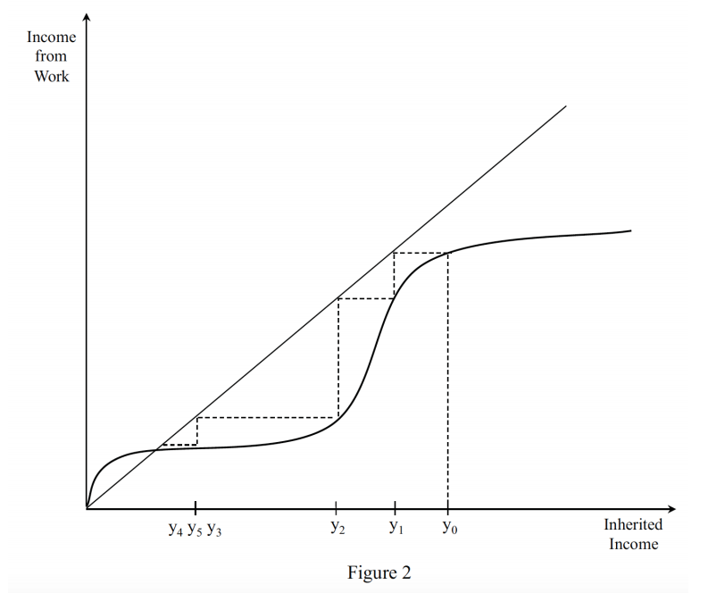
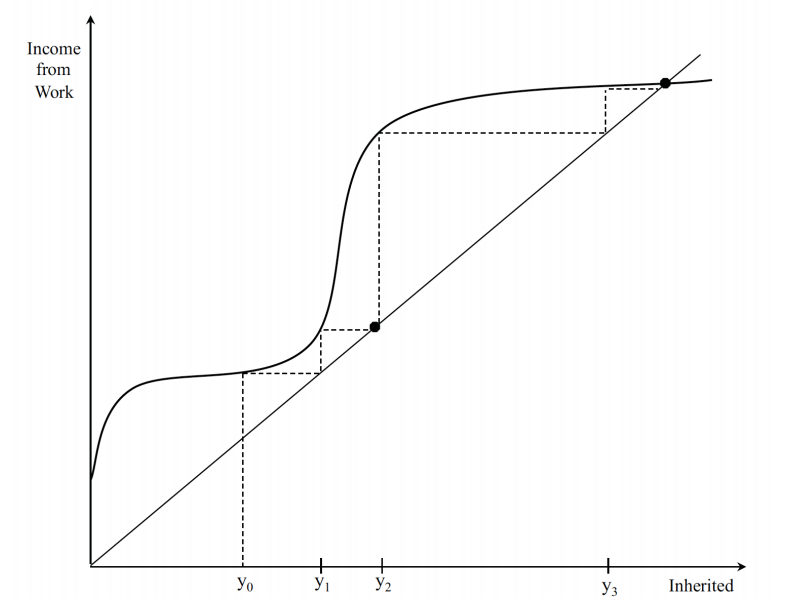

A review of two free online MIT Global Poverty courses
==============

## Introduction

MIT's Poverty Action Lab has made their courses available online, and this is a big deal because the teaching is of excellent quality. I've taken _Microeconomics_, _Evaluating Social Programs_, _The Challenges of Global Poverty_ and _Foundations of Development Policy_.

Regarding the first two courses, I remember that _Evaluating Social Programs_ delivers on the title, as does the book _Running Randomized Evaluations: A Practical Guide_. I remember _Microeconomics_ as being a solid introduction to the subject by a competent teacher of above-average charisma.

Below is a review of the last two courses: _The Challenges of Global Poverty_ and _Foundations of Development Policy_, written while they were fresh in my mind, while the teachers hadn't yet won the Nobel Price in Economics, and lightly edited thereafter. Both courses scavenge from the book _Poor Economics_, but also expand upon it. Because they have significant overlap, I would recommend just the second: _Foundations of Development Policy_, which covers the material in more depth.

## General structure

The general structure of each unit of both courses is:

*   A question is presented
*   Different options, all of which _a priori_ sound plausible, are discussed.
*   An experiment or a series of experiments is presented which answers the question in a manner more decisive than speculation could.

I think that constant repetition of this structure pushes the point that you really can't trust which arguments seem more plausible to you, or trust that you're being presented with a plausible model of impact, but instead have to go and do the experiment. This is one of the important intuitions which the course helps understand on a deep level.

When the professors deviate from that general structure, they become less convincing. In particular, they seem to really not like macro-economy / geopolitics. As a particular example which really stuck out for me, Ben Olken [helped increase Pakistan's tax revenue](https://www.povertyactionlab.org/evaluation/incentivizing-property-tax-inspectors-through-performance-based-postings-pakistan), which is not clearly net positive to me. On the one hand, individuals have less money, on the other hand, I could imagine the marginal revenue being invested in schools, used to do something essentially useless, or to increase defense spending, the value of which might be negative, which depends on the geopolitical situation.

## An example unit: Nutrition and Productivity.

The question presented is whether there is a nutrition based poverty trap. A mathematical formalism for a poverty trap is presented, in which wealth at time t+1 depends on wealth at time t. A poverty trap appears if falling below a wealth threshold leads to a further sliding down, that is, if the relationship between wealth at time t and t+1 looks like:

 as opposed to like

(In both cases, you start at y0 at time 0, move to y1 at time 1, to y2 at time 2, etc.)

And this formalism is then applied to the case of nutrition:

*   On day n, you have wealth W(n)
*   On day n, you consume an amount of food F(n) = f(W(n))
*   On day n+1, your production depends on how well you've eaten the day before, that is W(n+1) = g(F(n)) = g(f(W(n)) = h(W(n)) , so ultimately, wealth on day n+1 depends on wealth on day n.

The question is whether, in practice, a poverty trap mediated by nutrition arises. A mathematical condition necessary and sufficient for a poverty trap to arise is not just stated, but efforts are made so that students without a mathematical background can understand why that is.

Then, some data is presented, which attempts to solve the problem. First, some cross-sectional data, that is, getting data from the population in general, without conducting a trial. But this is insufficient. Then, they present data from a GiveDirectly randomized trial, and give some details as to its implementation. From this first randomized trial, they get some numbers for how calories and food expenditure vary with wealth. Then, they look at another randomized trial which measures the impact of calories on productivity (by providing laborers different amounts of calories, and paying them proportionally per unit of output). Putting both things together, they conclude that a poverty trap as mediated by day-to-day nutrition is unlikely (as one might have intuited).

However, child nutrition could cause such a poverty trap, because nutrition deficiencies as a child could affect productivity throughout life. They apply the model again, looking at the impact of deworming (because if worms don't eat your food, you do) and see that it does have a significant impact on wages later in life.

To complement the lectures, a bibliography is provided:

*   _Poor Economics_: Chapter 2.
*   "Household Response to Income Changes: Evidence from an Unconditional Cash Transfer Program in Kenya" (Haushofer and Shapiro, 2013).
*   "Giffen behavior and subsistence consumption" (Jensen and Miller, 2008).
*   "Causal effect of health on labor market outcomes: Experimental evidence" (Thomas et al., 2006).
*   "Worms at work: Long-run impacts of child health gains" (Baird, Hicks, Kremer, and Miguel, 2012).
*   "Are there nutrient-based poverty traps? Evidence on iron deficiency and schooling attainment in Peru" (Chong et al., 2014).
*   Video: "The Name of the Disease"
*   Optional: "Wealth, Health, and Health Services in Rural Rajasthan" (Banerjee, Deaton and Duflo, 2004).
*   Optional: _Poor Economics_: Chapter 3.

The readings comprise ~300 pages; the size of a small book (every week). In other words, the student has the possibility of digging pretty deep, which I generally did. It was a significant time investment.

As homework, some data from the Kremer’s deworming project in Kenya (see the readings) is provided, and one plays around with it in R and does some analysis, which gets more complicated as the course progresses. Then, some questions about an unrelated 45 page report on malaria nets are asked.

For a higher level overview, [here](https://nunosempere.github.io/ea/14.740x_Syllabus.pdf) is the course syllabus

## R

Throughout the courses, I picked up R (a programming language well-suited for analyzing datasets). I then read parts of the book [R for Data Science](https://r4ds.had.co.nz/), which is available for free online, and used it for [some self-experimentation in calibration](https://nunosempere.github.io/rat/Self-experimentation-calibration.html) (using the exercises for these courses as a source of data), for a data science hackathon, [to analyze the results of an EA mental health survey](https://nunosempere.github.io/rat/eamentalhealth/analysis/writeup), etc. The courses definitely helped, but I think that personal interest plus previous experience with programming also played an important role.

## Quality of the teachers & of the pedagogy

I feel that the quality of the teachers is very noticeably better than that of the professors either at the University of Vienna or at the Autonomous University of Madrid (maths and philosophy, at the undergraduate level). Perhaps they more closely approach the ideal of a [zetetic explanation](https://www.lesswrong.com/posts/i2Dnu9n7T3ZCcQPxm/zetetic-explanation), approaching a topic from many different angles. Perhaps they just have a _depth_ to them. If a student asks a miscellaneous question, they can answer it, and they take the time to do it. They express ideas clearly. At the beginning of the course, you're asked to write down your reasons for taking it, and to find an accountability partner.

It might be the case that the teachers have a carefully-considered cognitive model of the student (see: [Why books don't work: Why lectures don't work](https://andymatuschak.org/books/)). They're good pedagogues. They ask questions to the students, and keep the lectures engaging. Implicitly, all the students in the recorded classroom have read all the recommended texts beforehand, so the interaction is meaningful. The online TAs were also quite helpful; on some occasions I asked for additional information, and they could point me to relevant resources.

Some of the RCTs which are discussed have been carried out by the professors themselves, and this is not a function of their vanity, but of the relevance of these RCTs. \[Note: In my defense, that sentence was written before the profs won the Nobel price, and while I was still getting an understanding of the impact of the randomista movement in general and of JPAL in particular\]

## Value of the certification

I'm very uncertain about the signalling value of the certification. I myself just audited the courses (i.e., did not pay edx/MIT $1,000 for a certificate), but did all the exercises and the final online exam. There is also a proctored exam, which I didn't take.

## Call to action and epistemic status

The [MIT edx courses on Data, Economics, and Development Policy](https://micromasters.mit.edu/dedp/) reopen this upcoming February, so if the [course syllabus](https://nunosempere.github.io/ea/14.740x_Syllabus.pdf) appeals to you, you might want to set some time aside this week to consider whether you want to take any of these courses, and whether that makes sense in your particular situation. In my experience, it helps if you pick a concrete time (11 pm on Friday), instead of a fuzzy "I will do this sometime this week".

Regarding my epistemic status, I can vouch for the quality of the content and of the pedagogy, but not for the signalling value. Models of which kinds of EAs are likely to get career capital from this kind of online course are very welcome; Charity Entrepeneurship mentions [taking online courses](https://forum.effectivealtruism.org/posts/QxCpXjGmHbpX45nxo/how-to-increase-your-odds-of-starting-a-career-in-charity#Possible_actions) as a factor which would increase your odds of starting a career in charity entrepreneurship

I also strongly suspect that this post is the result of a selection effect, both in terms of liking these courses in particular, and online courses in general, more than average. For example, I much prefer the flexibility of online courses and I'm happy to provide my own motivation structures, perhaps to an unusual degree. I thought that the review was worth posting anyways.
