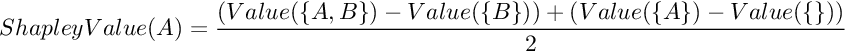
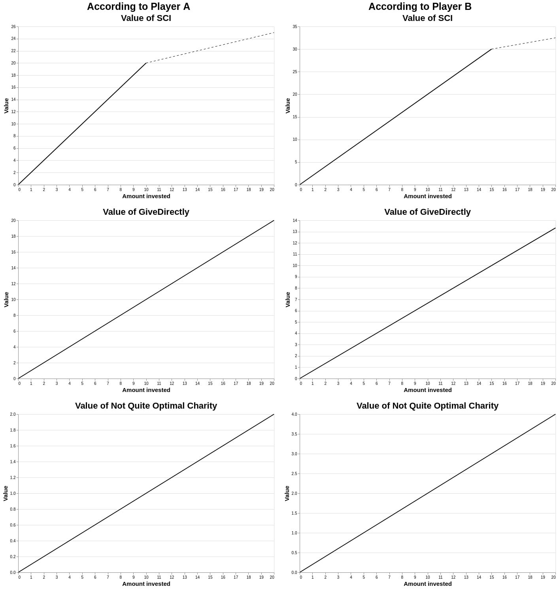

Shapley Values II: Philantropic Coordination Theory & other miscellanea.
==============

{Epistemic status: Less confused. Much as the Matrix sequels, so too I expect this post to be worse than the original, but still be worth having.}

## Introduction

In [Shapley values: Better than counterfactuals](https://forum.effectivealtruism.org/posts/XHZJ9i7QBtAJZ6byW/shapley-values-better-than-counterfactuals), we introduced the concept of Shapley values. This time, we assume knowledge of what Shapley Values are, and we:

*   Propose a solution to _Point 4: Philantropic Coordination Theory_ of OpenPhilantropy's [Technical and Philosophical Questions That Might Affect Our Grantmaking](https://www.openphilanthropy.org/blog/technical-and-philosophical-questions-might-affect-our-grantmaking). Though by no means the philosopher's stone, it may serve as a good working solution. We remark that an old GiveWell solution might have been to harsh on the donor with whom they were coordinating.
*   We explain some setups for measuring the Shapley value of forecasters in the context of a prediction market or a forecasting tournament.
*   We outline an impossibility theorem for value attribution, similar to Arrow's impossibility theorem in voting theory. Though by no means original, knowing that all solutions are unsatisfactory we might be nudged towards thinking about which kind of tradeoffs we want to make. We consider how this applies to the [Banzhaf power index](https://en.wikipedia.org/wiki/Banzhaf_power_index), mentioned in previous posts.
*   We consider how Shapley values fare with respect to the critiques in Derek Parfit's paper [_Five Mistakes in Moral Mathematics_](http://www.stafforini.com/docs/Parfit%20-%20Five%20mistakes%20in%20moral%20mathematics.pdf).
*   We share some Shapley value puzzles: scenarios in which the Shapley value of an action is ambiguous or unintuitive.
*   We propose several speculative forms of Shapley values: Shapley values + Moments of Consciousness, Shapley Values + Decision Theory, Shapley Values + Expected Value
*   We conclude with some complimentary (and yet obligatory) ramblings about Shapley Values, Goodhart's law, and Stanovich's disrationalia.

Because this post is long, images will be interspersed throughout to clearly separate sections and provide rest for tired eyes. This is an habit I have from my blogging days, though which I have not seen used in this forum.

## Philantropic Coordination Theory:

GiveWell posed, in 2014, the following dilemma: (numbers rounded to make some calculations easier later on):

> A donor recently told us of their intention to give $1 million to SCI. We and the donor disagree about what the right “maximum” for SCI is: we put it at $6 million, while the donor – who is particularly excited about SCI relative to our other top charities – would rather see SCI as close as possible to the very upper end of its range, meaning they would put the maximum at $8 million. (This donor is relying on our analysis of room for more funding but has slightly different values.)

> If we set SCI’s total target at $6 million, and took into account our knowledge of this donor’s plans, we would recommend a very small amount of giving – perhaps none at all – this giving season, since we believe SCI will hit $6 million between the $3 million from Good Ventures, $1 million from this donor, and other sources of funding that we detailed in our previous post. The end result would be that SCI raised about $6 million, while the donor gave $1 million. On the other hand, if the donor had not shared their plans with us, and we set the total target at $6 million, we would recommend $1 million more in support to SCI this giving season; the donor could wait for the end of giving season before making the gift. The end result would be that SCI raised about $7 million, while the donor gave $1 million.

### A. What is going on in that dilemma?

(This section merely offers some indications as to what is going on. It's motivated by my intense dislike of solutions which appear magically, but might be slightly rambly. Mathematically inclined readers are very welcome to stop here and try to come up with their own solutions., while casual readers are welcome to skip to next section. )

| Group | Outcome |
|-------|-------|
| {}    | 0*    |
| {A}   | 6 million to SCI    |
| {B}   | ?    |
| {A,B} | 6 million + $X to the SCI + $Y  million displaced to ??  |

If we try to calculate the Shapley value in this case, we notice that it depends on what the donor would have done with their budget in the counterfactual case, where the displaced money would go to, and how much each party would have valued that.

In any case, their Shapley values are:

 

One can understand this as follows: Player A has Value({A}) already in their hand, and Player B has Value({B}), and they're considering whether to cooperate. If they do, then the surplus from cooperating is Value({A,B}) - (Value({A}) + Value({B})), and it get's shared equally:

`1/2*(Value({A,B}) - (Value({A}) + Value({B})))` goes to A, which had `Value({A})` already

`1/2*(Value({A,B}) - (Value({A}) + Value({B})))` goes to B, which had `Value({B})` already

If the donor wouldn't have known what to do with their money in the absence of GiveWell's research, the surplus increases, whereas if the donor only changed their mind slightly, the surplus decreases.

At this point, we could try to assign values to the above, look at the data and make whatever decision seems most intuitive:

> In cases where we really don’t know what we’re doing, like utilitarianism, one can still make System 1 decisions, but making them with the System 2 data in front of you can change your mind. (Source: [If it’s worth doing it’s worth doing with made up statistics](https://slatestarcodex.com/2013/05/02/if-its-worth-doing-its-worth-doing-with-made-up-statistics/))

We could also assign values to the above and math it out. As I was doing so, I first tried to define the problem and see if I could come up with. After trying to find some meaning to setting their Shapley values to be equal, and imagining some contrived moral trades, I ended coming up with a solution involving value certificates. That is, if both GiveWell and the donor are willing to sell value certificates of their Shapley value of their donations, what happens?

While trying to find a solution, I found it helpful to specify some functions and play around with some actual numbers. In the end, they aren't necessary to _explain_ the solution, but I personally dislike it when solutions appear magically out of thin air

For simplicity, we'll suppose that GiveWell donates $6 million, rather than donating some and moving some.

For the donor:

*   The donor values $X dollars donated to SCI as f1(X)
*   The donor values $Y dollars donated to GiveDirectly as f2(Y)=Y (donations to GiveDirectly seem exeedingly scalable).
*   From 8 million onwards, the donor prefers donating to GiveDirectly, that is, f1' > 1 from 0 to 8 million, but f1' < 1 afterwards

For GiveWell:

*   GW values $X dollars donated to SCI as g1(X)
*   GW values $Y dollars donated to GiveDirectly as g2(Y)=Y
*   From 6 million onwards, GW prefers donating to GiveDirectly, that is, g1' > 1 from 0 to 6 million, but g1' < 1 afterwards.

Some functions which satisfy the above might be f1(X) =((80.1)/0.9)\*X(0.9), g1(X) = 2\*sqrt(6)\*sqrt(X) (where X is in millions).

A = GiveWell; B = The donor.

| Group | Outcome |
|-------|-------|
| {}    | 0*    |
| {A}   | 6 million to the SCI     |
| {B}   | 0*   |
| {A,B} | 6 million + $X to the SCI + $Y to GiveDirectly |

What are the units for the value of these outcomes? They're arbitrary units, one might call them "utilons". Note that they're not directly exhangeable, that is, the phrases "GiveWell values the impact of one dollar donated to SCI less than the donor does", or "GiveWell values one of their (GiveWell's) utilons as much as the donor values one of their (the donor's) utilons" might not be true, or even meaningful sentences. I tried to consider _two_ tables of Shapley values, one for GW-utilons and another one for donor-utilons, which aren't directly comparable. However, that line of reasoning proved unfruitful.

Now, from a Shapley value perspective, GiveWell gets the impact of the first 6 million donated to the SCI, and half the value of every additional dollar donated by the donor (minus the donor's outside option, which we've asumed to be 0), and the donor gets the other half.

### B. A value certificate equilibrium.

So we've asumed that:

*   The donor's outside option is 0
*   From 6 million onwards, GiveWell prefers that donations be given to GiveDirectly, but the donor prefers that they be given to SCI.

How much should, then, the donor donate to the SCI? Suppose that GiveWell has offering certificates of impact for their Shapley value (respectively counterfactual) impact. Consider that te donor could spend half of his million in donations to SCI. With the other half, the donor could:

*   Either buy GiveWell's share of the impact for that first half million.
*   Donate it to SCI.

Because of the diminishing returns to investing in SCI, the donor should buy GiveWell's share of the impact.

Or, in other words, suppose that the donor donates $X to the SCI and $Y to GiveDirectly.

*   If X=Y=0.5 million, GiveWell and the donor can agree to interchange their Shapley (respectively, counterfactual) values, so that GiveWell is responsible for the GiveDirectly donation, and the donor for the SCI donation.
*   If X > 0.5 million, then the donor would want to stop donating to SCI and instead buy value certificates from GiveWell corresponding to the earlier part of the half million (which are worth more, because of diminishing returns).
*   If X < 0.5 million, then the donor would want to buy more SCI until X=0.5 million, then buy the certificates from GiveWell corresponding to the earlier half a million.

Yet another way to see this would be, asuming the donor has a granularity of $1 (one dollar):

*   The first dollar should go to the SCI. He gets some impact I from that, and GiveWell also gets some impact I', of equal magnitude.
*   The second dollar could go either towards buying GiveWell's certificate of impact for the impact of the first dollar, or be a further donation to SCI. Because of diminishing returns, buying I', the impact of the first dollar is worth more than the impact of donating a second dollar to SCI. GiveWell automatically funnels the money from the certificate of impact to, say, GiveDirectly.
*   The third dollar should go to SCI.
*   The fourth dollar should go towards buying GiveWell's share of impact from the first dollar
*   And so on.

Note that, because GiveWell's alternative is known, GiveWell doesn't have to see the donor's money; he can send it directly to GiveDirectly. Alternatively, the donor and GiveWell can agree to "displace" some of GiveWell's donation, such that GiveWell donates part of the amount that they would have donated to SCI to GiveDirectly instead.

### Conclusions, remarks and Caveats.

*   In short, the above for philantropic coordination theory, expressed in words, might be:

> Divide the value from cooperating equally. This value depends on both what the outside options for the parties involved are, where any money displaced goes to, and how much each party values each of those options. Shapley values, as well as certificates of impact might be useful formalisms to quantify this.

*   The solution as considered above seems to me to be at a sweet spot between;
    *   Being principled and fair. In the two player case, for Shapley values this comes from equally splitting the gains from cooperating.
    *   Considering most of the relevant information.
    *   Not being too computationally intensive. A lot of this comes from treating GiveWell/ OpenPhil/ GoodVentures as one cohesive agent. Further, we actually don't have access to the countefactual world in which GiveWell doesn't exist (which is, admittedly, a weakness of the method), and we could have spent arbitrary amounts of time and effort attempting to model it. But for a moral trade of $1 million, it might actually be worth it to spend that time and effort!
*   One particular simplification was considering the donor's outside option to be 0\* (relative zero), which simplified our calculus. If it had been nonzero, we would have to have considered the value to the donor and the value to GiveWell of the donor's outside option separately. This is doable, but makes the explanation of the core idea behind the solution somewhat more messy; see the appendix for a worked example.
*   Assuming that the outside option of the donor is 0 leads to the same solution as GiveWell's original post (split in the middle). However, it is harsh on the donor if their outside option is better, according to the Shapley values/certificates of impact formalism above. Or, in other words, the gains from cooperating might not be in the middle.
*   Note that while the above may perhaps be a mathematically elegant solution, the questions "what donors like", "what narratives are more advantageous", "how do we create common knowledge that everyone is acting in good faith", and public relations in general are not being considered here _at all_. In particular, in the original GiveWell solution, the moral trade is presented in terms of "using the information advantage", which may or may not be more savvy
*   In this case, we have modelled SCI and GiveDirectly as parts of nature, rather than as agents, but modelling them as agents wouldn't have changed our conclusions (though it would have complicated our analysis). In particular, regardless of whether GiveDirectly and/or SCI are agents in our model, if the donor is willing to donate to them, they should also be willing to buy certificates of impact from GiveWell corresponding to that donation.
*   When buying a certificate of impact, the donor would in fact be willing to pay _more_ than $1, because $1 dollar can't get him that much value any more, due to diminishing returns. Similarly, GiveWell would be willing to sell it for _less_ than $1, because of the same reasons; once diminishing returns start setting in, they would have to donate less than $1 to their best alternative to get the equivalent of $1 dollar of donations to SCI. I've thus pretended that in this market with one seller and one buyer, the price is agreed to be $1. Another solution would be to have an efficient market in certificates of impact.
*   The value certificate equilibrium is very similar regardless of whether one is thinking in terms of Shapley values or counterfactuals. I feel, but can't prove, that Shapley values add a kind of clarity and crispness to the reasoning, if only because they force you to consider all the moving parts.

## Shapley values of forecasters.

### Shapley values are different from normal scoring in practice

Suppose that you are wrong, but you are _interestingly_ wrong. You may be very alarmed about an issue which people are not alarmed at all, thus moving the aggregate to a medium degree of alertness.

Or you might be the first to realize something. In a forecasting tournament, under some scoring rules, you might want to actively mislead people into thinking the opposite, for example by giving obviously flawed reasons for your position, thus increasing your own score. This is less than ideal.

[The literature](https://users.cs.duke.edu/~conitzer/predictionUAI09.pdf) points to Shapley values as being able to solve some of these problems in the context of prediction markets, while making sure that participants report their true beliefs. It can be shown that Shapley values have optimal results on the face on strategic behaviour, and that they are incentive compatible, that is, agents have no incentive to misreport their private information. In particular, if you reward forecasters in proportion to their Shapley values, they have an incentive to cooperate, which is something that is not trivial to arrange with other scoring rules.

In practice, taking the data from a [previous experient](https://forum.effectivealtruism.org/posts/ZTXKHayPexA6uSZqE/part-2-amplifying-generalist-research-via-forecasting), I [rolled the results differently](https://observablehq.com/@nunosempere/shapley-value-experiments-part-i), trying to approximate something similar to the Shapley value of each prediction, with the data at hand. And the resulting ranking did in fact look different. For example, in one question, the final market aggregate approximated the resolution distribution pretty well, but it was composed of individual forecasters all being somewhat overconfident in their own pet region.

Most memorably, one user who has a high ranking in Metaculus, but didn't fare that well in our competition would have done much better under a Shapley-value scoring rule. In this case, what I think happened was that the user genuinely had information to contribute, but was not very familiar with distributions.

Because the Shapley value can be proved to be, in some sense, optimal with respect to incentives, and that this might make a difference in practice, I'd intuitively be interested in seeing it used to reward forecasters. However, the Shapley value is in general both too computationally expensive (as of 2020), and requires us to use information to which we don't have acess. With this in mind, what follows are some approximations of the Shapley value which I think are intriguing in the context of prediction markets:

### Red Team vs Blue Team.

Given a proper scoring function which takes a prediction, a prior, and a resolution, a member of the blue team would get

`A*Score(Member) + B*AverageScore(Blue team without the member) - (A + B)*Score(Red team) (+ Constant)`

(A,B) are positive constant which determine how much you want to reward the individual as opposed to the group. As long as they're positive, incentives remain the same.

In this setup, forecasters have the incentive to reveal all of their information to their team, to make sure they use it, to use the information given by their teeam, and to make sure that this information isn't found by the red team. Further, if both teams have similar capabilities, whomever has to pay for the forecasting tournament can decide how much to pay by choosing a suitable constant.

However, you end up duplicating efforts. This may be a positive in the cases where you really want different perspectives, and in case you don't want your forecasters to anchor on the first consensus which forms. A competitive spirit may form. However, this design is probably too wasteful.

### Gradually reveal information

Suppose that there were some predictions in a prediction market: {Prior, P1, P2, P3, ..., Pk, ..., Pn}. A new forecaster comes in, sees only the prior, and makes his first prediction, f(0). He then sees the first prediction, P1, and makes another prediction, f(1). He sees the second prediction, and makes another prediction, f(2), and so on:

*   (Prior) -> f(0)
*   {P1} -> f(1)
*   {P1, P2} -> f(2)
*   {P1, P2, ..., Pk} -> f(k)
*   {P1, P2, P3, ..., Pk, ..., Pn} -> f(n)

Let AGk be the aggregate after the first k predictions: {P1, ..., Pk}, and AG0 be the prior.

Is this enough to calculate the Shapley value? No. We would also need to know what the predictor would have done had they seen, say, only {P3}. Sadly, we can't induce amnesia on out forecasters (though we could induce amnesia on bots and on other artificial systems!). In any case, we can reward our predictor proportionally to:

`[Score(f(0)) - Score(AG0)] + [Score(f(1)) - Score(AG1)] + ... + [Score(f(n)) - Score(AGn)]`

We can also reward Predictor Number N in proportion to `f(n) - f(n-1)`. That is, in proportion to how future forecasters improved after seeing the information which Predictor Number N produced. This has the properties that:

*   Our forecaster has the incentive to make the best prediction with the information he has, at each step.
*   Other forecasters have the incentive to make their predictions (which may have a comment attached) as useful and as informative as possible.

This still might be too expensive, that is, it might require too many steps, so we can simplify it further, so that the forecaster only makes two predictions, g(0) and g(1):

*   (Prior) -> g(0)
*   {P1, P2, P3, ..., Pk, ..., Pn} -> g(1)

Then, we can reward forecaster number n in proportion to:

`(g(1) - g(0)) * (Some measure of the similarity between g(1) and Pn such as the KL divergence)`

while the new forecaster gets rewarded in proportion to

`Score(g0) - Score(prior) + Score(g(1)) - Score(AGn).`

This still preserves some of the same incentives as above, though in this case, attribution becomes more tricky. Further, anecdotically, seeing someone's distribution before updating gives more information than seeing someone's distribution after they've updated, so just seeing the contrast between g(0) and g(1) might be useful to future forecasters.

## A value attribution impossibility theorem.

Epistemic status: Most likely not original; this is really obvious once you think about it.

The Shapley value is uniquely defined by:

*   Efficiency. The sum of the values of all agents equals the value of the grand coalition.
*   Equal treatment of equals. If, for every world, the counterfactual value of two agents is the same, the two agents should have the same value.
*   Linearity. "If two games, played independently, are regarded as sections of a single game, the value to the players who participate in just one section is unchanged, while the value of those who play in both sections is the sum of their sectional values."
*   Null player. If a player adds 0 value to every coalition, the player has a Shapley value of 0.

But there are some other eminently reasonable properties (their characterizations follow) which we would also like our value function to have:

*   Irrelevance of cabals.
*   Protection against parasites.
*   Agency agnosticism.
*   Elegance in happenstance.

Because the Shapley values are uniquely defined, and because none of the above are true for Shapley values, this constitutes an imposibility theorem.

### Irrelevance of Cabals

If a group of agents `A1, A2, A3, ...` decide to form a super-agent SA, Value(SA) should be equal to `Value(A1) + Value(A2) + Value(A3) + ...`

*   If there are cases in which Value(SA) > ΣValue(A\_i), then agents will have the incentive to form cabals.
*   If there are cases in which Value(SA) < ΣValue(A\_i), then agents will have the incentive to split as much as possible. This is the case for Shapley values.

One way to overcome irrelevance of cabals would be to prescribe a canonical list of agents, so that agents can't form super-agents, or, if they do, these super-agents just have as their value the sum of the Shapley values of their members. However, in many cases, talking about super-agents, like organizations, not people, is incredibly convenient for analysis. Further, it is in some cases not clear what is an agent, or what has agentic properties, so we would only let go of this condition very recluctantly.

Another way to acquire this property would be to work within a more limited domain. For example, if we restrict the Shapley value formalism to the space of binary outcomes (where, for example, a law either passes or doesn't pass, or an image gets classified either correctly or incorrectly), we get the [Banzhaf power index](https://en.wikipedia.org/wiki/Banzhaf_power_index) which happens to have irrelevance of cabals because of the simplicity of the domain which it considers. To repeat myself, the Banzaf power index values, mentioned in the previous post are just Shapley values divided by a different normalizing constant (!), and constrained to a simpler domain.

### Protection against parasites.

The contribution should be proportional to the effort made. In particular, consider the following two cases:

*   $1000 and 100h are needed for an altruistic project. Peter Parasite learns about it and calls Anna Altruist, and she puts in the $1000 and the 100h needed for the project.
*   $1000 and 100h are needed for an altruistic project. Pamela Philantropist learns about it and calls Anna Altruist and they each cough up $500 and 50h to make it possible.

The value attribution function should deal with this situation by assigning more value to Pamela Philantropist than to Peter Parasite. Note that Lloyd Shapley points to something similar in [his original paper](https://www.rand.org/content/dam/rand/pubs/research_memoranda/2008/RM670.pdf); see comments on the axioms on p. 6 and subsequent of the pdf, but ultimately dismisses it.

Also note that counterfactual reasoning is really vulnerable to parasites. See the last example in the secition: _Five Mistakes in Moral Mathematics_.

### Agency agnosticism.

A long, long time ago, an apple fell on Newton, and the law of gravity was discovered. I wish for a value attribution function which doesn't require me to differentiate between Newton and the apple, and define one as an agent process, and the other one as a non-agent process.

Some value functions which fulfill this criterion:

*   All entities are attributed a value of 0.
*   All value in the universe is assigned to one particular entity.
*   All value in the universe is asigned to all possible entities.

This requirement might be impossible to fulfill coherently. If it _is_ fulfilled, it may produce weird scenarios, such as "Nature" being reified into being responsible for billions of deaths. Failing this, I wish for a canonical way to decide whether an entity is an "agent". This may also be very difficult.

### Elegance in happenstance.

> a party that spent a huge amount of money on a project that was almost certainly going to be wasteful and ended up being saved when by sheer happenstance another party appeared to save the project was not making good spending decisions

I wish for a value attribution rule that somehow detects when situations such as those happen and adjusts accordingly. In particular, Shapley Values don't take into account:

*   Intentions
*   What is the expected value of an action given the information which are reasonable agent ought to have had?

See the section on Shapley Values + Expected Values below on how one might do that, as well as the last section on when one might one want to do that. On the other hand, if you incentivize something other than outcomes, you run the risk of incentivizing incompetence.

### Conclusions

Much like in the case of voting theory, the difficulty will be in managing tradeoffs, rather than in choosing the one true voting system to rule them all (pun intended).

With that in mind, one of the most interesting facts about Arrow's impossibility theory is that there are voting methods which aren't bound by it, like [Score Voting](https://en.wikipedia.org/wiki/Score_voting). Quoting from Wikipedia:

> As it satisfies the criteria of a deterministic voting method, with non-imposition, non-dictatorship, monotonicity, and independence of irrelevant alternatives, it may appear that it violates Arrow's impossibility theorem. The reason that score voting is not a counter-example to Arrow's theorem is that it is a cardinal voting method, while the "universality" criterion of Arrow's theorem effectively restricts that result to ordinal voting methods

As such, I'm hedging my bets: impossibility theorems must be taken with a grain of salt; they can be stepped over if their assumptions do not hold.

## Parfit's [_Five Mistakes in Moral Mathematics_](http://www.stafforini.com/docs/Parfit%20-%20Five%20mistakes%20in%20moral%20mathematics.pdf).

The Indian Mathematician Brahmagupta describes the solution to the quadratic equation as follows:

> 18.44. Diminish by the middle \[number\] the square-root of the rupas multiplied by four times the square and increased by the square of the middle \[number\]; divide the remainder by twice the square. \[The result is\] the middle \[number\].

to describe the solution to the quadratic equation ax^2 + bx = c.

I read Parfit's piece with the same admiration, sadness and sorrow with which I read the above paragraph. On the one hand, he is oftent clearly right. On the other hand, he's just working with very rudimentary tools: mere words.

With that in mind, how do Shapley values stand up to critique? Parfit proceeds by presenting several problems, and Toby Ord suggested that Shapley values might perform inadequately on some of them; I'll sample the Shapley solution to those I thought might be the trickiest ones:

### The First Rescue Mission

> I know all of the following. A hundred miners are trapped in a shaft with flood-waters rising. These men can be brought to the surface in a lift raised by weights on long levers. If I and three other people go to stand on some platform, this will provide just enough weight to raise the lift, and will save the lives of these hundred men. If I do not join this rescue mission, I can go elsewhere and save, single-handedly, the lives of ten other people. There is a fifth potential rescuer. If I go elsewhere, this person will join the other three, and these four will save the hundred miners.

Do Shapley Values solve this satisfactorily? They do. If you go to save the other ten, your Shapley value is in fact higher. You can check this on [http://shapleyvalue.com/](http://shapleyvalue.com/); input 100 for every group with four participants, 10 for every group of less than four people which contains you. For the total, try with either 110, or 100, corresponding to whether you remain or leave.

### The Second Rescue Mission

> As before, the lives of a hundred people are in danger. These people can be saved if I and three other people join in a rescue mission. We four are the only people who could join this mission. If any of us fails to join, all of the hundred people will die. If I fail to join, I could go elsewhere and save, single-handedly, fifty other lives.

Do Shapley Values solve this satisfactorily? They do. By having a stronger outside option, your Shapley value is in fact increased, even if you end up not taking it. Again, you can check on the link above, inputing 50 whenever you're in the group, and 100 (or 50 again) when the whole group is involved.

### Simultaneous headshots

> X and Y simultaneously shoot and kill me. Either shot, by itself, would have killed.

Do Shapley Values solve this satisfactorily? Maybe? They each get responsiblity for half a death; whether this is satisfactory is up to discussion. I agree that the solution is counter-intuive, but I'm not sure it's it's wrong. In particular, consider the question with the signed reversed:

> I die of an unexpected heart attack. X and Y simultaneously revive me (they both make a clone of me with the memory backup I had just made the day before, but the law sadly only allows one instance per being, so one has to go).

In this case, I find that my intuition is reversed; X and Y "should focus on cases which are less likely to be resurrected", and I see it as acceptable that they each get half the impact. I take this as a sign that my intuition here isn't that reliable in this case; resurrecting someone should probably be as good as kiling them is bad.

Consider also:

> You have put a bounty of 1 million dollars on the death of one of your hated enemies. As before, X and Y killed them with a simultaneous headshot. How do you divide the bounty?

On the other hand, we can add a fix on Shapley values to consider intentions (that is, expected values), which maybe fixes this problem. We can also use different variations of Shapley values depending on whether we want to coordinate with, award, punish, incentivize someone, or to attribute value. For this, see the last and the second to last sections. In conclusion, this example is deeply weird to me, perhaps because the "coordinate" and "punish" intuitions go in different directions.

### German Gift

Statement of the problem: X tricks me into drinking poison, of a kind that causes a painful death within a few minutes. Before this poison has any effect, Y kills me painlessly.

Do Shapley Values solve this satisfactorily? They do. They can differentiate between the case where Y kills me painlessly _because_ I've been poisoned (in which case she does me a favor), and the case where Y intended to kill me painlessly anyways. Depending on how painful the death is (for example, a thousand and one times worse than just dying), Y might even end up with a positive Shapley value even in that second case.

### Third Rescue Mission

Statement of the problem: As before, if four people stand on a platform, this will save the lives of a hundred miners. Five people stand on this platform.

Do Shapley Values solve this satisfactorily? They do. They further differentiate cleanly between the cases where:

*   All five people see the opportunity at the same time. In this case, each person gets 1/5th of the total.
*   Four people detect the opportunity at the same time. Seeing them, a fifth person joins in. In this case, the initial four people each get 1/4th, and the fifth person gets 0.

### An additional problem:

Here is an additional problem which I also find counterintuitive (though I'm unsure on how much to be confused about it):

> X kills me. Y resurrects me. I value my life at 100 utilons.

Here, the Shapley value of X is -50, and the Shapley value of Y is 50. Note, however, that the moment in which Y has an outside option to save someone else, their impact jumps to 100.

Ozzie Gooen comments:

> Note that in this case case, the counterfactuals would be weird too. The counterfactual value of X is 0, because Y would save them. The counterfactual value of Y would be +100, for saving them. So if you were to try to assign value, Y would get lots, and X wouldn’t lose anything. X and Y could then scheme with each other to do this 100 times and ask for value each time

### Comments

Overall, I think that Shapley values do pretty well on the problems posed by Parfit on _Five Mistakes on Moral Mathematics_. It saddens me to see that Parfit had to resort to using words, which are unwieldy, for considering hypothesis of like the following:

> (C7) Even if an act harms no one, this act may be wrong because it is one of a set of acts that together harm other people. Similarly, even if some act benefits no one, it can be what someone ought to do, because it is one of a set of acts that together benefit other people.

## Shapley value puzzles

\[The first four puzzles of this section, and the commentary in between, were written by Ozzie Gooen.\]

Your name is Emma. You see 50 puppies drowning in a pond. You think you only have enough time to save 30 puppies yourself, but you look over and see a person in the distance. You yell out, they come over (their name is Phil), and together you save all the puppies from drowning.

Calculate the Shapley values for:

*   You (Emma)
*   Phil

The correct answer, of course, for both, should have been “an infinitesimal fraction” of the puppies. In your case, your parents were necessary for you to exist, so they should get some impact. Their parents too. Also, there were many people responsible for actions that led to your being there through some chaotic happenstance. Also, in many worlds where you would have not been there, someone else possibly would have; they deserve some Shapley value as well.

In moral credit assignment, it seems sensible that all humans should be included. That includes all those who came before, many of whom were significant in forming the exact world we have today.

However, maybe we want a more intuitive answer for a very specific version of the Shapley value; we’ll only include value from the moment when we started the story above.

Now the answer is Emma: 40 puppies, Phil: 10 puppies. In total, you share 50 saved puppies. You can tell by trying it out in [this calculator](http://shapleyvalue.com/).

Now that we’ve solved all concerns with Shapley values, let’s move on to some simpler examples.

You (Emma again) are enjoying a nice lonely stroll in the park when you hear a person talking loudly on their cell phone. Their name is Mark. You stare to identify the voice, and you spot some adorable puppies drowning right next to him. You yell at Mark to help you save the puppies, but he shrugs and walks away, continuing his phone conversation. You save 30 puppies. However, you realize that if it weren’t for Mark, you wouldn’t have noticed them at all.

Calculate the Shapley values for:

*   You (Emma)
*   Mark

You (Emma again) are enjoying a nice lonely stroll in the park when you hear a rock splash in a pond. You look and notice some 30 adorable puppies drowning right to it. You save all of the puppies. You realize that if it weren’t for the rock, you wouldn’t have noticed them at all.

Calculate the Shapley values for:

*   You (Emma)
*   The Rock

You (Emma again), are enjoying a nice stroll in the park. Alarmedly, 29 paperclip satisficers\* inform you that a paperclip is going to be lost forever, and 30 adorable puppies will drown unless you do something about it. You, together with the paperclip satisficers, spend three grueling hours saving the 30 puppies and the paperclip.

Calculate the Shapley values for:

*   You (Emma)
*   Each paperclip satisficer

You (Emma again), decide that this drowning puppies business must stop, and create the Puppies Liberation Front. You cooperate with the Front for the Liberation of Puppies, such that the PLF gets the puppies out of the water, and the FLP dries them, and both activities are necessary to rescue a puppy. Together, you rescue 30 puppies.

Calculate the Shapley values for:

*   The Puppies Liberation Front:
*   The Front for the Liberation of Puppies:

The Front for the Liberation of Puppies splits off a subgroup in charge of getting the towels: The Front for Puppie Liberation. Now;

*   The Puppies Liberation Front gets the puppies out of the water
*   The Front for the Liberation of Puppies dries them
*   The Front for Puppie Liberation makes sure there are enough clean & warm towels for every puppie.

All steps are necessary. Together, you save 30 puppies. Calculate the Shapley value of:

*   The Puppies Liberation Front:
*   The Front for the Liberation of Puppies:
*   The Front for Puppie Liberation:

Your name is Emma. Phil sees 30 puppies drowning in a pond, and he yells at you to come and save them. To your frustration, Phil just watches while you do the hard work. But you realize that without Phil’s initial shouting, you would never have saved the 30 puppies.

Calculate the Shapley values for:

*   You (Emma)
*   Phil

You are Emma, again. You finally find the person who has been trying to drown so many puppies, Lucy. You ask how many puppies she threw into the water: 100. Relieved, you realize you (and you alone) have managed to save all of them.

Calculate the Shapley values for:

*   You (Emma)
*   Lucy

## Speculative Shapley extensions.

### Shapley values + Decision theory.

Epistemic status: Very biased. I am quite convinced that some sort of timeless decision theory is probably better. I also think that it is more adequate than competing theories in domains where other agents are simulating you, like philantropic coordination questions.

In the previous post, Toby Ord writes:

> In particular, the best things you have listed in favour of the Shapley value applied to making a moral decision correctly apply when you and others are all making the decision 'together'. If the others have already committed to their part in a decision, the counterfactual value approach looks better.

> e.g. on your first example, if the other party has already paid their $1000 to P, you face a choice between creating 15 units of value by funding P or 10 units by funding the alternative. Simple application of Shapley value says you should do the action that creates 10 units, predictably making the world worse.

> One might be able to get the best of both methods here if you treat cases like this where another agent has already committed to a known choice as part of the environment when calculating Shapley values. But you need to be clear about this. I consider this kind of approach to be a hybrid of the Shapley and counterfactual value approaches, with Shapley only being applied when the other agents' decisions are still 'live'. As another example, consider your first example and add the assumption that the other party hasn't yet decided, but that you know they love charity P and will donate to it for family reasons. In that case, the other party's decision, while not yet made, is not 'live' in the relevant sense and you should support P as well.

Note that the argument, though superficially about Shapley values, is actually about which decision theory one is using; Toby Ord seems to be using CDT (or, perhaps, EDT), whereas I'm solidly in the camp of updateless/functional/timeless decision theories. From my perspective, proceeding as the comment above suggests would leave you wide open to blackmail, would incentivize commitment races and other nasty things (i.e., if I'm the other party in the example above, by commiting to donate to my pet cause, I can manipulate Toby Ord to donate money to the charity I love from family reasons, (and to take it away from more effective charities (unless, of course, Toby Ord has previously commited to not negotiating with such blackmailers, and I know that))). I'm not being totally fair here, and timeless decision theories also have other bullets to bite (perhaps [transparent Newcomb](https://arbital.com/p/transparent_newcombs_problem/) and [counterfactual mugging](https://wiki.lesswrong.com/wiki/Counterfactual_mugging) are the more antiintuitive examples (though I'd bite the bullet for both (as a pointer, see [In logical time, all games are iterated games](https://www.lesswrong.com/posts/dKAJqBDZRMMsaaYo5/in-logical-time-all-games-are-iterated-games))))

But, as fascinating as they might be, we don't _actually_ have to have discussions about decision theories so full of parentheses that they look like Lisp programs. We can just earmark the point of disagreement. We can specify that if you're running a causal decision theory, you will want to consider only agents whom you can causally affect, and will only include such agents on your Shapley value calculations, whereas if you're running a different decision theory you might consider a broader class of agents to be "live", including some of those who have already made their decisions. In both cases, you're going to have to bite the bullets of your pet decision theory.

Personally, and only half-jokingly, there is a part of me which is very surprised to see decision theory in general and timeless decision theories in particular be used for a legit real life problem, namely philantric coordination theory, as the examples I'm most familiar with all involve Omegas which can predict you almost perfectly, Paul Elkmans who can read your facial microexpressions, and other such contrived scenarios.

### Shapley values + Moments of consciousness.

One way to force irrelevance of cabals is to define a canonical definition of agent, and have the value of the group just be the sum of the values of the individuals. One such canonical definition could be over moments of consciousness, that is, you consider each moment of consciousness to be an agent, and you compute Shapley values over that. The value attributed to a person would be the sum of the Shapley values of each of their moments of consciousness. Similarly, if you need to compute the value of a group, you compute the Shapley value of the moments of consciousness of the integrants the the group.

On the one hand, the exact result of this procedure are particularly uncomputable as of 2020. And yet, using your intuition, you can see that the Shapley value of a person would be proportional to the number of necesary moments of consciousness which the person contributes, so not all is lost. On the other hand, it buys you irrelevance of cabals, and somewhat solves the parasite problem:

*   $1000 and 100h are needed for an altruistic project. Peter Parasite learns about it and calls Anna Altruist, and she puts in the $1000 and the 100h needed for the project.
*   $1000 and 100h are needed for an altruistic project. Pamela Philantropist learns about it and calls Anna Altruist and they each cough up $500 and 50h to make it possible.

So taking into account moments-of-consciousness would assign more value to those who put in more (necessary) effort. Your milleage may vary with regards to whether you consider this to be a positive.

### Shapley Values + Sensitivity Analysis + Expected Values

Epistemic Status: Not original, but I don't know where I got the idea from.

Given some variable of interest, average the Shapley values over different values of that variable, proportional to their probabilities. In effect, don't report the Shapley values directly, but do a [Sensitivity Analysis](https://en.wikipedia.org/wiki/Sensitivity_analysis) on them.

In the cases in which you want to punish or reward an outcome, and in particular in cases where you want to point to a positive or negative example for other people, you might want to act not on the Shapley value from the world we ended up living in, but to take the expected value of the Shapley Value by the agent under consideration. Expected values either with the information you had, or from the information they had.

If you the agent's information for those expected values, this allows you to punish evil but incompetent people, celebrate positive but misguided acts (which you might want to do for e.g., small kids). If you use your own information for those expected values, this also allows you to celebrate competent but unlucky entrepeneurs, and punish evil and competent people even when, by chance, they don't succeed.

However, Shapley values are probably be too unsophisticated to be used in situations which are primarily about social incentives.

## Some complimentary (and yet obligatory) ramblings about Shapley Values, Goodhart's law, and Stanovich's disrationalia.

So one type of Goodhart's law is [Regressional Goodhart](https://www.lesswrong.com/posts/EbFABnst8LsidYs5Y/goodhart-taxonomy#Regressional_Goodhart).

> When selecting for a proxy measure, you select not only for the true goal, but also for the difference between the proxy and the goal. Example: height is correlated with basketball ability, and does actually directly help, but the best player is only 6'3", and a random 7' person in their 20s would probably not be as good

Other examples relevant to the discussion at hand:

*   If you're optimizing your counterfactual value, you're also optimizing for the difference between the counterfactual values and the more nuanced thing which you care about.
*   If you're optimizing your Shapley value, you're also optimizing for the difference between the Shapley values and the more nuanced thing which you care about.
*   If you're optimizing for cost-effectiveness, you're also optimizing for the difference between being cost-effective and the more nuanced thing which you care about.
*   If you're optimizing for being legible, you're also optimizing for the difference between being legible and the more nuanced thing which you care about.
*   More generally, if you're optimizing for a measure of impact, you're also optimizing for the difference between what you care about and the measure of impact.

Of course, one could take this as a fully general counterargument against optimization and decide to become chaotic good. Instead, one might recognize that, even though you might cut yourself with a lightsaber, lightsabers are powerful, and you would want to have one. Or, in other words, to be really stupid, you need a theory (for an academic treatment on the matter, consult work by Keith Stanovich). Don't let Shapley values be that theory.

One specific way one can be stupid with Shapley values is by not disambiguating between different use cases, and not notice that Shapley values are imperfect at the social ones:

*   Coordinate. Choose what to do together with a group of people.
*   Award. Pick a positive exemplar and throw status at them, so that people know what is your or your group's idea of "good".
*   Punish. Pick a negative exemplar and act so as to make clear to your group that this exemplar corresponds to your group's idea of "bad".
*   Incentivize. You want to see more of X. Create mechanisms so that people do more of X.
*   Attribute. Many people have contributed to X. How do you divide the spoils?

To conclude, commenters in the last post emphasized that one should not consider Shapley Values as the philosopher's stone, the summum bonum, and I've smoothed my initial enthusiasm somewhat since then. With that in mind, we considered Shapley values in a variety of cases, from the perhaps useful in practice (philantropic coordination theory, forecasting incentives), to the exceedingly speculative, esoteric and theoretical.

### Assorted references

*   [_Donor coordination and the “giver’s dilemma”_](https://blog.givewell.org/2014/12/02/donor-coordination-and-the-givers-dilemma/)
*   [_Technical and Philosophical Questions That Might Affect Our Grantmaking_](https://www.openphilanthropy.org/blog/technical-and-philosophical-questions-might-affect-our-grantmaking)
*   [If it’s worth doing it’s worth doing with made up statistics](https://slatestarcodex.com/2013/05/02/if-its-worth-doing-its-worth-doing-with-made-up-statistics/)
*   [_Prediction Markets, Mechanism Design, and Cooperative Game Theory_](https://users.cs.duke.edu/~conitzer/predictionUAI09.pdf)
*   [KL divergence](https://en.wikipedia.org/wiki/Kullback%E2%80%93Leibler_divergence)
*   [Shapley values: Better than counterfactuals](https://forum.effectivealtruism.org/posts/XHZJ9i7QBtAJZ6byW/shapley-values-better-than-counterfactuals)
*   [Score voting](https://en.wikipedia.org/wiki/Score_voting)
*   [Banzhaf power index](https://en.wikipedia.org/wiki/Banzhaf_power_index)
*   [Notes on the N-Person game](https://www.rand.org/content/dam/rand/pubs/research_memoranda/2008/RM670.pdf)
*   [Amplifying generalist research via forecasting](https://forum.effectivealtruism.org/posts/ZTXKHayPexA6uSZqE/part-2-amplifying-generalist-research-via-forecasting)
*   [Shapley Value Approximations for a Forecasting Experiment](https://observablehq.com/@nunosempere/shapley-value-experiments-part-i)
*   [_Five Mistakes in Moral Mathematics_](http://www.stafforini.com/docs/Parfit%20-%20Five%20mistakes%20in%20moral%20mathematics.pdf).
*   [Functional Decision Theory: A New Theory of Instrumental Rationality](https://arxiv.org/abs/1710.05060)
*   [In logical time all games are iterated games](https://www.lesswrong.com/posts/dKAJqBDZRMMsaaYo5/in-logical-time-all-games-are-iterated-games).
*   [Sensitivity analysis](https://en.wikipedia.org/wiki/Sensitivity_analysis)
*   [Regressional Goodhart](https://www.lesswrong.com/posts/EbFABnst8LsidYs5Y/goodhart-taxonomy#Regressional_Goodhart).

## Appendix: A more complicated worked example.

Suppose that you have two players, player a and Player B, and three charities: GiveDirectly, SCI, and the Not Quite Optimal Charity (NQOC).

| Charity | Value for A                       | Value for B |
|---------|-----------------------------------|-------------|
| GD      | y=x                               | y=x      |
| SCI     | y=2x if x<10, y=x/2 + 15 if x>=10 | y=2x        |
| NQOC    | 1/10                              | 1/5         |

Or, in graph form:

Caveat:

*   I don't actually think that the diminishing returns are likely to be that brutal and that sudden, but assuming they are simplified calculations.
*   I don't actually know whether 1/5th to 1/10th of the value of a donation to GiveDirectly is a reasonable estimate of what an informed donor would have made in the absence of GiveWell's analysis.

Then suppose that:

*   Player A has 10 million, and information
*   Player B has 1 million, and not much information.

Then the outcomes might look like

| Group | Value for A  | Value for B    |
|-------|--------------|----------------|
| {}    | 0*           | 0*             |
| {A}   | 20           | 20             |
| {B}   | 1/10         | 1/5            |
| {A,B} | 20 + X/2 + Y | 20 + 2X + Y|
	
where X and Y are the quantities which player B donates to SCI and GiveDirectly, respectively, and they sum up to 1. So the value of cooperating is

*   X/2 + Y -1/10 according to A's utility function
*   2X + Y - 1/5 according to B's utility function

In particular, if B donates only to SCI, then the value of cooperating is:

*   X/2 -1/10 according to A's utility function
*   2X - 1/5 according to B's utility function

Now, we have the interesting scenario in which A is willing to sell their share of the impact for `X/4 - 1/20`, but B is willing to buy it for more, that is, for `X - 1/10`. In this case, suppose that they come to a gentleman's agreement and decide that the fair price is `(X/4 - 1/20)/2 + (X - 1/10)/2`, which simplified, is equal to `(5 X)/8 - 3/40`.

Now, player B then donates X to SCI and buys player A's certificates of impact for that donation (which are cheaper than continuing to donate). If they spend the million, then `X + (5 X)/8 - 3/40 = 1`, so X≈0.66, that is, 0.66 million are donated to SCI, whereas 0.34 million are spent buying certificates of impact from player A, which then donates that to GiveDirectly.
