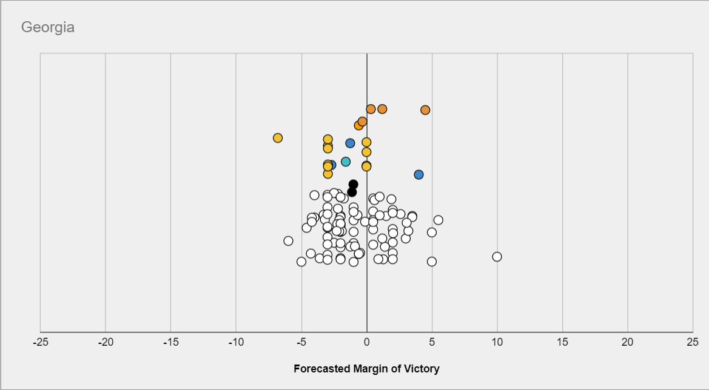

Incentive Problems With Current Forecasting Competitions.
==============

This post outlines some incentive problems with forecasting tournaments, such as Good Judgement Open, CSET, or Metaculus. These incentive problems may be problematic not only because unhinged actors might exploit them, but also because of mechanisms such as those outlined in [Unconscious Economics](https://www.lesswrong.com/posts/PrCmeuBPC4XLDQz8C/unconscious-economics). For a similar post about PredictIt, a prediction market in the US, see [here](https://www.lesswrong.com/posts/c3iQryHA4tnAvPZEv/limits-of-current-us-prediction-markets-predictit-case-study). This post was written in collaboration with [Nuño Sempere](https://forum.effectivealtruism.org/users/nunosempere), who should be added as a coauthor soon. This is a crosspost from [LessWrong](https://www.lesswrong.com/posts/tyNrj2wwHSnb4tiMk/incentive-problems-with-current-forecasting-competitions).

## Problems

**Discrete prizes distort forecasts**

If a forecasting tournament offers a prize to the top X forecasters, the objective "be in the top X forecasters" differs from "maximize predictive accuracy". The effects of this are greater the smaller the number of questions.

For example if only the top forecaster wins a prize, you might want to predict a surprising scenario, because if it happens you will reap the reward, whereas if the most likely scenario happens, everyone else will have predicted it too.

Consider for example [this prediction contest](https://predictingpolitics.com/2020/08/02/the-predictions-are-in/), which only had a prize for #1. The following question asks about the margin Biden would win or lose Georgia by:

Then the most likely scenario might be a close race, but the prediction which would have maximized your odds of coming in #1st might be much more extremized, because other predictors are more tightly packed in the middle.

This effect also applies if you think of "becoming a superforecaster", which you can do if you are in the top 2% and have over 100 predictions in Good Judgement Open, as a distinct objective from "maximizing reward accuracy".

**Incentives not to share information and to produce corrupt information**

In a forecasting tournament, there is a disincentive to sharing information, because other forecasters can use it to improve relative standing. This not only includes not sharing information but also providing misleading information. As a counterpoint, other forecasters can and will often point out flaws in your reasoning if you're wrong. 

**Incentives to selectively pick questions.**

If one is maximizing the Brier score, one is incentivized to pick easier questions. Specifically, if someone has a brier score _b2_, then they should not make a prediction on any question where the probability is between b and (1-b), **even if they know the true probability exactly.** Tetlock explicitly mentions this in one of his [Commandments for superforecasters](https://fs.blog/2015/12/ten-commandments-for-superforecasters/): “Focus on questions where your hard work is likely to pay off”. Yet if we care about making better predictions of things we need to know the answer to, the skill of "trying to answer easier questions so you score better" is not a skill we should reward, let alone encourage the development of.

A related issue is that, if one is maximizing the difference between one's Brier score and the aggregate’s Brier score, one is incentivized to pick questions for which the one thinks the aggregate is particularly wrong. This is not necessarily a problem, but can be. 

**Incentive to just copy the community on every question.**

In scoring systems which more directly reward making many predictions, such as the Metaculus scoring system where in general one has to be both wrong and very confident to actually lose points, predictors are heavily incentivized to make predictions on as many questions as possible in order to move up the leaderboard. In particular, a strategy of “predict the community median with no thought” could see someone rise to the top 100 with a few months of signing up.

This is plausibly less bad than the incentives above, although this depends on your assumptions. If the main value of winning “metaculus points” is personal satisfaction, then predicting exactly the community median is unlikely to keep people entertained for long. New users predicting something fairly close to the community median on lots of questions, but updating a little bit based on their own thinking, is arguably not a problem at all, as the small adjustments may be enough to improve the crowd forecast, and the high volume of practice that users with this strategy experience can lead to rapid improvement.

## Solutions

**Probabilistic rewards**

In tournaments with fairly small numbers of questions, where paying only the top few places would incentivize forecasters to make overconfident predictions to maximize their chance of first-place finishes as discussed above, probabilistic rewards may be used to mitigate this effect. 

In this case, rather than e.g. having prizes for the top three scorers, prizes would be distributed according to a lottery, where the number of tickets each player received was some function of their score, thereby incentivizing players to maximize their expected score, rather than their chance of scoring highest. 

Which precise function should be used is a non-trivial question: If the payout structure is too “flat”, then there is not sufficient incentive for people to work hard on their forecasts compared to just entering with the community median or some reasonable prior. If on the other hand the payout structure too heavily rewards finishing in one of the top few places, then the original problem returns. This seems like a promising avenue for a short research project or article.

**Giving rewards to the best forecasters among many questions.**

If one gives rewards to the top three forecasters for 10 questions in a contest in which there are 200 forecasters, the top three forecasters might be as much a function of luck as of skill, which might be perceived as unfair. Giving prizes for much larger pools of questions makes this effect smaller. 

**Forcing forecasters to forecast on all questions**

This fixes the incentive to pick easier questions to forecast on. 

A similar idea is assuming that forecasters have predicted the community median on any question that they haven't forecast on, until they make their own prediction, and then reporting the average brier score over all questions. This has the disadvantage of not rewarding "first movers/market makers", however it has the advantage of "punishing" people for not correcting a bad community median in a way that relative Brier doesn't (at least in terms of how people experience it).

**Scoring groups**

If one selects a group of forecasters and offers to reward them in proportion to the Brier score of the group’s predictions for a fixed set of questions, then the forecasters now have the incentive to share information with the group. This group of forecasters could be pre-selected for having made good predictions in the past. 

**Designing collaborative scoring rules**

One could design rules around, e.g., Shapley values, but this is tricky to do. Currently, some platforms make it possible to give upvotes to the most insightful forecasters, but if upvotes were monetarily rewarded, one might not have the incentive to upvote other participants’ contributions as opposed to waiting for one’s contributions to be upvoted. 

In practice, Metaculus and GJOpen do have healthy communities which collaborate, where trying to maximize accuracy at the expense of other forecasters is frowned upon, but this might change with time, and it might not always be replicable. In the specific case of Metaculus, monetary prizes are relatively new, but becoming more frequent. It remains to be seen whether this will change the community dynamic.

**Divide information gatherers and prediction producers.**

In this case, information gatherers might then be upvoted by prediction producers, who wouldn’t have any disincentive not to do so. Alternatively, some prediction producers might be shown information from different information gatherers, or select which information was responsible for a particular change in their forecast. A scheme in which the two tasks are separated might also lead to efficiency gains.

**Other ideas**

*   One might explicitly reward reasoning rather than accuracy (this has been tried on Metaculus for the insight tournament, and also for the [El Paso series).](https://pandemic.metaculus.com/contests/?selected=el-paso) This has its own downsides, notably that it’s not obvious that reasoning which looks good/reads well is actually correct.
*   One might make objectives more fuzzy, like the Metaculus points system, hoping this would make it more difficult to hack.
*   One might reward activity, i.e., frequency of updates, or some other proxy expected to correlate with forecasting accuracy. This might work better if the correlation is causal (i.e., better forecasters have higher accuracy because they forecast more often), rather than due to a confounding factor. The obvious danger with any such strategy is that rewarding the proxy [is likely to break the correlation](https://www.lesswrong.com/posts/YtvZxRpZjcFNwJecS/the-importance-of-goodhart-s-law#:~:text=Goodhart's%20law%20states%20that%20once,to%20the%20Bank%20of%20England.).