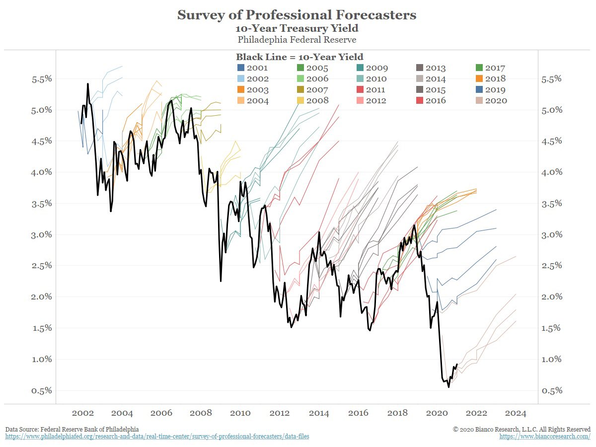

Forecasting Newsletter: December 2020
==============

## Highlights

*   Nigh unbeatable forecaster gives [85% chance that the newly identified COVID-19 strain is >30% more transmissible](https://twitter.com/juan_cambeiro/status/1344058829823238145).
*   Prediction markets and betting platforms mostly resolved the election in favor of Biden already. However, new markets have been created about whether Trump will still be president in February. Those who believe he won't can still earn a circa [10% return](https://polymarket.com/market/will-joe-biden-be-inaugurated-as-president-of-the-usa-on-january-20th-2021-1).
*   Metaculus announces their [AI Progress tournament](https://www.metaculus.com/ai-progress-tournament/), with $50,000 in rewards.

## Index

*   Prediction Markets & Forecasting Platforms
*   US Presidential Election Betting
*   In the News
*   Negative Examples
*   Hard to Categorize
*   Long Content
*   Yearly Housekeeping

Sign up [here](https://forecasting.substack.com/) or browse past newsletters [here](https://forum.effectivealtruism.org/s/HXtZvHqsKwtAYP6Y7).

## Prediction Markets & Forecasting Platforms

**Metaculus** organized the [AI Progress tournament](https://www.metaculus.com/ai-progress-tournament/), covered by a Forbes contributor [here](https://www.forbes.com/sites/johnkoetsier/2020/12/07/50k-ai-prediction-contest-launches-today); rewards are hefty ($50,000 in total). Questions for the first round, which focuses on the state of AI exactly six months into the future, can be found [here](https://www.metaculus.com/questions/?search=contest:ml-round). In the [discussion page](https://www.metaculus.com/questions/5952/forecasting-ai-progress--discussion/) for the first round, some commenters point out that the questions so far aren't that informative or intellectually stimulating. Metaculus has also [partnered with The Economist](https://www.metaculus.com/questions/?search=cat:economist--2021) for a series of events in 2021, and were mentioned in this [article](https://www.economist.com/graphic-detail/2021/01/02/what-to-expect-in-2021-according-to-prediction-markets) (sadly paywalled). They are also [hiring](https://forum.effectivealtruism.org/posts/iuWamFwC7NFabCixE/metaculus-is-hiring). 

[@lxrjl](https://twitter.com/lxrjl), a moderator in the platform, has gathered a [list of forecasts about Effective Altruism organisations which are currently on Metaculus](https://forum.effectivealtruism.org/posts/N5D75jM8sw5do95RC/forecasts-about-ea-organisations-which-are-currently-on). This includes a [series](https://www.metaculus.com/questions/?search=cat:series--ace) introducing ACE (Animal Charity Evaluators) to using forecasting as a tool to inform their strategy, which Misha Yagudin and I came up with after some back-and-forth with ACE. 

[**Augur**](https://augur.net/) partnered with the crypto currency/protocol $COVER/CoverProtocol to provide protection from losses in case Augur got hacked. In effect, traders could also bet for or against the proposition that a given Augur market will be hacked, and they could do this in a separate protocol. Traders could then use these bets to provide or acquire insurance ([source](https://twitter.com/AugurProject/status/1340522544923865088), [secondary source](https://www.altcoinbuzz.io/cryptocurrency-news/prediction-market-platform-augur-joins-cover-for-shield-mining/)). 

In an ironic twist of fate, soon after commencing the partnership CoverProtocol was [hacked](https://twitter.com/CoverProtocol/status/1343559022667046912) ([details](https://twitter.com/nomorebear/status/1343553883964985345), [secondary source](https://news.bitcoin.com/attackers-drain-millions-from-cover-protocol-token-holders-attack-compensation-plan/)). Even though the money was later [returned](https://twitter.com/GrapFinance/status/1343555258316804101), it seems that $COVER is being delisted from major cryptocurrency trading exchanges. 

I added [**catnip.exchange**](https://catnip.exchange/) to [this](https://docs.google.com/spreadsheets/d/1XB1GHfizNtVYTOAD_uOyBLEyl_EV7hVtDYDXLQwgT7k/edit#gid=0) list of prediction markets Jacob Lagerros created. More suggestions are welcome, and can be made by leaving a comment in the linked document.

During Christmas, I programmed an [**interface**](https://www.loki.red/polymarket/) **to view** [**PolyMarket**](https://polymarket.com/) markets and trades, using their GraphQL API. PolyMarket is a speculative crypto prediction market, which I trust because they successfully resolved the first round of US presidential elections without absconding with the money. PolyMarket’s frontpage has an annoying UI bug— it sometimes doesn't show the 2% liquidity provider fee, and my interface solves that. 

Karen Hagar, with the collaboration of Scott Eastman, has started two **forecasting-related nonprofit** organizations:

[AZUL Foresight](https://azul.logiccurve.org/about-us) is devoted to forecasting and red team analysis, and is planning to have a geopolitical analysis column. 

[LogicCurve](https://logiccurve.org/what-we-do) is devoted to forecasting education, training and international outreach. 

Both Karen and Scott are Superforecasters™ and “friends of the newsletter”; we previously worked together on EpidemicForecasting predicting the spread of COVID-19 in developing nations. They are eager to get started on forecasting, and are looking for clients. I’m curious to see what comes of it, particularly because forecasting can be combined with almost any interesting and important problem. 

## US Presidential Election Betting

The primary story for prediction markets this month was that they generally acknowledged Biden as the president of the USA, early. This was done according to the terms and conditions of the markets—they were to be resolved according to whomever Fox, CNN, AP, and other major American news outlets called as the winner. However, the resolution was also seen as problematic by those who believe that Trump still has a chance. Prediction markets reacted by opening new questions asking whether Trump will still be president by February 2021. For example, [here](https://ftx.com/en/trade/TRUMPFEB) is one on FTX, and [here](https://polymarket.com/market/will-joe-biden-be-inaugurated-as-president-of-the-usa-on-january-20th-2021-1) is a similar one about Biden on PolyMarket. 

As of late December one can still get, for example, a circa 1.1x return on PolyMarket by betting on Biden if he wins, or a circa 15x return by betting on FTX by betting on Trump, if Trump wins. FTX has Trump at ca. 6%, whereas PolyMarket has Biden at ca. 88%, and arbitrage hasn't leveled them yet (but note that their resolution criteria are different). However, the process of betting on one's preferred candidate depends on one's jurisdiction. As far as I understand (and I give ~50% to one of these being wrong or sub-optimal):

*   Risk-averse American living in America: Use PredictIt.
*   European, Russian, American living abroad, risk-loving American: Use FTX/PolyMarket.
*   British: Use Smarkets/PolyMarket/PaddyPower.

Other platforms that I haven't looked much into are catnip.exchange, Augur, and Omen. For some of these platforms, one needs to acquire USDC, a cryptocurrency pegged to the dollar. For this, I've been using crypto.com, but it's possible that Coinbase or other exchanges offer better rates. If you're interested in making a bet, you should do so before the 6th of January, one of the last checkpoints in the American election certification process. Note that getting your funds into a market might take a couple of days.

As for the object-level commentary, [here](https://www.vox.com/22173990/electoral-college-trump-biden-stephen-miller) is a piece by Vox, [here](https://www.nytimes.com/2020/11/25/us/elections/trump-campaign-lawsuits.html) one by the New York Times, and [here](https://thehill.com/homenews/administration/532036-pence-refused-to-sign-on-to-plan-to-overturn-election-lawyers-say) one by The Hill. With regards to the case for Trump staying in the White House, [here](https://twitter.com/CryptoADavid/status/1338511543198167040) is a Twitter thread collecting information from a vocal member of the PolyMarket Discord Server. A selection of resources from that thread is:

*   [This site](https://hereistheevidence.com/) aims to collect all instances of purported election fraud and manipulation in the US.
*   [This thread](https://twitter.com/Maximus_4EVR/status/1339646031202377728) elaborates on the role which Trump supporters are hoping Vice President Pence will take during the 6th of January joint session of the US Congress.
*   An [ELI5 on how Trump could win](https://twitter.com/shot_gangster/status/1339086600148402183).

I'm giving more space to the views I disagree with, because I'm betting some money that Biden will, in fact, be inaugurated president, though nothing I can't afford to lose. I'm also aware that [in matters of politics](https://www.huffpost.com/entry/nate-silver-election-forecast_n_581e1c33e4b0d9ce6fbc6f7f), it's particularly easy to confuse a 30% for a 3% chance, so I wouldn’t recommend full [Kelly betting](https://en.wikipedia.org/wiki/Kelly_criterion).

As an interesting tidbit, most big bets on PolyMarket’s election markets are against Trump. For instance, the largest bet placed against Trump amounts to $1,480,000, whereas the largest bet placed on his success is $622,223.

## In the News

A [new variant of COVID-19](https://en.wikipedia.org/wiki/Variant_of_Concern_202012/01) has been identified (New York Times coverage [here](https://www.nytimes.com/2020/12/20/health/coronavirus-britain-variant.html?smid=tw-share)). The broader Effective Altruism and rationality communities are giving high probabilities to the possibility that this new variant is significantly more contagious. See [here](https://twitter.com/juan_cambeiro/status/1344058829823238145), [here](https://pandemic.metaculus.com/questions/6089/50-transmissible-variant-to-infect-10m/), [here](https://pandemic.metaculus.com/questions/6031/more-transmissible-variant-to-infect-10m/), and the last section [here](https://www.lesswrong.com/posts/CHtwDXy63BsLkQx4n/covid-12-24-we-re-f-ed-it-s-over#What_Happens_Now_). Juan Cambeiro, an expert COVID-19 forecaster who has consistently outperformed competitors and experts across Metaculus and various Good Judgement platforms, gives an 85% chance that this specific new strain is >30% more transmissible. Because of Cambeiro’s past forecasting prowess, subject-matter expertise and nigh unbeatable track record, I suggest adopting his probabilities as your own, and acting accordingly. Note that the Metaculus questions he is forecasting are clearly, precisely, narrowly and tightly defined, so there isn’t room for doubt in that regard. 

Budget forecasting in the US under COVID-19:

*   [Kentucky decides to go with a forecast which is very conservative and doesn't incorporate all available information](https://kychamberbottomline.com/2020/12/04/economists-suggest-governor-and-lawmakers-go-with-an-economic-forecast-expecting-more-revenue-as-they-craft-budget-in-2021/). This is an interesting example of a legitimate use of forecasting which doesn't involve maximizing accuracy. The forecast will be used to craft the budget, so choosing a more pessimistic forecast might make sense if one is aiming for increased robustness. Or, in other words, the forecast isn't aiming to predict the expected revenue, but rather the lower bound of an 80% confidence interval.
*   [Louisiana](https://www.sfchronicle.com/news/article/Louisiana-forecasting-panel-delays-income-review-15789160.php) chooses to delay their projections until early next year.
*   [Colorado](https://www.gjsentinel.com/news/western_colorado/state-economists-hopeful-but-guarded-over-revenue-forecasts/article_a2948a66-4177-11eb-92f5-9b6aa90492fe.html) finds that they have a $3.75 billion surplus on a $32.5 billion budget after budget cuts earlier in the year.

The Washington post editorializes: [Maverick astrophysicist calls for unusually intense solar cycle, straying from consensus view](https://www.washingtonpost.com/weather/2020/12/19/solar-cycle-prediction-mcintosh/) ([original source](https://link.springer.com/article/10.1007/s11207-020-01723-y)). On this topic, see also the [New Solar Cycle 25 Question Series](https://www.metaculus.com/questions/4982/new-solar-cycle-25-question-series/) on Metaculus.

> Our method predicts that SC25 \[the upcoming sunspot cycle\] could be among the strongest sunspot cycles ever observed, depending on when the upcoming termination happens, and it is highly likely that it will certainly be stronger than present SC24 (sunspot number of 116) and most likely stronger than the previous SC23 (sunspot number of 180). This is in stark contrast to the consensus of the SC25PP, sunspot number maximum between 95 and 130, i.e. similar to that of SC24.

An opinion piece by [The Wall Street Journal](https://www.wsj.com/articles/usgs-gets-politics-out-of-climate-forecasts-11608593315) talks about measures taken by the US Geological Survey to make climate forecasts less political (unpaywalled [archive link](https://archive.is/9IIvu)).

> The approach includes evaluating the full range of projected climate outcomes, making available the data used in developing forecasts, describing the level of uncertainty in the findings, and periodically assessing past expectations against actual performance to provide guidance on future projections.
> 
> Moving forward, this logical approach will be used by the USGS and the Interior Department for all climate-related analysis and research—a significant advancement in the government’s use and presentation of climate science.
> 
> These requirements may seem like common sense, but there has been wide latitude in how climate assessments have been used in the past. This new approach will improve scientific efficacy and provide a higher degree of confidence for policy makers responding to potential future climate change conditions because a full range of plausible outcomes will be considered.
> 
> Science should never be political. We shouldn’t treat the most extreme forecasts as an inevitable future apocalypse. The full array of forecasts of climate models should be considered. That’s what the USGS will do in managing access of natural resources and conserving our natural heritage for the American people.

Australian weather forecasters are [incorporating climate change comments](https://www.theguardian.com/environment/2020/dec/05/a-change-in-the-weather-new-demand-for-tv-presenters-to-include-climate-in-forecasts) into their coverage ([archive link](https://web.archive.org/web/20201222070908/https://www.theguardian.com/environment/2020/dec/05/a-change-in-the-weather-new-demand-for-tv-presenters-to-include-climate-in-forecasts)).

As the year comes to a close, various news media are taking stock of past predictions, and making new predictions for 2021. These aren’t numerical predictions, and as such are difficult to score. Some examples:

*   Politico: [The Worst Predictions of 2020](https://www.politico.com/news/magazine/2020/12/29/worst-predictions-about-2020-451444)
*   New Statesman: [In January, I made ten predictions for 2020 – how did they turn out?](https://www.newstatesman.com/international/places/2020/12/january-i-made-ten-predictions-2020-how-did-they-turn-out)
*   CryptoBriefing.com: [Crypto Predictions for 2020: Who Got It Right?](https://cryptobriefing.com/crypto-predictions-2020-who-was-right/)
*   New York Times: [Clueless About 2020, Wall Street Forecasters Are at It Again for 2021](https://www.nytimes.com/2020/12/18/business/stock-market-forecasts-wall-street.html)
*   The Wall Street Journal: [Here’s a Market Forecast: 2021 Will Be Hard to Predict](https://www.wsj.com/articles/heres-a-market-forecast-2021-will-be-hard-to-predict-11608392924)
*   Financial Times: [Forecasting the world in 2021](https://www.ft.com/content/cbfe6821-c70b-4e4d-977b-979bfe929fd3).
*   Forbes: [What Will The Stock Market Return In 2021?](https://www.forbes.com/sites/johnjennings/2021/12/29/what-will-the-stock-market-return-in-2021/?sh=206693bf7330)
*   Bloomberg: [Ignore All 2021 Market Predictions - Except This One](https://www.bloomberg.com/opinion/articles/2020-12-29/ignore-all-2021-market-predictions-except-this-one)
*   Washington Post: [Five (somewhat) upbeat predictions for 2021](https://www.washingtonpost.com/business/2020/12/31/economic-predictions-2021/)
*   News.Bitcoin.com: [Zero to $318,000: Proponents and Detractors Give a Variety of Bitcoin Price Predictions for 2021](https://news.bitcoin.com/zero-to-318000-proponents-and-detractors-give-a-variety-of-bitcoin-price-predictions-for-2021/)

## Negative Examples

Trump [predicted](https://twitter.com/realDonaldTrump/status/1298637609871212545) that the US stock market would crash if Biden won. Though it still could, the forecast is not looking good. Here is CNN [making that point](https://edition.cnn.com/2020/11/30/business/stock-market-dow-jones-trump-biden/index.html).

[Betting markets predicted no-deal after the failed Brexit summit](https://uk.finance.yahoo.com/news/brexit-no-deal-betting-markets-prediction-uk-eu-boris-johnson-161123649.html). Though they did see a bump, the prediction market quoted [went up](https://smarkets.com/event/40554343/politics/uk/brexit/trade-deals) briefly afterwards.

Twitter user [@kjhealy](https://twitter.com/kjhealy/status/1336681782251573249) visualizes forecasts from the [Survey of Professional Forecasters](https://en.wikipedia.org/wiki/Survey_of_Professional_Forecasters):

## Hard to Categorize

Twitch adds [prediction functionalities](https://help.twitch.tv/s/article/channel-points-predictions?language=en_US) h/t [@Pongo](https://www.lesswrong.com/users/pongo).

The US's National Oceanic and Atmospheric Administration (NOAA) is organizing a [contest](https://www.drivendata.org/competitions/73/noaa-magnetic-forecasting/) to forecast movements in the Earth's magnetic field, with prizes totaling $30,000.

> The efficient transfer of energy from solar wind into the Earth’s magnetic field causes geomagnetic storms. The resulting variations in the magnetic field increase errors in magnetic navigation. The disturbance-storm-time index, or Dst, is a measure of the severity of the geomagnetic storm.
> 
> In this challenge, your task is to develop models for forecasting Dst that push the boundary of predictive performance, under operationally viable constraints, using the real-time solar-wind (RTSW) data feeds from NOAA’s DSCOVR and NASA’s ACE satellites. Improved models can provide more advanced warning of geomagnetic storms and reduce errors in magnetic navigation systems.

The [US Congress adopts a plan to consolidate weather catastrophe forecasting](https://www.wicker.senate.gov/public/index.cfm/2020/12/congress-adopts-wicker-plan-to-improve-hurricane-forecasting-storm-damage-claims-and-flood-mapping). Previously, different agencies had been in charge of predicting weather phenomena.

A [new flood forecasting platform implemented in Guyana](https://www.unitar.org/about/news-stories/news/flood-forecasting-platform-guyana). As is becoming usual for these kinds of projects, I am unable to evaluate the extent to which this platform will be useful.

> Despite Dominica and Guyana’s agriculture sectors being the primary industries, the sector has constantly been affected by disasters. Recurring hurricanes, floods and droughts represent real threat to development and food security at the national level. It also increases the vulnerability of local communities and puts small farmers, live stock holders, and aggro-processors, who are primarily women, at risk.

The [SlateStarCodex subreddit](https://www.reddit.com/r/slatestarcodex/comments/kkta0b/interesting_paper_by_andrew_gelman_discussing/) talks about a [paper](http://www.stat.columbia.edu/~gelman/research/published/philosophy.pdf) by Andrew Gelman, which discusses flaws with "pure Bayesianism".

> Bayesian updating only works if the "true model" is in the space of models you're updating over. This is never the case in practice. And, in fact Bayesian updating can lead you to becoming ever more convinced of a given model that is clearly false.

DartThrowingSpiderMonkey [(@alexrjl](https://www.youtube.com/watch?v=hRYmsSZTfaw)) presents the fourth video in his [Introduction to Forecasting](https://www.youtube.com/playlist?list=PL4K6kMBfuK2kdCdIqTs40t7NsQfBCwPIC) Series. This time it’s about making Guesstimate models for questions for which a base rate is nonexistent or hard to find. 

[xkcd](https://xkcd.com/2379/) has a list of comparisons to help visualize different probabilities.

[Volcano forecasting models](https://eos.org/articles/can-volcano-forecasting-make-visiting-whakaari-safe-again) might help New Zealand tourists who want to visit risky places.

## Long Content

Paper: [Estimating the deep replicability of scientific findings using human and artificial intelligence](https://www.pnas.org/content/117/20/10762.long) ([secondary source](https://www.forbesindia.com/article/kellogg-school-of-management/how-ai-can-help-weed-out-faulty-scientific-research/64797/1)). 

The authors of the paper train a machine learning model to predict replicability of research results, using a relatively meager sample of 96 papers. The papers, taken from the original [Reproducibility Project: Psychology](https://en.wikipedia.org/wiki/Reproducibility_Project), have been validated on various other datasets. While the model does only slightly better than human prediction markets, it’s important to note that a machine learning system, once set-up, would be much faster. Interestingly, the authors "did not detect statistical evidence of model bias regarding authorship prestige, sex of authors, discipline, journal, specific words, or subjective probabilities/persuasive language". Otherwise, their setup is relatively simple: a pre-processing step which translates words to vectors using [Word2vec](https://en.wikipedia.org/wiki/Word2vec), followed by a random forest combined with [bagging](https://en.wikipedia.org/wiki/Bootstrap_aggregating).

A nice tidbit from the paper is that past citation count isn’t very predictive of future replication:

Article: [Forecasting the next COVID-19](https://www.princeton.edu/news/2020/12/14/forecasting-next-covid-19). 

Implementing better measures and institutions to predict pandemics is probably a good idea. However, I'd expect the next catastrophic event in the scale of COVID-19 to [not be a pandemic](https://history.stackexchange.com/questions/60422/who-said-armies-prepare-to-fight-their-last-war-rather-than-their-next-war).

> Princeton disease ecologist C. Jessica Metcalf and Harvard physician and epidemiologist Michael Mina say that predicting disease could become as commonplace as predicting the weather. The Global Immunological Observatory, like a weather center forecasting a tornado or hurricane, would alert the world, earlier than ever before, to dangerous emerging pathogens like SARS-CoV-2.
> 
> A GIO \[Global Immunological Observatory\] would require an unprecedented level of collaboration between scientists and doctors, governments and citizens across the planet. And it would require blood.
> 
> Until recently, most blood-serum tests detected antibodies for a single pathogen at a time. But recent breakthroughs have expanded that capability enormously. One example, a method developed at Harvard Medical School in 2015 called VirScan, can detect over 1,000 pathogens, including all of the more than 200 known viruses to infect humans, from a single drop of blood.

[Uncertainty Toolbox](https://github.com/uncertainty-toolbox/) is "a python toolbox for predictive uncertainty quantification, calibration, metrics, and visualization", available on GitHub. The toolbox, as per the [accompanying paper](https://arxiv.org/pdf/2011.09588.pdf), was created in order to better calibrate machine learning models. Previous similar projects in this area are: [Ergo](https://github.com/oughtinc/ergo) and [Python Prediction Scorer](https://github.com/yhoiseth/python-prediction-scorer).

The [Alpha Pundits Challenge proposal](https://www.openphilanthropy.org/files/Grants/Tetlock/Revolutionizing_the_interviewing_of_alpha-pundits_nov_10_2015.pdf) was a proposal by the Good Judgement Project to take predictions by pundits, convert their verbal expressions of uncertainty into probabilities, and compare those probabilities to predictions made by superforecasters. Tetlock received some unrestricted funding from [Open Philanthropy](https://www.openphilanthropy.org/giving/grants/university-pennsylvania-philip-tetlock-forecasting) back in 2016, and the grant mentioned the proposal. However, since there isn’t more publicly available information about the project, we can guess that it was probably abandoned. 

> Whenever alpha-‐pundits balk at making testable claims —like an 80% chance of ‐2% or worse global deflation in 2016—GJPs ideologically balanced panels of intelligent readers will make good‐faith inferences about what the pundits meant. Using all the textual clues available, what is the most plausible interpretation of “serious possibility” of global deflation? GJP will then publish the readers’ estimates and of course invite alpha-­‐pundits to make any corrections if they feel misinterpreted.
> 
> GJP Superforecasters will also make predictions on the same issues. And the match will have begun—indeed it has already begun.
> 
> For instance, former Treasury Secretary Larry Summers recently published an important essay on global secular stagnation in the Washington Post which included a series of embedded forecasts, such as this prediction about inflation and central bank policies: "The risks tilt heavily toward inflation rates below official targets." It is a catchy verbal salvo, but just what it means is open to interpretation.
> 
> Our panel assigned a range of 70–99% to that forecast, centering on 85%. When asked that same question, the Superforecasters give a probability of 72%. These precise forecasts can now be evaluated against reality.
> 
> What we propose is new, even revolutionary, and could with proper support evolve into a systemic check on hyperbolic assertions made by opinion makers in the public sphere. It is rigorous, empirical, repeatable, and backed by the widely-­recognized success of the Good Judgment Project based at the University of Pennsylvania

## Yearly Housekeeping

I'm trying to improve this newsletter’s content and find feedback really valuable. If you could take 2 minutes to [fill out this form](https://docs.google.com/forms/d/e/1FAIpQLSc1k9fj0Z7WuWBoMe9ZYp2qyACWd16D1R1tTCuiPxPkBjujJQ/viewform?usp=sf_link) and share your thoughts, that would go a long way.

I've moved the newsletter from Mailchimp to [forecasting.substack.com](https://forecasting.substack.com/), where I’ve added an optional paid subscription option. Because I conceive of this newsletter as a public good, I’m not planning on offering restricted content, so the main benefits to paid subscribers would be the personal satisfaction of funding a public good. 

---

Note to the future: all links are added automatically to the Internet Archive. In case of link rot, go [here](https://archive.org/) and input the dead link.

---

> Disconfirmed expectancy is a psychological term for what is commonly known as a failed prophecy. According to the American social psychologist Leon Festinger's theory of cognitive dissonance, disconfirmed expectancies create a state of psychological discomfort because the outcome contradicts expectancy. Upon recognizing the falsification of an expected event an individual will experience the competing cognitions, "I believe \[X\]," and, "I observed \[Y\]." The individual must either discard the now disconfirmed belief or justify why it has not actually been disconfirmed. As such, disconfirmed expectancy and the factors surrounding the individual's consequent actions have been studied in various settings.

Source: [Disconfirmed expectancy, Wikipedia](https://en.wikipedia.org/wiki/Disconfirmed_expectancy)

---
