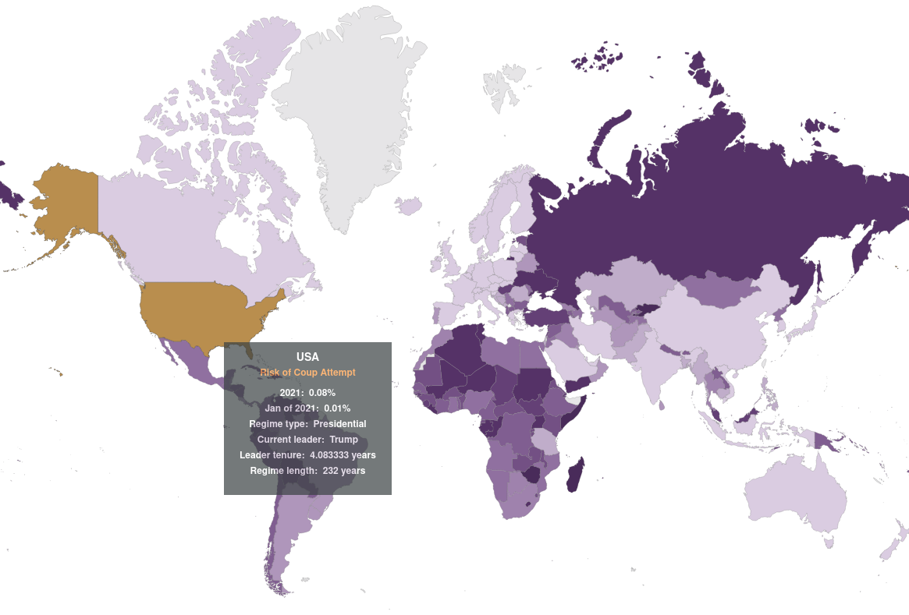

2020: Forecasting in Review
==============

This document contains a series of highlights about forecasting in 2020 which I have gathered after 10 months of writing a forecasting newsletter. I'll write one or two paragraphs for each point, and then list ideas which interested readers can follow up on. As such, this piece can be read either as an accessible superficial summary, as an index of pointers, or or as a resource for later years—a snapshot of what was happening in 2020. EAs will particularly be interested in sections II, IV and VI.

## Index.

I. The Phantom COVID-19 Forecasting

II. Attack of the Metaculus

III. Revenge of the Crypto Prediction Markets

IV. Disaster Forecasters—A New Hope

V. US Election Forecasting Strikes Back

VI. Return of the Machine Learning

VII. Platforms Awaken

VIII. The Last Superforecaster

You can also see this on [substack](forecasting.substack.com/). 

## I. The Phantom COVID-19 Forecasting

The world in general wasn't prepared to forecast the spread of COVID-19.

“The original IHME model underestimates uncertainty and 45.7% of the predictions (over 1- to 14-step-ahead predictions) made over the period March 24 to March 31 are outside the 95% PIs. In the revised model, for forecasts from of April 3 to May 3 the uncertainty bounds are enlarged, and most predictions (74.0%) are within the 95% PIs, which is not surprising given the PIs are in the order of 300 to 2000 daily deaths. Yet, even with this major revision, the claimed nominal coverage of 95% well exceeds the actual coverage. On May 4, the IHME model undergoes another major revision, and the uncertainty is again dramatically reduced with the result that 47.4% of the actual daily deaths fall outside the 95% PIs—well beyond the claimed 5% nominal value.” ([Source](https://arxiv.org/abs/2006.15997))

Previously, preparedness prediction exercises had been carried out for Ebola. These, however, failed to generalize, because Ebola produces symptoms which are much easier to detect, unlike COVID-19. Irritatingly, media and predictors often confused the detected and the actual cases, as did some forecasting models.

Threads to follow up on:

*   [A Case Study in Model Failure? COVID-19 Daily Deaths and ICU Bed Utilisation Predictions in New York State](https://arxiv.org/abs/2006.15997)
*   [Forecasting s-curves is hard](https://constancecrozier.com/2020/04/16/forecasting-s-curves-is-hard/)
*   [This coronavirus model keeps being wrong. Why are we still listening to it?](https://www.vox.com/future-perfect/2020/5/2/21241261/coronavirus-modeling-us-deaths-ihme-pandemic)
*   [A Failure, But Not Of Prediction](https://slatestarcodex.com/2020/04/14/a-failure-but-not-of-prediction/)
*   [Ioannidis: Forecasting for COVID-19 has failed](https://forecasters.org/wp-content/uploads/Ioannidisetal_03082020-1.pdf) vs. [Taleb: On Single Point Forecasts for Fat-Tailed Variables](https://forecasters.org/wp-content/uploads/Talebetal_03082020.pdf)
*   [How does pandemic forecasting resemble the early days of weather forecasting](https://www.foreignaffairs.com/articles/united-states/2020-06-29/how-forecast-outbreaks-and-pandemics)
*   [Assessing the performance of real-time epidemic forecasts: A case study of Ebola in the Western Area region of Sierra Leone, 2014-15](https://www.ncbi.nlm.nih.gov/pmc/articles/PMC6386417/)
*   [CDC wants states to count ‘probable’ coronavirus cases and deaths, but most aren’t doing it](https://www.washingtonpost.com/investigations/cdc-wants-states-to-count-probable-coronavirus-cases-and-deaths-but-most-arent-doing-it/2020/06/07/4aac9a58-9d0a-11ea-b60c-3be060a4f8e1_story.html)
*   [COVID-19 Projections](https://covid19-projections.com/)
*   [Forecasting the next COVID-19](https://www.princeton.edu/news/2020/12/14/forecasting-next-covid-19)

## II. Attack of the Metaculus

Overall Metaculus, a sophisticated forecasting platform and community with a [pretty good track record](https://www.metaculus.com/questions/track-record/), organized a large number of activities, tournaments and collaborations this past year. Some of the most noteworthy ones follow:

The [AI progress tournament](https://metaculus.com/ai-progress-tournament), which aims to predict progress in AI, has 50k in rewards. The first round, currently open, contains fairly specific questions which resolve in circa six months.

The [Insight is 20/20](https://www.metaculus.com/questions/5336/the-2020-insight-forecasting-contest/) was carried out in partnership with the Ben-Gurion University of the Negev. It experimented with rewarding not only the best forecasters, but also those who produced the best arguments and reasoning for their forecasts.

The [Lighting Round Tournament](https://pandemic.metaculus.com/%20questions/4166/the-lightning-round-tournament-comparing-metaculus-forecasters-to-infectious-disease-experts/) compared forecasts made by infectious disease experts with those made by Metaculus forecasters. Selected results can be found [here](https://www.metaculus.com/news/2020/06/02/LRT/): Metaculus forecasters generally did better than experts.

On the topic of COVID-19, the [Li Wenliang Forecasting Tournament](https://www.metaculus.com/questions/3667/the-li-wenliang-prize-series-for-forecasting-the-covid-19-outbreak/) was organized to forecast the outbreak, and the [Salk Tournament](https://pandemic.metaculus.com/questions/4093/the-salk-tournament-for-coronavirus-sars-cov-2-vaccine-rd/) asked for predictions about vaccine research, development and distribution. Metaculus also created a domain dedicated to pandemic predictions: [pandemic.metaculus.com](https://pandemic.metaculus.com/questions/), and put together a [dashboard](https://pandemic.metaculus.com/dashboard/) which presented these predictions on the site. See also: [takeaways from Covid forecasting on Metaculus](https://forum.effectivealtruism.org/posts/xwG5MGWsMosBo6u4A/lukas_gloor-s-shortform?commentId=ZNgmZ7qvbQpy394kG) from the winner of the Li Wenliang Forecasting Tournament.

The [El Paso series](https://pandemic.metaculus.com/questions/4161/el-paso-series-supporting-covid-19-response-planning-in-a-mid-sized-city/) was launched to help El Paso County, Texas, plan their response to the outbreak, and also rewarded development of tools for scalable forecasting. The first place in the tournament went to Ought, for their development of [Ergo](https://github.com/oughtinc/ergo); Ought then went on to [partner with Metaculus](https://www.metaculus.com/questions/5157/meet-metaculus-developer-partner-ought/) and to develop [Elicit](https://elicit.org/).

Previously, Metaculus had given a [36% probability to a major naturally-originated pandemic by 2026](https://www.metaculus.com/questions/247/pandemic-series-a-major-naturally-originated-pandemic-by-2026/), in a question which opened in 2016 and closed on Jan 1, 2020.

Metaculus has also [partnered](https://www.metaculus.com/questions/5932/economist-2021-series-announcement/) with The Economist to predict general news in 2021. The [Ragnarök Question Series](https://www.metaculus.com/questions/?search=cat:series--ragnarok), back from 2018, continues offering probabilities for various catastrophic events. Lastly, [here](https://forum.effectivealtruism.org/posts/N5D75jM8sw5do95RC/forecasts-about-ea-organisations-which-are-currently-on) is a list of forecasts related to Effective Altruism organisations which are currently on Metaculus.

## III. Revenge of the Crypto Prediction Markets

Crypto prediction markets bloomed this year, due to the US elections. Getting money into them for the first time generally takes a couple of days, because of the measures taken to verify all users of crypto prediction exchanges to prevent tax evasion.

Because of the initial optimism for decentralized finance applications using blockchain technologies, transaction fees have gone up and down somewhat unpredictably, making crypto prediction markets such as Augur initially unusable for small players. This led to the development of other crypto prediction markets, such as PolyMarket. They promised to achieve much lower fees by carrying out most transactions in cheaper secondary chains, such as the Matic Network. However, this didn’t fix the whole problem because entering and leaving the side-chain still remained expensive. FTX, initially a cryptocurrency derivatives exchange, also offered the possibility to trade US election futures, that is, tokens which could be redeemed for $0 or for $1 depending on which presidential candidate won. 

One of the most exciting uses of crypto prediction markets was the Omen-based Corona Information Markets, which was designed to produce public and reliable information about COVID-19. However, its markets never saw much volume, and thus their predictions weren't that reliable. Later on, Omen went on to partner with Kleros to deliver decentralized resolutions using a clever scheme where, in essence, judges are incentivized to judge that which the majority of judges will judge (a Keynesian beauty contest).

Threads to follow-up on:

*   [Augur](https://www.augur.net/)
*   [Catnip.exchange](https://catnip.exchange/), an interface for Augur.
*   [Gnosis](https://www.theblockcrypto.com/post/76453/arca-gnosis-defi-project-call)
*   [Announcing GnosisDAO](https://blog.gnosis.pm/announcing-gnosisdao-a7102fcf9224)
*   [PolyMarket](https://polymarket.com/)
*   [Polymarket Relayer Community Announcement](https://polymarket.medium.com/polymarket-relayer-community-announcement-31ac3b64c09d)
*   [Matic Network](https://matic.network/)
*   [FTX](https://ftx.com/)
*   [Omen](https://omen.eth.link/)
*   [coronainformationmarkets.com](https://coronainformationmarkets.com/)
*   [Kleros](https://blog.kleros.io/kleros-community-update-july-2020/#case-302-the-largest-decentralized-trial-of-all-time)
*   [List of prediction markets](https://docs.google.com/spreadsheets/d/1XB1GHfizNtVYTOAD_uOyBLEyl_EV7hVtDYDXLQwgT7k/edit#gid=0)
*   [Prediction Markets’ Time Has Come, but They Aren’t Ready for It](https://www.coindesk.com/prediction-markets-election)
*   [How Accurate Are Prediction Markets?](https://daily.jstor.org/how-accurate-are-prediction-markets/)

## VII. Disaster Forecasters—A New Hope

The Red Cross and Red Crescent societies have been trying out "forecast-based financing". The idea is to create forecasts and early warning indicators for negative outcomes, such as floods, using weather forecasts, satellite imagery, climate models, etc., and release funds automatically if the forecast reaches a given threshold. This allows the funds to be put to work before the disaster happens in a more automatic, fast and efficient manner.

"In the precious window of time between a forecast and a potential disaster, FbF \[Forecast-based Financing\] releases resources to take early action. Ultimately, we hope this early action will be more **effective at reducing suffering**, compared to waiting until the disaster happens and then doing only disaster response. For example, in Bangladesh, people who received a forecast-based cash transfer were less malnourished during a flood in 2017." ([Source](https://www.forecast-based-financing.org/our-projects/what-can-go-wrong/))

Separately, disaster forecasting systems—such as those for floods, hurricanes, famine, locusts, solar flares, volcanoes, etc.—continue to be improved. 

Threads to follow-up on:

*   [Forecast-based Financing](https://www.forecast-based-financing.org)
*   [Introductory video](https://www.youtube.com/watch?v=FcuKUBihHVI)
*   [Locust-tracking application](https://www.research.noaa.gov/article/ArtMID/587/ArticleID/2620/NOAA-teams-with-the-United-Nations-to-create-locust-tracking-application)
*   [In Forecasting Hurricane Dorian, Models Fell Short](https://www.scpr.org/news/2020/04/30/92263/in-forecasting-hurricane-dorian-models-fell-short/)
*   [Pan-African Heatwave Health Hazard Forecasting](http://www.walker.ac.uk/research/projects/pan-african-heatwave-health-hazard-forecasting/)
*   [Space Weather Challenge and Forecasting Implications of Rossby Waves](https://agupubs.onlinelibrary.wiley.com/doi/full/10.1029/2018SW002109)
*   [USAID's Intelligent Forecasting: A Competition to Model Future Contraceptive Use](https://competitions4dev.org/forecastingprize/)
*   [Forecasting the dividends of conflict prevention from 2020 - 2030](https://reliefweb.int/report/world/forecasting-dividends-conflict-prevention-2020-2030)
*   [How to improve space weather forecasting](https://forum.effectivealtruism.org/s/HXtZvHqsKwtAYP6Y7/p/5pMawW5pCA85tRcQg)
*   [Coup cast](https://oefresearch.org/activities/coup-cast)
*   [Flood forecasting system didn’t help](https://www.hindustantimes.com/mumbai-news/flood-forecasting-system-didn-t-help/story-mJanM39kxJPOvFma6TeqUM.html)
*   [Time to develop a reliable flood forecasting model](https://www.thedailystar.net/opinion/news/time-develop-reliable-flood-forecasting-model-1952061)
*   [Google's AI Flood Forecasting Initiative now expanded to all parts of India: Here's how it helps](https://www.timesnownews.com/technology-science/article/googles-ai-flood-forecasting-initiative-now-expanded-to-all-parts-of-india-heres-how-it-helps/646340)
*   [NSF, NASA partner to address space weather research, forecasting](https://www.nsf.gov/news/special_reports/announcements/090120.01.jsp)
*   [Forecasting Solar Flares](https://www.nytimes.com/2020/09/15/science/sun-solar-cycle.html)
*   [Forecasting changes in Earth’s magnetic field](https://www.drivendata.org/competitions/73/noaa-magnetic-forecasting/)
*   [US Congress adopts a plan to consolidate weather catastrophe forecasting](https://www.wicker.senate.gov/public/index.cfm/2020/12/congress-adopts-wicker-plan-to-improve-hurricane-forecasting-storm-damage-claims-and-flood-mapping)
*   [Volcano forecasting models](https://eos.org/articles/can-volcano-forecasting-make-visiting-whakaari-safe-again)

## V. US Election Forecasting Strikes Back

US election forecasting was the big story this year, because of the volume of bets it brought. Some threads to follow-up on:

*   [Forecasting Newsletter November: United States Presidential Election Post-mortems](https://forum.effectivealtruism.org/s/HXtZvHqsKwtAYP6Y7/p/DFNckNtbCwgiZCKEr#United_States_Presidential_Election_Post_mortems)
*   [Forecasting Newsletter December: US Presidential Election Betting](https://forum.effectivealtruism.org/s/HXtZvHqsKwtAYP6Y7/p/26ucfqmigErtRvxAL#US_Presidential_Election_Betting)
*   [Limits of Current US Prediction Markets (PredictIt Case Study)](https://www.lesswrong.com/posts/c3iQryHA4tnAvPZEv/limits-of-current-us-prediction-markets-predictit-case-study)
*   [Information, incentives, and goals in election forecasts](http://www.stat.columbia.edu/~gelman/research/unpublished/forecast_incentives3.pdf)
*   [The Primary Model](http://primarymodel.com/)
*   [The Long Fork Project](https://prod.hypermind.com/longfork/en/showcase/showcase.html?next=https%3A%2F%2Fprod.hypermind.com%2Flongfork%2Fen%2Fwelcome.html)
*   [Historical Presidential Betting Markets](https://pubs.aeaweb.org/doi/pdf/10.1257/0895330041371277)
*   [“Biden yes” continues to trade at $0.9-$0.92 on Polymarket](https://polymarket.com/market/will-joe-biden-be-inaugurated-as-president-of-the-usa-on-january-20th-2021-1) (for an implied probability of 90%, instead of the more reasonable 99%+).

## VI. Return of the Machine Learning

Epistemic status: Not an epidemiologist AI researcher.

There were two particularly impressive prediction-like machine learning systems this year, namely GPT-3 and AlphaFold.

I received some feedback that the connection between these advances and forecasting wasn't quite clear, so I thought I'd clarify it. As far as I understand, what GPT-3 does can be thought of as a prediction task: given a prompt, predict its most likely completion. Similarly, AlphaFold is trying to predict the protein structure of a given protein. In contrast, other machine learning systems and training procedures, such as, say, AlphaGo or OpenAI Five, aren't as prediction-like.

We can think of the spectrum from human judgemental forecasting to machine learning as follows:

*   Human judgmental forecasting: Complex questions, low amounts of raw data to work with, or the data hasn't been gathered.
    *   Example question: "Between 10 July and 31 December 2020, will a firm or paid backup driver operating a self-driving vehicle face criminal charges in relation to an accident involving a self-driving vehicle in the U.S.?"
    *   Example method: Do a Fermi estimate with made up numbers.
*   Data analysis: Well-posed questions with a medium amount of decently structured data.
    *   Example: "Given past sales, what sales volume might this mid-sized company be expected to have in the next year?"
    *   Example method: Train a random forest.
*   Machine learning: Given vast, vast amounts of structured data, train a machine learning model.
    *   Example question: "Given all the products each Amazon user has bought or searched for, output recommendations."
    *   Example method: Train a vast machine learning system.

One powerful move for a forecaster is to switch between these levels. For example, given a graph with a very small number of data points, some people would run regressions, but I can sometimes do better by pulling numbers or impressions out of thin air (and, normally, adding more uncertainty). The reverse is also true: Nate Silver could search for structured data to train his US elections model, and beat both pundits and prediction markets. Or, suppose that several million companies each have their own data teams to analyze sales data. You can offer a broader service to all of them, train a superior and more accurate machine learning model on all of their sales data, and perhaps do it more cheaply, because you don't have to pay data analysts.

An interesting development is that machine learning systems are encroaching on data analysis, and data analysis is encroaching on human judgmental forecasting, which is finding new domains. For example, AlphaFold surpasses and augments the biochemists who were previously best at predicting protein shapes, and GPT-3 can sometimes produce reasonable outputs given just a few prompts (though the predictions it produces are so far pretty terrible, I checked). On this note, the nonprofit Ought is trying to skip (or systematize) the process of turning human judgemental forecasting problems into machine learning problems. Although their agenda sounds oddly plausible, it is also very ambitious and they still have a long way to go.

Simultaneously, there have also been some research and forecasting efforts dedicated to predicting AI progress timelines. This has taken various shapes, such as:

*   Trying to estimate how many computations per second humans execute, and when machines will reach that point.
*   Looking at past technologies to see how often technological progress has been discontinuous, and what the magnitude of past discontinuities has been.
*   Eliciting beliefs from informed crowds or experts.
*   Incentivizing forecasters to make accurate predictions on the topic of AI progress timelines.
*   Checking the accuracy of predictions of technological progress made 10 or more years in advance

Threads to follow up on:

*   [Atari, early](https://aiimpacts.org/atari-early/)
*   [Language Models are Few-Shot Learners](https://arxiv.org/abs/2005.14165)
*   [GPT-3](https://openai.com/blog/openai-api/)
*   [AlphaFold](https://deepmind.com/blog/article/alphafold-a-solution-to-a-50-year-old-grand-challenge-in-biology)
*   [OpenAI Five](https://openai.com/blog/openai-five/)
*   [AlphaGo](https://en.wikipedia.org/wiki/AlphaGo)
*   [Ought](https://ought.org)
*   [2020 AI Alignment Literature Review and Charity Comparison](https://www.alignmentforum.org/posts/pTYDdcag9pTzFQ7vw/2020-ai-alignment-literature-review-and-charity-comparison) (search for "#Forecasting")
*   [Draft report on AI timelines: Summary](https://www.lesswrong.com/posts/KrJfoZzpSDpnrv9va/draft-report-on-ai-timelines?commentId=7d4q79ntst6ryaxWD)
*   [Discontinuous progress in history: an update](https://www.lesswrong.com/posts/CeZXDmp8Z363XaM6b/discontinuous-progress-in-history-an-update) (see also: [A prior for technological discontinuities](https://www.lesswrong.com/posts/FaCqw2x59ZFhMXJr9/a-prior-for-technological-discontinuities))
*   [Forecasting Thread: AI Timelines](https://www.lesswrong.com/posts/hQysqfSEzciRazx8k/forecasting-thread-ai-timelines)
*   [AI progress tournament](https://metaculus.com/ai-progress-tournament)
*   [Assessing Kurzweil predictions about 2019: the results](https://www.lesswrong.com/posts/NcGBmDEe5qXB7dFBF/assessing-kurzweil-predictions-about-2019-the-results) (see also [Feynman in 1985](https://infoproc.blogspot.com/2020/09/feynman-on-ai.html), lucidly answering questions about whether machines will ever be more intelligent than humans.)
*   [The Parable of Predict-O-Matic](https://www.lesswrong.com/posts/SwcyMEgLyd4C3Dern/the-parable-of-predict-o-matic)
*   [CSET-foretell](https://www.cset-foretell.com/)

## IV. Platforms Awaken

CSET-foretell is a new platform which aims to predict geopolitical tensions and transformative technological change and, using the insights gained, attempts to influence policy in the US. CSET (the Center for Security and Emerging Technology), its parent organization, got started with a large grant from Open Philanthropy. I'm back to being the #1 forecaster there, after having momentarily lost the position to user @Hinterhunter. CSET-foretell researchers are gratifyingly superb at metrizicing the grand, that is, decomposing and operationalizing big picture questions into smaller ones which can then be forecasted by humans such as myself.

ReplicationMarkets, an effort to study how replication can be best predicted, awarded over $100,000 in prizes through 2020. They organize prediction markets where traders can buy and sell futures contracts which would pay if a paper replicated, and otherwise wouldn’t, and where the best traders are rewarded with real money. In addition, they also organized survey rounds in which forecasters predicted alone, and which paid out sooner. Two other, smaller, similar efforts in this area are The Pipeline Project, and the Social Science Prediction Platform. As for the second, as far as I understand, although it is open to anyone, only graduate students can receive their symbolic $25 reward.

Otherwise, Facebook announced Forecast, a forecasting app. Twitch also added prediction functionalities to their platform.

Threads to follow-up on:

*   [CSET-foretell](https://www.cset-foretell.com/). Their decomposition of high-level questions into many specific sub questions is superb; more can be read about their approach here: [Future Indices: How Crowd Forecasting Can Inform the Big Picture](https://cset.georgetown.edu/wp-content/uploads/CSET-Future-Indices.pdf) or their [blog](https://www.cset-foretell.com/blog).
*   [ReplicationMarkets](https://www.replicationmarkets.com/)
*   ReplicationMarkets: [Prediction Market for COVID-19 Preprints](https://www.replicationmarkets.com/index.php/rm-c19/)
*   [Are replication rates the same across academic fields? Community forecasts from the DARPA SCORE programme](https://royalsocietypublishing.org/doi/10.1098/rsos.200566)
*   [Social Science Prediction Platform](https://socialscienceprediction.org/)
*   [Replication Markets: Can You Predict Which Social Science Papers Will Replicate?](https://www.adamlgreen.com/replication-markets/)
*   [Estimating the deep replicability of scientific findings using human and artificial intelligence](https://www.pnas.org/content/117/20/10762.long)
*   [What's Wrong with Social Science and How to Fix It: Reflections After Reading 2578 Papers](https://fantasticanachronism.com/2020/09/11/whats-wrong-with-social-science-and-how-to-fix-it/).
*   [The Pipeline Project](https://thepipelineproject.org)
*   [Facebook's Forecast](https://twitter.com/ForecastByNPE)
*   [Forecast Update: Making Forecast Publicly Available in the US and Canada](https://npe.fb.com/2020/10/01/forecast-update-making-forecast-available-to-everyone/)
*   [Azul Forecasting](https://azul.logiccurve.org/about-us)

## VIII. The Last Superforecaster

Good Judgement Inc. is the organization which grew out of Tetlock's research on forecasting, and out of the Good Judgement Project, which won the IARPA ACE forecasting competition, and brought about the research covered in the book _Superforecasting_. Good Judgement Inc. also organizes Good Judgement Open, a forecasting platform with a focus on serious geopolitical questions which is used to identify Superforecasters, whose predictions are then offered as a proprietary service. 

This year, Good Judgment 2.0—a new research project by Tetlock et al.—participated in IARPA's FOCUS (Forecasting Counterfactuals in Uncontrolled Settings) tournament, and to do this, started a new R&D project, Good Judgment 2.0. Otherwise, there just isn't much high-quality publicly available information about what they've been up to recently.

Meanwhile, while the CultivateLabs platform—used by Good Judgment Open and CSET-foretell—has remained relatively static, other forecasting platforms and projects have been making their own advances. Metaculus and Foretold have continuous questions in which forecasters produce probability distributions over a range, rather than probabilities over binary outcomes. Ozzie Gooen, of Foretold and Guesstimate fame, has also been experimenting with forecasting using functions that return probability distributions—rather than forecasting probability distributions directly. Elicit’s and Metaculus’ predictions can be embedded on other webpages. On the prediction markets front, Polymarket and Augur allow users to trade on their implied probability distributions using scalar markets. Augur further allows users an option to trade on an "ambiguous" resolution as one of the explicit outcomes. And Gnosis has been experimenting with futarchy: using prediction markets to make decisions. 

Threads to follow up on:

*   [The One Good Overview](https://qz.com/1899461/how-individuals-and-companies-can-get-better-at-making-decisions/?utm_campaign=email-offer) of what Good Judgment (2.0) has been up to. Thanks to Walter Frick & Quartz for relaxing the paywall so that access only requires an email. Warning: long.
*   [Tetlock's Twitter](https://twitter.com/PTetlock)
*   [Good Judgement Open](https://www.gjopen.com/)
*   [Good Judgement Inc.](https://goodjudgment.com/)
*   [IARPA's Aggregative Contingent Estimation (ACE) Program](https://en.wikipedia.org/wiki/Aggregative_Contingent_Estimation_(ACE)_Program)
*   [IARPA's FOCUS tournament](https://www.iarpa.gov/index.php/research-programs/focus)
*   [Good Judgement 2.0 project](https://www.gjp2.org/)
*   [Good Judgement Dashboard](https://goodjudgment.io/economist/)
*   [Multivariate estimation & the Squiggly language](https://www.lesswrong.com/posts/kTzADPE26xh3dyTEu/multivariate-estimation-and-the-squiggly-language)
*   [Elicit](http://elicit.org/)
*   [Augur scalar markets](https://help.augur.net/trading/trading-faq#how-do-scalar-markets-work)
*   [GnosisDAO](https://blog.gnosis.pm/announcing-gnosisdao-a7102fcf9224)
*   [Futarchy](http://mason.gmu.edu/~rhanson/futarchy.html)
*   [A review of Tetlock’s ‘Superforecasting’ (2015)](https://dominiccummings.com/2016/11/24/a-review-of-tetlocks-superforecasting-2015/), by Dominic Cummings
