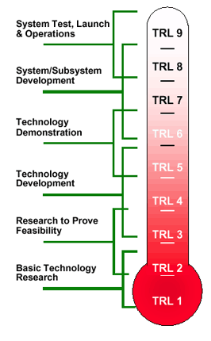
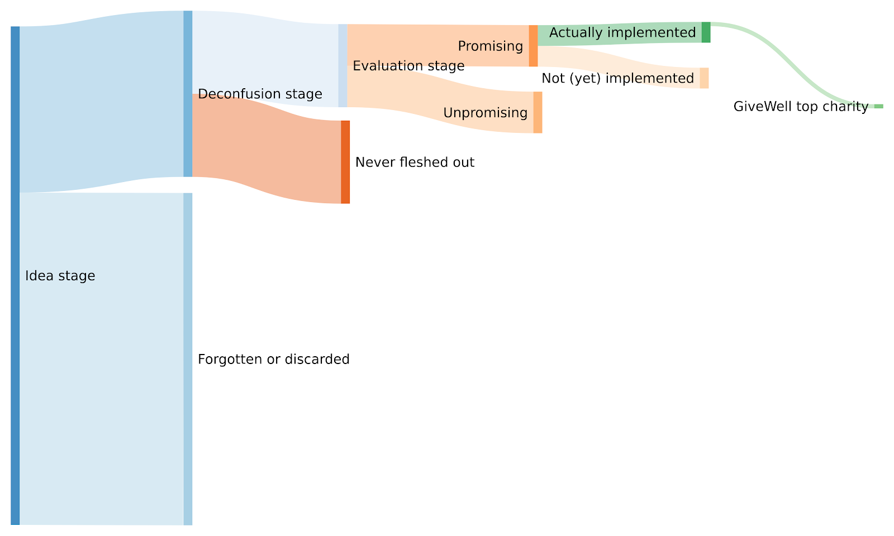

A Funnel for Cause Candidates
==============

From some previous work on technology timelines I know that NASA used [Technology readiness levels](https://en.wikipedia.org/wiki/Technology_readiness_level) to gauge the maturity of technologies for the purposes of space exploration. The scale then later was [criticized](https://web.archive.org/web/20171011071816/https://www.innovation.cc/discussion-papers/22_2_3_heder_nasa-to-eu-trl-scale.pdf) as becoming much less useful when it became applied more widely and more holistically, particularly by the European Union. Here is a picture of NASA’s technology readiness levels: 

The general idea is an awareness that technology has a funnel, from theoretical proposal to actually being used in space, and that the drop-out rate —the rate at which technologies don't make it to the next stage— is pretty brutal. For Effective Altruism cause candidates, the funnel might look something like this (more on the meaning of each stage later):

So if one is trying to pick technologies for the next generation of rockets, as in the case of NASA, one would want to focus on ideas with a high level of maturity. Similarly, if one is an EA incubator who wants to create a charity which has a chance of becoming a, say, GiveWell top charity, or a valuable long-termist charity, one might also want to choose an idea to implement which has a very high level of maturity. 

But one would also want to pay attention to the health of the funnel. That is, one would want to make sure that each stage has an adequate amount of resources, that each stage has enough survivors left for the next stage, and that there isn’t any particularly grievous bottleneck at any stage. For example, it could be the case that many ideas are suggested, but that they are mostly not fleshed out or followed up on, which means that the set of ideas for which there is a cost effectiveness analysis might be very small (and thus its best ideas not as promising as if they had been selected from a larger pool). 

This brings me to the question of what the actual stages are. I’m currently thinking in terms of the following stages: 

1.  **Ideation stage**: A new idea which hasn’t been considered before, or which hasn’t been salient recently, is proposed.
2.  **Deconfusion stage**: The proposed idea is fleshed out, and concrete interventions are proposed or explored.
    1.  There is a theory of change from intervention to impact, an understanding of how progress can be measured, etc.
3.  **Evaluation**: How does the evidence base for this kind of intervention look? 
    1.  What unit of benefit would an intervention produce and how many units would it produce per unit of resources? What does a cost-effectiveness analysis of proposed interventions reveal?
    2.  Overall, is this cause competitive with GiveWell's/ACE's/That Long-Termist Charity Evaluator Organization Which Doesn't Exist But Probably Should's top charities?
    3.  If the evidence base is unclear (for example, because the cause area under consideration is speculative), what specific evidence is there to think that the idea is worth it? Are there robust heuristics that allow us to conclude that working on the cause under consideration is very much likely to be worth it?
4.  **Implementation stage**: It has been determined that it's most likely a good idea to start object-level work on a specific cause/intervention (e.g., starting a charity, starting a new programme in an existing org or government, doing independent research and advising key decision-makers). Now the hard work begins of actually doing that

To clarify, I’m not saying that all  EA charities or projects need to be started after a quantitative cost-effectiveness analysis. But I’m guessing it helps, particularly for charities in global health and development, and particularly if someone wants to convince EAs to go along with a new cause. Other strong evaluation methods are of course also possible.

I’m holding this model somewhat lightly. For example, I’ve noticed that the “deconfusion” and the “evaluation” stages can sometimes go in either order. For instance, we can guess that an intervention which positively affects vast amounts of people in the long-term future of humanity is probably very cost-effective, even if we’re confused about how such an intervention looks like in practice. It can also be the case that some area seems particularly valuable to become less confused about, and so an organization could be created for that purpose. Further, ongoing interventions still undergo deconfusion and evaluations on later variations and specificities.

Despite holding that model lightly, and understanding that it doesn’t fully capture reality, I’ll be referring to it in subsequent posts, because I think it’s useful to be able to talk about the “readiness level” of a cause candidate. Thanks to Ozzie Gooen and Edo Arad for comments and discussion.