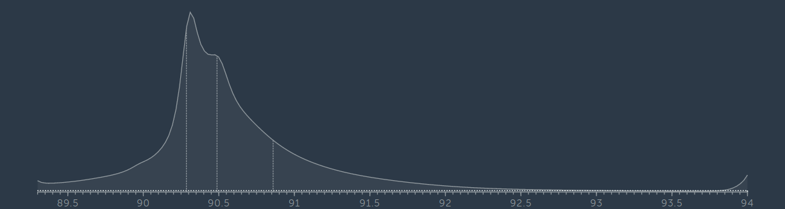
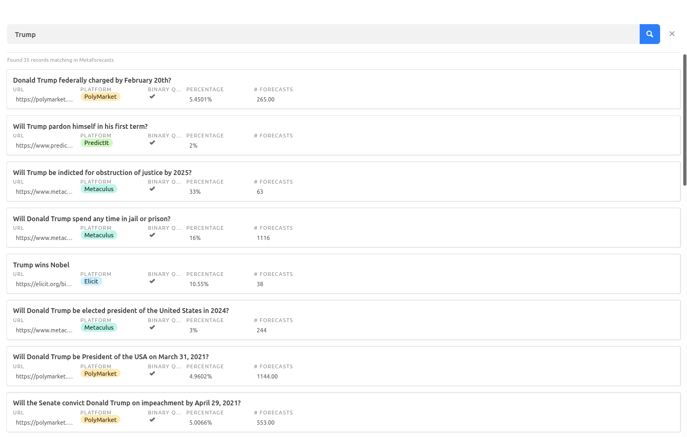
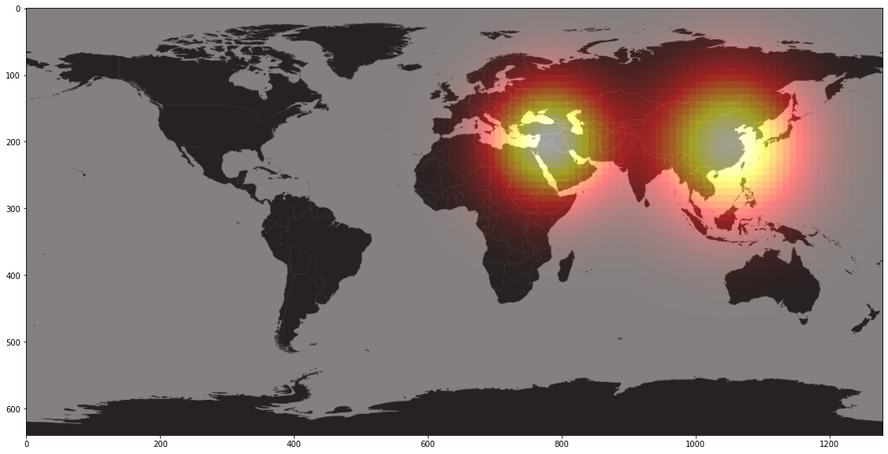

Forecasting Newsletter: January 2021
==============

## Highlights

1\. Veteran PredictIt trader writes a [pretty good guide](https://predictingpolitics.com/2021/01/31/how-to-get-good/) on how to make money on prediction markets. 

2\. [Metaculus](https://pandemic.metaculus.com/contests/?selected=consensus--forecasting) and [Hypermind](https://predict.hypermind.com/hypermind/app.html) both have new COVID-19 forecasting tournaments.

3\. I created a [search engine for probabilities](https://metaforecast.org/).

## Index

*   Highlights
*   Prediction Markets & Forecasting Platforms
*   In The News
*   Long Content
*   Hard To Categorize

Sign up [here](https://forecasting.substack.com) or browse past newsletters [here](https://forum.effectivealtruism.org/s/HXtZvHqsKwtAYP6Y7).

## Prediction Markets & Forecasting Platforms

**Hypermind** is an American-French forecasting platform with a somewhat outdated and clunky interface. They have a new [COVID-19 Recovery](https://predict.hypermind.com) contest with $7000 in promised prizes so far, with the amount set to increase as more questions get added. The contest is sponsored by the Open Philanthropy Project. Hypermind is somewhat difficult to navigate, so you might only be able to find the contest if you create an account and look around. 

**Metaculus** has a new [COVID-19 Forecasting](https://pandemic.metaculus.com/contests/?selected=consensus--forecasting) contest. From the description:

> “The goal of this project is to provide probabilistic predictions of the U.S. COVID-19 outbreak to support public health decision making at the federal and state level.
> 
> At the end of each month we will share a summary report with the Council of State and Territorial Epidemiologists, members of the Centers for Disease Control and Prevention, all members of MIDAS (Modeling of Infectious Disease Agent Study), and make this report available for public consumption.”

Metaculus also published an open letter on the [urgent need for expanded surveillance and forecasting of novel SAR-CoV-2 variants](https://www.metaculus.com/news/2021/01/08/OpenLetter/). An opinion piece saying the same thing is also available on [The Hill](https://thehill.com/opinion/healthcare/534639-genomic-sequencing-and-forecasting-needed-to-combat-deadlier-covid):

> “Efforts are already being made to characterize and understand the infectivity properties and immunological consequences of these new variants. However, as was the case at the start of the pandemic, most countries remain extraordinarily uncertain as to (1) the extent to which these novel variants are spreading and (2) the likelihood as to whether and when these new variants will become predominant.
> 
> Unfortunately, these issues do not appear as if they will be extensively addressed in the immediate future. The U.S. CDC, for instance, is currently only planning on having each state send it ‘at least 10 samples’ on a biweekly basis for sequencing and further characterization. This is woefully inadequate genomic surveillance — we are in the dark.
> 
> We are calling for a massive increase in genomic sequencing, monitoring, data sharing, and probabilistic forecasting so we can have a detailed understanding of where these new variants are circulating and how rapidly they are increasing as a proportion of all cases.”

On the negative side, Metaculus’s current editor could use some improvement. For example, consider the following aggregate prediction on the [state of the art performance on the SuperGLUE AI benchmark](https://www.metaculus.com/questions/5937/sota-on-superglue-on-2021-06-14/):

The current state of the art performance is [90.3](https://super.gluebenchmark.com/leaderboard) in the SuperGLUE benchmark, making it extremely unlikely that the end result will fall below that number. But, the Metaculus’s aggregate prediction gives a 25% chance to the state of the art falling below that number at question resolution time. This is because the Metaculus interface makes it annoying, or directly impossible, to create one-sided tails.

[**Omen**](http://omen.eth.link/) announced an integration with [API3](https://medium.com/api3/api3-to-integrate-with-omen-prediction-markets-4efee9d228f3). This will allow for obtaining generally superior resolutions for the price of almost any cryptocurrency. However, Omen is seeing very low trade volumes and very low numbers of active questions.

In contrast, [**Polymarket**](https://polymarket.com/) has been doing quite well with regards to trade volume. They resolved some of their presidential succession questions, and have probably managed to keep some of the new users in the aftermath. For a while, Polymarket was “an unlimited passive income stream for people who still have their frontal lobes intact” ([source](https://twitter.com/keendawgSSG/status/1351267120865280002)). For example, [Will Joe Biden be inaugurated as President of the USA on January 20th, 2021?](https://polymarket.com/market/will-joe-biden-be-inaugurated-as-president-of-the-usa-on-january-20th-2021-1) traded at 85 to 93% (!). 

But now—unlike in the previous edition of this newsletter—I don’t think that there are any markets which are egregiously wrong after taking into account fees and the hassle of moving relatively small amounts of money into Polymarket. That said, the “No” position on [Will Donald Trump be President of the USA on March 31, 2021?](https://polymarket.com/market/will-donald-trump-be-president-of-the-usa-on-march-31-2021) is still trading at 97 to 98% (after fees). And, a 2 to 3% return per month, particularly if compounded for a year, still looks pretty good.

**Augur**, a more decentralized cryptocurrency-based prediction market, has also successfully resolved various US election questions, and has also done better in terms of volume, particularly since its new interface, [catnip.exchange](https://catnip.exchange/), sprung up. However, I haven’t been following them closely.

In other news, I created a [**search engine for probabilities**](https://metaforecast.org/). It currently aggregates forecasts from PredictIt, Polymarket, Omen, Metaculus, Good Judgment Open, CSET-foretell, Elicit, PredictionBook (through Elicit) and Hypermind. You can access a demo [here](https://metaforecast.org/), or browse a GitHub repository and find out the location of selected API endpoints [here](https://github.com/QURIresearch/metaforecasts). To get a feel of how it works, I suggest searching for “Trump”, “China”, or “semiconductors”. Tentatively, I'll keep both the search engine and the json/csv endpoints updated once a day for the next month. I consider this to be in very early beta: comments and suggestions are welcome.

## In the News

[Forecasting the New Administration’s Impact on Defense](https://www.nationaldefensemagazine.org/articles/2021/1/18/forecasting-the-new-administrations-impact-on-defense). Despite being quite badly formatted, this piece by a former vice president of combat avionics at Northrop Grumman provides deep expertise and insight on the future shape of US defense spending under the Biden administration. The piece doesn't provide explicit probabilities, but it does give a sense of which scenarios are most likely and which are most worth paying attention to. 

[Vox looks back at their forecasts from 2020](https://www.vox.com/future-perfect/22158806/predict-2020-biden-trump-coronavirus-pandemic), and they compare favorably to [Metaculus](https://docs.google.com/spreadsheets/d/14Cc0amKbO-4-COsmf6hKlgKKaFqy-hVhmC9KCbyUAq0/edit#gid=0)’s ([source](https://twitter.com/beala/status/1346136939024551937)). Vox also [offers new predictions for 2021](https://www.vox.com/future-perfect/22167877/predicting-biden-coronavirus-transition-vaccines-2021).

[Radar technology that could revolutionize hurricane forecasts hits major setback](https://www.washingtonpost.com/weather/2021/01/07/airborne-phased-array-radar-ncar/). The US’s National Science Foundation considered the price tag of $70 million insufficiently justified.

> “An airborne phased-array radar system consists of thousands of transmitters and receivers spread across four square arrays strategically placed on an aircraft’s fuselage. They scan the sky and “can provide unprecedented detailed observations of the dynamics and microphysics of high-impact storms,” according to an NCAR fact sheet. The data collected by the phased-array radar, when integrated into computer models, could improve forecasts for hurricanes and other hazards investigated by aircraft, including non-hurricane severe weather and winter storms.”

[Airports explore new ways to forecast travel amid the pandemic](https://www.marketplace.org/2021/01/11/airports-explore-new-ways-to-forecast-travel-amid-pandemic/) by looking at new indicators, such as the number of people who search for the opening times of the Statue of Liberty, or for rental cars.

[AI Startup Sees Opportunity Forecasting Pandemic-Era Consumer Demand](https://www.wsj.com/articles/ai-startup-sees-opportunity-forecasting-pandemic-era-consumer-demand-11610496808) using proxies which other companies don’t yet use as much, such as internet searches.

[Betting Against QAnon](https://www.theatlantic.com/politics/archive/2021/01/betting-against-qanon-predictit/617396/) proved particularly profitable for some of the PredicIt traders.

[Superforecasters have a look at the end of Covid](https://unherd.com/2021/01/superforecasting-the-end-of-covid/) in Britain.

## Hard to Categorize

A small US city [deliberates](https://www.govtech.com/public-safety/Worcester-Mass-Balks-at-Crime-Forecasting-Technology.html) about paying for an expansion to a [gunfire locator](https://en.wikipedia.org/wiki/Gunfire_locator) which would not only detect and report shots fired, but also direct police officers to areas where incidents are predicted to be likely to happen. See also: [Minority Report](https://en.wikipedia.org/wiki/Minority_Report_(film)).

[Rootclaim](https://www.rootclaim.com/) is a site which comes up with Bayesian calculations for public interest questions. For example, here is their page on [the source of COVID-19](https://www.rootclaim.com/analysis/what-is-the-source-of-covid-19-sars-cov-2): they start with a reasonable prior and then legibly update their initial prediction with each piece of evidence they consider. That said, their conclusion differs from that of [Metaculus](https://www.metaculus.com/questions/3681/will-it-turn-out-that-covid-19-originated-inside-a-research-lab-in-hubei/#comment-27925) and from that of casual [discussion](https://twitter.com/kristjanmoore/status/1350432516314976258) between several superforecasters on Twitter.

Metaculus user [Ege Erdil](https://www.metaculus.com/accounts/profile/116023/) has produced a heatmap of predicted locations for World War 3 putting together the results of two questions: [If there is a WW3, what latitude will it start in?](https://www.metaculus.com/questions/3868/if-there-is-a-ww3-what-latitude-will-it-start-in/) and [If there's a WW3, what longitude will it start in?](https://www.metaculus.com/questions/3867/if-there-is-a-ww3-what-longitude-will-it-start-in/) . The source code used to produce the image below is available [here](https://colab.research.google.com/drive/1vULirmiot4vMHMFzTnY1l1kiIPwgrqei#scrollTo=1f5wDgZNwxrf). Because the latitude and longitude are given as separate variables, the code uses some kernel wizardry to try to find their degree of correlation, which might introduce some mistakes.

WW3 according to Metaculus.

Another Metaculus user and top 50 forecaster, [SimonM](https://www.metaculus.com/accounts/profile/112076/), has created a page, [Metaculus Extras](https://metaculusextras.com/points_per_question#), which presents various statistics about the platform, such as a list of top comments, an h-index (!), and a [timeline](https://www.tiki-toki.com/timeline/entry/1585353/Metaculus-Predictions/) of Metaculus community predictions. 

## Long Content

[A new paper](https://www.sciencedirect.com/science/article/pii/S0883902620306832?via%3Dihub) ([summary](https://newsroom.unsw.edu.au/news/business-law/how-investors-and-entrepreneurs-can-play-accurate-forecasting-game)) tries to quantify by how much entrepreneurs are overconfident when presenting forecasts to potential investors. The authors found ~15% overconfidence in founder CEOs, and ~27% for non-founder CEOs.

[Forecasting the future risk of dengue epidemics facing climate change in New Caledonia, South Pacific](https://www.biorxiv.org/content/10.1101/2021.01.22.427761v1).

> “Over the last decade, the toll of dengue fever has increased in New Caledonia, raising questions about the future of the disease in this French island territory located in the South Pacific. Climate has a strong influence on dengue through its influence on the ecology of the vector and the viral cycle. Several studies have explored the link between climate and dengue in New Caledonia, with the aim of explaining and predicting dengue outbreaks. None of these studies have explored the possible outcome climate change will have on the risk of dengue fever in New Caledonia. This is the goal of this study, through projections of rainfall and temperature and the selection of an appropriate prediction target for our statistical model, we assess the climate-induced risk of dengue outbreaks up to the 2100 horizon. We prove that the inter-annual risk of dengue outbreaks in New Caledonia will raise, according to all the greenhouse gas emission scenarios and according to the high emission scenario, dengue fever will become an endemic disease in New Caledonia.”

A [recent working paper](https://www.philadelphiafed.org/-/media/frbp/assets/working-papers/2021/wp21-03.pdf) by the Federal Reserve Bank of Philadelphia introduces a class of disagreement measures for probability distribution forecasts based on the [Wasserstein metric](https://en.wikipedia.org/wiki/Kullback%E2%80%93Leibler_divergence) (also known as the [Earth mover's distance](https://en.wikipedia.org/wiki/Earth_mover%27s_distance)).

[Against essential and accidental complexity](https://danluu.com/essential-complexity/).

> “In the classic 1986 essay, No Silver Bullet, Fred Brooks argued that there is, in some sense, not that much that can be done to improve programmer productivity. His line of reasoning is that programming tasks contain a core of essential/conceptual complexity that's fundamentally not amenable to attack by any potential advances in technology (such as languages or tooling). He then uses an Ahmdahl's law argument, saying that because 1/X of complexity is essential, it's impossible to ever get more than a factor of X improvement via technological improvements. Towards the end of the essay, Brooks claims that at least 1/2 (most) of complexity in programming is essential, bounding the potential improvement remaining for all technological programming innovations combined to, at most, a factor of 2. Let's see how this essential complexity claim holds(...)”

[Mining the silver lining of the Trump presidency](https://predictingpolitics.com/2021/01/09/mining-the-silver-lining-of-the-trump-presidency/): A retrospective look at the Trump tweets’ markets in PredictIt.

> “For the better part of the last four politically insane years, a community of gamblers wagered stupid amounts of money betting on a simple question: How many times would Donald Trump tweet this week? The game ended for us before it ended for the President, but now that it’s completely over, I feel this tiny corner of Internet weirdness deserves some remembrance. After all, there are very few other people on this planet that understood Trump’s twitter habits – and by extension, Trump himself – more than the people who bet on them.”

That same author has what seems to be a [pretty good guide](https://predictingpolitics.com/2021/01/31/how-to-get-good/) on how to bet on prediction markets if one is optimizing for making money. Something I personally was doing wrong was holding until the end and considering prices in isolation, that is, asking myself “is this price wrong?” rather than “is this price the most wrong it will be?”

The UK's [National Risk Register](https://assets.publishing.service.gov.uk/government/uploads/system/uploads/attachment_data/file/952959/6.6920_CO_CCS_s_National_Risk_Register_2020_11-1-21-FINAL.pdf) is a document which "provides information on the most significant risks that could occur in the next two years and which could have a wide range of impacts on the UK." Besides this, it also contains a pretty good categorization scheme for risks.

Metaculus lore tells of a [legendary comment](https://www.metaculus.com/questions/124/will-the-world-population-increase-every-year-for-the-next-decade/#comment-20441) by user [@travisfisher](https://www.metaculus.com/accounts/profile/100518/). Written on Jan 24, 2020, under [Will the world population increase every year for the next decade?](https://www.metaculus.com/questions/124/will-the-world-population-increase-every-year-for-the-next-decade/#comment-20441), it reads:

> The Wuhan Coronavirus is looking like a pandemic event that could be serious enough to threaten this outcome.

---

Note to the future: All links are added automatically to the Internet Archive. In case of link rot, go [there](https://archive.org/) and input the dead link.

---

> Probability should not be introduced through games of chance. These games are artificial, & give the impression that probability is mostly objective & irreducible (aleatoric). The real problems we face almost always require probability that is subjective & reducible (epistemic).

Source: [@maosbot](https://twitter.com/maosbot/status/1343120572864225280)

---