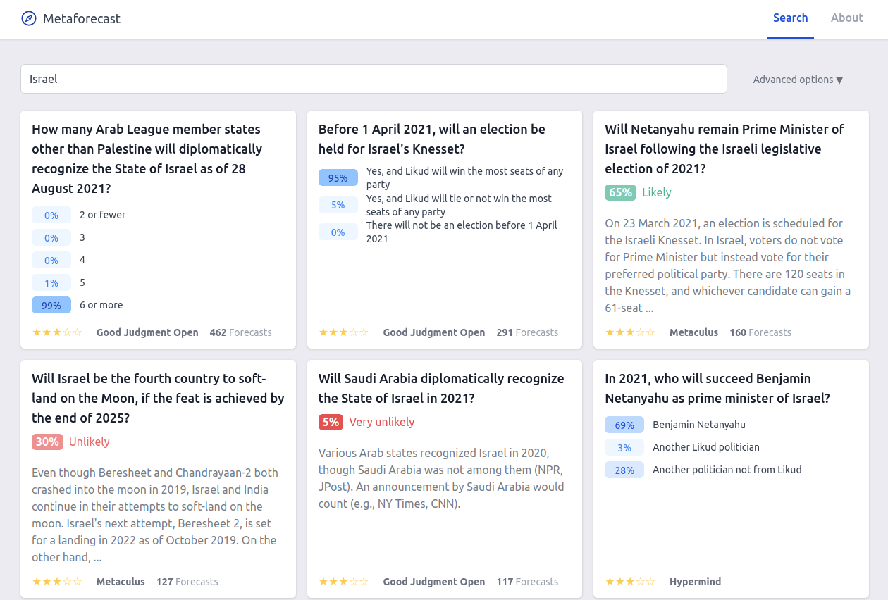
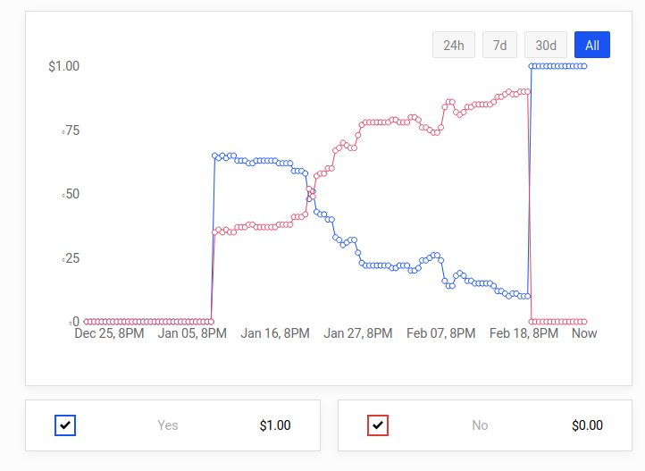
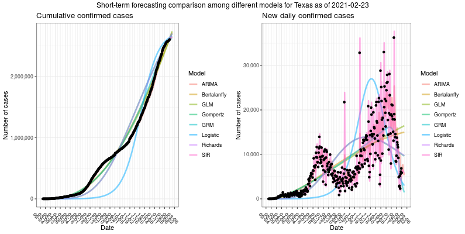
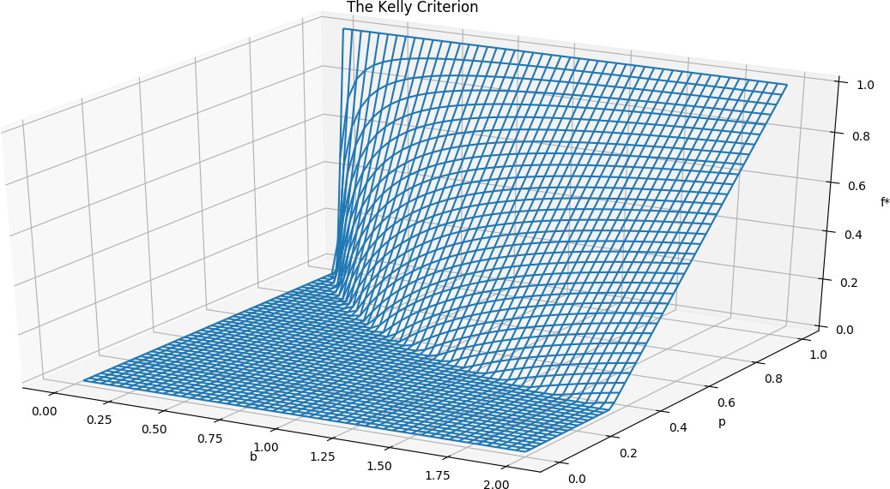

Forecasting Newsletter: February 2021
==============

## Highlights

*   Biden orders the creation of a [National Center for Epidemic Forecasting and Outbreak Analytics](https://www.whitehouse.gov/briefing-room/statements-releases/2021/01/21/national-security-directive-united-states-global-leadership-to-strengthen-the-international-covid-19-response-and-to-advance-global-health-security-and-biological-preparedness/)
*   Americans get a [clone](https://kalshi.com/) of Betfair/Smarkets, expected to be marginally better than PredictIt
*   Hypermind has a new forecasting tournament on the [future of AI in 2023](https://prod.hypermind.com/ngdp/en/welcomeAI2023.html)

## Index

*   Prediction Markets & Forecasting Platforms
*   In The News
*   Recent Blog Posts
*   Personal Forecasts
*   Hard To Categorize
*   Long Content

Sign up [here](https://forecasting.substack.com/) or browse past newsletters [here](https://forum.effectivealtruism.org/s/HXtZvHqsKwtAYP6Y7).

## Prediction Markets & Forecasting Platforms

A new US company, [Kalshi](https://kalshi.com/), has gotten [regulatory approval](https://kalshi.com/news/kalshi-designation) from the Commodity Futures Trading Commission to create a betting platform. I don't really have many thoughts given that they haven't launched yet. I expect them to use newer technologies than PredictIt just because they are newer, and I expect them to have somewhat lower fees because it would make business sense. They are planning to open in March. From the [Wall Street Journal](https://www.wsj.com/articles/online-trading-platform-will-let-investors-bet-on-yes-or-no-questions-11613557800) (unpaywalled [archive link](https://archive.is/kPqzi#selection-2633.0-2633.124)): 

> Alfred Lin, a partner at Sequoia and a Kalshi board member, said Kalshi’s embrace of regulation was one of the reasons his firm invested in the startup. “They’re taking regulation fairly seriously,” he said. “Companies that move fast and break things are not going to work in this regulated environment.”

[Hypermind](http://hypermind.com/) has a new forecasting tournament: [Where will AI be in 2023?](https://prod.hypermind.com/ngdp/en/welcomeAI2023.html), with a prize pot worth $7,000 so far.

Forecasters on Good Judgment Open have the opportunity to receive feedback from superforecasters if they participate in the [Think Again challenge](https://www.gjopen.com/challenges/53-think-again-with-adam-grant), make 10 predictions and complete a survey.

With [QURI](http://quantifieduncertainty.org/), I've been improving [Metaforecast](https://metaforecast.org/), a search tool for probabilities. It now has more prediction platforms, a nicer interface, and more search options. Readers might be interested in [COVID predictions](https://metaforecast.org/?query=COVID&starsThreshold=2&numDisplay=20&forecastsThreshold=0&forecastingPlatforms=CSET-foretell%7CGood%20Judgment%7CGood%20Judgment%20Open%7CGuesstimate%7CHypermind%7CMetaculus%7CPolyMarket%7CPredictIt%7CSmarkets), readers from the EA movement might be particularly interested in [all GiveWell and OpenPhilanthropy predictions](https://metaforecast.org/?query=%20&starsThreshold=2&numDisplay=20&forecastsThreshold=0&forecastingPlatforms=GiveWell/OpenPhilanthropy).

[Metaforecast](https://metaforecast.org/?query=Israel&starsThreshold=2&numDisplay=20&forecastsThreshold=0&forecastingPlatforms=CSET-foretell|Good%20Judgment|Good%20Judgment%20Open|Guesstimate|Hypermind|Metaculus|PolyMarket|PredictIt|Smarkets) search for "Israel"

## In the News

Biden ordered the creation of a [National Center for Epidemic Forecasting and Outbreak Analytics](https://www.whitehouse.gov/briefing-room/statements-releases/2021/01/21/national-security-directive-united-states-global-leadership-to-strengthen-the-international-covid-19-response-and-to-advance-global-health-security-and-biological-preparedness/) ([secondary source](https://archive.is/PJhKx)). The new agency looks somewhat related to a previous proposal mentioned in this newsletter:  [Forecasting the next COVID-19](https://www.princeton.edu/news/2020/12/14/forecasting-next-covid-19).

[Suboptimal demand forecasting](https://www.forbes.com/sites/willyshih/2021/02/07/the-automotive-chip-crunch-reflects-the-challenges-of-forecasting-as-well-as-the-role-of-china/?sh=cd0259f76af5) for semiconductor chips has led to pausing automobile production in the US. On the one hand, automakers struggle to compete for chips against more profitable tech products—e.g., iPhones—on the other hand, US sanctions on China’s Huawei and [SMIC](https://en.wikipedia.org/wiki/Semiconductor_Manufacturing_International_Corporation) put even more pressure on semiconductor production capacity.

[The European Central Bank will be holding its 11th Conference on Forecasting Techniques as an online event on 15 and 16 June 2021.](https://www.ecb.europa.eu/pub/conferences/html/20210615_forecasting_techniques_CALL.en.html) 

Hewlett Packard has built a new [supercomputer](https://www.hpe.com/us/en/newsroom/press-release/2021/02/us-air-force-advances-weather-forecasting-for-defense-missions-with-65x-faster-supercomputer-built-by-hewlett-packard-enterprise.html) dedicated to weather forecasting for the U.S. Air Force. The new system advertises a peak performance of 7.2 petaflops. This is comparable to estimates of the [human brain](https://aiimpacts.org/brain-performance-in-flops/), and around two orders of magnitude lower than the [fastest supercomputer](https://en.wikipedia.org/wiki/TOP500#TOP_500).

[Future Returns: Using the Past to Forecast the Future of the Markets](https://www.barrons.com/articles/future-returns-using-the-past-to-forecast-the-future-of-the-markets-01611701133). An analyst at [Fidelity](https://en.wikipedia.org/wiki/Fidelity_Investments) looks at the historical base rate for market behavior in situations similar to the current, COVID-19-affected, performance.

[Where The Latest COVID-19 Models Think We're Headed — And Why They Disagree](https://projects.fivethirtyeight.com/covid-forecasts/), by FiveThirtyEight

## Recent blog posts

[Boring is back, baby!](https://predictingpolitics.com/2021/02/06/boring-is-back-baby/) Experienced PredictIt bettor discusses the future profitability of political predictions:

> The political betting community has been quietly dreading the potential boringness of the Biden presidency – without politics being so crazy, engagement should fall off and so should the deposits of new accounts coming in to bet on whatever wild stuff Trump was up to next
> 
> I’d more or less written off this year as one in which I’d be happy to earn a third what I did last year on PredictIt and maybe try doing some grown-up work or something (lol, as if). Then it turns out January was one of the most interesting months in politics of the entire Trump presidency (to put it mildly) and engagement has remained fairly substantial. But that doesn’t mean the doldrums aren’t coming.

The following three articles, among others, won a “[Forecasting Innovations Prize](https://forum.effectivealtruism.org/posts/8QFWHzmur4roAcnCf/forecasting-prize-results)” I had previously co-organized under QURI.

[Crowd-Forecasting Covid-19](https://www.lesswrong.com/posts/CiXsE3N77sXi95nvD/crowd-forecasting-covid-19) describes the results of a COVID-19 crowd-forecasting project created during the author's PhD. This is probably the one app in which human forecasters can conveniently forecast different points in a time series, with confidence intervals. The project’s forecasts were submitted to the German and Polish Forecast Hub, and they did surprisingly well in comparison with other groups.They are [looking for forecasters](https://cmmid-lshtm.shinyapps.io/crowd-forecast/), and will soon expand to cover 32 European countries as part of the yet-to-be-launched [European Forecast Hub](https://covid19forecasthub.eu/).

[Incentivizing forecasting via social media](https://forum.effectivealtruism.org/posts/842uRXWoS76wxYG9C/incentivizing-forecasting-via-social-media) explores the implications of integrating forecasting functionality with social media platforms. The authors consider several important potential issues at length, propose possible solutions, as well as give recommendations regarding next steps. The scenario they consider— if it were to occur—could possibly have a large impact on the “information economy”.

[Central Limit Theorem investigation](https://www.lesswrong.com/posts/YM6Qgiz9RT7EmeFpp/how-long-does-it-take-to-become-gaussian) visualizes how quickly the central limit theorem works in practice, i.e., how many distributions of different types one has to sum (or convolve) to approximate a Gaussian distribution in practice (rather than in the limit). The visualizations are excellent and give the readers intuitions about how long the central limit theorem takes to apply. As a caveat, the post requires understanding that the density of the sum of two independent variables is the convolution of their densities. That is, that when the post mentions “the number of convolutions you need to look Gaussian”, this is equivalent to “the number of times you need to sum independent instances of a distribution in order for the result to look Gaussian”. This point is mentioned in an [earlier post](https://www.lesswrong.com/s/AaKNSG7caKMFmPWtn/p/6oPe3oqzdJtrWmduR) of the [same sequence](https://www.lesswrong.com/s/AaKNSG7caKMFmPWtn).

I stumbled upon [Alert Foxes](https://alertfoxes.com/?cat=3), a blog with a few forecasting posts by Alex Foster (perfect anagram!). I particularly enjoyed the decompositions of his predictions on [US election questions](https://alertfoxes.com/?p=106).

Vitalik Buterin writes about his experience [betting on the US election](https://vitalik.ca/general/2021/02/18/election.html) using crypto prediction markets.

[AstralCodexTen](http://astralcodexten.substack.com/)—previously [SlateStarCodex](https://slatestarcodex.com/), a blog I hold in high regard—has started a weekly series discussing forecasting questions ([1](https://astralcodexten.substack.com/p/metaculus-monday), [2](https://astralcodexten.substack.com/p/metaculus-monday-2821), [3](https://astralcodexten.substack.com/p/mantic-monday-judging-april-covid)).

## Personal forecasts

A piece of [feedback](https://docs.google.com/forms/d/1UxeJ5A3pI4vqSbXaQGNPsOQamVsvEalamlRr78uNzIM/edit) I got at the end of last year about this newsletter was to talk more about my own predictions, so here are two which I recently got wrong and one that I got right:

The first one was [Will Kim Kardashian or Kanye West file for divorce before March 1, 2021?](https://polymarket.com/market/will-kim-kardashian-or-kanye-west-file-for-divorce-before-march-1-2021). After some investigation, I thought that they would try to time the divorce to maximize news about the last season of [Keeping Up with the Kardashians](https://en.wikipedia.org/wiki/Keeping_Up_with_the_Kardashians), and was quite surprised when they didn't. Other bettors were also surprised, as the price on Polymarket looked as follows:

PolyMarket prices for question "Will Kim Kardashian or Kanye West file for divorce before March 1, 2021?"

The second prediction I got grievously wrong was [How much new funding will facial recognition companies raise between July 1 and December 31, 2020, inclusive?](https://www.cset-foretell.com/questions/56-how-much-new-funding-will-facial-recognition-companies-raise-between-july-1-and-december-31-2020-inclusive), on CSET-foretell. With the passage of time I updated away from the option "Less than $200 million", which ended up being chosen for resolution. The resolution source, Crunchbase, describes [Acceso Digital](https://www.crunchbase.com/organization/acesso-digital/company_financials) as "a developer of facial recognition and identification technology created to solve document and process management", but doesn't classify it in the "facial recognition" category. In September 2020, Acesso Digital raised R$580M (circa $90 million), which would have been enough to raise the final question resolution to the next category ("More than $200 million but less than or equal to $500 million"). 

Thirdly, I assigned a 50% probability to winning an EA forum prize for a [research project](https://forum.effectivealtruism.org/posts/SCqRu6shoa8ySvRAa/big-list-of-cause-candidates), which I [did](https://forum.effectivealtruism.org/posts/NQWG2e97cTEGyHGEx/ea-forum-prize-winners-for-december-2020?commentId=8xMPEbyeRN7NsqxYk).

## Hard to Categorize

The [Illinois Commission on Government Forecasting and Accountability](https://cgfa.ilga.gov/Home.aspx) is a government agency in charge of making e.g., revenue predictions. Judging by its webpage, it seems somewhat outdated. A similar agency in [California](https://www.dof.ca.gov/Forecasting/) appears to be more up to date. It might be interesting for platforms like Metaculus to try to partner with them.

[Meta and consensus forecast of COVID-19 targets](https://raw.githubusercontent.com/computationalUncertaintyLab/aggStatModelsAndHumanJudgment_PUBL/main/summaryreports/summaryReport01/MetaandConsensusForecastOfCOVID-19Targets.pdf) ([secondary source](https://www.eurekalert.org/pub_releases/2021-01/lu-ff012921.php)) provides a variety of forecasts about COVID. They provided forecasts about US deaths conditional on vaccination rates, which could have been particularly action-guiding. They also find that forecasts which aggregate predictions from infectious disease experts and “trained forecasters” have wider uncertainty intervals than the [COVID-19 Forecast Hub](https://covid19forecasthub.org/).

[Upstart](http://upstart.com/), a company which uses machine learning/data analysis to predict loan repayment, is looking for one or more forecasters with a good track record to do some consulting work. If you're interested, let me [know](mailto:nuno.semperelh@gmail.com). 

## Long Content

[Evaluating Short-term Forecast among Different Epidemiological Models under a Bayesian Framework](https://www.medrxiv.org/content/10.1101/2020.10.11.20210971v1.full) ([supporting data](http://gigadb.org/dataset/100863), [webpage](https://qiwei.shinyapps.io/PredictCOVID19/)). The authors notice that the relative merits of different epidemic forecasting methods and approaches are difficult to compare. This is because they don’t normally have access to the same data or computational capacity in the wild. The authors set out to carry out that comparison themselves, but they don’t arrive to any sharp conclusions, other than [ARIMA](https://en.wikipedia.org/wiki/Autoregressive_integrated_moving_average) not being able to keep up with stochastic approaches. 

from 'Evaluating Short-term Forecast among Different Epidemiological Models under a Bayesian Framework'

> We calibrate stochastic variants of growth models and the standard SIR model into one Bayesian framework to evaluate their short-term forecasts. 
> 
> Broadly speaking, there are five types of approaches to forecasting the number of new cases or the expected total mortality caused by the COVID-19: 1) time-series forecasting such as autoregressive integrated moving average (ARIMA) \[...\]; 2) growth curve fitting based on the generalized Richards curve (GRC) or its special cases \[...\]; 3) compartmental modeling based on the susceptible-infectious-removed (SIR) models or its derivations \[...\]; 4) agent-based modeling \[...\]; 5) artificial intelligence (AI)-inspired modeling.
> 
> There has been a growing debate amongst researchers over model performance evaluation and finding the best model appropriate for a certain feature (cases, deaths, etc.), a particular regional level (county, state, country, etc.), and more. Fair evaluation and comparison of the output of different forecasting methods have remained an open question, since models vary in their complexity in terms of the number of variables and parameters that characterize the dynamic states of the system.
> 
> Although a comparison of predictive models for infectious diseases has been discussed in the literature, to our best knowledge, no existing work systematically compares their performances, particularly with the same amount of data information.
> 
> None of the models proved to be golden standards across all the regions in their entirety, while the ARIMA model underperformed all stochastic models proposed in the paper

Comparing weather forecasts in Tasmania now to those made 30 years ago, a news article mentions that the amount of available data has increased [13.5 million times](https://www.abc.net.au/news/2021-02-02/bureau-of-meteorology-weather-forecasting-methods-evolving/13094442).

[The Kelly Criterion, visualized in 3D](https://www.lesswrong.com/posts/iboaiByhPxfvYgFoB/the-kelly-criterion-in-3d).

The Kelly Criterion in 3D, visualized by lsusr. Source: Less Wrong

On the topic of Kelly, see also [Kelly isn't (just) about logarithmic utility](https://www.lesswrong.com/posts/zmpYKwqfMkWtywkKZ/kelly-isn-t-just-about-logarithmic-utility), [Kelly \*is\* (just) about logarithmic utility](https://www.lesswrong.com/posts/DfZtwtGD6ymFtXmdA/kelly-is-just-about-logarithmic-utility) and [Never Go Full Kelly.](https://www.lesswrong.com/posts/TNWnK9g2EeRnQA8Dg/never-go-full-kelly)

[The EpiBench Platform to Propel AI/ML-based Epidemic Forecasting: A Prototype Demonstration Reaching Human Expert-level Performance](https://arxiv.org/abs/2102.02842) ([secondary source](https://venturebeat.com/2021/02/11/researchers-propose-platform-for-evaluating-ai-disease-forecasting-methods/)).

> During the COVID-19 pandemic, a significant effort has gone into developing ML-driven epidemic forecasting techniques. However, benchmarks do not exist to claim if a new AI/ML technique is better than the existing ones. The "covid-forecast-hub" is a collection of more than 30 teams, including us, that submit their forecasts weekly to the CDC.
> 
> It is not possible to declare whether one method is better than the other using those forecasts because each team's submission may correspond to different techniques over the period and involve human interventions as the teams are continuously changing/tuning their approach. Such forecasts may be considered "human-expert" forecasts and do not qualify as AI/ML approaches, although they can be used as an indicator of human expert performance.
> 
> We are interested in supporting AI/ML research in epidemic forecasting which can lead to scalable forecasting without human intervention. Which modeling technique, learning strategy, and data pre-processing technique work well for epidemic forecasting is still an open problem. To help advance the state-of-the-art AI/ML applied to epidemiology, a benchmark with a collection of performance points is needed and the current "state-of-the-art" techniques need to be identified. We propose EpiBench a platform consisting of community-driven benchmarks for AI/ML applied to epidemic forecasting to standardize the challenge with a uniform evaluation protocol.
> 
> In this paper, we introduce a prototype of EpiBench which is currently running and accepting submissions for the task of forecasting COVID-19 cases and deaths in the US states and We demonstrate that we can utilize the prototype to develop an ensemble relying on fully automated epidemic forecasts (no human intervention) that reaches human-expert level ensemble currently being used by the CDC.
> 
> In an experiment, the researchers compared 3 AI and machine learning forecasting methods and 30 methodologies pulled from published research using EpiBench. They found that while many of the forecasts reportedly used the same model (SEIR), they predicted “drastically” different outcomes. Moreover, two methodologies identical except that one smoothed data over 14 days versus the other’s 7 days varied “significantly” in their performance, suggesting that data preprocessing played a nontrivial role.

---

Note to the future: All links are added automatically to the Internet Archive. In case of link rot, go [here](https://archive.org/) and input the dead link.

---

> "I never think of the future. It comes soon enough".

Albert Einstein, said probably as a joke ([source](https://quoteinvestigator.com/2013/07/23/future-soon/)).

---
