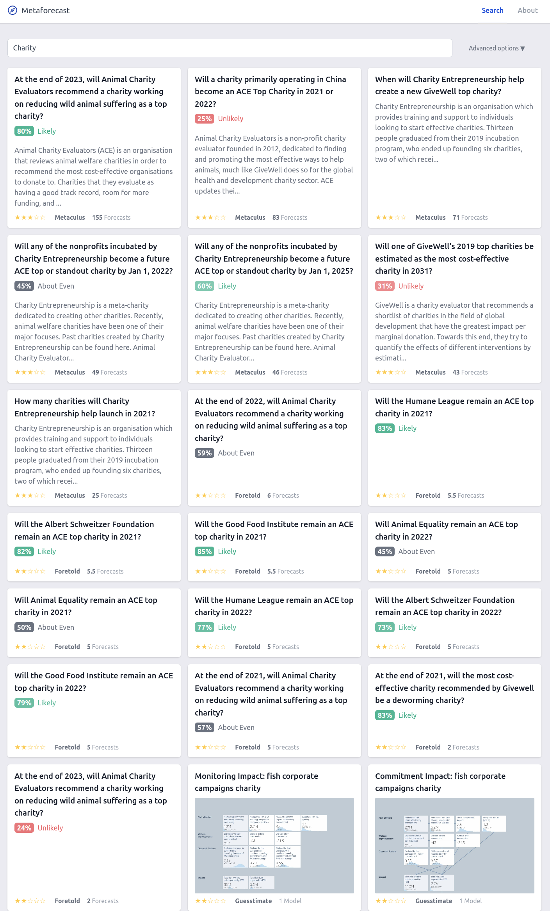
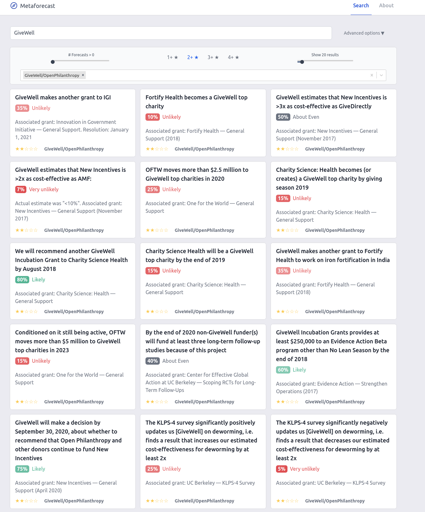

Introducing Metaforecast: A Forecast Aggregator and Search Tool
==============

## Introduction

The last few years have seen a proliferation of forecasting platforms. These platforms differ in many ways, and provide different experiences, filters, and incentives for forecasters. Some platforms like Metaculus and Hypermind use volunteers with prizes, others, like PredictIt and Smarkets are formal betting markets. 

Forecasting is a public good, providing information to the public. While the diversity among platforms has been great for experimentation, it also fragments information, making the outputs of forecasting far less useful. For instance, different platforms ask similar questions using different wordings. The questions may or may not be organized, and the outputs may be distributions, odds, or probabilities.

Fortunately, most of these platforms either have APIs or can be scraped. We’ve experimented with pulling their data to put together a listing of most of the active forecasting questions and most of their current estimates in a coherent and more easily accessible platform.

## Metaforecast

[Metaforecast](https://metaforecast.org/) is a free & simple app that shows predictions and summaries from 10+ forecasting platforms. It shows simple summaries of the key information; just the immediate forecasts, no history. Data is fetched daily. There’s a simple string search, and you can open the advanced options for some configurability. Currently between all of the indexed platforms we track ~2100 active forecasting questions, ~1200 (~55%) of which are on Metaculus. There are also 17,000 public models from Guesstimate. 

One obvious issue that arose was the challenge of comparing questions among platforms. Some questions have results that seem more reputable than others. Obviously a Metaculus question with 2000 predictions seems more robust than one with 3 predictions, but less obvious is how a Metaculus question with 3 predictions compares to one from Good Judgement Superforecasters where the number of forecasters is not clear, or to estimates from a Smarkets question with £1,000 traded. We believe that this is an area that deserves substantial research and design experimentation. In the meantime we use a star rating system. We created a function that estimates reputability as “stars” on a 1-5 system using the forecasting platform, forecast count, and liquidity for prediction markets. The estimation came from volunteers acquainted with the various forecasting platforms. We’re very curious for feedback here, both on what the function should be, and how to best explain and show the results. 

Metaforecast is being treated as an experimental endeavor of [QURI](https://quantifieduncertainty.org/). We spent a few weeks on it so far, after developing technologies and skill sets that made it fairly straightforward.  We're currently expecting to support it for at least a year and provide minor updates. We’re curious to see what interest is like and respond accordingly. 

Metaforecast is being led by Nuño Sempere, with support from Ozzie Gooen, who also wrote much of this post.

## Select Search Screenshots

### [**Charity**](https://metaforecast.org/?query=Charity)

### [**GiveWell**](https://metaforecast.org/?query=GiveWell&starsThreshold=2&numDisplay=20&forecastsThreshold=0&forecastingPlatforms=GiveWell/OpenPhilanthropy)

## Data Sources

| Platform                  | Url                               | Information used in Metaforecast                                                                              | Robustness                                                                                        |
|---------------------------|-----------------------------------|---------------------------------------------------------------------------------------------------------------|---------------------------------------------------------------------------------------------------|
| Metaculus                 | https://www.metaculus.com         | Active questions only. The current aggregate is shown for binary questions, but not for continuous questions. | 2 stars if it has fewer than 100 forecasts, 3 stars when between 101 and 300, 4 stars if over 300 |
| Foretell (CSET)           | https://www.cset-foretell.com/    | All active questions                                                                                          | 1 star if a question has fewer than 100 forecasts, 2 stars if it has more                         |
| Hypermind                 | https://www.hypermind.com         | Questions on various dashboards                                                                               | 3 stars                                                                                           |
| Good Judgement            | https://goodjudgment.io/          | We use various superforecaster dashboards. You can see them here and here                                     | 4 stars                                                                                           |
| Good Judgement Open       | https://www.gjopen.com/           | All active questions                                                                                          | 2 stars if a question has fewer than 100 forecasts, 3 stars if it has more                        |
| Smarkets                  | https://smarkets.com/             | Only take the political markets, not sports or others.                                                        | 2 stars                                                                                           |
| PredictIt                 | https://www.predictit.org/        | All active questions                                                                                          | 2 stars                                                                                           |
| PolyMarket                | https://polymarket.com/           | All active questions                                                                                          | 3 stars if they have more than $1000 of liquidity, 2 stars otherwise                              |
| Elicit                    | https://elicit.org/               | All active questions                                                                                          | 1 star                                                                                            |
| Foretold                  | https://www.foretold.io/          | Selected communities                                                                                          | 2 stars                                                                                           |
| Omen                      | https://www.fsu.gr/en/fss/omen    | All active questions                                                                                          | 1 star                                                                                            |
| Guesstimate               | https://www.getguesstimate.com/   | All public models. These aren’t exactly forecasts, but some of them are, and many are useful for forecasts.   | 1 star                                                                                            |
| GiveWell                  | https://www.givewell.org/         | Publicly listed forecasts                                                                                     | 2 stars                                                                                           |
| Open Philanthropy Project | https://www.openphilanthropy.org/ | Publicly listed forecasts                                                                                     | 2 stars                                                                                           |

Since the initial version, the star rating has been improved by [aggregating the judgment of multiple people](https://github.com/QURIresearch/metaforecasts/blob/master/src/stars.js), which mostly just increased Polymarket’s rating. However, the fact that we are aggregating different perspectives makes the star rating more difficult to summarize, and the numbers shown on the table are just those of my (Nuño’s) perspective. 

## Future work

*   There are several more platforms to include. These include Augur, various non-crypto betting houses such as Betfair and William Hill, and Facebook’s Forecast. Perhaps we also want to include the sources of statistics, or hunt for probabilistic claims in books, Twitter, and other places.
*   The ratings should reflect accuracy over time, and as data becomes available on prediction track records, aggregation and scoring can become less subjective.
*   Metaforecast doesn’t support showing continuous numbers or forecasts over dates yet.
*   Search and discovery could be improved, perhaps with the addition of formal categorization systems on top of the existing ones.
*   It would be neat to have importance or interest scores to help order and discover questions.
*   We could have an API for Metaforecast, providing a unified way to fetch forecasts among many different platforms. As of now, we have a json endpoint [here](https://metaforecast.org/data/metaforecasts.json).
*   Metaforecast  currently focuses on search, but it could make the data more available in nice table forms. This is a bit of a challenge now because it's all so disorganized.
*   It could be nice to allow users to create accounts, star and track questions they care about, and perhaps vote (indicating interest) and comment on some of them.
*   This is unlikely, but  one could imagine a browser extension that tries to guess what forecasts are relevant to any news article one might be reading and show that to users.
*   There could be a big difference between forecasting dashboards optimized for different groups of people. For instance, sophisticated users may want power and details, while most people would be better suited to curated and simplified workflows.

## Challenges

Doing this project exposed just how many platforms and questions there are. At this point there are thousands of questions and it's almost impossible to keep track of all of them. Almost all of the question names are rather ad-hoc. Metaforecast helps, but is limited. 

Most public forecasting platforms seem optimized for questions and user interfaces for forecasters and narrow interest groups, not public onlookers. There are a few public dashboards, but these are rather few compared to all of the existing forecasting questions, and these often aren’t particularly well done. It seems like there's a lot of design and figuring out to both reveal and organize information for intelligent consumers, and also doing so for more public groups.

Overall, this is early work for what seems like a fairly obvious and important area. We encourage others to either contribute to Metaforecast, or make other websites using this as inspiration.

## Source code

The source code for the webpage is [here](https://github.com/QURIresearch/metaforecast-frontend), and the source code for the library used to fetch the probabilities is [here](https://github.com/QURIresearch/metaforecast-backend). Pull requests or new [issues](https://github.com/QURIresearch/metaforecast-frontend/issues) with complaints or feature suggestions are welcome. 

---

Thanks to David Manheim, Jaime Sevilla, @meerpirat, Pablo Melchor, and Tamay Besiroglu for various comments, to Luke Muehlhauser for feature suggestions, and to Metaculus for graciously allowing us to use their forecasts.
