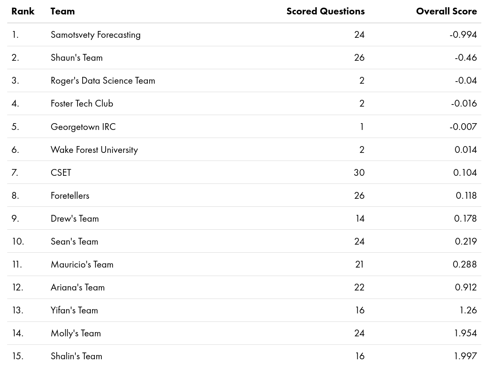
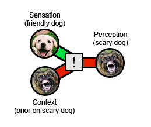
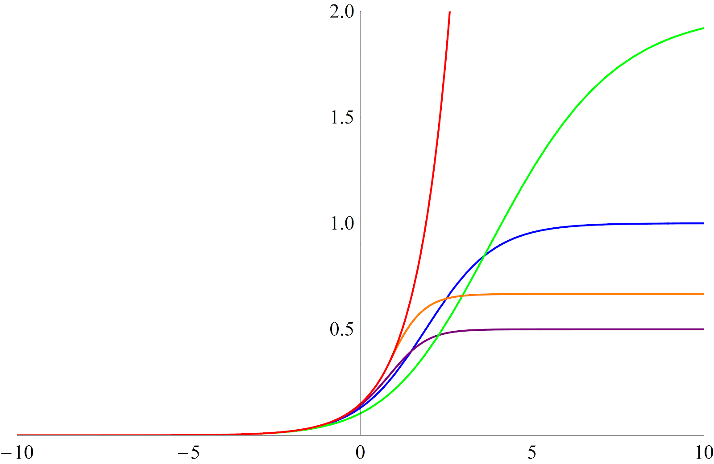
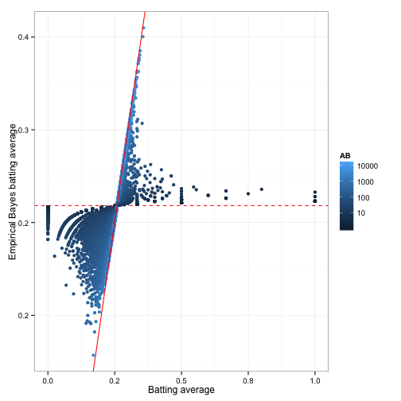
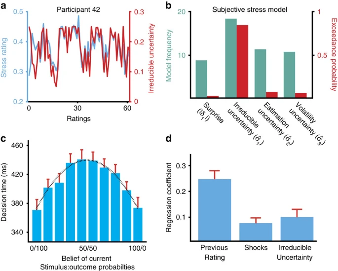

Forecasting Newsletter: March 2021
==============

## Highlights

*   OpenPhilanthropy releases a report on [outside view perspectives on the likelihood of AGI.](https://www.openphilanthropy.org/blog/report-semi-informative-priors)
*   Jason Matheny, previous director of IARPA, CSET, is now a ¿senior? [official in the Biden administration](https://twitter.com/CSETGeorgetown/status/1369043114481102848).
*   Astral Codex Ten considers [Trapped Priors As A Basic Problem Of Rationality](https://astralcodexten.substack.com/p/trapped-priors-as-a-basic-problem)

## Index

*   Prediction Markets & Forecasting Platforms
*   In The News
*   Recent Blog Posts
*   Hard to Categorize
*   Long Content

Sign up [here](https://forecasting.substack.com/) or browse past newsletters [here](https://forum.effectivealtruism.org/s/HXtZvHqsKwtAYP6Y7).

## Prediction Markets & Forecasting Platforms

[Numerai](https://docs.numer.ai/tournament/learn) is a distributed, blockchain-based hedge fund. Users can either [predict on free, but obfuscated data](https://docs.numer.ai/tournament/learn), or [use their own data and predict on real world companies](https://docs.numer.ai/numerai-signals/signals-overview). After the users stake cryptocurrency on their predictions, Numerai buys or sells stocks in proportion to each prediction's stake.and then stake cryptocurrency on their predictions. The fund observes how well the predictions do. Then it increases the stake of those who did well and burns part of the stake of those who performed badly. Numerai’s users currently have around $12.5 million staked.

CSET's Founding Director [Jason Matheny](https://en.wikipedia.org/wiki/Jason_Gaverick_Matheny) is now a ¿senior? [official in the Biden administration](https://twitter.com/CSETGeorgetown/status/1369043114481102848). In his past life, he did some pioneering work on cultured meat, then was a Program Manager of IARPA's [Aggregative Contingent Estimation (ACE) program](https://en.wikipedia.org/wiki/Aggregative_Contingent_Estimation_(ACE)_Program) (of Good Judgment fame), before becoming director of IARPA. In recent times, he founded the [Center for Security and Emerging Technologies](https://cset.georgetown.edu/) (CSET.)

CSET Foretell is launching a [Pro Forecaster Program](https://www.cset-foretell.com/open-call-pro-forecasters) in April 2021, which means it will start paying its forecasters. They are offering to pay $200/month (each) to 50 selected forecasters. The total payout, which comes to $120k yearly, competes with Replication Markets as one of the largest forecaster reward budgets.

> Pro Forecasters will be paid to make forecasts that contribute to our research and analysis for policymakers. Invitations have been sent to current Foretell users, and we are now accepting applications for the remaining spots. _Anyone who can show a proven track record as a top forecaster on Good Judgment Open, Metaculus, or a similar crowd forecasting site may apply_ (emphasis mine). 

Using early [data](https://docs.google.com/spreadsheets/d/1GH4m8QiLbciodi0MnX71ybfC9Hn3BGDzyIjZ5BdpHlQ/edit#gid=0), CSET Foretell [finds](https://www.cset-foretell.com/blog/crowd-performance-analysis) that its crowd outperforms historical projections.

Personally, I ended up on place #5 out of 646 on the [first season’s leaderboard](https://www.cset-foretell.com/leaderboards/seasons/1), and my team, Samotsvety Forecasting, comprised out of Eli Lifland, Misha Yagudin and myself, completely outpaced all other teams: 

CSET-Foretell: [Team leaderboard](https://www.cset-foretell.com/leaderboards/teams) at the end of the first season.

[Omen v2 launches](https://dxdao.medium.com/omen-latest-release-launches-scalar-markets-and-expands-to-xdai-chain-f906532b49d9). Crucially, they are moving to a subchain. Trades will be cheaper, once they are made inside the subchain, yet this comes at a cost—the process of moving currency to a subchain is cumbersome. They have added more questions, but the platform still remains small.

[Here](https://hackmd.io/@vI0VhzpxTLOQ3uSKoTaSmA/BJjSBMjuv#) is a short explanation of how Catnip works, and what the differences between Catnip and Augur are.

Hypermind has a [new forecasting tournament](https://prod.hypermind.com/ngdp/en/welcomeAI2030.html)—on the state of AI in 2030—with relatively low rewards of $3000.

I’ve continued to improve [Metaforecast](https://metaforecast.org/):

*   I added MichaelA’s excellent [Database of Existential Risk Estimates](https://docs.google.com/spreadsheets/d/1W10B6NJjicD8O0STPiT3tNV3oFnT8YsfjmtYR8RO_RI/edit#gid=1429038499).
*   I also added [Ladbrokes](https://www.ladbrokes.com/), [WilliamHill](https://www.williamhill.com/), [Estimize](https://www.estimize.com) and [FantasySCOTUS](https://fantasyscotus.net/), “the leading Supreme Court Fantasy League,” which covers cases the US Supreme Court is expected to address this year.
*   I marginally improved the search, h/t  Peter Hartree for a detailed [pull request](https://github.com/QURIresearch/metaforecast-website-nextjs/issues/9).
*   Ozzie Gooen and I wrote [Introducing Metaforecast: A Forecast Aggregator and Search Tool](https://forum.effectivealtruism.org/posts/tEo5oXeSNcB3sYr8m/introducing-metaforecast-a-forecast-aggregator-and-search) (also on [LessWrong](https://www.lesswrong.com/posts/cWSDKWDFcGA2Bzyni/introducing-metaforecast-a-forecast-aggregator-and-search)).
*   Metaforecast also saw [some](https://twitter.com/juliagalef/status/1370095948307820554) [activity](https://twitter.com/MWStory/status/1368807506487640064) on [twitter](https://twitter.com/lukeprog/status/1368702468650131459).

While [sniffing](https://en.wikipedia.org/wiki/Sniffing_attack) the requests from WilliamHill and Ladbrokes, I found out about [OpenBet](https://www.openbet.com/). OpenBet is a provider of software infrastructure for many major European betting houses: WilliamHill, Betfair, PaddyPower, Ladbrokes, etc. They package that software infrastructure with extremely [addictive games](https://www.openbet.com/games). OpenBet has a [“Corporate Social Responsibility”](https://www.openbet.com/about/corporate-social-responsibility) page and various responsible gaming [accreditations](https://www.openbet.com/about/accreditation). But despite these accrediations, the platform's business model appears to rely on making the bettors become addicted: As explained on the—sinisterly named —“[omni-channel](https://www.openbet.com/omni-channel)” page "multi-channel customers have proven to be 38% more profitable than single channel customers”. It’s unclear to me whether the fact that they manage the infrastructure for so many European betting houses is problematic with regards to the EU’s [antitrust policy](https://ec.europa.eu/competition/antitrust/overview_en.html); I’d give it a 10 to 30% chance. 

That modus operandi stands in contrast to current cryptocurrency-based prediction markets, which have much cleaner interfaces and don’t appear to indulge in predatory profit-chasing, e.g., compare [Omen's frontend](https://omen.eth.link/) with that of [Betfair](https://www.betfair.es/sport/). 

In a sad turn of affairs, [Polkamarkets](https://www.polkamarkets.com/), a new prediction market still under development, might also be aiming to capture profit from the addictive gamification aspect of betting within the crypto-prediction market ecosystem. Nonetheless, Polkamarkets hasn’t launched yet and, on the positive side, it promises higher frequency markets and faster resolution times, so it’s still too soon to judge whether it will be a net positive project.

### Metaculus

Metaculus is [hiring](https://www.metaculus.com/news/2021/03/25/hiring-three-new-open-positions/).

There has been some [discussion about, and criticism of](https://astralcodexten.substack.com/p/mantic-monday-scoring-rule-controversy), the Metaculus scoring rule. A Metaculus co-founder answers with [A Primer on the Metaculus Scoring Rule](https://metaculus.medium.com/a-primer-on-the-metaculus-scoring-rule-eb9a974cd204).

[MetaculusExtras](https://metaculusextras.com/) has added new features, like the daily and cumulative [number of predictions](https://metaculusextras.com/questions_chart) on the site or the [number of points per question](https://metaculusextras.com/ppq_chart) per user. [SimonM](https://twitter.com/SmoLurks/), of MetaculusExtras fame, also [extracts](https://metaculusextras.com/top_comments?start_date=2021-03-01&end_date=2021-04-01) the top comments (i.e. the most upvoted and slightly curated) made in March on Metaculus:

*   misha lays out the [various different odds for the Olympics](https://www.metaculus.com/questions/5555/rescheduled-2020-olympics/?invite=tLxPdB#comment-56906) on different platforms. Relatedly, and not on Metaculus, see [this twitter thread](https://twitter.com/brianluidog/status/1374555476793323521) by Brian Lui about a trader on FTX who is taking all bets.
*   zc points out some examples of countries having [fantastic longevity improvements](https://www.metaculus.com/questions/6592/when-will-a-country-reach-escape-velocity/?invite=Olx7Ci#comment-57828)
*   ege\_erdil calculates the [base rate for resignations for politicians resigning after accusations of misconduct](https://www.metaculus.com/questions/6693/will-ny-governor-andrew-cuomo-resign-soon/?invite=tLxPdB#comment-57116).
*   SimonM finds the [distribution of the maximum price of BTC implied by market prices](https://www.metaculus.com/questions/6666/maximum-price-of-bitcoin-in-2021/#comment-56828) (cf. [volatility smile](https://en.wikipedia.org/wiki/Volatility_smile)),the historical base rates of [SCOTUS accepting a case](https://www.metaculus.com/questions/6853/will-scotus-hear-a-male-only-draft-case/?invite=fmE6Hp#comment-57915), and the US House of Representatives [disciplining a member](https://www.metaculus.com/questions/6659/us-house-punishes-member-by-2022-09-03/?invite=tLxPdB#comment-58635).
*   Matthew\_Barnett explains why he wrote a question [calling out bad predictions by journalists and policy analysts](https://www.metaculus.com/questions/6870/025-births-per-woman-globally-by-2045/?invite=Olx7Ci#comment-58081).
*   isinlor [makes the case for predictions about the longer-term future](https://www.metaculus.com/questions/353/will-someone-born-before-2001-live-to-be-150/#comment-57513): even if Metaculus doesn’t exist, its questions will almost certainly be archived.
*   Sylvian comments on [how to ask good questions](https://www.metaculus.com/questions/3983/metaculus-hangout/?invite=joX2Fj#comment-58446).

## In the News

FiveThirtyEight on [why Republicans outperformed polls again](https://fivethirtyeight.com/features/why-did-republicans-outperform-the-polls-again-two-theories/). Their two hypotheses are that Republicans are losing trust in (strongly left-leaning) institutions, and that college-graduated Republicans might worry about being ostracized for their political views. However, the connection between that and differential nonresponse seems unclear.

Also from FiveThirtyEight: [Ignore What Potential 2024 Presidential Candidates Say. Watch What They Do](https://fivethirtyeight.com/features/ignore-what-potential-2024-presidential-candidates-say-watch-what-they-do/). I found Senator Obama's [flat out, no-nonsense denial that he would run for president in 2008](https://www.nbcnews.com/video/mtp-remembers-sen-obama-in-06-i-wont-run-for-president-130042947833) particularly striking.

[Coles shows off a powerful forecasting engine](https://www.itnews.com.au/news/coles-shows-off-powerful-forecasting-engine-561861). I was especially surprised by the following paragraph:

> Today, 95 percent of the items that you see in the stores are all on automatic ordering. The store does not need to place any orders. Our analytics behind the system looks at the history, looks at the plans, and projects that order demand for the stores that come from all the delivery centres.

I looked into how hard the insurance industry has been hit by COVID. On the one hand, payouts spiked; on the other hand, insurance companies also got more clients. There isn't much hard data, but overall the first effect seems to [dominate](https://www.insurancebusinessmag.com/uk/news/columns/covid19-takes-its-toll-on-insurers-first-quarter-results-221710.aspx) [around the world](https://www.insurancebusinessmag.com/us/news/breaking-news/old-mutual-forecasting-severe-loss-for-2020-248580.aspx). [COVID Insurance Coverage One Year Later](https://www.paynefears.com/insights/covid-insurance-coverage-one-year-later-%E2%80%93-herd-immunity-insurers-or-coverage-spreading) describes the situation on the US front, explains that policies were ambiguously written and that courts are still deciding whether COVID-19 should be classified as "physical damage" or a "physical alteration".

> Our next prediction was disheartening, but also pretty obvious: Policyholders would have to sue to secure coverage. The economic impact of this pandemic is larger than anything the world has ever seen, dwarfing other massive loss events like 9/11 or Hurricane Katrina. Paying even a fraction of the claims would bankrupt the insurance industry, so insurers had no choice but to deny every coronavirus-related claim and force policyholders to sue to secure coverage. We got this one right.

[Technology for Forecasting Fish Outbreaks](https://thefishsite.com/articles/a-new-tool-for-forecasting-isa-and-pd-outbreaks) keeps improving. I mention this from time to time, and I may have seen the idea somewhere else, but subsidizing such technology could be a cost-effective intervention to improve fish welfare.

The Association of Bay Area Governments has released a series of demographic, economic, and land-use projections for 2040. The projections are presented [on a sleek webpage](http://projections.planbayarea.org/) as well as in a [more comprehensive pdf](http://mtcmedia.s3.amazonaws.com/files/Projections_2040-ABAG-MTC-web.pdf). The expected error of these projections is difficult to estimate.

## Recent Blog Posts

Astral Codex Ten considers [Trapped Priors As A Basic Problem Of Rationality](https://astralcodexten.substack.com/p/trapped-priors-as-a-basic-problem). “The raw evidence (the Rottweiler sat calmly wagging its tail) looks promising. But the context is a very strong prior that dogs are terrifying. If the prior is strong enough, it overwhelms the real experience. Result: the Rottweiler was terrifying. Any update you make on the situation will be _in favor of_ dogs being terrifying”

[Astral Codex Ten](https://astralcodexten.substack.com/p/trapped-priors-as-a-basic-problem): Priors combine with sensory input to produce a perception of the situation. That perception is then used to produce a new prior. 

Discussion on Kelly Betting: [Kelly isn't (just) about logarithmic utility](https://www.lesswrong.com/posts/zmpYKwqfMkWtywkKZ/kelly-isn-t-just-about-logarithmic-utility), [Kelly _is_ (just) about logarithmic utility](https://www.lesswrong.com/posts/DfZtwtGD6ymFtXmdA/kelly-is-just-about-logarithmic-utility), and [A non-logarithmic argument for Kelly](https://www.lesswrong.com/posts/HLCcTypehEJtstNnD/a-non-logarithmic-argument-for-kelly) (and [this comment](https://www.lesswrong.com/posts/HLCcTypehEJtstNnD/a-non-logarithmic-argument-for-kelly?commentId=aqQRp7TQdpKc4A6Et) which summarizes the last post.)

David Manheim tries to apply accounting principles to forecasting on [Resolutions to the Challenge of Resolving Forecasts](https://www.lesswrong.com/posts/JnDEAmNhSpBRpjD8L/resolutions-to-the-challenge-of-resolving-forecasts) and [Systematizing Epistemics: Principles for Resolving Forecasts](https://www.lesswrong.com/posts/KrvXNGLxhkifQCch9/systematizing-epistemics-principles-for-resolving-forecasts).

deluks917, of previous ["Bet on Biden"](https://www.lesswrong.com/posts/y8RWtNBiksbSzm9j4/bet-on-biden) fame, has two pieces on the Efficient Market Hypothesis (EMH): [The EMH is False - Specific Strong Evidence](https://www.lesswrong.com/posts/ybQdaN3RGvC685DZX/the-emh-is-false-specific-strong-evidence#I_changed_my_mind__Now_I_m_feeling_different) and [Violating the EMH - Prediction Markets](https://www.lesswrong.com/posts/MSpfFBCQYw3YA8kMC/violating-the-emh-prediction-markets)

[Why sigmoids are so hard to predict](https://www.lesswrong.com/posts/6tErqpd2tDcpiBrX9/why-sigmoids-are-so-hard-to-predict) makes an argument in terms of the differential equation which produces sigmoids. “The core reason why the turning point and the maximums are so hard to predict from early data \[is that\] we're not only trying to figure out the parameters of a logistic curve, but the functional form of the dampening function - a dampening function whose effect is insignificant in the early data.”

[Why sigmoids are so hard to predict](https://www.lesswrong.com/posts/6tErqpd2tDcpiBrX9/why-sigmoids-are-so-hard-to-predict): Various growth curves produced by different hard to estimate dampening factors

[Cafebedouin](https://www.gjopen.com/memberships/56), a top Good Judgment Open forecaster who recently ascended into superforecastdom, reviews his predictions for [2020](https://gitlab.com/cafebedouin/gjp/-/blob/master/docs/gjopen-review-2020/gjopen-review-2020.pdf).

Niplav looks at [Range and Forecasting Accuracy](https://niplav.github.io/range_and_forecasting_accuracy.html#Range-and-Forecasting-Accuracy) of questions on PredictionBook and Metaculus. Its results are an instance of [Simpson's paradox](https://en.wikipedia.org/wiki/Simpson%27s_paradox): 

*   Questions with a longer range (that is, time between the question being written and the question being resolved) generally receive predictions with a higher accuracy than questions with a shorter range. This might be because they are easier questions, or because they receive higher quality forecasts.
*   Predictions made on the same question earlier are generally less accurate than predictions that are made later.

[Star Spangled Gamblers](https://starspangledgamblers.com/) is a political betting blog which mostly covers questions on PredictIt. [Here](https://starspangledgamblers.com/2021/03/27/why-i-am-betting-on-a-gavin-newsom-recall/) is a profile piece on whether California's Governor Gavin Newsom will be recalled. The author seems to think that he won't, but that there are many events which would make irrational gamblers push the price higher than it currently is. This thesis is presented together with a solid mechanistic understanding of how California recall elections work and have turned out in the past.

## Hard to Categorize

[Forecasting: Principles and Practice](https://otexts.com/fpp3/) is a free online textbook which covers time series forecasting using R.

[Orbit](https://github.com/uber/orbit) is "a Python package for Bayesian time series modeling and inference" developed by Uber. The [documentation](https://orbit-ml.readthedocs.io) looks reasonably interesting.

## Long Content

OpenPhilanthropy released a report on [outside view perspectives on the likelihood of AGI](https://www.openphilanthropy.org/blog/report-semi-informative-priors). The report “ignores some of our evidence about when AGI will happen. It restricts itself to _outside view considerations_ - those relating to how long analogous developments have taken in the past. It ignores evidence about how good current AI systems are compared to AGI, and how quickly the field of AI is progressing. It does not attempt to give all-things-considered probabilities.”

OpenPhilanthropy asked various academics for feedback. Among other comments, they highlighted the following:

*   The importance of [unknown unknowns](https://docs.google.com/document/d/1jAJwLlevk05TcBH98tRiNyLh76vllklE/edit#). They would presumably make the prior wider, and could also be incorporated from an outside-view perspective.
*   [The assumption of independent and identically distributed trials might be faulty](https://docs.google.com/document/d/1S6hOHYsIAgx-VGYajSKYkm4SwR2BtBXY/edit#). In this case, modelling the path to AGI as a journey of unknown duration ends up giving similar results after an initial period.
*   The need for a measure of the robustness of probabilities.
*   The observation that AGI is [more of a continuous than a binary problem](https://docs.google.com/document/d/1eAur79G35stUgUb1Kle5sITwKUtxhxUhill9Tmdry1U/edit).

[Understanding "empirical Bayes estimation" (using baseball statistics)](http://varianceexplained.org/r/empirical_bayes_baseball/): Given two baseball batters, one which has hit 4 out of 10 balls, and another one which has hit 300 out of 1000 balls, which one is, in expectation, better?

[Understanding "empirical Bayes estimation"](http://varianceexplained.org/r/empirical_bayes_baseball/): Batting average before and after adjustment for the number of trials

In a prediction market in which participants Kelly bet, the market price reacts exactly as if updating according to Bayes' Law. See [an introductory blog post](https://shlegeris.com/2018/04/11/kelly.html), and [this paper with a proof](https://arxiv.org/abs/1201.6655).

From [The risks of communicating extreme climate forecasts](https://eurekalert.org/pub_releases/2021-02/coec-tro022421.php):

> In a new paper published in the International Journal of Global Warming, Carnegie Mellon University's David Rode and Paul Fischbeck argue that making such forecasts can be counterproductive. "Truly apocalyptic forecasts can only ever be observed in their failure--that is the world did not end as predicted," says Rode, adjunct research faculty with the Carnegie Mellon Electricity Industry Center, "and observing a string of repeated apocalyptic forecast failures can undermine the public's trust in the underlying science."
> 
> Fischbeck noted, "from a forecasting perspective, the 'problem' is not only that all of the expired forecasts were wrong, but also that so many of them never admitted to any uncertainty about the date. About 43% of the forecasts in our dataset made no mention of uncertainty."
> 
> In some cases, the forecasters were both explicit and certain. For example, Stanford University biologist Paul Ehrlich and British environmental activist Prince Charles are serial failed forecasters, repeatedly expressing high degrees of certainty about apocalyptic climate events.
> 
> Rode commented "Ehrlich has made predictions of environmental collapse going back to 1970 that he has described as having 'near certainty'. Prince Charles has similarly warned repeatedly of 'irretrievable ecosystem collapse' if actions were not taken, and when expired, repeated the prediction with a new definitive end date. Their predictions have repeatedly been apocalyptic and highly certain...and so far, they've also been wrong."

[Long-Term Capital Management](https://en.wikipedia.org/wiki/Long-Term_Capital_Management) is a failed hedge fund. In the aftermath of its failure, its manager set up [another hedge fund](https://en.wikipedia.org/wiki/John_Meriwether#JWM_Partners), which also failed in the 2008 crisis, and then a [third one](https://jmfund.com/jm-catalyst-fund/performance/), whose current existence is uncertain.

> Initially successful with annualized return of over 21% (after fees) in its first year, 43% in the second year and 41% in the third year, in 1998 it lost $4.6 billion in less than four months due to a combination of high leverage and exposure to the 1997 Asian financial crisis and 1998 Russian financial crisis.

[A Semitechnical Introductory Dialogue on Solomonoff Induction](https://www.lesswrong.com/posts/EL4HNa92Z95FKL9R2/a-semitechnical-introductory-dialogue-on-solomonoff-1) presents, in dialogue form, an idealized way of “how to do good epistemology” if one had infinite computing power.

[Nature study which gives electric shocks to participants when they predict incorrectly](https://www.nature.com/articles/ncomms10996) finds that "irreducible subjective uncertainty" is very predictive of stress.

> On each trial, a stimulus (rock A or rock B) was presented and participants were asked to predict whether or not there was a snake underneath (snake or no snake). Each time a snake was presented, participants received a painful electric shock to the hand.
> 
> Pupil diameter and skin conductance provided established measures of activity in the autonomic nervous system, a key effector of acute stress responses.
> 
> We found that all three were predicted by subjective irreducible uncertainty. We further examined interindividual variance in the degree of coupling between uncertainty and stress responses, which we related to the ability of participants to learn in an uncertain dynamic environment. Unpredictable aversive threat induces stress.
> 
> The probabilistic mapping from stimulus (rock) to outcome (snake) shifted over the course of the experiment (Fig. 1c), requiring participants to track this relationship over time. When an outcome was revealed, the presence of a snake was deterministically associated with an electric shock delivered to the back of the left hand. Over the course of 320 trials, the probabilistic mapping between stimuli and outcomes changed every 26–38 trials, requiring participants to maintain and update their beliefs about the probability of a snake being under either rock.
> 
> Shocks and irreducible uncertainty both predicted subjective stress ratings (single-sample t-tests, P<0.001; P=0.0024).
> 
> As predicted, participants reported being most stressed when they believed the current state was high in irreducible uncertainty.
> 
> Subjective irreducible uncertainty is highest in our task when the subject’s estimated probability of a shock is 50%, corresponding to a situation where the environment is utterly unpredictable, and maximal in entropy.

[Computations of uncertainty mediate acute stress responses in humans](https://www.nature.com/articles/ncomms10996): Fig. 4.

---

Note to the future: All links are added automatically to the Internet Archive. In case of link rot, go [there](https://archive.org/) and input the dead link.

---

> Value is not created in the production of the forecast, but in the deployment of plans and actions that follow.

Source: [Kitsch article about how to improve forecasting.](https://www.fm-magazine.com/issues/2021/mar/steps-to-more-valuable-forecasting.html)
