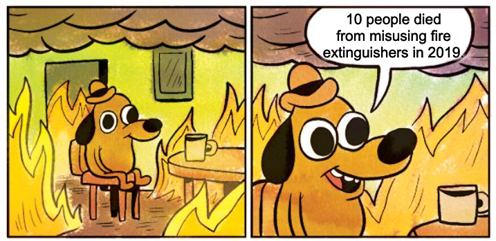
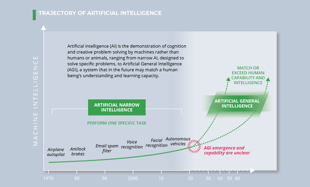

Forecasting Newsletter: April 2021
==============

## Highlights

*   Polymarket is being attacked by “sandwiching” bots
*   Metaculus launches “[Forecasting Causes](https://metaculus.medium.com/metaculus-announces-forecasting-causes-776473f42e38)”
*   In [Reflective Bayesianism](https://www.lesswrong.com/posts/vpvLqinp4FoigqvKy/reflective-bayesianism), Abram Demski outlines questionable and implicit assumptions which Bayesians make.

## Index

*   Prediction Markets & Forecasting Platforms
*   In The News
*   Blog Posts
*   Long Content
*   Hard To Categorize

Sign up [here](https://forecasting.substack.com/) or browse past newsletters [here](https://forum.effectivealtruism.org/s/HXtZvHqsKwtAYP6Y7).

## Prediction Markets & Forecasting Platforms

### Polymarket

After the demonstrable success of Polymarket (and, to a lesser extent, Augur) in attracting volume to their platforms, many imitators have popped up on the crypto scene. None of them are functional yet, but I thought I'd mention them, in order from least to most scammy:

*   [PolkaMarkets](https://www.polkamarkets.com/) is aiming for an August release date, and has recently begun [testing its MVP](https://polkamarkets.medium.com/polkamarkets-product-showcase-part-2-6b42262be3a8).
*   [Hedgehog Markets](https://www.hedgehog.markets/#/)'s schtick is to be implemented in an up-and-coming blockchain, Solana. The functioning markets on their webpage are currently using test money.
*   [Totem](https://totemfi.com/) has an interesting scheme where predictions are non-punitive. That is, people who predict incorrectly won't lose money, they will merely win less. However, after reading [their whitepaper](https://drive.google.com/file/d/1b-R4gSghyeGQdh0ynMjHEsZ62iXDI8qm/view), it is not exactly clear where the money for rewards will come from. It is being built on top of the Binance chain, [a centralised exchange with a centralized coin](https://www.reddit.com/r/CryptoCurrency/comments/lnhpic/its_really_embarrassing_for_the_whole/), which I find unappealing.
*   [Polars](https://polars.io/) and [PredictX](https://www.predictx.market/) are also built on top of the Binance chain. I would characterize them as money grabs. That is, they are attempting to raise money to do something like Polymarket without a clear plan for how they would be superior.

While Totem feels scammy, there are interesting possibilities related to its core idea. For example, external actors could subsidize the market. Another alternative could be to stake the bet amounts on a financial instrument which provides returns, like Uniswap, while waiting for resolution. In other words, one could bet the interest, not the principal.

While imitator projects go through the design and test stages, Polymarket has been dealing with a new real world problem: “sandwiching". Here is how it works on a high level: a bot detects transactions before miners process them, and profits from that information at the expense of the user.

To understand it on a more detailed level, it is first necessary to explain several details about Polymarket's architecture. Polymarket uses an Automated Market Maker design (as opposed to an order book). This means that users trade with liquidity providers, who take bets on both sides, rather than with other users. This enables users to make bets at any time, even when there isn't somebody willing to take the other side. Liquidity providers take a small fee, and are exposed to risk if too many people want to bet on the correct side at once. To reduce that risk, liquidity providers change the odds with each bet—the more people bet in the same direction, the more the odds change. This happens on a blockchain, so miners—the players who add transactions to the record of transactions—need to be able to see transactions, such as bets. But, this means that other players, and in particular bots, are  able to see them too. The miners prioritize transactions based on how much users are willing to pay, so a bot which wants to jump the line can pay a little bit more to do so.

Now, when a user is going to make a bet, a bot can buy `b` worth of a contract at price `X` (equivalent to betting at oddss of `X:(1-X)`, which moves its price to `X+slippage(b)`. The user then buys $`u` worth of a contract at `X+slippage(b)`, and moves the price to `X+slippage(b)+slippage(u)`. The bot then sells its shares at `X+slippage(b)+slippage(u)`, moving the price to approximately `X+slippage(u)`. The bot bought at `X+slippage(b)`, and sold at `X+slippage(b)+slippage(u)`, so it made a profit of approximately `slippage(u)` per share, at the expense of making the user buy at a more expensive price (at `X+slippage(b)`, instead of at `X`). Crucially, because the bot also pays fees to liquidity providers for its two transactions, the attack is only profitable if `slippage(u)` is large enough. For example, Polymarket has 2% fees, so in a 50% contract, the attack is only profitable if the user moves the price by more than 4%, i.e., if `slippage(u)` is bigger than 4%. This calculation changes somewhat when the price moves away from 50%.

Polymarket has implemented "slippage protection", which solves a part of this problem. In particular, it detects that a bot (or another user) has moved the price from the expected `X` to `X+slippage(someone)`, and halts the trade if this is the case. But, for this protection to be effective, the user then has to refuse to buy at the new price of `X+slippage(someone)` after the trade has failed. Polymarket could improve on this by dividing a trade into small, unpredictably-sized chunks randomly delayed in time. Then it wouldn’t be profitable to sandwich each trade individually, and it would also be difficult to sandwich the whole sequence—a bot wouldn’t be able to know whether a trade begins a sequence. Still, there is currently a particularly annoying bot which appears to be sandwiching all trades, even when it isn’t be profitable.

Background reading: [Ethereum is a Dark Forest](https://medium.com/@danrobinson/ethereum-is-a-dark-forest-ecc5f0505dff); [I got “sandwich attacked” on my transaction](https://ethereum.stackexchange.com/questions/93137/i-got-sandwich-attacked-on-my-transaction)

Avraham Eisenberg writes [Tales from Prediction Markets](https://misinfounderload.substack.com/p/tales-from-prediction-markets/comments), taking place on Polymarket. It features market manipulation, bold exploits, and cautionary tales. Polymarket itself also has announced a ["Microgrants"](https://polymarket.medium.com/introducing-polymarket-microgrants-2d6078512d1d) program for people to work on projects related to the platform.

### Metaculus

Metaculus has announced ["Forecasting Causes"](https://metaculus.medium.com/metaculus-announces-forecasting-causes-776473f42e38), an initiative to connect non-profit organizations with forecasters. They are starting with a [tournament on alternative meat](https://www.metaculus.com/tournament/alt-protein-tournament/) (see also: [more commentary](https://metaculus.medium.com/cultivating-an-alt-meat-forecasting-initiative-bc8bd6a9f019)), a part of their [Feeding Humanity](https://www.metaculus.com/cause/feeding-humanity/) cause area, and a [tournament on COVID-19 in Virginia](https://www.metaculus.com/tournament/vdh_tournament/), as part of their [Healthy Communities](https://www.metaculus.com/cause/healthy-communities/) cause.

Background reading: Long Term Future Fund grants to Metaculus, back in [2019](https://forum.effectivealtruism.org/posts/CJJDwgyqT4gXktq6g/long-term-future-fund-april-2019-grant-recommendations) and [2020](https://forum.effectivealtruism.org/posts/AioofNtgQFpE5k8tE/long-term-future-fund-april-2020-grants-and-recommendations).

Metaculus is [revamping](https://metaculus.medium.com/aligning-incentives-for-forecast-accuracy-relevance-and-efficacy-a-new-paradigm-for-metaculus-26b0e79616cb) a part of its incentive designs mechanism. They are also [hiring](https://www.metaculus.com/news/2021/03/25/hiring-three-new-open-positions/) for Junior Designer, Full-Stack Developer, and Public Policy Data Scientist positions.

[SimonM](https://twitter.com/SmoLurks/) kindly curates the top comments from Metaculus this past April. They are:

*   [GlobalGuessing](https://www.metaculus.com/questions/6898/quadfiveeyes-boycott-of-2022-winter-olympics/#comment-59675) and [PeterHurford](https://www.metaculus.com/questions/6898/quadfiveeyes-boycott-of-2022-winter-olympics/#comment-59835) lay out the chances of an Olympic boycott in 2022.
*   [EvanHarper](https://www.metaculus.com/questions/6940/10k-us-conflict-deaths-in-1-year-by-2030/#comment-59946) points out the base rate for KIA is much lower in modern wars.
*   Metaculus users have fun with a [pseudo-Keynesian Beauty Contest](https://www.metaculus.com/questions/6945/kbc-comment-threads-h-index/#comment-59428).
*   SimonM and Charles discuss [Jannik Sinner's prospects](https://www.metaculus.com/questions/6887/jannik-sinner-first-gen-x-slam-winner/#comment-60036).
*   [elifand\_ought and liconstan](https://www.metaculus.com/questions/7058/anti-alt-food-adds-by-2023/#comment-60993) have very different forecasts for whether or not the meat industry will put out an anti-plant-based-food ad.
*   [onlyasith's](https://www.metaculus.com/questions/7012/release-date-of-nate-silvers-2nd-book/#comment-60104) forensic analysis of a Brandon Adams podcast is part of his model for when Nate Silver's next book will be out.
*   [fianxu](https://www.metaculus.com/questions/6829/derek-chauvin-convicted-of-homicide-by-june/#comment-60416) points out jury instructions don't apply to forecasters.
*   [haukurth](https://www.metaculus.com/questions/6829/derek-chauvin-convicted-of-homicide-by-june/#comment-60291) notes the community forecast was well calibrated during the Chauvin trial.
*   [SimonM](https://www.metaculus.com/questions/6291/trump-family-indictments-in-2021/#comment-60677) points out people don't update their forecasts as often as they should.
*   [clearthis](https://www.metaculus.com/questions/7012/release-date-of-nate-silvers-2nd-book/#comment-60104)'s comment causes people to notice an old question about Trump family indictments, and the Metaculus community prediction moves up by 30%.

SimonM has also added more functionality to the Metaculus Extras site, including a “[movers and shakers](https://metaculusextras.com/movers_and_shakers)” page. It lists the Metaculus questions that moved the most in the last week.

## In the News

The Anticipation Hub is a loose association of organizations trying to anticipate catastrophes and mitigate them before they happen. Based on the contents of their newsletter, they seem to be [fairly active](https://news.anticipation-hub.org/m/12667026/531386-afbc79eb9d38a58d5273fb488647e76004b096e53e9a252178536769290cce3afcce63f314735db68cede73b36ad4795), particularly around the topics of floods, tropical storms, and inter-institutional cooperation. For instance, they have a [postmortem](https://www.anticipation-hub.org/news/the-aftermath-of-anticipatory-humanitarian-actions-taken-for-severe-tropical-storm-chalane-in-mozambique-was-it-worth-it/) of the actions they took before a severe tropical storm “Chalane" hit Mozambique. They find that the value of their preparation decisions  was not as high as they had hoped for.

[Charismatics issue ‘prophetic standards’ to address false Trump prophecies](https://religionunplugged.com/news/2021/4/28/charismatics-issue-prophetic-standards-to-address-false-trump-prophecies) ([original source](http://propheticstandards.com/)). “After an embarrassing number of wrong prophecies and bungled predictions about the 2020 election, a group of [charismatic Christian](https://en.wikipedia.org/wiki/Charismatic_Christianity) leaders have released a four-page statement of “prophetic standards'' to help correct abuses in the movement”. In particular, they call on those who have made false prophecies to apologize.

[How spooks are turning to superforecasting in the Cosmic Bazaar](https://www.economist.com/science-and-technology/2021/04/15/how-spooks-are-turning-to-superforecasting-in-the-cosmic-bazaar): The Economist mentions a few details about the "Cosmic Bazaar", a forecasting tournament organised by the British government.

> Since the launch of the website in April 2020, more than 10,000 forecasts have been made by 1,300 forecasters, drawn from across 41 government departments and several allied countries. The site has around 200 regular forecasters monthly, who must draw only on publicly available information to tackle 30-40 questions live at any time. Cosmic Bazaar represents the gamification of intelligence. Users are ranked by a brutally simple measure: the accuracy of their predictions.

Facebook releases a research paper: "Large-scale forecasting: Self-supervised learning framework for hyperparameter tuning" ([blog post](https://ai.facebook.com/blog/large-scale-forecasting-self-supervised-learning-framework-for-hyper-parameter-tuning/), [arxiv preprint](https://arxiv.org/pdf/2102.05740.pdf))

> Forecasting is one of the core data science and machine learning tasks we perform at Facebook, so providing fast, reliable, and accurate forecasting results with large amounts of time series data is important for our business. 
> 
> We empirically evaluated our algorithms on both internal and external data sets, and obtained similar conclusions. SSL frameworks can dramatically improve the efficiency of model selection and hyperparameter tuning, reducing running time by 6-20x with comparable forecasting accuracy. 
> 
> This approach is independent of specific forecasting models and algorithms

Goldman Sachs [downgrades](https://www.cnbc.com/2021/04/07/goldman-sachs-downgrades-indias-growth-forecast-as-covid-cases-spike.html) India’s growth forecast as Covid cases spike.

The European Centre for Disease Prevention and Control (ECDC) has run a new forecasting hub for about a month now ([announcement](https://www.ecdc.europa.eu/en/news-events/forecasting-covid-19-cases-and-deaths-europe-new-hub), [link to the hub](https://covid19forecasthub.eu/reports.html)). It's unclear whether any decision-makers are influenced by its predictions.

[Draft EU legislation on AI is proposing to regulate the use of Bayesian estimation](https://digital-strategy.ec.europa.eu/en/library/proposal-regulation-laying-down-harmonised-rules-artificial-intelligence-artificial-intelligence) (see also some commentary [here](https://statmodeling.stat.columbia.edu/2021/04/22/eu-proposing-to-regulate-the-use-of-bayesian-estimation/) [here](https://www.cser.ac.uk/news/eus-world-first-ai-regulation/), and [here](https://forum.effectivealtruism.org/posts/ARwvpA4dLvpPxNNRD/a-new-proposal-for-regulating-ai-in-the-eu?commentId=HqJqzW4TAFfbCfXFr#comments)). Some commenters opine that the proposal is business as usual—draft legalese that will get refined and clarified in a future review. Other commenters view it as another example of the EU's incompetence.

## Blog Posts

[The Kelly Criterion Kinda Sucks](https://predictingpolitics.com/2021/04/04/why-the-kelly-criterion-kinda-sucks/). An experienced PredictIt bettor points out that the Kelly criterion doesn't offer guidance in cases when one can bet on more than one event at more than one point in time.

Scott Alexander, of AstralCodexTen, publishes a [list of 75 public predictions for 2021](https://astralcodexten.substack.com/p/mantic-monday-predictions-for-2021). [Zvi](https://www.lesswrong.com/posts/Cpy23aBzx3hnjKbnt/scott-alexander-2021-predictions-buy-sell-hold) and [SimonM](https://www.lesswrong.com/posts/sAmkpdmfDMCohXiBX/scott-alexander-2021-predictions-market-prices) discuss some aspects of it on LessWrong. I have also added them to [Foretold](https://www.foretold.io/c/6eebf79b-4b6f-487b-a6a5-748d82524637), in case people want to forecast on them, and to [Metaforecast](https://metaforecast.org/?query=%20&starsThreshold=2&numDisplay=200&forecastsThreshold=0&forecastingPlatforms=AstralCodexTen), which makes them searchable using a nicer interface.

[The die is forecast](https://medium.com/the-die-is-forecast) is a "Computational Social Science and Political Event Analysis" blog by the people behind [CoupCast](https://www.oneearthfuture.org/activities/coup-cast), and the [Rulers, Elections and Irregular Governance (REIGN)](https://oefdatascience.github.io/REIGN.github.io/) dataset. I appreciate their rigorous, base-rate-driven analysis of [election violence risk](https://medium.com/the-die-is-forecast/april-2021-election-violence-risk-briefing-891768b55f50) in upcoming elections around the world.

[Global Guessing](https://globalguessing.com/) is a geopolitics forecasting blog. The authors take questions from various forecasting platforms, chiefly Metaculus, and analyze them in depth in public. For instance, see [this post](https://globalguessing.com/metaculus-mondays-vol10/) on the chances of a boycott of the 2022 Winter Olympics in China, the chances of a North Korea ICBM test, and the possible origins of COVID-19.

[Stephen S. Roach](https://en.wikipedia.org/wiki/Stephen_S._Roach) is a senior fellow at Yale. In [My Worst Forecasting Mistake](https://www.project-syndicate.org/commentary/why-no-double-dip-us-recession-by-stephen-s-roach-2021-04), he looks back at one of his failed predictions:

> Attempting to predict interest rates was my least favorite part of the job. With good reason. I remember walking into the old Morgan Stanley investment banking meeting room and seeing a chart of my predecessor’s bond market forecast sitting upside down on the floor. I was determined to avoid that fate. When my favorite bond trader started calling me “dart man,” I made an executive decision to disengage and hire an interest-rate strategist. Survival of the fittest, I guess. 
> 
> I went on to stress that the nascent recovery was likely to be aborted by a relapse, as had occurred in eight of the preceding 11 recessions since the end of World War II. A few months later, taking comfort from some economic indicators that had broken my way, I committed the most egregious forecasting sin of all: giving a date. I actually wrote that the coming double-dip was likely to occur by mid-2021. 
> 
> In the end, the confluence of science, politics, and the indomitable human spirit left my out-of-consensus double-dip call in tatters. It wasn’t my first forecasting mistake, but it is probably the most glaring. Mea culpa is an understatement. Back to the ivory tower.

He has it right that for him as an individual, it was the wrong move to make a quantifiable prediction. But, the system as a whole wants for people like him to make quantifiable predictions and be weeded out by more accurate forecasters.

In [The Johnson & Johnson Pause Shows The System Is Working](https://fivethirtyeight.com/features/the-johnson-johnson-pause-shows-the-system-is-working/), FiveThirtyEight claims that stopping vaccination because of one death and six cases of a rare type of blood clots among 6.8 million doses administered was somehow a positive development. 

[Some "This is fine" dog meme variations](https://twitter.com/LinchZhang/status/1385373839639552002), @LinchZhang, 2021

Abram Demski writes [Reflective Bayesianism](https://www.lesswrong.com/posts/vpvLqinp4FoigqvKy/reflective-bayesianism), which outlines implicit and questionable assumptions that strict Bayesians have to make (cf. [Radical Probabilism](https://www.lesswrong.com/posts/xJyY5QkQvNJpZLJRo/radical-probabilism-1)).

[Probability theory and logical induction as lenses](https://www.lesswrong.com/posts/Zd5Bsra7ar2pa3bwS/probability-theory-and-logical-induction-as-lenses) talks about how both probability theory and logical induction are both "lenses for looking at the real-world phenomena of machines that quantify their uncertainty in their beliefs".

## Long Content

The Office of the Director of National Intelligence (ODNI) of the USA has released a ["Global Trends 2040"](https://www.dni.gov/index.php/global-trends-home) report. In ancient history, the Bush administration established this office in the aftermath of the US intelligence community's failure to aggregate information available in disjoint agencies to predict the 2001 attacks (cf. [Wikipedia](https://en.wikipedia.org/wiki/Intelligence_Reform_and_Terrorism_Prevention_Act#History)). Then in 2006, [IARPA](https://en.wikipedia.org/wiki/Intelligence_Advanced_Research_Projects_Activity) was formed as an organization within the ODNI, and went on to organize the [ACE program](https://en.wikipedia.org/wiki/Aggregative_Contingent_Estimation_(ACE)_Program), which explored which kind of setups produced the most accurate probabilities, and found out that pre-selected superforecasters from the general population working in groups did best, or at least better than intelligence analysts with access to classified information. 

Because of this history and background of its office, I was expecting the report to have some probabilistic estimates, but the report is instead structured around a set of scenarios, rather than around quantified predictions. However, the report does includes interesting observations around structural technology forces:

[Global Trends 2040, Structural Forces: Technology](https://www.dni.gov/index.php/gt2040-home/gt2040-structural-forces/technology), Office of the Director of National Intelligence, 2021.

> Timelines Shrinking. The time to develop, deploy, mature, and then retire technologies is moving from decades to years and sometimes faster. Multiple actors, including corporations and states, at the forefront of emerging technology may deploy and exploit a new technology before others get off the starting blocks. Those trying to catch up, especially in developing countries, may be increasingly forced to choose technologies before the implications of those choices are fully understood, risking investment in technological dead ends or falling hopelessly behind. Planned economies may be able to react faster to emerging technology developments, potentially at the cost of reduced technological diversity and efficiency.
> 
> AI is the demonstration of cognition and creative problem solving by machines rather than humans or animals, ranging from narrow AI, designed to solve specific problems, to Artificial General Intelligence, a system that in the future may match or exceed a human being’s understanding and learning capacity. By 2040, AI applications, in combination with other technologies, will benefit almost every aspect of life, including improved healthcare, safer and more efficient transportation, personalized education, improved software for everyday tasks, and increased agricultural crop yields. Political and business leaders worldwide are seeking global talent and are pouring resources into developing AI, hoping to be among the first to use it to reshape societies, economies, and even war. Enabled by concurrent increases in high-quality data, computing capability, and high-speed communication links, AI will challenge leaders to keep pace and reap the benefits while mitigating harmful effects, such as threats to privacy and liberty.
> 
> Existential Risks. Technological advances may increase the number of existential threats; threats that could damage life on a global scale challenge our ability to imagine and comprehend their potential scope and scale, and they require the development of resilient strategies to survive. Technology plays a role in both generating these existential risks and in mitigating them. Anthropomorphic risks include runaway AI, engineered pandemics, nanotechnology weapons, or nuclear war. Such low-probability, high-impact events are difficult to forecast and expensive to prepare for, but identifying potential risks and developing mitigation strategies in advance can provide some resilience to exogenous shocks.

In contrast to the approach taken by the report above, [Keeping Score: A New Approach to Geopolitical Forecasting](https://global.upenn.edu/sites/default/files/perry-world-house/Keeping%20Score%20Forecasting%20White%20Paper.pdf), by Perry World House, calls for more quantified predictions. See also [this twitter thread](https://twitter.com/MWStory/status/1382692182906183680) by @MWStory.

The [Survey of Professional Forecasters](https://www.philadelphiafed.org/surveys-and-data/real-time-data-research/survey-of-professional-forecasters) is "the oldest quarterly survey of macroeconomic forecasts in the United States. The survey began in 1968 and was conducted by the American Statistical Association and the National Bureau of Economic Research. The Federal Reserve Bank of Philadelphia took over the survey in 1990." Its last forecasts, for Q1 2020, can be found [here](https://www.philadelphiafed.org/-/media/frbp/assets/surveys-and-data/survey-of-professional-forecasters/2021/spfq121.pdf).

Robin Hanson does some Robin-Hansoning, and proposes “[Shoulda-Listened Futures](https://www.overcomingbias.com/2021/04/shoulda-listened-futures.html)”, a system in which people who think they are unfairly ignored by mainstream science could pay for a future evaluation of their work and for an immediate prediction about that evaluation.

> These “world shoulda listened to me” customers might pay to have some of their works evaluated by posterity. For example, for every $1 saved now that gains a 3% real rate of return, $19 in real assets are available in a century to pay historians for evaluations. At a 6% rate of return (or 3% for 2 centuries), that’s $339. Furthermore, if future historians needed only to randomly evaluate 1% of the works assigned them, then if malcontents paid $10 per work to be maybe evaluated, historians could spend $20K (or $339K) per work they evaluate. Considering all the added knowledge and tools to which future historians may have access, that seems enough to do a substantial evaluation, especially if they evaluate several related works at the same time.
> 
> Given a substantial chance (1% will do) that a work might be evaluated by historians in a century or two, we could then create (conditional) prediction markets now estimating those future evaluations. So a customer might pay their $20 now, and get an immediate prediction market estimate of that future evaluation for their work. That $20 might pay $10 for the (chance of a) future evaluation and another $10 to establish and subsidize a prediction market over the coming centuries until resolution.

---

Note to the future: All links are added automatically to the Internet Archive. In case of link rot, go [there](https://archive.org/) and input the dead link.

---

> I'm not disagreeing with your emotions or your politics. I'm disagreeing with your numbers.

[@LinchZhang](https://twitter.com/LinchZhang/status/1381600167116169218), 2021.
