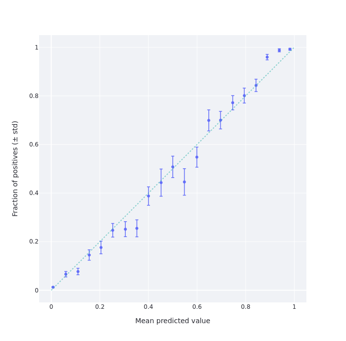
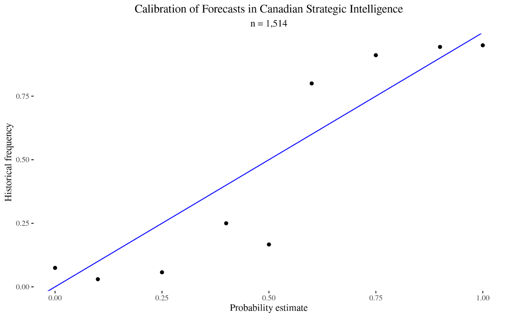
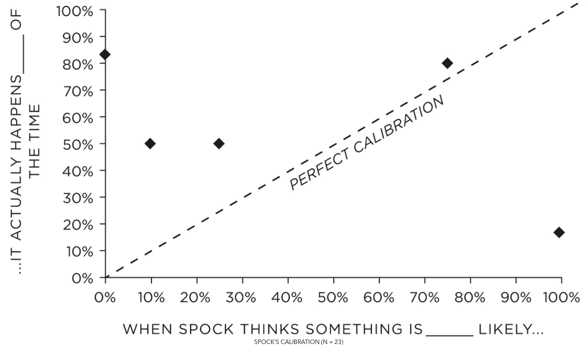
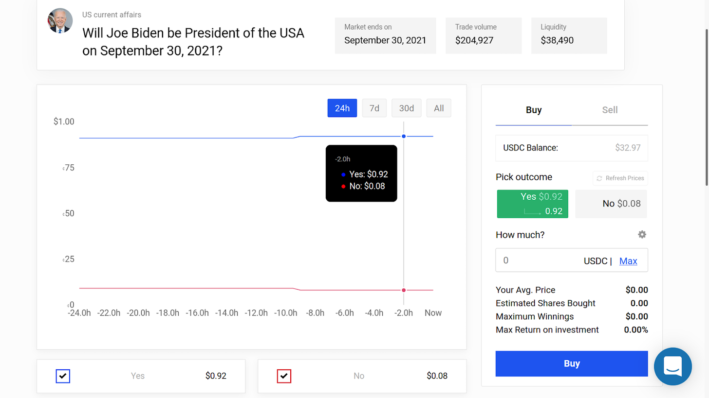
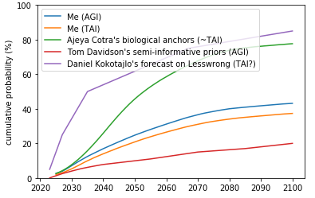

Forecasting Newsletter: May 2021
==============

## Highlights

*   Misha Yagudin creates a [webpage](https://share.streamlit.io/yagudin/gjo-calibration/main/strmlt.py) to get one’s calibration chart for Good Judgment Open and CSET-Foretell
*   Hypermind experiments with new methods of eliciting, incentivizing and scoring long-range forecasts.
*   Augur launches [Augur Turbo](https://bafybeihlyzl7tcxa3fppm2haqoba66jquop7xjjfgjoty4ymuu7r6zngzm.ipfs.dweb.link/#!/markets) on Polygon, but gets very little trade volume

## Index

*   Prediction Markets & Forecasting Platforms
*   In The News
*   Blog Posts
*   Papers
*   Hard to Categorize
*   Long Content

Sign up [here](https://forecasting.substack.com) or browse past newsletters [here](https://forum.effectivealtruism.org/s/HXtZvHqsKwtAYP6Y7).

## Prediction Markets & Forecasting Platforms

### Augur

Augur has launched [Augur Turbo](https://augur.net/blog/launching-augur-turbo-chainlink-polygon/) on Polygon, the same second-layer chain which also hosts Polymarket. The website to access it is hosted on IPFS, hence the long address when one accesses it through a [portal](http://bafybeihlyzl7tcxa3fppm2haqoba66jquop7xjjfgjoty4ymuu7r6zngzm.ipfs.dweb.link/#!/markets). 

To unpack the tech stack:

*   [Augur](https://augur.net/) is a decentralized prediction market protocol. Its strength lies on its robust decentralized question resolution mechanism: resolutions can be disputed until a consensus is reached.
*   [Polygon](https://polygon.technology/) (previously Matic) is a parallel blockchain for Ethereum. It offers contract compatibility, so that contracts written for the main Ethereum blockchain can also run on Polygon. Moving assets from the main Ethereum blockchain to Polygon is initially somewhat cumbersome. But once inside Polygon, transaction fees are much cheaper.
*   [Chainlink](https://chain.link/) is an oracle service. Most of the time, it will work and it will work fast. The rest of the time, resolution can be disputed and Augur's protocol can be used instead. Chainlink claims to be decentralized, but appears [not](https://www.reddit.com/r/LINKTrader/comments/fyxc23/whats_up_with_vitalik_constantly_bashing/fn35ae0/) to fully [be so](https://www.reddit.com/r/Chainlink/comments/i49iz3/how_is_chainlink_actually_decentralized/).
*   [IPFS](https://en.wikipedia.org/wiki/InterPlanetary_File_System) is a censor-proof, decentralized alternative to the [http protocol](https://en.wikipedia.org/wiki/Hypertext_Transfer_Protocol). To a first approximation, files in the network are [hashed](https://en.wikipedia.org/wiki/Hash_function) using the [SHA-256](https://en.wikipedia.org/wiki/SHA-2) algorithm, and accessed using their hash. However, this turns out to be [more](https://github.com/multiformats/cid) [complicated](https://github.com/multiformats/multibase) in practice.

So far, Augur Turbo merely has NBA markets, with low volume, and low liquidity.

Augur Turbo [webpage](https://bafybeihlyzl7tcxa3fppm2haqoba66jquop7xjjfgjoty4ymuu7r6zngzm.ipfs.dweb.link/#!/markets). Screenshot taken the 1st of June, 2021. Notice that the market with the highest total volume has a mere $100 in trade volume.

From Augur’s early history, [Is Augur Being Gamed](https://decrypt.co/6010/is-augur-being-gamed) explains what exactly [Poyo](https://medium.com/sunrise-over-the-merkle-trees/meet-poyo-an-interview-with-augurs-most-controversial-cat-a6bccae9ffe7) did to profit from the creation of invalid markets. Back in the day, Augur didn’t have a tradable “invalid” resolution. Instead, invalid or ambiguous markets were resolved 50-50. This allowed Poyo to profit by creating markets he knew would resolve as invalid, and then buying the cheaper side. 

### CSET-Foretell

[CSET-Foretell](https://www.cset-foretell.com/question_queue/questions) has added the ability for users to suggest questions. 

Good Judgment training for “Foretell Pros”—the best scoring forecasters during CSET-Foretell's first season—continues. Because Foretell Pros might get culled if they perform worse than the crowd, and because their score is proportional to their difference from the crowd, they have an incentive not to share information. When this was pointed out, CSET-Foretell answered with an impassioned appeal to the better angels of our nature. It seems it worked to some extent, and participants are sharing more of their reasoning within the platform and community.

### Good Judgment Inc/Good Judgment Open

Per the [Good Judgment Open Newsletter](https://mailchi.mp/goodjudgment/gjomaynewsletter), product lead and Superforecaster Luis Enrique Urtubey De Césaris has some openings in his office hours coming up on June 11th and 18th. The contact email provided is beta@goodjudgment.com, no schedule is given.

The Financial Times [reports](https://ig.ft.com/coronavirus-vaccine-tracker/?areas=gbr&areas=isr&areas=usa&areas=eue&cumulative=1&doses=total&populationAdjusted=1) on Superforecaster predictions for "When will the number of doses administered globally reach 5 billion?"

### How to find out your calibration on Good Judgment Open and CSET-Foretell

Misha Yagudin, friend of the newsletter and fellow Samotsvety Forecasting team member on CSET-Foretell, has programmed a [site](https://share.streamlit.io/yagudin/gjo-calibration/main/strmlt.py) which allows users to get their calibration chart for their predictions on Good Judgment Open and other Cultivate Labs platforms, such as CSET-Foretell. See [this one-minute video](https://www.youtube.com/watch?v=_G3FNzYNPCs) for how to use it. Using [Misha’s site](https://share.streamlit.io/yagudin/gjo-calibration/main/strmlt.py), my calibration chart looks as follows:

My calibration chart for Good Judgment Open as of the 1st of July 2021, based on 2337 forecasts on 106 resolved questions.

This means that I'm under-confident around the 15% (resp. 85%) level. I know why this is: I was assigning a 15% chance to questions which gave me the feeling that "this is most likely not the case, but I’m not completely sure.” As it turns out, the kinds of questions on Good Judgment Open which generate that feeling instead happen around 10% of the time.

For comparison, here is the historical calibration of Canadian strategic intelligence forecasts, which I calculated using [this dataset](https://open.canada.ca/data/en/dataset/d5f7f93b-f757-42ef-b468-1d3791d97d94):

[Accuracy of forecasts in (Canadian) strategic intelligence](https://open.canada.ca/data/en/dataset/d5f7f93b-f757-42ef-b468-1d3791d97d94), processed [in R](https://gist.github.com/NunoSempere/2cfb5b824539a262d96af1fc596ff662)

And here is the calibration of [Spock](https://en.wikipedia.org/wiki/Spock), from Julia Galef’s The Scout Mindset (h/t Gavin Leech, Michał Dubrawski):

Spock's calibration chart, taken from Julia Galef's _The Scout Mindset_, p.77.

Here are some hypothesis about why Spock's calibration is skewed:

*   The [anthropic principle](https://www.wikiwand.com/en/Anthropic_principle). Even if Spock was perfectly calibrated in his estimates that a given suicidal maneuver had a 10% chance of survival, we would only hear about the adventures of the Enterprise crew if they survive after the fact. Or, in other words, consider that the adventures of the Enterprise and the other ships are selected to be the most interesting ones out of a whole interstellar civilization. So we can't infer from the fact that Kirk's crew won a lottery ticket that the probability of winning was a priori high. Consider also that (potentially infinite) [mirror universes](https://www.wikiwand.com/en/Mirror_Universe) are canon within the Star Trek universe. This means that selection effects may be arbitrarily pronounced, and we might just be observing the thinner and thinner slices of probability mass where Kirk tries something improbable and survives. See also [The Hero With A Thousand Chances](https://www.lesswrong.com/posts/EKu66pFKDHFYPaZ6q/the-hero-with-a-thousand-chances).
*   [Plot armor](https://tvtropes.org/pmwiki/pmwiki.php/Main/PlotArmor). By virtue of being a straight-faced foil to Kirk, Spock cannot have "we are in a story" in his hypothesis space. But maybe Kirk does, and this would explain why Kirk’s implied probability assessments are better than Spock's. See also [Reflective Bayesianism: The world is in our hypothesis-space](https://www.lesswrong.com/posts/vpvLqinp4FoigqvKy/reflective-bayesianism#The_best_prior_is_already_one_of_my_hypotheses_). A variation of this hypothesis would be the existence of [a God](https://www.wikiwand.com/en/Q_(Star_Trek)) within the Star Trek universe.
*   Spock's deep seated anti-human speciesism. If Spock truly was as rational as advertised, he should have noticed that his calibration was way off. Then, if nothing else, he could apply a calibration adjustment. I find this a parsimonious explanation, given that Spock is often shown as deeply conflicted about his mixed human-Vulcan heritage. In particular, having been bullied on Vulcan as a kid because of that mixed heritage might have led to a stunted psyche in this regard.

### Hypermind

Hypermind has been experimenting with new methods of eliciting, incentivizing and scoring long-range forecasts. The first mechanism consists of “drip rewards.” In short, if you want to get predictions about an event in 2030, you could try to promise forecasters a reward in 2030. But they might not find it very motivating. Instead, you could ask the same question each year (2021, 2022,...) until 2030, and reward forecasters according to how much their prediction one year resembles the crowd's predictions in the next year.

[Here](https://prod.lumenogic.com/ngdp/en/drip.html) is a summary of the mechanism which includes more twists, such as making the reward time random, and increasing rewards as resolution time approaches. Hypermind is trying out this method for [predicting COVID-19 vaccinations by 2029](https://prod.hypermind.com/ngdp/en/showcase2/showcase.html?sc=DOSES), with a price pool of $30,000.

Comments from colleagues centered around the fact that Hypermind wants to patent the method, but there is plenty of prior art. For instance, in machine learning a similar idea is known as [Temporal difference learning](https://en.wikipedia.org/wiki/Temporal_difference_learning) (h/t Misha Yagudin.)

The second method is more speculative. Forecasters make an object-level prediction, and a meta-prediction on what the crowd prediction will be. Then, forecaster predictions are adjusted—based on the meta-predictions—to increase the probability of "surprisingly popular" predictions. See Wikipedia on the [Surprisingly popular](https://en.wikipedia.org/wiki/Surprisingly_popular) method for a simplified example.

> There are four groups of people:
> 
> A: "Philadelphia is the capital of Pennsylvania, and others will agree." (This group answers yes/yes.)
> 
> B: "Philadelphia is the capital of Pennsylvania, but most others won't know that". (This group answers yes/no.)
> 
> C: "Philadelphia is not the capital of Pennsylvania, and others will agree." (This group answers no/no.)
> 
> D: "Philadelphia is not the capital of Pennsylvania, but most others won't know that." (This group answers no/yes.)
> 
> This technique causes groups A and C to be eliminated from consideration and measures the difference in size between groups B and D.
> 
> Both groups B and D think they know something other people don't, but B is wrong and D is right. In cases where people feel like they have "inside" knowledge, it's more often the case that it's because they are correct and knowledgeable (group D), not because they are misled (group B).

The [paper from which this method comes](https://www.nature.com/articles/nature21054) considered forecasts on discrete bins. Per its [public writeup](https://docs.google.com/document/d/1fRg7twB2RLAc-Ey8NUj5qFUJCg-dp3yb/edit), Hypermind applies this method to predicting continuous distributions by dividing continuous distributions into discrete bins _and then ignoring bins with probabilities below 5%!_:

> A second approximation is the minimum probability required to consider that a forecaster has a “non-zero” probability in a particular bin. This goes to the core of equation (2) which computes the prediction-normalized forecast based on which participants have a forecast or a meta forecast in each bin. After some experimentation, we settled on a rather aggressive threshold of .05 probability below which a forecaster is not considered to have forecasted or meta-forecasted that particular bin.

Hypermind tried this method for predicting [the state of AI in 2030](https://prod.hypermind.com/ngdp/en/showcase2/showcase.html?sc=AI2030) where ignoring events which have a lower than 5% probability seems like a particularly bad idea, given that those events might be particularly impactful.

### Metaculus

GlobalGuessing [interviews Gaia Dempsey,](https://globalguessing.com/gaia-dempsey-ggwp/) Metaculus’ CEO, and continues [analyzing Metaculus questions](https://globalguessing.com/tag/metaculus-mondays/). 

[SimonM](https://twitter.com/SmoLurks/) kindly curated the top comments from Metaculus this past May. They are:

*   [cd](https://www.metaculus.com/questions/6051/will-andrew-yang-be-the-next-mayor-of-nyc/#comment-61464) argues for uncertainty in the New York mayoral race.
*   [EvanHarper](https://www.metaculus.com/questions/6051/will-andrew-yang-be-the-next-mayor-of-nyc/#comment-61650) reports that Andrew Yang is no longer leading on the New York mayoral race polls.
*   SimonM isn't very optimistic about [100m times at the Olympics](https://www.metaculus.com/questions/5860/2020-mens-100m-final/#comment-61765), and notices that [longevity research has cashflows tied to crypto](https://www.metaculus.com/questions/7198/sens-research-foundation-revenue-2021/#comment-62222).
*   [niplav](https://www.metaculus.com/questions/5035/when-will-spacex-starlink-internet-be-generally-available/#comment-62585) uses the ["Musk forecast correction factor"](https://web.archive.org/web/20210302224031/https://anthony.boyles.cc/Essays/portfolio/ElonMuskForecastCorrectionFunction.html) to predict Starlink internet availability.
*   A [lab-leak hypothesis question](https://www.metaculus.com/questions/3681/will-it-turn-out-that-covid-19-originated-inside-a-research-lab-in-hubei/#comment-62865) resolves ambiguously, which leads to discussion ([1](https://www.metaculus.com/questions/3681/will-it-turn-out-that-covid-19-originated-inside-a-research-lab-in-hubei/#comment-62865), [2](https://www.metaculus.com/questions/3681/will-it-turn-out-that-covid-19-originated-inside-a-research-lab-in-hubei/#comment-62874), [3](https://www.metaculus.com/questions/3681/will-it-turn-out-that-covid-19-originated-inside-a-research-lab-in-hubei/#comment-62896).)
*   [fianxu](https://www.metaculus.com/questions/2598/metaculus-web-app-by-2024/#comment-62308) (Gaia Dempsey) gives the lowdown on whether a Metaculus mobile app is coming (it isn’t.)

A tournament on Virginia COVID-19 cases was also covered by a [quaint local Virginian newspaper](https://archive.is/0GStq).

### Polymarket

Polymarket featured plenty of markets about [NBA playoffs](https://en.wikipedia.org/wiki/2021_NBA_playoffs). They also [sponsored](https://twitter.com/GMHikaru/status/1395439527171280898) GM Hiraru Nakamura's Twitch stream throughout the #FTXCryptoCup, a chess tournament organized by [FTX](https://ftx.com/). As part of their sponsorship, they gave away $20 to 500 new users; it seems like the [link](https://polymarket.typeform.com/to/xtGqPcQ2) is still up.

Polymarket's microgrants program spawned [Polystats](https://polystats.info/), which displays statistics about markets. The site might make it easier for liquidity providers to choose where to stake their funds, and competes with an earlier site, [PolymarketWhales](https://polymarketwhales.info/).

"Sandwiching" bots, covered in the [previous edition of this newsletter](https://forecasting.substack.com/p/forecasting-newsletter-april-2021), continue to be an annoyance.

As for markets, [Will the 2021 Tokyo Olympics take place?](https://polymarket.com/market/will-the-2021-tokyo-olympics-take-place) is sitting at ~81% (~77% on [FTX](https://ftx.com/trade/OLY2021)) (!), and [Will Joe Biden be President of the USA on September 30, 2021?](https://polymarket.com/market/will-joe-biden-be-president-of-the-usa-on-september-30-2021) is currently sitting at ~92% (!?).

Polymarket: [Will Joe Biden be President of the USA on September 30, 2021?](https://polymarket.com/market/will-joe-biden-be-president-of-the-usa-on-september-30-2021). Screenshot taken on the 1st of July 2021.

### PredictIt

[Old Bull TV](https://www.youtube.com/channel/UCOabUJ3mn2NftdU16AIeHiQ) is a Youtube Channel which covers PredictIt markets. Their episode [When PredictIt Met Kevin](https://www.youtube.com/watch?v=pVz7tIDbaH4) presents the case of [Kevin Paffrath](https://en.wikipedia.org/wiki/Kevin_Paffrath), a random influencer with [1.63M Youtube followers](https://www.youtube.com/channel/UCUvvj5lwue7PspotMDjk5UA) who [got his followers and associates](https://youtu.be/RdP2aXVAdpw?t=19) to buy his shares for the [Who will be the governor of California on Dec. 31?](https://www.predictit.org/markets/detail/7214/Who-will-be-the-governor-of-California-on-Dec-31) market.

## In the News

[How the U.S. Government Can Learn to See the Future](https://www.lawfareblog.com/how-us-government-can-learn-see-future) argues that rigorous probabilistic forecasting, keeping score of assessments, and employing the “wisdom of crowds” would lead to better US intelligence assessments. They also point out that forecasting projects did not survive the “valley of death”—the space between being a pilot program and being an established product for the Department of Defense which many initiatives fail to cross.

> During the Obama years, the U.S. government initiated several quantitative geopolitical forecasting projects designed to complement traditional analysis methods. Between 2008 and 2018, the Defense Advanced Research Projects Agency (DARPA) and its intelligence community counterpart, the Intelligence Advanced Research Projects Activity (IARPA), launched a portfolio of a dozen prediction and forecasting initiatives. Some were very successful, such as the Aggregative Contingent Estimation (ACE) Program, which [illustrated](https://www.aaai.org/ocs/index.php/SSS/SSS12/paper/viewFile/4290/4699) the potential utility of open-sourced forecasts by crowds. Another program [reportedly](https://www.ffcoi.org/wp-content/uploads/2019/03/Three-IARPA-Forecasting-Efforts-ICPM-HFC-and-the-Geopolitical-Forescasting-Challenge_Jan-2018.pdf) had “the largest dataset on the accuracy of analytic judgments in the history of the intelligence community,” and yet another [was credited with predicting](https://www.brookings.edu/techstream/forecasting-and-predictive-analytics-a-critical-look-at-the-basic-building-blocks-of-a-predictive-model/#ftn2) the 2013 Brazilian Spring and 2014 protests in Venezuela.
> 
> Despite promising results, nearly all of these programs ended during the Trump years. Some initiatives came to a natural end; others lost bureaucratic support. The U.S. government often faces challenges when seeking to transition promising research and development efforts into programs of record. In fact, there is a foreboding name given to this trend in the defense procurement world—the “[valley of death](https://www.gao.gov/assets/gao-16-5.pdf).” Many U.S. government forecasting attempts failed to emerge from the valley because of failures to effectively communicate probabilities and their value to intelligence agency officials and policymakers, and bureaucratic resistance from those who feared forecasting efforts would upend their careers or the hierarchy of subject matter experts.

There has been some recent brouhaha in the [news](https://news.google.com/search?q=COVID%20lab%20leak&hl=en-US&gl=US&ceid=US%3Aen) ([archive link](https://web.archive.org/web/https://news.google.com/search?q=COVID%20lab%20leak&hl=en-US&gl=US&ceid=US%3Aen)) about whether COVID-19 originated from a lab. The issue was previously featured in the January edition of this newsletter:

> [Rootclaim](https://www.rootclaim.com/) is a site which comes up with Bayesian calculations for public interest questions. For example, here is their page on [the source of COVID-19](https://www.rootclaim.com/analysis/what-is-the-source-of-covid-19-sars-cov-2) (80%+): they start with a reasonable prior and then legibly update their initial prediction with each piece of evidence they consider. That said, their conclusion differs from that of [Metaculus](https://www.metaculus.com/questions/3681/will-it-turn-out-that-covid-19-originated-inside-a-research-lab-in-hubei/#comment-27925) (<10%) and from that of casual [discussion](https://twitter.com/kristjanmoore/status/1350432516314976258) between several superforecasters on Twitter (~25%).

[Gauging for disasters: Neighbor shares distrust of river forecasting following flood event](https://wpde.com/news/local/gauging-for-disasters-neighbor-shares-distrust-of-river-forecasting-following-flood-event) gives a slice-of-life picture of how forecasting affects common folks. On the one hand, the interviewee is probably suffering from hindsight bias. But on the other hand, it does seem like the forecasts were not robust to further rainfall, and that grizzled grumpy locals might have had more information than the forecasters.

## Blog Posts

[Probability theory does not extend logic (predicate calculus)](https://metarationality.com/probability-and-logic). In particular, freely mixing logical quantifiers (∀, ∃) and probability statements gets messy fairly quickly, and the tools to disambiguate their meaning may not be found solely in probability theory (but perhaps in statistical inference or in the study of causality.)

> Probability theory can be viewed as an extension of propositional calculus. Propositional calculus is described as "a logic," for historical reasons, but it is not what is usually meant by "logic." Cox's Theorem concerns only propositional calculus. Further, it was well-known long before Cox that probability theory does extend propositional calculus. Informally, probability theory can extend Aristotelian logic as well. This is usually unproblematic in practice, although it squicks logicians a bit. Probability theory by itself cannot express relationships among multiple objects, as predicate calculus (i.e. "logic") can. The two systems are typically combined in scientific practice. In specific cases, this is intuitive and unproblematic. In general, it is difficult and an open research area.

[My attempt to think about AI timelines](https://forum.effectivealtruism.org/posts/tCo2WeQXpTWb5i8d7/my-attempt-to-think-about-ai-timelines), by Ben Snodin, gives his probabilities for AI timelines based on a combination of inside and outside views, after thinking about it for 40 hours.

Ben Snodin’s AI timelines alongside timelines from other notable sources

[Data on forecasting accuracy across different time horizons and levels of forecaster experience](https://forum.effectivealtruism.org/posts/hqkyaHLQhzuREcXSX/data-on-forecasting-accuracy-across-different-time-horizons), by [Charles Dillon](https://twitter.com/CharlesD353), builds on [earlier work by niplav](https://www.lesswrong.com/posts/MquvZCGWyYinsN49c/range-and-forecasting-accuracy). The post might be useful to individual forecasters seeking to learn about past failure modes when forecasting long-range questions.

> We see a very well calibrated graph for predictions with <1 year time horizons, before the graph starts to sag as horizons get longer, and as with PredictionBook, things just don’t seem to happen as often as predictors imagine.

[Predict responses to the "existential risk from AI" survey](https://forum.effectivealtruism.org/posts/iBTon2dRYwcoS9Jyr/predict-responses-to-the-existential-risk-from-ai-survey) (also on [LessWrong](https://www.lesswrong.com/posts/3LtDzDJc32TF6bJEY/predict-responses-to-the-existential-risk-from-ai-survey?commentId=9N7428jWuQ6Bif4vr)):

> I sent a short [survey](https://docs.google.com/forms/d/13u7164jFHxcE6qWDcsgsLUsMZr72VpEvpxGcJsRp--E/viewform?edit_requested=true) to ~117 people working on long-term AI issues, asking about the level of existential risk from AI; 44 responded. In ~6 days, I'm going to post the anonymized results. For now, I'm posting the methods section of my post so anyone interested can predict what the results will be.

## Papers

[Decomposing the Effects of Crowd-Wisdom Aggregators: The Bias-Information-Noise (BIN) Model](https://papers.ssrn.com/sol3/papers.cfm?abstract_id=3781405)

> Aggregating predictions from multiple judges often yields more accurate predictions than relying on a single judge: the "wisdom-of-the-crowd" effect. This aggregation can be conducted by different methods, from simple averaging to complex techniques, like Bayesian estimators and prediction markets. This article applies a broad set of aggregation methods to subjective probability estimates from a series of geopolitical forecasting tournaments. It then uses the Bias-Information-Noise (BIN) model to disentangle three mechanisms by which each aggregation method improves accuracy: the tamping down of bias and noise and the extraction of valid information across forecasters. Averaging works almost entirely via noise reduction whereas more complex techniques, like prediction markets and Bayesian aggregators, work via all three BIN pathways: better signal extraction and noise and bias reduction.

## Hard to categorize

The Miami International Securities Exchange (MIAX) was set to offer corporate tax futures on the Minneapolis Grain Exchange (MGEX). The [site](http://www.mgex.com/corporatetaxfutures.html) currently seems to be down, but a copy remains on the [Internet Archive](http://www.mgex.com/corporatetaxfutures.html).

The United States' distopically named National Institute of Justice has a [Recidivism Forecasting Challenge](https://nij.ojp.gov/funding/recidivism-forecasting-challenge), with a total prize pool of $723,000, divided across many categories. I imagine that the student and small team categories should be reasonably accessible, but “individuals must be U.S. residents and companies must have an office with a U.S. business license.”

The epiforecast group at the London School of Hygiene & Tropical Medicine opened the [UK Covid-19 Crowd Forecasting Challenge](https://www.crowdforecastr.org/2021/05/11/uk-challenge/), with a prize pool of £175.

OpenPhilanthropy has a [forecasting-related job offer](https://www.openphilanthropy.org/get-involved/jobs/program-assistant) for a relatively junior role:

> Open Philanthropy is seeking a Program Assistant to support Luke Muehlhauser, who leads our work on AI policy and governance and forecasting. This role can be based out of our San Francisco office or be done fully remotely. 
> 
> You will work closely with Luke to find and organize information that will accelerate and help prioritize his grantmaking, maintain and improve our internal systems for tracking and improving our forecasts, and generally help free up more of his time.

## Long Content

[Imprecise probability](https://www.wikiwand.com/en/Imprecise_probability) is an attempt to generalize probability theory to allow for uncertainty about or multiplicity of probability estimates. For example, consider expressing one's uncertainty by giving the odds you'd be willing to take in favor of X, and the odds you'd be willing to take against X, but those odds having a spread. See also [this summary](https://forum.effectivealtruism.org/posts/AP7XBRSAw3eczpwah/ben_snodin-s-shortform?commentId=LshkvYsfdYFAoMr2j) by Ben Snodin of two abstruse ivory-tower papers about the topic.

[Anthropics: different probabilities, different questions](https://www.lesswrong.com/posts/LARmKTbpAkEYeG43u/anthropics-different-probabilities-different-questions) dissolves the apparent paradox that different anthropic theories give different probabilities to the same event.

[The economics of faith: using an apocalyptic prophecy to elicit religious beliefs in the field](https://www.sciencedirect.com/science/article/abs/pii/S0047272716300779):

> We show how standard experimental interventions linking financial consequences to falsifiable religious statements can elicit and characterize beliefs. We implemented this approach with members of a group that expected the "End of the World" to occur on May 21, 2011 by varying monetary prizes payable before and after May 21st. To our knowledge, this is the first incentivized elicitation of religious beliefs ever conducted. The results suggest that the members held extreme, sincere beliefs that were unresponsive to experimental manipulations in price.

> We administered an experiment to implement our elicitation approach, relying on the well publicized prophecy made by Harold Camping, an elderly Christian radio talk show host, who held that May 21st, 2011 would be the "End of the World." On May 21st, the prophecy went, the biblical Rapture would occur: divine judgement would be passed and the "saved" would ascend to Heaven to meet God, while great cataclysms would ravage the Earth. The "non-saved" would suffer "Hell on Earth" for five months, until all of creation would be annihilated on October 21st, 2011. Camping’s prediction attracted a world-wide following, driven by tens of millions of advertising dollars and daily discussion on his Family Radio network, one of the largest Christian broadcasting networks in the U.S.
> 
> The evidence indicates that the vast majority of Family Radio members held extreme beliefs even in the face of direct financial costs—nearly all Family Radio subjects preferred $5 dollars today to any amount up to $500 payable after the Rapture.

---

Note to the future: All links are added automatically to the Internet Archive. In case of link rot, go [there](https://archive.org/) and input the dead link.

---

Alan Moore, Watchmen, [Issue #12, page 29](https://readcomiconline.li/Comic/Watchmen/Issue-12?id=14879&readType=0#29)

> Adrian Veidt (Ozymandias): I did the right thing, didn't I? It all worked out in the end. 
> 
> Dr. Manhattan: "In the end"? Nothing ends, Adrian. Nothing ever ends.

---
