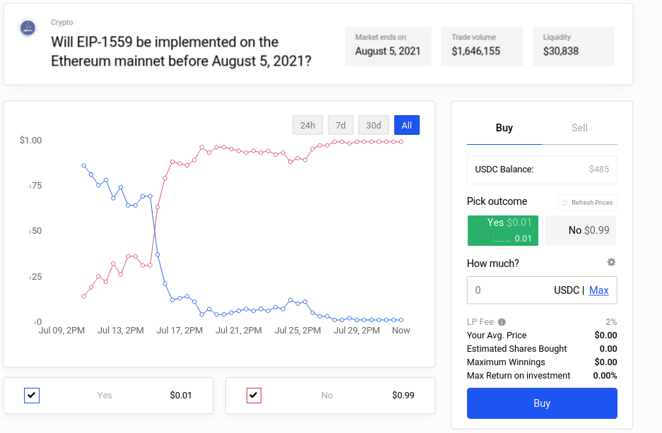
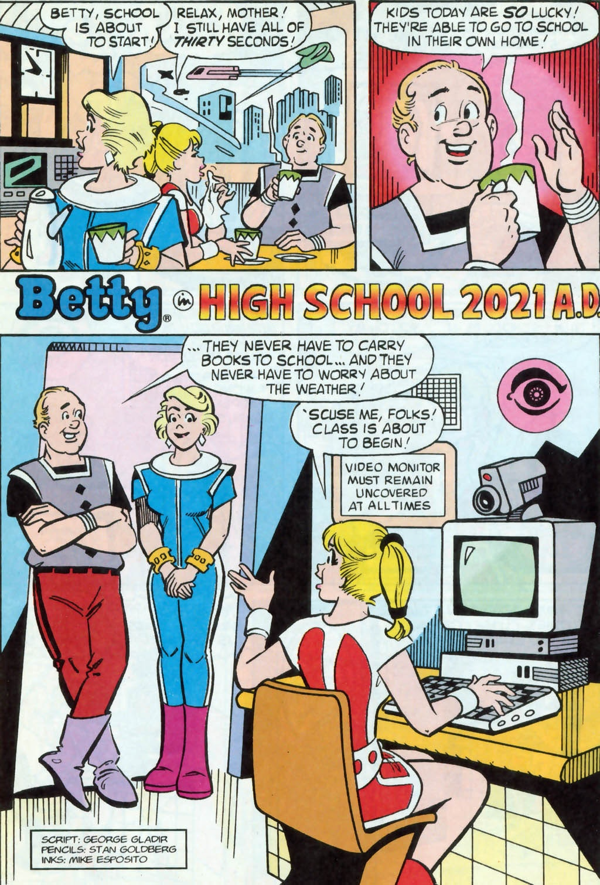
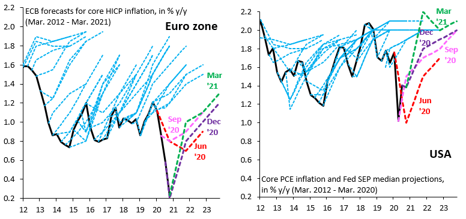

Forecasting Newsletter: July 2021
==============

## Highlights

*   [Biatob](https://biatob.com/) is a new site to embed betting odds into one’s writing
*   [Kalshi](https://kalshi.com/), a [CFTC](https://en.wikipedia.org/wiki/Commodity_Futures_Trading_Commission)\-regulated prediction market, launches in the US
*   [Malta](https://news.err.ee/1608259272/malta-first-eu-state-placed-on-international-money-laundering-watch-list) in [trouble](https://www.sbcnews.co.uk/sportsbook/2021/06/14/malta-faces-eu-sports-betting-veto-withdrawal/) over betting and gambling fraud

## Index

*   Prediction Markets & Forecasting Platforms
*   In The News
*   Blog Posts
*   Long Content

Sign up [here](https://forecasting.substack.com) or browse past newsletters [here](https://forum.effectivealtruism.org/s/HXtZvHqsKwtAYP6Y7).

## Prediction Markets & Forecasting Platforms

### Metaculus

[SimonM](https://twitter.com/SmoLurks/) ([a](https://web.archive.org/web/20210801121716/https://twitter.com/SmoLurks/)) kindly curated the top comments from Metaculus this past July. They [are](https://metaculusextras.com/top_comments?start_date=2021-76-01&end_date=2021-08-01) ([a](https://web.archive.org/web/20210801121745/https://metaculusextras.com/top_comments?start_date=2021-76-01&end_date=2021-08-01)):

*   [SimonM](https://www.metaculus.com/questions/7494/uk-third-wave/#comment-66192) ([a](https://web.archive.org/web/20210801121811/https://www.metaculus.com/questions/7494/uk-third-wave/#comment-66192)), [alexrjl](https://www.metaculus.com/questions/7494/uk-third-wave/#comment-65303) ([a](https://web.archive.org/web/20210801121811/https://www.metaculus.com/questions/7494/uk-third-wave/#comment-65303)), [alexrjl & discussion](https://www.metaculus.com/questions/7494/uk-third-wave/#comment-65945) ([a](https://web.archive.org/web/20210801121811/https://www.metaculus.com/questions/7494/uk-third-wave/#comment-65945)), [alexrjl](https://www.metaculus.com/questions/7494/uk-third-wave/#comment-66728) ([a](https://web.archive.org/web/20210801121811/https://www.metaculus.com/questions/7494/uk-third-wave/#comment-66728)), and [alexrjl](https://www.metaculus.com/questions/7494/uk-third-wave/#comment-65504) ([a](https://web.archive.org/web/20210801121811/https://www.metaculus.com/questions/7494/uk-third-wave/#comment-65504)) make good points on the the recent COVID-19 wave in the UK.
*   [Uncle Jeff](https://www.metaculus.com/questions/7334/us-commercial-animal-farming-ban-by-2041/#comment-65517) ([a](https://web.archive.org/web/20210801122006/https://www.metaculus.com/questions/7334/us-commercial-animal-farming-ban-by-2041/#comment-65517)) and [JonathanShi](https://www.metaculus.com/questions/7334/us-commercial-animal-farming-ban-by-2041/#comment-65517) ([a](https://web.archive.org/web/20210801122006/https://www.metaculus.com/questions/7334/us-commercial-animal-farming-ban-by-2041/#comment-65517)) don't think commercial animal farming is going anywhere.
*   [NunoSempere](https://www.metaculus.com/questions/6179/second-us-civil-war-before-2031/#comment-65829) ([a](https://web.archive.org/web/20210801122034/https://www.metaculus.com/questions/6179/second-us-civil-war-before-2031/#comment-65829)) and [elifland\_ought](https://www.metaculus.com/questions/6179/second-us-civil-war-before-2031/#comment-65848) ([a](https://web.archive.org/web/20210801122034/https://www.metaculus.com/questions/6179/second-us-civil-war-before-2031/#comment-65848)) make the case for a higher prediction of a civil war in the US.
*   [Charles](https://www.metaculus.com/questions/7452/will-there-be-a-us-russia-war-by-2050/#comment-64544) ([a](https://web.archive.org/web/20210801122229/https://www.metaculus.com/questions/7452/will-there-be-a-us-russia-war-by-2050/#comment-64544)) looks at the chances of a US-Russia war in the next 30 years
*   [ege\_erdil](https://www.metaculus.com/questions/7454/inadvertent-nuclear-detonation-by-2024/#comment-64961) ([a](https://web.archive.org/web/20210801122259/https://www.metaculus.com/questions/7454/inadvertent-nuclear-detonation-by-2024/#comment-64961)) looks at the base rates on inadvertent nuclear detonations
*   [PeterWildeford](https://www.metaculus.com/questions/5542/japan-host-games-advantage/#comment-66220) ([a](https://web.archive.org/web/20210801122334/https://www.metaculus.com/questions/5542/japan-host-games-advantage/#comment-66220)) links to FiveThirtyEight's new [Olympic medal tracker](https://projects.fivethirtyeight.com/olympics-medal-count/) ([a](https://web.archive.org/web/20210801122403/https://projects.fivethirtyeight.com/olympics-medal-count/))
*   [elifland\_ought](https://www.metaculus.com/questions/935/platform-feature-suggestions/#comment-65539) ([a](https://web.archive.org/web/20210801122439/https://www.metaculus.com/questions/935/platform-feature-suggestions/#comment-65539)) has some suggestions for better metrics for predictors.
*   [KnowName](https://www.metaculus.com/questions/6693/will-ny-governor-andrew-cuomo-resign-soon/#comment-64989) ([a](https://web.archive.org/web/20210801122517/https://www.metaculus.com/questions/6693/will-ny-governor-andrew-cuomo-resign-soon/#comment-64989)) explains why questions should close earlier

Round 2 of the [Keep Virginia Safe Tournament](https://www.metaculus.com/tournament/vdh_tournament/) ([a](https://web.archive.org/web/20210801122553/https://www.metaculus.com/tournament/vdh_tournament/)) will begin in early August. It'll focus on Delta and other variants of concern, access to and rollout of the vaccine, and the safe reopening of schools in the fall.

[Charles Dillon—](https://forum.effectivealtruism.org/users/charles_dillon)a Rethink Priorities volunteer—created a Metaculus series on [Open Philanthropy's donation volumes](https://www.metaculus.com/questions/7433/future-effective-altruism-resources-series/) ([a](https://web.archive.org/web/20210801121527/https://www.metaculus.com/questions/7433/future-effective-altruism-resources-series/)). Charles also wrote [an examination of Metaculus' resolved AI predictions and their implications for AI timelines](https://forum.effectivealtruism.org/posts/vtiyjgKDA3bpK9E4i/an-examination-of-metaculus-resolved-ai-predictions-and) ([a](https://web.archive.org/web/20210801121604/https://forum.effectivealtruism.org/posts/vtiyjgKDA3bpK9E4i/an-examination-of-metaculus-resolved-ai-predictions-and)), which tentatively finds that the Metaculus community expected slightly more progress than actually occurred.

### Polymarket

Polymarket had several prominent cryptocurrency prediction markets. [Will Cardano support smart contracts on Mainnet by October 1st, 2021?](https://polymarket.com/market/will-cardano-support-smart-contracts-on-mainnet-by-october-1st-2021) ([a](https://web.archive.org/web/20210801122630/https://polymarket.com/market/will-cardano-support-smart-contracts-on-mainnet-by-october-1st-2021)) called Cardano developers out on [missed deadlines](https://twitter.com/PolymarketHQ/status/1415700008595230720) ([a](https://web.archive.org/web/20210801122700/https://twitter.com/PolymarketHQ/status/1415700008595230720)) ([secondary source](https://www.coindesk.com/market-opens-betting-that-cardano-wont-release-smart-contracts-by-oct-1) ([a](https://web.archive.org/web/20210801122734/https://www.coindesk.com/market-opens-betting-that-cardano-wont-release-smart-contracts-by-oct-1))). 

[Will EIP-1559 be implemented on the Ethereum mainnet before August 5, 2021?](https://polymarket.com/market/will-eip-1559-be-implemented-on-the-ethereum-mainnet-before-august-5-2021) ([a](https://web.archive.org/web/20210801122839/https://polymarket.com/market/will-eip-1559-be-implemented-on-the-ethereum-mainnet-before-august-5-2021)) saw Polymarket pros beat Ethereum enthusiasts by more accurately calculating block times. Lance, an expert predictor market player, covers the topic [here](https://twitter.com/LanceupperPI/status/1419740083603771393) ([a](https://web.archive.org/web/20210801122931/https://twitter.com/LanceupperPI/status/1419740083603771393)).

Polymarket also started their first tournament, the first round of which is currently ongoing. 32 participants each received $100, and face-off in a [sudden-death tournament](https://en.wikipedia.org/wiki/Single-elimination_tournament) ([a](https://web.archive.org/web/20210801133838/https://en.wikipedia.org/wiki/Single-elimination_tournament)). Participants' profits can be followed on [PolymarketWhales](https://polymarketwhales.info/tournament) ([a](https://web.archive.org/web/20210726142609/https://polymarketwhales.info/tournament)).

### Kalshi

[Kalshi](https://kalshi.com/) ([a](https://web.archive.org/web/20210801123115/https://kalshi.com/))—a [CFTC](https://en.wikipedia.org/wiki/Commodity_Futures_Trading_Commission) ([a](https://web.archive.org/web/20210707135511/https://en.wikipedia.org/wiki/Commodity_Futures_Trading_Commission))-regulated prediction market—has launched, and is now available to US citizens. Kalshi previously raised [$30 million](https://kalshi.com/news/kalshi-raises-30-million-in-series-a-funding-led-by-sequoia) ([a](https://web.archive.org/web/20210801123324/https://kalshi.com/news/kalshi-raises-30-million-in-series-a-funding-led-by-sequoia)) in a round led by [Sequoia Capital](https://en.wikipedia.org/wiki/Sequoia_Capital) ([a](https://web.archive.org/web/20210705233544/https://en.wikipedia.org/wiki/Sequoia_Capital)). [Fees](https://kalshi.com/docs/kalshi-fee-schedule.pdf) ([a](https://web.archive.org/web/20210801144246/https://kalshi.com/docs/kalshi-fee-schedule.pdf)) are significantly higher than those of Polymarket.

### Reddit

Reddit added some [prediction functionality](https://www.reddit.com/r/changelog/comments/jfmwu1/experimenting_with_a_new_feature_predictions/g9ljiu6/) ([a](https://web.archive.org/web/20210801123446/https://www.reddit.com/r/changelog/comments/jfmwu1/experimenting_with_a_new_feature_predictions/g9ljiu6/)) late last year, and the NBA subreddit has recently been [using it](https://www.reddit.com/r/nba/predictions/) ([a](https://web.archive.org/web/20210801134120/https://www.reddit.com/r/nba/predictions/)). See [Incentivizing forecasting via social media](https://forum.effectivealtruism.org/posts/842uRXWoS76wxYG9C/incentivizing-forecasting-via-social-media) ([a](https://web.archive.org/web/20210427023131/https://forum.effectivealtruism.org/posts/842uRXWoS76wxYG9C/incentivizing-forecasting-via-social-media)) and [Prediction markets for internet points?](https://sideways-view.com/2019/10/27/prediction-markets-for-internet-points/) ([a](https://web.archive.org/web/20210801123724/https://sideways-view.com/2019/10/27/prediction-markets-for-internet-points/)) for two posts which explore the general topic of predictions on social media platforms.

Also on Reddit, [r/MarkMyWorlds](https://www.reddit.com/r/MarkMyWords/top/?t=all) ([a](https://web.archive.org/web/20201108192509/https://www.reddit.com/r/MarkMyWords/top/?t=all)) contains predictions which people want remembered, and [r/calledit](https://www.reddit.com/r/calledit/top/?t=all) ([a](https://web.archive.org/web/20210801123915/https://www.reddit.com/r/calledit/top/?t=all)) contains those predictions which people surprisingly got right. Some highlights:

*   [Betty In School in 2021 AD (originally from Feb. 1997)](https://www.reddit.com/r/calledit/comments/n37mlw/kind_of_creepy_to_be_honest/) ([a](https://web.archive.org/web/20210801123946/https://www.reddit.com/r/calledit/comments/n37mlw/kind_of_creepy_to_be_honest/)) ([original source](https://twitter.com/ArchieComics/status/1371927216922234886/photo/1) ([a](https://web.archive.org/web/20210801124014/https://twitter.com/ArchieComics/status/1371927216922234886/photo/1)))

*   [News anchorman predicts that Trump could win the Republican nomination in 2015, gets laughed at](https://www.reddit.com/r/calledit/comments/f30mux/a_classic_from_july_2015_way_early_in_the/) ([a](https://web.archive.org/web/20210801134204/https://www.reddit.com/r/calledit/comments/f30mux/a_classic_from_july_2015_way_early_in_the/)) ([original source](https://www.youtube.com/watch?v=FHkPadFK34o) ([a](https://web.archive.org/web/20210801124139/https://www.youtube.com/watch?v=FHkPadFK34o)))
*   [Just a reminder this guy correctly predicted the end of How I Met Your Mother.](https://www.reddit.com/r/calledit/comments/muk6eo/just_a_reminder_this_guy_correctly_predicted_the/) ([a](https://web.archive.org/web/20210801124218/https://www.reddit.com/r/calledit/comments/muk6eo/just_a_reminder_this_guy_correctly_predicted_the/)) ([original source](https://www.reddit.com/r/FanTheories/comments/159tk9/how_i_met_your_mother_a_study_in_violet_xpost/c7kzq8h/) ([a](https://web.archive.org/web/20210801124251/https://www.reddit.com/r/FanTheories/comments/159tk9/how_i_met_your_mother_a_study_in_violet_xpost/c7kzq8h/)))
*   [Mark my words, Ruth Bader Ginsburg will die by September and Trump and the Republicans will ram through a replacement before Biden is sworn in.](https://www.reddit.com/r/calledit/comments/jqou2w/sorry_everyone/) ([a](https://web.archive.org/web/20210801124433/https://www.reddit.com/r/calledit/comments/jqou2w/sorry_everyone/))

The predictions from r/MarkMyWords about public events could be tallied to obtain data on medium to long-term accuracy, and the correct predictions from r/calledit could be used to get a sense of how powerful human hypothesis generation is.

### Hedgehog Markets

[Hedgehog Markets Raises $3.5M in Seed Funding](https://hedgehog-markets.medium.com/decentralized-prediction-markets-platform-hedgehog-markets-raises-3-5m-in-seed-funding-76a64ce7648d) ([a](https://web.archive.org/web/20210801124523/https://hedgehog-markets.medium.com/decentralized-prediction-markets-platform-hedgehog-markets-raises-3-5m-in-seed-funding-76a64ce7648d)). They also give a [preview](https://hedgehog-markets.medium.com/hedgehog-markets-mainnet-a-sneak-peek-cdd66e2e42a5) ([a](https://web.archive.org/web/20210730214245/https://hedgehog-markets.medium.com/hedgehog-markets-mainnet-a-sneak-peek-cdd66e2e42a5)) of their upcoming platform. I'm usually not a fan of announcements of an announcement, but in this case I thought it was worth mentioning:

> A No-Loss Competition allows users to make predictions on event outcomes without losing their principal.
> 
> It works like this — a user decides they are interested in participating in one of Hedgehog’s No-Loss Competitions. So, they stake USDC to receive game tokens, and use those game tokens to participate in various prediction markets offered within the competition. Regardless of how a user’s predictions perform, they will always receive back their original USDC stake at the end of the competition.

The problem this solves is that within the DeFi ecosystem, the time value of money—the amount of interest one can earn from money by letting it sit idle, e.g., by lending it to other people or by lending liquidity to stable-coin pools—is fairly high. So once one is willing to get one's money into a blockchain, it's not clear that betting offers the best return on investment. But with Hedgehog Market's proposed functionality, one can get the returns on betting plus the interest rate of money at the same time.

In practice, the proposed design isn't quite right, because Hedgehog contests unnecessarily consist of more than one question, and because one can't also bet the principal. But in the long run, this proposal, or others like it, should make Polymarket worried that it will lose its #1 spot as the best crypto prediction market.

### Odds and Ends

[Biatob](https://biatob.com/welcome) ([a](https://web.archive.org/web/20210801124756/https://biatob.com/welcome))—an acronym of "Betting is a Tax On Bullshit"—is a new site for embedding betting odds on one's writing. Like: I [(bet: $20 at 50%)](https://biatob.com/p/12287851928832199285) ([a](https://web.archive.org/web/20210801124930/https://biatob.com/p/12287851928832199285)) that this newsletter will exceed 500 subscribers by the end of 2021. [Here](https://www.lesswrong.com/posts/QHL6Pf2GTNT3MLCHv/a-somewhat-beta-site-for-embedding-betting-odds-in-your) ([a](https://web.archive.org/web/20210801125036/https://www.lesswrong.com/posts/QHL6Pf2GTNT3MLCHv/a-somewhat-beta-site-for-embedding-betting-odds-in-your)) is a LessWrong post introducing it.

Hypermind launches a new contest on [the future of AI](https://prod.hypermind.com/ngdp/fr/showcase2/showcase.html?sc=JSAI) ([a](https://web.archive.org/web/20210801125144/https://prod.hypermind.com/ngdp/fr/showcase2/showcase.html?sc=JSAI)), with 30,000€ at stake for prizes. An interview with Jacob Steinhardt, a UC Berkeley professor who selected the questions, can be found [here](https://www.hypermind.com/en/forecasting-contest-on-evolution-of-artificial-intelligence/) ([a](https://web.archive.org/web/20210801125243/https://www.hypermind.com/en/forecasting-contest-on-evolution-of-artificial-intelligence/)). Hypermind's website has also undergone a light redesign.

I've added [Kalshi](https://metaforecast.org/?query=Kalshi&forecastingPlatforms=Kalshi) and [Betfair](https://metaforecast.org/?query=Betfair&forecastingPlatforms=Betfair) to [Metaforecast](https://metaforecast.org).

## In the News

[Unfortunately, Fabs Won’t Fix Forecasting](https://epsnews.com/2021/06/25/unfortunately-fabs-wont-fix-forecasting/) ([a](https://web.archive.org/web/20210801125630/https://epsnews.com/2021/06/25/unfortunately-fabs-wont-fix-forecasting/)) gives a brief overview of the state of the semiconductor manufacturing industry. The recent chips shortage has led to more fabrics being built to serve anticipated demand, and to tighter coordination between buyers and manufacturers. The article then makes a point that "...companies are looking for ways to mitigate shortages. Building fabs is part of the answer, but unless OEMs ([original equipment manufacturers](https://en.wikipedia.org/wiki/Original_equipment_manufacturer) ([a](https://web.archive.org/web/20210801134657/https://en.wikipedia.org/wiki/Original_equipment_manufacturer))) and the supply chain can improve the accuracy of their forecasts, the chip industry's next problem could be be overcapacity."

Malta is in trouble over betting & fraud: [Malta faces EU sports betting veto withdrawal](https://www.sbcnews.co.uk/sportsbook/2021/06/14/malta-faces-eu-sports-betting-veto-withdrawal/) ([a](https://web.archive.org/web/20210801125739/https://www.sbcnews.co.uk/sportsbook/2021/06/14/malta-faces-eu-sports-betting-veto-withdrawal/)) & [Malta first EU state placed on international money laundering watch-list](https://news.err.ee/1608259272/malta-first-eu-state-placed-on-international-money-laundering-watch-list) ([a](https://web.archive.org/web/20210627103810/https://news.err.ee/1608259272/malta-first-eu-state-placed-on-international-money-laundering-watch-list)). H/t Roman Hagelstein. From the first article:

> As one of Europe’s most prominent gambling hubs – online gambling accounts for 12% of the island’s GDP, generating €700 million and employing 9,000 people – and providing a base to over 250 betting operators including Betsson, Tipico and William Hill, the new stipulations could have a substantial impact on the day-to-day functions of Malta’s economy.

The European Central Bank seems to systematically [over-predict inflation](https://mobile.twitter.com/RobinBrooksIIF/status/1394653195633311748) ([a](https://web.archive.org/web/20210801125944/https://mobile.twitter.com/RobinBrooksIIF/status/1394653195633311748)).

[Forecasting Swine Disease Outbreaks](https://www.porkbusiness.com/news/hog-production/forecasting-swine-disease-outbreaks) ([a](https://web.archive.org/web/20210801130006/https://www.porkbusiness.com/news/hog-production/forecasting-swine-disease-outbreaks))

> For many years, production companies have been reporting the infection status of their sow farms to the MSHMP. So now we have this incredible dataset showing whether any given farm is infected with porcine epidemic diarrhea (PED) virus in a given week. We combine these data with animal movement data, both into the sow farms as well as into neighboring farms, to build a predictive, machine-learning algorithm that actually forecasts when and where we expect there to be high probability of a PED outbreak
> 
> The forecasting pipeline has a sensitivity of around 20%, which means that researchers can detect one out of every five outbreaks that occur.
> 
> That’s more information than we had before... so it’s a modest improvement,” VanderWaal said. “However, if we try to improve the sensitivity, we basically create more false alarms. The positive predictive value is 70%, which means that for every 10 times the model predicts an outbreak, it’s right seven of those times. Our partners don’t want to get a bunch of false alarms; if you ‘cry wolf’ too often, people stop responding. That’s one of the limitations we’re trying to balance.

## Blog Posts

[Thinking fast, slow, and not at all: System 3 jumps the shark](https://statmodeling.stat.columbia.edu/2021/05/23/thinking-fast-slow-and-not-at-all-system-3-jumps-the-shark/) ([a](https://web.archive.org/web/20210801130038/https://statmodeling.stat.columbia.edu/2021/05/23/thinking-fast-slow-and-not-at-all-system-3-jumps-the-shark/)): Andrew Gelman tears into Kahneman's new book _Noise_; Kahneman answers in the comments.

> Something similar seems to have happened with Kahenman. His first book was all about his own research, which in turn was full of skepticism for simple models of human cognition and decision making. But he left it all on the table in that book, so now he’s writing about other people’s work, which requires trusting in his coauthors. I think some of that trust was misplaced.

Superforecasters look at the chances of [a war over Taiwan](https://supers.substack.com/p/will-there-be-a-war-over-taiwan) ([a](https://web.archive.org/web/20210801130114/https://supers.substack.com/p/will-there-be-a-war-over-taiwan)) and at [how long Kabul has left after America's withdrawal from Afghanistan](https://supers.substack.com/p/how-long-does-kabul-have-left) ([a](https://web.archive.org/web/20210801130143/https://supers.substack.com/p/how-long-does-kabul-have-left)).

In [Shallow evaluations of longtermist organizations](https://forum.effectivealtruism.org/posts/xmmqDdGqNZq5RELer/shallow-evaluations-of-longtermist-organizations) ([a](https://web.archive.org/web/20210801130212/https://forum.effectivealtruism.org/posts/xmmqDdGqNZq5RELer/shallow-evaluations-of-longtermist-organizations)), I look at the pathways to impact for a number of prominent longtermist EA organizations, and I give some quantified estimates of their impact or of proxies of impact.

Global Guessing [interviews Juan Cambeiro](https://globalguessing.com/juan-cambeiro-trsom/) ([a](https://web.archive.org/web/20210801130314/https://globalguessing.com/juan-cambeiro-trsom/))—a superforecaster known for his prescient COVID-19 predictions—and goes over three forecasting questions with him. Forecasters who are just starting out might find the description of what steps Juan takes when making a forecast particularly valuable.

[Types of specification problems in forecasting](https://forum.effectivealtruism.org/posts/2WyhfryGmETCjgyHc/types-of-specification-problems-in-forecasting) ([a](https://web.archive.org/web/20210801130343/https://forum.effectivealtruism.org/posts/2WyhfryGmETCjgyHc/types-of-specification-problems-in-forecasting)) categorizes said problems and suggests solutions. It's part of a broader set of forecasting-related posts by [Rethink Priorities](https://forum.effectivealtruism.org/tag/rethink-priorities?sortedBy=new) ([a](https://web.archive.org/web/20210801130442/https://forum.effectivealtruism.org/tag/rethink-priorities?sortedBy=new)).

[Risk Premiums vs Prediction Markets](https://www.lesswrong.com/posts/5jA3Tvxh2jFcFBzqR/risk-premiums-vs-prediction-markets) ([a](https://web.archive.org/web/20210801081244/https://www.lesswrong.com/posts/5jA3Tvxh2jFcFBzqR/risk-premiums-vs-prediction-markets)) explains how risk premiums might distort market forecasts. For example, if money is worth less when markets are doing well, and more when markets are doing worse, a fair 50:50 bet on a 50% outcome might have negative expected utility. The post is slightly technical.

[Leaving the casino](https://metarationality.com/probabilism-applicability) ([a](https://web.archive.org/web/20210801130625/https://metarationality.com/probabilism-applicability)). "Probabilistic rationality was originally invented to choose optimal strategies in betting games. It’s perfect for that—and less perfect for other things."

[16 types of useful predictions](https://www.lesswrong.com/posts/x4GmqcwjFTnWeRiud/16-types-of-useful-predictions) ([a](https://web.archive.org/web/20210621185143/https://www.lesswrong.com/posts/x4GmqcwjFTnWeRiud/16-types-of-useful-predictions)) is an old LessWrong post by Julia Galef, with some interesting discussion in the comments about how one can seem more or less accurate when comparing oneself to other people, depending on the method of comparison.

## Long Content

[The Complexity of Agreement](https://www.scottaaronson.com/papers/agreestoc.pdf) ([a](https://web.archive.org/web/20210801130743/https://www.scottaaronson.com/papers/agreestoc.pdf)) is a classical paper by Scott Aaronson which shows that the results of [Aumann's agreement theorem](https://en.wikipedia.org/wiki/Aumann's_agreement_theorem) hold in practice.

> A celebrated 1976 theorem of Aumann asserts that Bayesian agents with common priors can never “agree to disagree”: if their opinions about any topic are common knowledge, then those opinions must be equal. But two key questions went unaddressed: first, can the agents reach agreement after a conversation of reasonable length? Second, can the computations needed for that conversation be performed efficiently? This paper answers both questions in the affirmative, thereby strengthening Aumann’s original conclusion.
> 
> We show that for two agents with a common prior to agree within ε about the expectation of a \[0, 1\] variable with high probability over their prior, it suffices for them to exchange O(1/ε^2) bits. This bound is completely independent of the number of bits n of relevant knowledge that the agents have. We also extend the bound to three or more agents; and we give an example where the “standard protocol” (which consists of repeatedly announcing one’s current expectation) nearly saturates the bound, while a new “attenuated protocol” does better
> 
> This paper initiates the study of the communication complexity and computational complexity of agreement protocols. Its surprising conclusion is that, in spite of the above arguments, complexity is not a fundamental barrier to agreement. In our view, this conclusion closes a major gap be- tween Aumann’s theorem and its informal interpretation, by showing that agreeing to disagree is problematic not merely “in the limit” of common knowledge, but even for agents subject to realistic constraints on communication and computation
> 
> In Section 4 we shift attention to the computational complexity of agreement, the subject of our deepest technical result. What we want to show is that, even if two agents are computationally bounded, after a conversation of reasonable length they can still probably approximately agree about the expectation of a \[0, 1\] random variable. A large part of the problem is to say what this even means. After all, if the agents both ignored their evidence and estimated (say) 1/2, then they would agree before exchanging even a single message. So agreement is only interesting if the agents have made some sort of “good-faith effort” to emulate Bayesian rationality.

The blog post [The Principle of Indifference & Bertrand’s Paradox](https://jonathanweisberg.org/vip/priors.html#the-principle-of-indifference) ([a](https://web.archive.org/web/20210801130951/https://jonathanweisberg.org/vip/priors.html#the-principle-of-indifference)) gives very clear examples of the problem of priors. It's a chapter from a [free online textbook](https://jonathanweisberg.org/vip/index.html) ([a](https://web.archive.org/web/20210116183631/https://jonathanweisberg.org/vip/index.html)) on probability.

> What’s the problem? Imagine a factory makes square pieces of paper, whose sides always have length somewhere between 1 and 3 feet. What is the probability the sides of the next piece of paper they manufacture will be between 1 and 2 feet long?
> 
> Applying the Principle of Indifference we get 1/2
> 
> That seems reasonable, but now suppose we rephrase the question. What is the probability that the area of the next piece of paper will be between 1 ft2 and 4 ft2? Applying the Principle of Indifference again, we get a different number, 3/8
> 
> But the answer should have been the same as before: it’s the same question, just rephrased! If the sides are between 1 and 2 feet long, that’s the same as the area being between 1 ft2 and 4 ft2.

The infamous [Literary Digest poll of 1936](https://en.wikipedia.org/wiki/The_Literary_Digest#/Presidential_poll) ([a](https://web.archive.org/web/20210801135337/https://en.wikipedia.org/wiki/The_Literary_Digest#/Presidential_poll)) predicted that Roosevelt's rival would be the overwhelming winner. After Roosevelt instead overwhelmingly won, the magazine soon folded. Now, a new analysis [finds that](https://statmodeling.stat.columbia.edu/2021/07/16/the-xbox-before-its-time-using-the-famous-1936-literary-digest-survey-as-a-positive-example-of-statistical-adjustment-rather-than-a-negative-example-of-non-probability-sampling/) ([a](https://web.archive.org/web/20210801131141/https://statmodeling.stat.columbia.edu/2021/07/16/the-xbox-before-its-time-using-the-famous-1936-literary-digest-survey-as-a-positive-example-of-statistical-adjustment-rather-than-a-negative-example-of-non-probability-sampling/)):

> If information collected by the poll about votes cast in 1932 had been used to weight the results, the poll would have predicted a majority of electoral votes for Roosevelt in 1936, and thus would have correctly predicted the winner of the election. We explore alternative weighting methods for the 1936 poll and the models that support them. While weighting would have resulted in Roosevelt being projected as the winner, the bias in the estimates is still very large. We discuss implications of these results for today’s low-response-rate surveys and how the accuracy of the modeling might be reflected better than current practice.

[Proebsting's paradox](https://en.wikipedia.org/wiki/Proebsting%27s_paradox) ([a](https://web.archive.org/web/20210306083131/https://en.wikipedia.org/wiki/Proebsting's_paradox)) is an argument that appears to show that the Kelly criterion can lead to ruin. Its resolution requires understanding that "Kelly's criterion is to maximise expected rate of growth; only under restricted conditions does it correspond to maximising the log. One easy way to dismiss the paradox is to note that Kelly assumes that probabilities do not change."

---

Note to the future: All links are added automatically to the Internet Archive, using [this tool](https://github.com/NunoSempere/longNowForMd) ([a](https://web.archive.org/web/20210629082204/https://github.com/NunoSempere/longNowForMd)). "(a)" for archived links was inspired by [Milan Griffes](https://www.flightfromperfection.com/(a).html) ([a](https://web.archive.org/web/20210614011126/https://www.flightfromperfection.com/(a).html)), [Andrew Zuckerman](https://www.andzuck.com/) ([a](https://web.archive.org/web/20210613135614/https://www.andzuck.com/)), and [Alexey Guzey](https://guzey.com/) ([a](https://web.archive.org/web/20210629082537/https://guzey.com/)).

---
