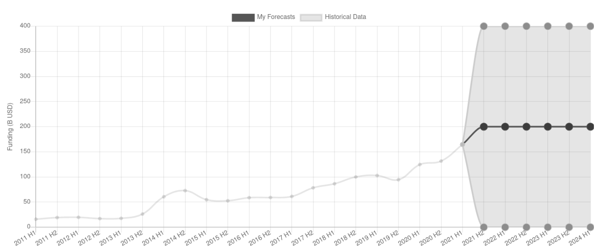
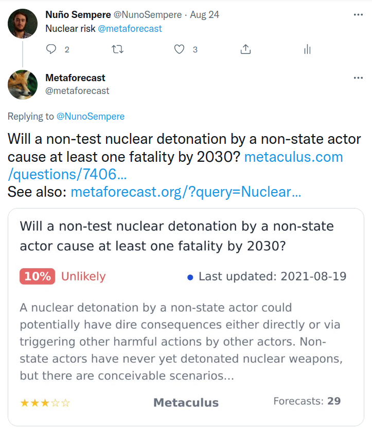
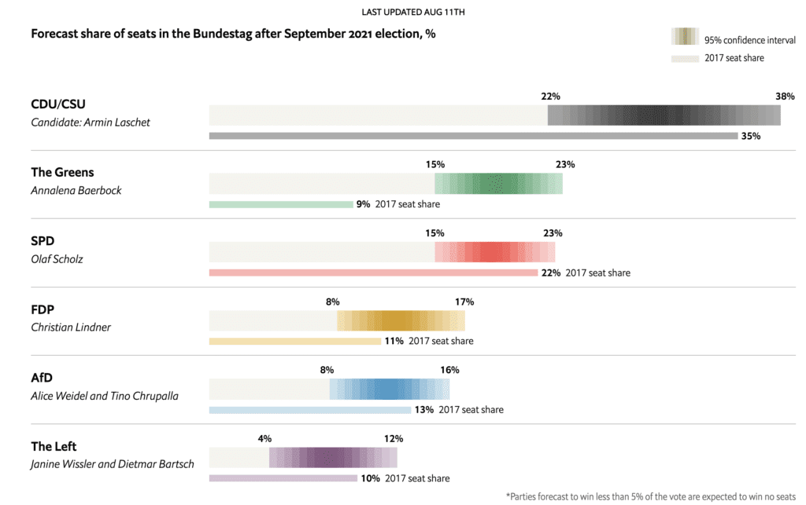
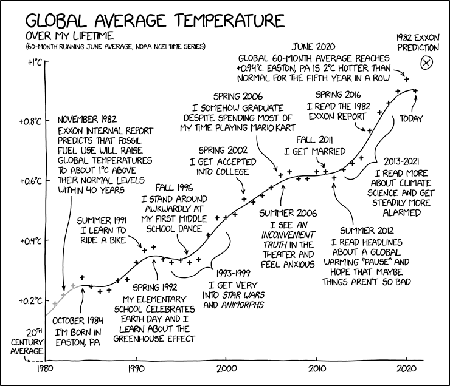
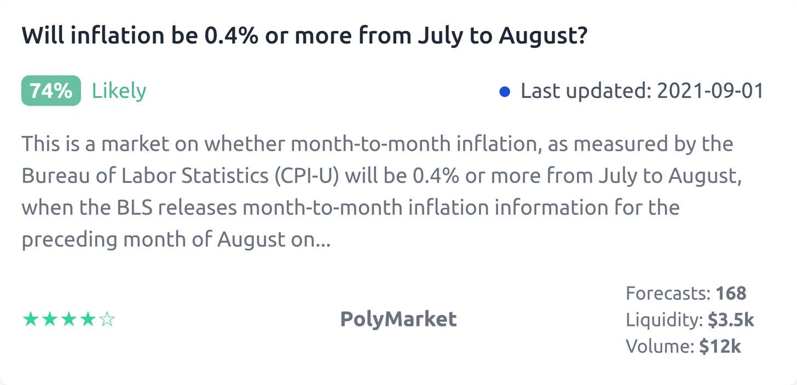

Forecasting Newsletter: August 2021
==============

## Highlights

*   Despite forecaster consensus to the contrary, Kabul has fallen
*   CSET-Foretell attempts to [make inroads](https://www.cset-foretell.com/issue-campaigns) into US decision-making mechanisms
*   The US’ CDC to [launch a new outbreak analysis and forecast center](https://fortune.com/2021/08/18/cdc-center-forecasting-and-outbreak-analytics-public-health/)

## Index

*   Prediction Markets & Forecasting Platforms
*   Blog Posts
*   Long Content
*   In The News

Sign up [here](https://forecasting.substack.com) or browse past newsletters [here](https://forum.effectivealtruism.org/s/HXtZvHqsKwtAYP6Y7).

## Prediction Markets & Forecasting Platforms

### Metaculus

[SimonM](https://twitter.com/SmoLurks/) ([a](https://web.archive.org/web/20210901141135/https://twitter.com/SmoLurks/)) kindly curated the [top comments from Metaculus this past August](https://metaculusextras.com/top_comments?start_date=2021-08-01&end_date=2021-09-01) ([a](https://web.archive.org/web/20210901153731/https://metaculusextras.com/top_comments?start_date=2021-08-01)). They are:

*   [johnnycaffeine](https://www.metaculus.com/questions/7514/taliban-capture-of-afghan-presidential-palace/#comment-68015) ([a](https://web.archive.org/web/20210901154328/https://www.metaculus.com/questions/7514/taliban-capture-of-afghan-presidential-palace/#comment-68015)) asks if the community prediction is a good indicator that people didn't forsee the rapidity of the Taliban takeover
*   [j.m.](https://www.metaculus.com/questions/7643/andrew-cuomo-still-ny-governor-on-2021-12-31/#comment-67115) ([a](https://web.archive.org/web/20210901141214/https://www.metaculus.com/questions/7643/andrew-cuomo-still-ny-governor-on-2021-12-31/#comment-67115)) did the (now moot) impeachment math for Cuomo: there would probably have been enough votes for an impeachment to go through.
*   [Jgalt](https://www.metaculus.com/questions/7514/taliban-capture-of-afghan-presidential-palace/#comment-67997) ([a](https://web.archive.org/web/20210901141236/https://www.metaculus.com/questions/7514/taliban-capture-of-afghan-presidential-palace/#comment-67997)) flags up a rather poorly aged forecast by Biden.
*   [alexrjl](https://www.metaculus.com/questions/7598/rootclaim-challenge-before-2025/#comment-67928) ([a](https://web.archive.org/web/20210901141334/https://www.metaculus.com/questions/7598/rootclaim-challenge-before-2025/#comment-67928)) points out a design flaw in [Rootclaim's Challenge](https://www.rootclaim.com/rootclaim_challenge) ([a](https://web.archive.org/web/20210227095938/https://www.rootclaim.com/rootclaim_challenge)): "I find it ironic in the extreme that Rootclaim makes repeated reference to the overconfidence of experts, but that their challenge requires you to "win a debate", meaning that if you think they are overconfident but not directionally wrong (e.g. assigning 90% to something which you think should be assigned a 60% probability) there is no way for you to win the bet."
*   [j.m.](https://www.metaculus.com/questions/7314/50by40-meat-production-goal-achieved/#comment-67023) ([a](https://web.archive.org/web/20210901141525/https://www.metaculus.com/questions/7314/50by40-meat-production-goal-achieved/#comment-67023)) points out the internet was adopted slower than one might otherwise think.

Metaculus begins the next round of the [Keep Virginia Safe Tournament](https://www.metaculus.com/tournament/vdh/) ([a](https://web.archive.org/web/20210824140300/https://www.metaculus.com/tournament/vdh/)), which has a $1,000 prize pool. They have also pushed a redesign of their [frontpage](https://www.metaculus.com/questions/) ([a](https://web.archive.org/web/20210901161255/https://www.metaculus.com/questions/?show-welcome=true)).

### Good Judgment & Good Judgment Open

Here are the top few best comments from [Good Judgment Open](https://www.gjopen.com/) ([a](https://web.archive.org/web/20210901141640/https://www.gjopen.com/)), as curated by myself:

*   [rjfmgy](https://www.gjopen.com/comments/1315066) ([a](https://web.archive.org/web/20210901141700/https://www.gjopen.com/comments/1315066)) compares and contrasts the current situation in Afghanistan with the Bashar al-Assad regime in Syria in 2015, on which he also forecasted at the time.
*   [Anneinak](https://www.gjopen.com/comments/1319590) ([a](https://web.archive.org/web/20210901141725/https://www.gjopen.com/comments/1319590)) meets with the Dutch Ambassador to forecast "When will a new Dutch government be sworn in after the 2021 general election?"
*   [RyanBeck](https://www.gjopen.com/comments/1319364) ([a](https://web.archive.org/web/20210901141810/https://www.gjopen.com/comments/1319364)) reads Merck's Q2 earnings call document, and concludes that molnupiravir will most likely not be approved by the US FDA for use to treat COVID-19 before 1 October 2021. He also shares [this report](https://www.dni.gov/files/ODNI/documents/assessments/Unclassified-Summary-of-Assessment-on-COVID-19-Origins.pdf) ([a](https://web.archive.org/web/20210831175159/https://www.dni.gov/files/ODNI/documents/assessments/Unclassified-Summary-of-Assessment-on-COVID-19-Origins.pdf)) by the US's Office of the Director of National Intelligence on the origins of COVID-19.
*   [keith-huggins](https://www.gjopen.com/comments/1321084) ([a](https://web.archive.org/web/20210901144219/https://www.gjopen.com/comments/1321084)) gives the lowdown on the power grab by the President of Tunisia.

In addition, Good Judgment Open introduced the [Sky News Challenge](https://www.gjopen.com/challenges/58-the-sky-news-challenge) ([a](https://web.archive.org/web/20210901144240/https://www.gjopen.com/challenges/58-the-sky-news-challenge)). Questions are very UK-centric. But on the other hand, Sky News is a well-regarded major [UK news channel](https://en.wikipedia.org/wiki/Sky_News) ([a](https://web.archive.org/web/20210901144254/https://en.wikipedia.org/wiki/Sky_News)) with a [large viewership](https://www.skymedia.co.uk/channels/sky-news/) ([a](https://web.archive.org/web/20210901144350/https://www.skymedia.co.uk/channels/sky-news/)).

> Sky News is asking forecasters for their latest judgments on political questions of consequence in the UK and beyond. Our ambition is to use probability changes in crowd forecasts to visualize how key issues in the news agenda are developing. Forecasts and reasoning that attract significant upvotes could be featured in our reporting.

### CSET-Foretell

Foretell continues their work of making forecasts and forecasting methodologies more accessible and legible to US decision-makers. Most recentlyh, they are doing this through their "Issue campaigns"; a write-up of the idea can be seen [here](https://www.cset-foretell.com/issue-campaigns) ([a](https://web.archive.org/web/20210901144437/https://www.cset-foretell.com/issue-campaigns)). One of their first issue campaigns is on the topic of [the future of the of Defense-Silicon Valley Relationship](https://www.cset-foretell.com/blog/dod-sv-relationship-intro) ([a](https://web.archive.org/web/20210901144458/https://www.cset-foretell.com/blog/dod-sv-relationship-intro)).

Otherwise, CSET-Foretell (or rather, CultivateLabs, the company behind the webpage they use) has also [added two new question formats](https://www.cset-foretell.com/blog/rolling-question-formats) ([a](https://web.archive.org/web/20210901144534/https://www.cset-foretell.com/blog/rolling-question-formats)). The first asks about 80% confidence intervals for more than one time period at a time, aggregating multiple sub-questions into one. The second format consists of rolling predictions, such that, e.g. "in the next six months" resets every month to refer to the next six months from the month of the forecast. 

For example, a forecast on the question [Will the Chinese military or other maritime security forces fire upon another country's civil or military vessel in the South China Sea in the next six months?](https://www.cset-foretell.com/questions/349) ([a](https://web.archive.org/web/20210901144642/https://www.cset-foretell.com/questions/349)) made during the month of September refers to the September-February period, whereas a forecast made during October would refer to the October-April six month period.

Personally, while I'm glad to see experimentation with new formats, and I even intellectually admit that the new formats are in a sense superior, I still find them fairly unintuitive to forecast on.

Lastly, CSET-Foretell forecasts were quoted by [Quartz](https://qz.com/emails/quartz-forecast/2033619/) ([a](https://web.archive.org/web/20210802185209/https://qz.com/emails/quartz-forecast/2033619/)) on [on whether VC funding for tech startups will dry up](https://qz.com/emails/quartz-forecast/2033619/) ([a](https://web.archive.org/web/20210802185209/https://qz.com/emails/quartz-forecast/2033619/)) (warning: paywalled), and by [SupChina](https://supchina.com/2021/08/25/can-betting-on-chinese-politicians-predict-their-futures/) ([a](https://web.archive.org/web/20210901144840/https://supchina.com/2021/08/25/can-betting-on-chinese-politicians-predict-their-futures/)) on the composition of the Politburo Standing Committee of the Chinese Communist Party.

### Polymarket

Difficulties with The Graph—the service which Polymarket uses to bring the data from the blockchain to its webpage—have continued, with users seeing negative balances. Polymarket has also been hosting many sports markets recently. While they bring large amounts of volume, they make Polymarket less differentiated.

A community driven [command-line trading tool](https://github.com/PolyTrader/polymarket-trading) ([a](https://web.archive.org/web/20210901144836/https://github.com/PolyTrader/polymarket-trading)) continues to get better.

[Star Spangled Gamblers](https://starspangledgamblers.com) ([a](https://web.archive.org/web/20210901144857/https://starspangledgamblers.com/)), a political betting podcast, has been producing some highly entertaining Polymarket related podcasts, e.g.: [Betting to #FreeBritney](https://starspangledgamblers.com/2021/08/19/betting-to-freebritney/) ([a](https://web.archive.org/web/20210901145022/https://starspangledgamblers.com/2021/08/19/betting-to-freebritney/)) and [Your California Recall Playbook is Here](https://starspangledgamblers.com/2021/08/31/your-california-recall-playbook-is-here/) ([a](https://web.archive.org/web/20210901145105/https://starspangledgamblers.com/2021/08/31/your-california-recall-playbook-is-here/)).

An unrelated project in the Matic chain with a similar sounding name, [Poly Network](https://www.theblockcrypto.com/post/114045/at-least-611-million-stolen-in-massive-cross-chain-hack) ([a](https://web.archive.org/web/20210901145140/https://www.theblockcrypto.com/post/114045/at-least-611-million-stolen-in-massive-cross-chain-hack)), was hacked for $611 million, though most of the funds were [later returned](https://www.cnbc.com/2021/08/13/poly-network-hack-nearly-all-of-600-million-in-crypto-returned.html) ([a](https://web.archive.org/web/20210901145205/https://www.cnbc.com/2021/08/13/poly-network-hack-nearly-all-of-600-million-in-crypto-returned.html)). Polymarket users pretended to be confused about this out of that perverse sense of humor prevalent in our time.

### Metaforecast

I've pushed some [major upgrades](https://www.lesswrong.com/posts/5hugQzRhdGYc6ParJ/metaforecast-update-better-search-capture-functionality-more) ([a](https://web.archive.org/web/20210826050624/https://www.lesswrong.com/posts/5hugQzRhdGYc6ParJ/metaforecast-update-better-search-capture-functionality-more)) to [Metaforecast](https://metaforecast.org/) ([a](https://web.archive.org/web/20210901145401/https://metaforecast.org/)). Chiefly:

*   search is much better,
*   one can capture forecasts as images, making it easier to incorporate into blogposts,
*   questions have quality indicators (number of forecasters, volume traded, liquidity, etc.),
*   and I've added new platforms

In addition, I've written a Twitter bot which answers with the closest prediction in the database when @metaforecast is [mentioned in a tweet](https://twitter.com/metaforecast/status/1430226261515907075) ([a](https://web.archive.org/web/*/https://twitter.com/metaforecast/status/1430226261515907075)):

This makes mentioning forecasts in casual twitter conversation pretty much trivial, so perhaps the sanity level of Twitter conversations could be raised ever so slightly.

## Blog Posts

[Statistical Modelling](https://statmodeling.stat.columbia.edu) ([a](https://web.archive.org/web/20210901145425/https://statmodeling.stat.columbia.edu/)) discusses [Forecast displays that emphasize uncertainty](https://statmodeling.stat.columbia.edu/2021/08/11/forecast-displays-that-emphasize-uncertainty/) ([a](https://web.archive.org/web/20210812121830/https://statmodeling.stat.columbia.edu/2021/08/11/forecast-displays-that-emphasize-uncertainty/)), on account of [The Economist's Forecasting Model for the 2021 German election](https://www.economist.com/graphic-detail/who-will-succeed-angela-merkel) ([a](https://web.archive.org/web/20210831195410/https://www.economist.com/graphic-detail/who-will-succeed-angela-merkel)) ([unpaywalled version](https://archive.is/G9Tg9#selection-1118.0-1118.1)), which only offers 95% confidence intervals of parliament seats, rather than explicit probabilities of who will win.

[Uncertainty can Defuse Logical Explosions](https://www.lesswrong.com/posts/Q5um4RBHaF6gHfmLm) ([a](https://web.archive.org/web/20210901145759/https://www.lesswrong.com/posts/Q5um4RBHaF6gHfmLm)) makes the point that the [principle of explosion](https://en.wikipedia.org/wiki/Principle_of_explosion) ([a](https://web.archive.org/web/20210815095809/https://en.wikipedia.org/wiki/Principle_of_explosion))—"P and ¬P, therefore anything follows"—does not apply for an agent with probabilistic beliefs. I thought that the point was very neat, but also that it could be formalized better.

Daniel Kokotajlo writes [What 2026 looks like (Daniel's Median Future)](https://www.lesswrong.com/posts/6Xgy6CAf2jqHhynHL/what-2026-looks-like-daniel-s-median-future) ([a](https://web.archive.org/web/20210901145657/https://www.lesswrong.com/posts/6Xgy6CAf2jqHhynHL/what-2026-looks-like-daniel-s-median-future)), extrapolating the performance of models like GPT-3 year by year.

The team behind [Global Guessing](https://globalguessing.com/) ([a](https://web.archive.org/web/20210901145914/https://globalguessing.com/)) is starting a monthly newsletter focused on prediction markets: [Crowd Money](https://www.crowdmoney.io/p/-crowd-money-001-an-introduction) ([a](https://web.archive.org/web/20210901150036/https://www.crowdmoney.io/p/-crowd-money-001-an-introduction)).

## Long Content

[The D-Squared Digest One Minute MBA—Avoiding Projects Pursued By Morons 101](https://blog.danieldavies.com/2004/05/d-squared-digest-one-minute-mba.html) ([a](https://web.archive.org/web/20210901150058/https://blog.danieldavies.com/2004/05/d-squared-digest-one-minute-mba.html)). A blogger which correctly predicted that there would be no weapons of mass destruction in Iraq looks back at how and why.

> Literally people have been asking me: "How is it that you were so amazingly prescient about Iraq? Why is it that you were right about everything at precisely the same moment when we were wrong?" No honestly, they have. I'd love to show you the emails I've received, there were dozens of them, honest. Honest. Anyway, I note that "errors of prewar planning" is now pretty much a mainstream stylised fact, so I suspect that it might make some small contribution to the commonweal if I were to explain how it was that I was able to spot so early that this dog wasn't going to hunt. I will struggle manfully with the savage burden of boasting, self-aggrandisement and ego-stroking that this will necessarily involve. It's been done before, although admittedly by a madman in the process of dying of syphilis of the brain. Sorry, where was I?

In the [Abilene paradox](https://en.wikipedia.org/wiki/Abilene_paradox) ([a](https://web.archive.org/web/20210831030734/https://en.wikipedia.org/wiki/Abilene_paradox)), a group of people collectively decide on a course of action that is counter to the preferences of many or all of the individuals in the group. It involves a common breakdown of group communication in which each member mistakenly believes that their own preferences are counter to the group's and, therefore, does not raise objections. A common phrase relating to the Abilene paradox is a desire to not "rock the boat". h/t Chana.

## In the News

The United Nations' [Intergovernmental Panel on Climate Change](https://en.wikipedia.org/wiki/Intergovernmental_Panel_on_Climate_Change) ([a](https://web.archive.org/web/20210901150227/https://en.wikipedia.org/wiki/Intergovernmental_Panel_on_Climate_Change)) has a new [report](https://www.ipcc.ch/report/ar6/wg1/#SPM) ([a](https://web.archive.org/web/20210901150243/https://www.ipcc.ch/report/ar6/wg1/#SPM)) out. The report has been making the rounds; e.g., Boris Johnson described it as ["sobering reading"](https://www.theguardian.com/politics/2021/aug/09/boris-johnson-ipcc-climate-report-makes-sobering-reading) ([a](https://web.archive.org/web/20210901150305/https://www.theguardian.com/politics/2021/aug/09/boris-johnson-ipcc-climate-report-makes-sobering-reading)). Interestingly, it uses probabilistic quantifiers:

> Each finding is grounded in an evaluation of underlying evidence and agreement. A level of confidence is expressed using five qualifiers: very low, low, medium, high and very high, and typeset in italics, for example, medium confidence. The following terms have been used to indicate the assessed likelihood of an outcome or a result: virtually certain 99–100% probability, very likely 90–100%, likely 66–100%, about as likely as not 33–66%, unlikely 0–33%, very unlikely 0–10%, exceptionally unlikely 0–1%. Additional terms (extremely likely 95–100%, more likely than not >50–100%, and extremely unlikely 0–5%) may also be used when appropriate. Assessed likelihood is typeset in italics, for example, _very likely_. This is consistent with AR5. In this Report, unless stated otherwise, square brackets \[x to y\] are used to provide the assessed very likely range, or 90% interval

For example:

> Human influence is _very likely_ the main driver of the global retreat of glaciers since the 1990s and the decrease in Arctic sea ice area between 1979–1988 and 2010–2019 (about 40% in September and about 10% in March). There has been no significant trend in Antarctic sea ice area from 1979 to 2020 due to regionally opposing trends and large internal variability. Human influence _very likely_ contributed to the decrease in Northern Hemisphere spring snow cover since 1950. It is _very likely_ that human influence has contributed to the observed surface melting of the Greenland Ice Sheet over the past two decades, but there is only _limited evidence_, with _medium agreement_, of human influence on the Antarctic Ice Sheet mass loss.
> 
> It is _virtually certain_ that the global upper ocean (0–700 m) has warmed since the 1970s and _extremely likely_ that human influence is the main driver. It is _virtually certain_ that human-caused CO2 emissions are the main driver of current global acidification of the surface open ocean. There is _high confidence_ that oxygen levels have dropped in many upper ocean regions since the mid-20th century, and _medium confidence_ that human influence contributed to this drop.

[xkcd](https://xkcd.com/2500) ([a](https://web.archive.org/web/20210830094835/https://xkcd.com/2500/)) showcases a very accurate prediction from [Exxon](https://en.wikipedia.org/wiki/ExxonMobil_climate_change_controversy) ([a](https://web.archive.org/web/20210901150433/https://en.wikipedia.org/wiki/ExxonMobil_climate_change_controversy)), made back in 1982.

Kabul has fallen. One can laugh at Biden, and mention that he is "not a superforecaster". But forecasters and superforecasters alike also failed to see this one coming. I've written a postmortem from a forecasting perspective [here](https://forecasting.substack.com/p/postmortem-the-fall-of-kabul), available to Substack subscribers. Metaculus also has a post-mortem thread [here](https://www.metaculus.com/questions/7514/taliban-capture-of-afghan-presidential-palace/#comment-68015) ([a](https://web.archive.org/web/20210901154328/https://www.metaculus.com/questions/7514/taliban-capture-of-afghan-presidential-palace/#comment-68015)).

[CDC recruits outsiders to lead a new center on disease forecasting](https://fortune.com/2021/08/18/cdc-center-forecasting-and-outbreak-analytics-public-health/) ([a](https://web.archive.org/web/20210901150458/https://fortune.com/2021/08/18/cdc-center-forecasting-and-outbreak-analytics-public-health/)), with [Marc Lipsitch](https://twitter.com/mlipsitch) ([a](https://web.archive.org/web/20210901150735/https://twitter.com/mlipsitch)) as Director of Science. The name might [ring a bell](https://forum.effectivealtruism.org/search?terms=Marc%20Lipsitch) for EA readers.

[5G Wireless Could Interfere with Weather Forecasts](https://www.scientificamerican.com/article/5g-wireless-could-interfere-with-weather-forecasts/) ([a](https://web.archive.org/web/20210901150827/https://www.scientificamerican.com/article/5g-wireless-could-interfere-with-weather-forecasts/)). On the one hand, water absorbs electromagnetic radiation differently at different frequencies, and monitoring the 24 gigahertz frequency is apparently particularly informative. On the other hand, weather satellites use a 16 gigahertz band to communicate with stations on the ground. And proposed 5G bands might interfere with signals at either of those frequencies—reporting doesn't make clear which—and thus deteriorate weather forecasting performance.

> ...the biggest issue involves a spectrum called 24 gigahertz, which weather satellites use to monitor natural microwave signals produced by water vapor at various levels in the atmosphere. The device they use is a microwave radiometer.
> 
> But the signals made by water vapor and other natural weather signatures become fainter in a cacophonous surge of phone signals. “If you have a large network of cellphone towers transmitting many orders of magnitude more power near the ground, some of that reflects upward and parts of the atmosphere will become very noisy,” Mahoney said.
> 
> ...the most “insidious” impact of rising noise levels on a weather spectrum would emerge if they caused errors or gaps in the weather data that is undetected. The erroneous data might be included in computer models that scientists use for, among other things, predicting future climate behavior.
> 
> Just where the FCC will go next with its Frontier Spectrum policy on 5G is unclear. According to the House Science Committee, it has already taken in almost $2 billion from 29 winning bidders for space on the 24 gigahertz band.

The US military announces “Global Information Dominance“ experiments, using machine learning to automate analyzing and collecting intelligence ([primary source](https://www.defense.gov/Newsroom/Transcripts/Transcript/Article/2711594/northcom-commander-gen-glen-d-vanherck-conducts-press-briefing-on-north-america/) ([a](https://web.archive.org/web/20210901162915/https://www.defense.gov/Newsroom/Transcripts/Transcript/Article/2711594/northcom-commander-gen-glen-d-vanherck-conducts-press-briefing-on-north-america/)), [secondary source](https://www.thedrive.com/the-war-zone/41771/the-pentagon-is-experimenting-with-using-artificial-intelligence-to-see-days-in-advance) ([a](https://web.archive.org/web/20210901163000/https://www.thedrive.com/the-war-zone/41771/the-pentagon-is-experimenting-with-using-artificial-intelligence-to-see-days-in-advance))). Some highlights and thoughts [here](https://www.lesswrong.com/posts/vDvKWdCCNo9moNcMr/us-military-global-information-dominance-experiments) ([a](https://web.archive.org/web/20210901163047/https://www.lesswrong.com/posts/vDvKWdCCNo9moNcMr/us-military-global-information-dominance-experiments)).

[Inflation Comes for Aluminum](https://www.bloomberg.com/news/articles/2021-07-27/inflation-comes-for-aluminum-as-the-everywhere-metal-surges/):

> Demand is set to surge on the back of climate-change investment, and mega-producer China—which accounts for more than half of global output—is cracking down on smelting to reduce pollution and meet green targets.
> 
> It’s already jumped 26% this year to about $2,500 a ton, one the best performers on the London Metal Exchange. Goldman Sachs Group Inc. is among those seeing more gains ahead, forecasting record prices above $3,000 by late next year.
> 
> "It takes quite a mindset change—some viewed buying aluminum similar to buying groceries in the supermarket," said Philippe Mueller, head of aluminum trading at Trafigura. "It's not going to work like this anymore."
> 
> The metal isn't alone in facing short-term issues. The combination of soaring demand and spluttering supply after covid-19 disruption has upended many raw materials markets, all of which is feeding the global inflation scare that's taken hold in some corners this year.

On the topic of inflation, and to finish this newsletter with a forecast, see:

Source: [Will inflation be 0.4% or more from July to August?](https://polymarket.com/market/will-inflation-be-04-or-more-from-july-to-august)

---

Note to the future: All links are added automatically to the Internet Archive, using this [tool](https://github.com/NunoSempere/longNowForMd) ([a](https://web.archive.org/web/20210901151122/https://github.com/NunoSempere/longNowForMd)). "(a)" for archived links was inspired by [Milan Griffes](https://www.flightfromperfection.com/) ([a](https://web.archive.org/web/20210901152041/https://www.flightfromperfection.com/)), [Andrew Zuckerman](https://www.andzuck.com/) ([a](https://web.archive.org/web/20210901151200/https://www.andzuck.com/)), and [Alexey Guzey](https://guzey.com/) ([a](https://web.archive.org/web/20210823014942/https://guzey.com/)).

---

> Good ideas do not need lots of lies told about them in order to gain public acceptance

[Daniel Davies](https://blog.danieldavies.com/2004/05/d-squared-digest-one-minute-mba.html) ([a](https://web.archive.org/web/20210901150058/https://blog.danieldavies.com/2004/05/d-squared-digest-one-minute-mba.html))

---
