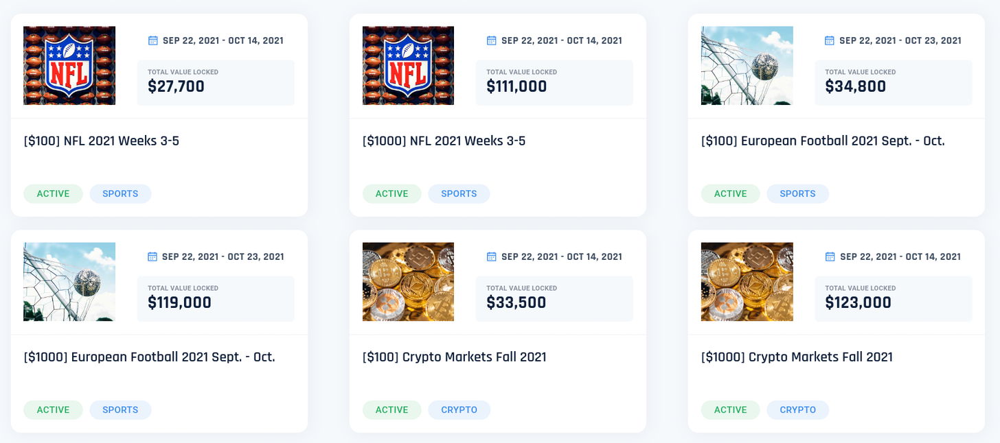
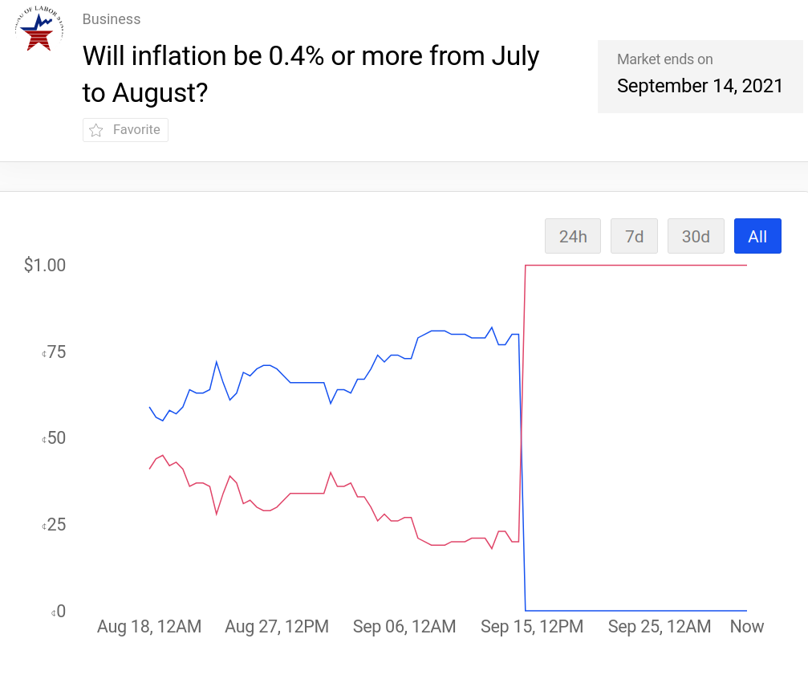
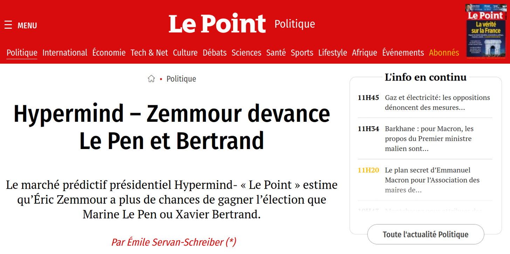
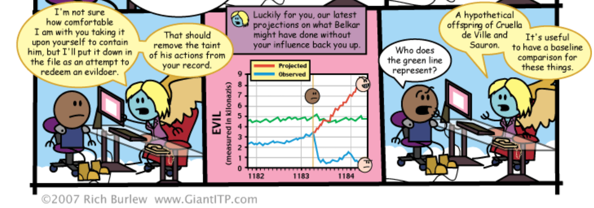

Forecasting Newsletter: September 2021.
==============

## Highlights

*   Facebook's Forecast [folds](https://mobile.twitter.com/dglid/status/1443024658169843718)
*   [Hedgehog Markets](https://hedgehog.markets/) now operational
*   Polygon and Augur announce a [$1M liquidity rewards program](https://blog.polygon.technology/augur-matic-rewards-1m-liquidity-mining-program-in-conjunction-with-augur/)

## Index

*   Prediction Markets & Forecasting Platforms
*   Blog Posts
*   Long Content
*   In The News

Sign up [here](https://forecasting.substack.com) or browse past newsletters [here](https://forum.effectivealtruism.org/s/HXtZvHqsKwtAYP6Y7).

## Prediction Markets & Forecasting Platforms

### Hedgehog markets

[Hedgehog markets](https://hedgehog.markets/no-loss/) ([a](https://web.archive.org/web/20211001085745/https://hedgehog.markets/no-loss/)) launches on the Solana mainnet, meaning that their prediction markets are now open to real-money bets. A brief explanation of how their no-loss competitions work and why they're interesting can be found on the [July edition of this newsletter](https://forecasting.substack.com/p/forecasting-newsletter-july-2021) ([a](https://web.archive.org/web/20210805135822/https://forecasting.substack.com/p/forecasting-newsletter-july-2021)). Their first competition offers [$100k in prizes](https://hedgehog-markets.medium.com/hedgehog-launches-no-loss-prediction-markets-on-solana-mainnet-with-100k-in-prizes-51acc0fde586) ([a](https://web.archive.org/web/20211001114031/https://hedgehog-markets.medium.com/hedgehog-launches-no-loss-prediction-markets-on-solana-mainnet-with-100k-in-prizes-51acc0fde586)).

Hedgehog Markets’ first [no-loss competitions](https://hedgehog.markets/no-loss)

Hedgehog's first markets are focused on sports and on the prices of various crypto assets. But their no-loss model is uniquely suitable for more long-term markets, so I'll be watching out for that.

### Metaculus

[SimonM](https://twitter.com/SmoLurks/) ([a](https://web.archive.org/web/20211001085003/https://twitter.com/SmoLurks/)) kindly curated the [top comments from Metaculus this past August](https://metaculusextras.com/top_comments?start_date=2021-09-01&end_date=2021-10-01). They are:

*   [RyanBeck](https://www.metaculus.com/questions/7995/two-theories-of-inflation/#comment-70281) ([a](https://web.archive.org/web/20211001085158/https://www.metaculus.com/questions/7995/two-theories-of-inflation/#comment-70281)) points out some shortcomings in Arnold Kling's fortified essay on [Two Theories of Inflation](https://www.metaculus.com/questions/7995/two-theories-of-inflation/)
*   [Charles](https://www.metaculus.com/questions/2511/will-emmanuel-macron-be-re-elected-president-of-france-in-2022/#comment-69998) ([a](https://web.archive.org/web/20211001085221/https://www.metaculus.com/questions/2511/will-emmanuel-macron-be-re-elected-president-of-france-in-2022/#comment-69998)) looks at Macron's re-election chances in 2022
*   [SimonM](https://www.metaculus.com/questions/8024/us-debt-default-by-halloween/#comment-70623) ([a](https://web.archive.org/web/20211001085246/https://www.metaculus.com/questions/8024/us-debt-default-by-halloween/#comment-70623)) calculates a base rate for US government defaults linked to the debt ceiling using Laplace's law
*   [ugandamaximum](https://www.metaculus.com/questions/5717/will-trump-be-elected-potus-in-2024/#comment-69500) ([a](https://web.archive.org/web/20211001085308/https://www.metaculus.com/questions/5717/will-trump-be-elected-potus-in-2024/#comment-69500)) looks at Trump's electoral prospects in 2024
*   [Comments on this question](https://www.metaculus.com/questions/7814/ai-incident-causes-1bn-damage-by-2032/) ([a](https://web.archive.org/web/20211001085333/https://www.metaculus.com/questions/7814/ai-incident-causes-1bn-damage-by-2032/)) wrangle with how to measure AI damage
*   [galen](https://www.metaculus.com/questions/5887/pantones-color-of-the-year-for-2022/#comment-70045) ([a](https://web.archive.org/web/20211001085356/https://www.metaculus.com/questions/5887/pantones-color-of-the-year-for-2022/#comment-70045)) makes a well-informed comment on [What will be the Hue (in angular degrees) of Pantone's Color of the Year for 2022?](https://www.metaculus.com/questions/5887/pantones-color-of-the-year-for-2022/#comment-70045) ([a](https://web.archive.org/web/20211001085356/https://www.metaculus.com/questions/5887/pantones-color-of-the-year-for-2022/#comment-70045))

Metaculus is [advertising for various job openings](https://apply.workable.com/metaculus/) ([a](https://web.archive.org/web/20211001085426/https://apply.workable.com/metaculus/)): Lead Developer, Senior NLP/Machine Learning Engineer, Effective Altruism Question Author, and “[analytical storyteller](https://www.metaculus.com/news/2021/07/23/analytical-storytellers-job/)” ([a](https://web.archive.org/web/20210725080229/https://www.metaculus.com/news/2021/07/23/analytical-storytellers-job/)).

### Polymarket

Polymarket writes about [Why You Should Get Your News From the Blockchain](https://pomp.substack.com/p/prediction-markets-and-the-beauty) ([a](https://web.archive.org/web/20211001085935/https://pomp.substack.com/p/prediction-markets-and-the-beauty)) on one of the largest crypto newsletters. Meanwhile, Polymarket keeps experiencing outages because of troubles with The Graph—one of the services it uses to connect its webpage with its blockchain contracts.

[Will inflation be 0.4% or more from July to August?](https://polymarket.com/market/will-inflation-be-04-or-more-from-july-to-august), Polymarket

Last month, I lost a small amount of money following forecasts from [Star Spangled Gamblers](https://starspangledgamblers.com/) ([a](https://web.archive.org/web/20211001090000/https://starspangledgamblers.com/)) and [Karlstack](https://karlstack.substack.com/p/polymarket-prediction-august-inflation) ([a](https://archive.is/HeneD#https://karlstack.substack.com/p/polymarket-prediction-august-inflation)), respectively on Britney Spears' conservatorship and August US inflation numbers. While I still find both sources very entertaining, I probably won't be following their lead on Polymarket in the future.

### Hypermind

Hypermind launches another tournament: [Forecast Covid-19 Mortality Worldwide](https://prod.hypermind.com/ngdp/en/welcomeCovidRoll.html) ([a](https://web.archive.org/web/20211001090303/https://prod.hypermind.com/ngdp/en/welcomeCovidRoll.html)), with $15,000 in total rewards.

Opinion piece on [Le Point](https://www.lepoint.fr/politique/hypermind-zemmour-devance-le-pen-et-bertrand-29-09-2021-2445295_20.php) by Hypermind’s Director

Hypermind was also featured on [Le Point](https://www.lepoint.fr/politique/hypermind-zemmour-devance-le-pen-et-bertrand-29-09-2021-2445295_20.php) ([a](https://web.archive.org/web/20210929090631/https://www.lepoint.fr/politique/hypermind-zemmour-devance-le-pen-et-bertrand-29-09-2021-2445295_20.php)), a large French magazine, on the topic of their upcoming presidential elections. Per the article, Marine Le Pen’s chances aren’t as high as those of a more entertaining far-right candidate, [Éric Zemmour](https://en.wikipedia.org/wiki/%C3%89ric_Zemmour) ([a](https://web.archive.org/web/20211001120012/https://en.wikipedia.org/wiki/%C3%89ric_Zemmour)). h/t MonsieurDimanche.

### Odds and ends

[Polygon and Augur (Turbo) announce a $1M liquidity rewards program](https://blog.polygon.technology/augur-matic-rewards-1m-liquidity-mining-program-in-conjunction-with-augur/) ([a](https://web.archive.org/web/20211001090524/https://blog.polygon.technology/augur-matic-rewards-1m-liquidity-mining-program-in-conjunction-with-augur/)).

> The program incentivizes liquidity providers (LPs) by rewarding them through so-called liquidity mining, in which users of a decentralized finance (DeFi) product earn an additional token on top of the regularly expected yield just for putting assets into a liquidity pool. In return, liquidity made available helps bootstrap user adoption and ensure the smooth running of Augur Turbo. Users can earn rewards by providing liquidity to every side of the bet on the platform.

This is interesting because providing liquidity is one of the most fickle and unprofitable parts of running a prediction market. Historically, Polymarket—which is also on the Polygon chain—has been setting large amounts of their money on fire providing liquidity to their own markets.

Augur Turbo is also setting their [trading fees to 0%](https://twitter.com/AugurProject/status/1443597635277844480) ([a](https://web.archive.org/web/20211001114219/https://twitter.com/AugurProject/status/1443597635277844480)).

[Facebook's Forecast](https://apps.apple.com/us/app/id1509378877) ([a](https://web.archive.org/web/20210227143009/https://apps.apple.com/us/app/id1509378877)), an experimental website and iPhone app from Facebook’s New Product Experimentation division, [folds](https://mobile.twitter.com/dglid/status/1443024658169843718) ([a](https://web.archive.org/web/20211001090148/https://mobile.twitter.com/dglid/status/1443024658169843718)). Second-hand sources speculate that this was because of the community's poor performance. Forecast was previously announced on LessWrong [here](https://www.lesswrong.com/posts/CZRyFcp6HSyZ7Jj8Q/launching-forecast-a-community-for-crowdsourced-predictions). h/t @dglid, Michał Dubrawski.

[PredictIt Arbitrage calculator](https://visuallyexplained.xyz/predictit-arbitrage-calculator/) ([a](https://web.archive.org/web/20210902171944/https://visuallyexplained.xyz/predictit-arbitrage-calculator/)) fetches the PredictIt markets in which one can make money no matter what the outcome is—because the shares price doesn't sum to exactly 100%. If I'm reading this correctly, there aren't any salient opportunities right now.

Meanwhile in the corporate world, Amazon is searching for a [Network Forecasting and Planning](https://www.amazon.jobs/en/jobs/1724275/program-manager-network-forecasting-and-planning) ([a](https://web.archive.org/web/20210915151113/https://www.amazon.jobs/en/jobs/1724275/program-manager-network-forecasting-and-planning)) Program Manager, with "Proficiency in MS Excel."

## Blog Posts

[The Order of the Stick](https://www.giantitp.com/comics/oots0489.html), on quantifying the impact of a life

[John Cochrane](https://en.wikipedia.org/wiki/John_H._Cochrane) ([a](https://web.archive.org/web/20211001092435/https://en.wikipedia.org/wiki/John_H._Cochrane)) writes [Climate Policy Should Pay More Attention to Climate Economics](https://johnhcochrane.blogspot.com/2021/09/climate-economics.html) ([a](https://web.archive.org/web/20211001124443/https://johnhcochrane.blogspot.com/2021/09/climate-economics.html)):

> But the best guesses of the economic impact of climate change are surprisingly small. The U.N.’s IPCC finds that a (large) temperature rise of 3.66°C by 2100 means a loss of 2.6 percent of global GDP. Even extreme assumptions about climate and lack of mitigation or adaptation strain to find a cost greater than 5 percent of GDP by the year 2100.
> 
> Now, 5 percent of GDP is a lot of money — $1 trillion of our $20 trillion GDP today. But 5 percent of GDP in 80 years is couch change in the annals of economics.
> 
> \[...\]
> 
> For a small donation, pictures of cuddly animals might do. For trillion-dollar costs and regulations, they do not. To justify such costs, we need some dollar value on specific environmental damage of climate change. Yes, the numbers are uncertain. But those numbers are the only sensible framework to discuss spending trillions of dollars on climate now.

I'll file this under "big if true". For what it's worth, the 2.6% of GDP is indeed mentioned in page 256 of [this IPCC report](https://www.ipcc.ch/site/assets/uploads/sites/2/2019/02/SR15_Chapter3_Low_Res.pdf) ([a](https://web.archive.org/web/20210818151148/https://www.ipcc.ch/site/assets/uploads/sites/2/2019/02/SR15_Chapter3_Low_Res.pdf)):

> Under the no-policy baseline scenario, temperature rises by 3.66°C by 2100, resulting in a global gross domestic product (GDP) loss of 2.6% (5–95% percentile range 0.5–8.2%), compared with 0.3% (0.1–0.5%) by 2100 under the 1.5°C scenario and 0.5% (0.1–1.0%) in the 2°C scenario

However, note that these are forecasts about events _80 years into the future_.

[Updates and Lessons from AI Forecasting](https://bounded-regret.ghost.io/ai-forecasting/) ([a](https://web.archive.org/web/20211001090720/https://bounded-regret.ghost.io/ai-forecasting/)) gives [Jacob Steinhardt's](https://jsteinhardt.stat.berkeley.edu/) ([a](https://web.archive.org/web/20210606103449/https://jsteinhardt.stat.berkeley.edu/)) outlook on having commissioned forecasts on the future of AI through Hypermind. See also [a forecaster's rundown of his predictions for Steinhardt's tournament](https://www.lesswrong.com/posts/kyySiWyxxhQN67Yhe/my-hypermind-arising-intelligence-forecasts-and-reflections) ([a](https://web.archive.org/web/20211001114236/https://www.lesswrong.com/posts/kyySiWyxxhQN67Yhe/my-hypermind-arising-intelligence-forecasts-and-reflections)).

[Cultured meat predictions were overly optimistic](https://forum.effectivealtruism.org/posts/YYurNqQDAWNiQJv9K/cultured-meat-predictions-were-overly-optimistic) ([a](https://web.archive.org/web/20211001090916/https://forum.effectivealtruism.org/posts/YYurNqQDAWNiQJv9K/cultured-meat-predictions-were-overly-optimistic)). "Of the 273 predictions collected, 84 have resolved - nine resolving correctly, and 75 resolving incorrectly. Additionally, another 40 predictions should resolve at the end of the year and look to be resolving incorrectly. Overall, the state of these predictions suggest very systematic overconfidence."

[When pooling forecasts, use the geometric mean of odds](https://forum.effectivealtruism.org/posts/sMjcjnnpoAQCcedL2/when-pooling-forecasts-use-the-geometric-mean-of-odds) ([a](https://web.archive.org/web/20210923170626/https://forum.effectivealtruism.org/posts/sMjcjnnpoAQCcedL2/when-pooling-forecasts-use-the-geometric-mean-of-odds)). "There are many methods to pool forecasts. The most commonly used is the arithmetic mean of probabilities. However, there are empirical and theoretical reasons to prefer the geometric mean of the odds instead." SimonM finds that [empirical Metaculus data](https://forum.effectivealtruism.org/posts/sMjcjnnpoAQCcedL2/when-pooling-forecasts-use-the-geometric-mean-of-odds?commentId=HNtKuSWwcyB5gdeE3) ([a](https://web.archive.org/web/20210904135756/https://forum.effectivealtruism.org/posts/sMjcjnnpoAQCcedL2/when-pooling-forecasts-use-the-geometric-mean-of-odds?commentId=HNtKuSWwcyB5gdeE3)) confirms this.

[Measuring the information in an empirical prior](https://statmodeling.stat.columbia.edu/2021/08/18/measuring-the-information-in-an-empirical-prior/) ([a](https://web.archive.org/web/20210825201057/https://statmodeling.stat.columbia.edu/2021/08/18/measuring-the-information-in-an-empirical-prior/)):

> For example, clinical trials reporting hazard ratios for treatment effects of say HR < 1/20 or HR > 20 are incredibly rare and typically fraudulent or afflicted by severe protocol violations. And then an HR of 100 could represent a treatment for which practically all the treated and none of the untreated respond, and thus is far beyond anything that would be uncertain enough to justify an RCT – we do not do randomized trials comparing jumping with and without a parachute from 1000m up. Yet typical “weakly informative” priors assign considerable prior probability to hazard ratios far below 1/20 or far above 20.

## Long Content

A flurry of papers [are out](https://twitter.com/spyrosmakrid/status/1440233354360594432#m) ([a](https://web.archive.org/web/20211001091630/https://twitter.com/spyrosmakrid/status/1440233354360594432#m)) detailing results and conclusions from the [Makridakis 5 competition](https://en.wikipedia.org/wiki/Makridakis_Competitions#Fifth_competition,_started_on_March_3,_2020,_ended_on_July_1,_2020) ([a](https://web.archive.org/web/20210320222022/https://en.wikipedia.org/wiki/Makridakis_Competitions#Fifth_competition,_started_on_March_3,_2020,_ended_on_July_1,_2020)), one of the largest and longest-running ML forecasting competitions in the world. They will be presented at the [M5 Conference](https://mofc.unic.ac.cy/m5-conference-overview/) ([a](https://web.archive.org/web/20211001091742/https://mofc.unic.ac.cy/m5-conference-overview/)) this September. [Applicability of the M5 to Forecasting at Walmart](https://doi.org/10.1016/j.ijforecast.2021.06.002) (([sci-hub link](https://sci-hub.se/https://doi.org/10.1016/j.ijforecast.2021.06.002) ([a](https://web.archive.org/web/20211001091846/https://sci-hub.se/https://doi.org/10.1016/j.ijforecast.2021.06.002))) presents the scoring details, and compares Walmart's own data pipeline to the winning entries.

[Wikipedia: Predictions of the collapse of the Soviet Union](https://en.wikipedia.org/wiki/Predictions_of_the_collapse_of_the_Soviet_Union) ([a](https://web.archive.org/web/20211001091902/https://en.wikipedia.org/wiki/Predictions_of_the_collapse_of_the_Soviet_Union)). "Whether any particular prediction was correct is still a matter of debate, since they give different reasons and different time frames for the Soviet collapse."

AI Impacts in [2015](https://aiimpacts.org/predictions-of-human-level-ai-timelines/) ([a](https://web.archive.org/web/20210812064013/https://aiimpacts.org/predictions-of-human-level-ai-timelines/)), on a large dataset of predictions of when human-level AI will be achieved.

[_Probabilistic Storytelling and Temporal Exigencies in Predictive Data Journalism_](https://doi.org/10.1080/21670811.2021.1878920) _(_[_a_](https://archive.is/s4jWU#https://doi.org/10.1080/21670811.2021.1878920)_) (_[_sci-hub link_](https://sci-hub.se/https://www.tandfonline.com/doi/full/10.1080/21670811.2021.1878920) ([a](https://web.archive.org/web/20211001092218/https://sci-hub.se/https://www.tandfonline.com/doi/full/10.1080/21670811.2021.1878920))) outlines some considerations about predictive storytelling:

*   Better prediction-making capabilities have only been game-changing in a few journalistic industries (political predictions, weather forecasting, sports)
*   The position of "data journalist" isn’t very established; people with that position often call themselves by different names (journalists, researchers, data-analysts, interaction designers, etc.)
*   Journalists are reluctant to use predictions
*   This might be because
    *   news are churned pretty fast, and focused on the very short term...
        *   whereas predictions take time to gather and make sense of and tell stories around
    *   or because text, stories and human minds tend to follow one thread...
        *   whereas probabilistic futures are a garden of forking paths, and thus more difficult to represent

Personally, I feel that the paper doesn't push enough on the lack of incentives for numerical predictions, or on the disappointing inadequacy of most—but not all—journalists to work with data, predictions, or nuance more generally. Further, it doesn't propose actionable insights. For instance, this seems like an area which would be amenable to top-down improvement, e.g., by directly paying newspapers to invest in quality probabilistic journalism, or by establishing prizes to incentivize such journalism.

"Proper scoring rules, like log or Brier, incentivize an expert to report their true belief. But what if there are _multiple_ experts? In that case they can collude to guarantee themselves a larger reward". See [this twitter thread](https://twitter.com/ericneyman/status/1434723912173096960) ([a](https://web.archive.org/web/20211001092346/https://twitter.com/ericneyman/status/1434723912173096960)) or the accompanying [paper](https://arxiv.org/abs/2109.01308) ([a](https://web.archive.org/web/20211001092413/https://arxiv.org/abs/2109.01308)).

[Hindenburg Research](https://en.wikipedia.org/wiki/Hindenburg_Research) ([a](https://web.archive.org/web/20211001092726/https://en.wikipedia.org/wiki/Hindenburg_Research))—a firm whose profit model is to investigate companies until it uncovers fraudulent activities, and then to short those while revealing their research—[alleged this June that DraftKings](https://hindenburgresearch.com/draftkings/) ([a](https://web.archive.org/web/20211001092745/https://hindenburgresearch.com/draftkings/)), a major US betting operator, has and continues to deal in countries where betting is illegal.

## In the News

[Nowcasting the Next Hour of Rain](https://deepmind.com/blog/article/nowcasting) ([a](https://web.archive.org/web/20211001114427/https://deepmind.com/blog/article/nowcasting)). Google’s DeepMind releases a more powerful model for forecasting weather in the very short term.

[Weather Forecasting in Afghanistan military operations](https://www.washingtonpost.com/weather/2021/09/10/weather-operations-afghanistan-post-911/) ([a](https://web.archive.org/web/20211001091349/https://www.washingtonpost.com/weather/2021/09/10/weather-operations-afghanistan-post-911/)) is a nice example of superior forecasting prowess that had an example on the tactical level—e.g., being able to evacuate soldiers better, being able to better schedule attacks—but not at the strategic level—the US lost regardless.

FiveThirtyEight [challenges readers](https://projects.fivethirtyeight.com/2021-nfl-forecasting-game/) ([a](https://web.archive.org/web/20210928160249/https://projects.fivethirtyeight.com/2021-nfl-forecasting-game/)) to beat their NFL forecasts.

[The Business of Forecasting Fashion](https://www.wsj.com/podcasts/the-journal/the-business-of-forecasting-fashion/56456044-361b-48a8-b6ea-4cafba023595) ([a](https://web.archive.org/web/20211001091417/https://www.wsj.com/podcasts/the-journal/the-business-of-forecasting-fashion/56456044-361b-48a8-b6ea-4cafba023595)). In a Wall Street Journal podcast, a fashion forecasting expert talks about predicting what people will wear. What I found most interesting was trying to logically follow the impact of trends. For instance, as poorer millennials work more often from home, there is more relative demand for home wear.

---

Note to the future: All links are added automatically to the Internet Archive, using this [tool](https://github.com/NunoSempere/longNowForMd) ([a](https://web.archive.org/web/20211001093337/https://github.com/NunoSempere/longNowForMd)). "(a)" for archived links was inspired by [Milan Griffes](https://www.flightfromperfection.com/) ([a](https://web.archive.org/web/20210901152041/https://www.flightfromperfection.com/)), [Andrew Zuckerman](https://www.andzuck.com/) ([a](https://web.archive.org/web/20211001093433/https://www.andzuck.com/)), and [Alexey Guzey](https://guzey.com/) ([a](https://web.archive.org/web/20210919003554/https://guzey.com/)).

---

> No airship will ever fly from New York to Paris. That seems to me to be impossible. What limits the flight is the motor. No known motor can run at the requisite speed for four days without stopping, and you can’t be sure of finding the proper winds for soaring. The airship will always be a special messenger, never a load-carrier. But the history of civilization has usually shown that every new invention has brought in its train new needs it can satisfy, and so what the airship will eventually be used for is probably what we can least predict at the present.

Wilbur Wright, of the Wright Brothers, [1908](http://www.smithsonianeducation.org/educators/lesson_plans/wright/flights_future.html) ([a](https://web.archive.org/web/20210815151349/http://www.smithsonianeducation.org/educators/lesson_plans/wright/flights_future.html)) h/t [Nintil](https://twitter.com/ArtirKel/status/1420124905102794756) ([a](https://web.archive.org/web/20211001093657/https://twitter.com/ArtirKel/status/1420124905102794756)) through the [Best of Twitter](https://bestoftwitter.substack.com/p/best-of-twitter-week-of-july-26-2021) ([a](https://web.archive.org/web/20211001093722/https://bestoftwitter.substack.com/p/best-of-twitter-week-of-july-26-2021)) newsletter.