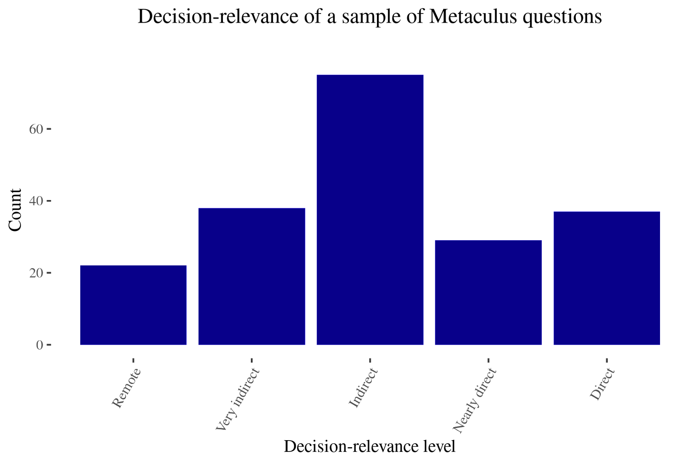
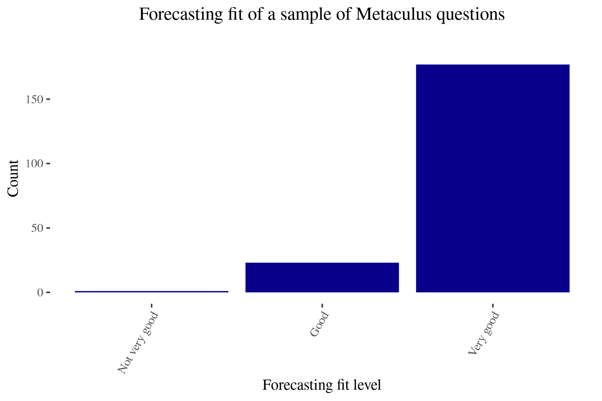
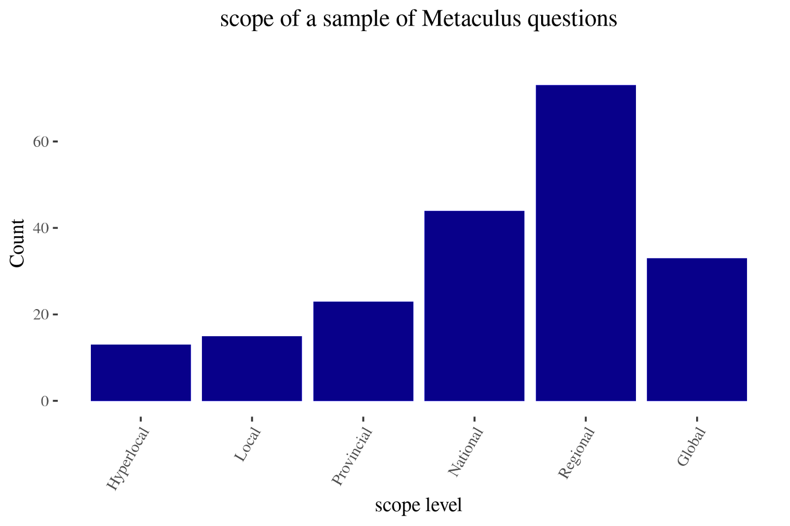
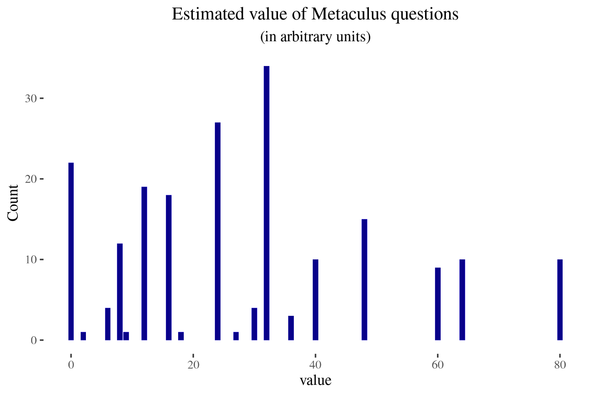
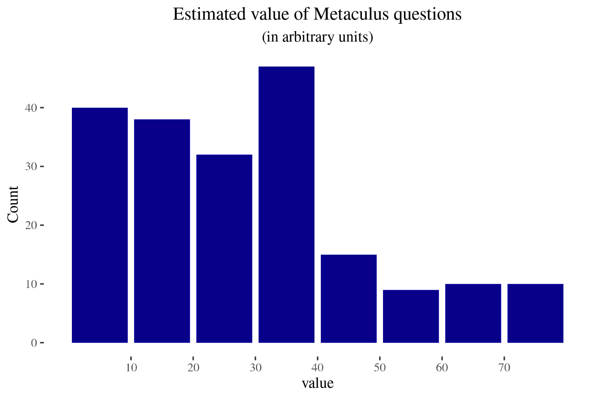

An estimate of the value of Metaculus questions
==============

**tl;dr**: [Metaculus](https://www.metaculus.com/questions/) is an EA-adjacent forecasting platform. By my estimation, most Metaculus questions fail to directly influence decisions, but a few fall at the sweet spot between large scope, high decision relevance, and good fit for forecasters. That said, perhaps only a fraction of Metaculus’ impact is captured by the impact of their questions. In any case, the EA community could perhaps use evaluations of the value of Metaculus questions to incentivize it to produce more valuable questions.

## Overall impressions

The holy grail for Metaculus would be questions on important topics which the kind of person who encounters Metaculus is in a position to do something about.

However, there is a tension between questions being decision-relevant and having a large scope because smaller entities might be more amenable than larger ones to being influenced. So it could turn out that the impact sweet spot is asking intimately decision-relevant questions that small organizations are willing to listen to. Conversely, as Metaculus grows its audience, perhaps questions with a large scope which change small decisions for many people might be more valuable.

But a large number of Metaculus questions fall in neither of those categories. On the one hand, we have very narrow questions which do not affect any decisions, such as [What will the women’s winning 100m time in the 2024 Olympic final be?](https://www.metaculus.com/questions/7776/2024-olympic-womens-100m-final/) On the other hand, we also have questions such as “[Will Israel recognize Palestine by 2070?](https://www.metaculus.com/questions/7631/israel-recognizing-palestine/)” or “[When will Hong Kong stop being a Special Administrative Region of China?](https://www.metaculus.com/questions/3338/when-will-hong-kong-stop-being-a-special-administrative-region-of-china/)”. These events seem so large as to essentially be non-influenceable, and thus I’d tend to think that their Metaculus questions are not valuable \[3\].

For Metaculus, another constraint is to have questions that interest forecasters. Interestingness is necessary to build a community around forecasting that may later have a large instrumental value.

Below, I outline a simple rubric that I think captures an important part of how Metaculus questions lead to value in the world. I look at questions’ decision-relevance, forecasting fit, and scope. 

Perhaps predictably, Metaculus is very good at making questions that are a good fit for being forecastable and suitable for forecasters instead of things like financial markets. Now that a forecasting community already exists and is known to be accurate and calibrated, it seems to me that the next bottleneck is to make forecasts action-guiding, perhaps by tweaking the scope of questions that Metaculus asks, or by reaching out to specific organizations.

Overall, the driving motivation behind this post is the perspective that:

*   even though I think that medium or long-term interventions can have a larger impact than spending their funds on the best near-term interventions,
*   I'd still like to have a healthy degree of paranoia
*   because I think that the default might be to have essentially no impact,
*   and I would dislike for that to be the case for Metaculus

## Methodology

I took a random sample of 200 questions and rated them according to:

1.  how far removed I think they are from influencing decisions
2.  how good of a fit they are for forecasters, and
3.  the scope of the matters they ask about

My results can be found [here](https://docs.google.com/spreadsheets/d/1q_VsIEt8swzT4aqqEaFm1ayIJN6G5YC5ybgkSSYjriU/edit?usp=sharing) \[1\]. This work is rough and not meant to be definitive. In particular, I think that some of the rankings might be subject to some degree of idiosyncrasy. Nonetheless,  I hope that this might still be informative, and lead to some reflection about if and how Metaculus questions can be valuable.

### Decision-relevance

How likely is this to change actual decisions?

*   Directly: Someone will read this and change their decisions as a result (e.g., micro-covid calculations). Numeric value: 4
*   Indirectly with one degree of separation. Numeric value: 3
*   Indirectly with more than one degree of separation. Numeric value: 2 (e.g, most CSET-Foretell questions)
*   Indirectly, with an unknown number of degrees of separation. Numeric value: 1
*   Almost certainly won't change any decisions. Numeric value: 0

Indirect effects, such as finding out if forecasters are calibrated on some domain, or improving one's models of the world, are difficult to capture in a simple rubric. I've tried to capture this in "degrees away from being decision-relevant", but this might be a bad approximation.

### Forecasting fit

How valuable is it to generate insight on this topic from a forecasting perspective? Is anybody else trying?

*   Very valuable: This question is perfectly suited to forecasters and makes its platform shine. Numeric value: 4
*   Valuable: This question isn't uniquely suited to forecasters specifically, but forecasts are still useful. Numeric value: 3
*   Not very valuable: It's free labour, so people will take it, but people wouldn't pay for it. Numeric value: 2
*   Not valuable: Forecasting doesn't solve the problem which the question seeks to address. Numeric value: 1

For example, if other groups are looking at similar questions, I would rate the forecasting fit lower. Other groups might be liquid financial markets, sports betting markets, politics prediction markets, Nate Silver’s group at FiveThirtyEight, or experts I deem to be reliable.

Otherwise, I would use my intuition about what makes a question more forecastable. For instance, binary events are more straightforward to forecast (and to construct base rates about) than distributions. I also rated questions as more forecastable if they were about areas where forecasters live (Europe, US and UK.)

### Scope

I categorized Metaculus questions as one of:

*   Global: Affects many nations or a few very important nations (e.g., US/China conflict, space exploration). Numeric value: = 5
*   Regional: Affects a whole region, with more than one nation or US state (e.g., Balcan conflict, Brexit, GERD dam). Numeric value: 4.
*   National: Affects one nation/US state or large non-state actor (e.g., Brazil elections, ExxonMobile scandals). Numeric value: 3
*   Provincial: Affects part of a nation/US state (e.g., California forest fires, local corruption scandal). Numeric value: 2
*   Local: Affects a more restricted area and doesn't have global implications (e.g., one particular organization). Numeric value: 1
*   Hyperlocal: Pertains to a particular detail of something which would otherwise have a local scope (e.g., one very particular detail of one particular organization). Numeric value: 0.5

Given Metaculus’ readership, local questions most likely end up being more decision-relevant than global ones. For instance, California wildfires could influence Metaculus users in California, or questions about [Virginia](https://www.metaculus.com/tournament/vdh/) could influence their health department. As expanded below, I attempt to consider this by multiplying scope, decision-relevance and forecasting fit, but this might be too crude a system.

Considerations regarding scope could be made more robust by considering how many people the event under consideration affects (e.g., 1k, 10k, 100k, 1M, 10M, 100M, 1B+), and a measure of how much it affects them.

### Overall value

The three elements (sort of) map to: scale, tractability and neglectedness, but not completely. One could also create more elaborate and robust rubrics.

In any case, I get a measure of the overall value by multiplying the numeric values of the three factors. For instance, if decision-relevance is zero, the overall value is zero as well. I am aware that this is not very methodologically elegant \[2\]. Nonetheless, I still wanted to have some measure of aggregate impact.

##   
 **Conclusion**

Given Metaculus’ historic roots as a general-purpose forecasting platform \[4\], it’s not surprising that their questions don’t have that much of an impact from the narrow perspective considered in this post: legibly changing decisions. In particular, many of Metaculus’ questions seem optimized for being fairly interesting to forecasters rather than directly valuable. However, given that Metaculus does appeal to the EA community for funding—see the [2019](https://forum.effectivealtruism.org/posts/CJJDwgyqT4gXktq6g/long-term-future-fund-april-2019-grant-recommendations#Anthony_Aguirre___70_000__) and [2020](https://forum.effectivealtruism.org/posts/AioofNtgQFpE5k8tE/long-term-future-fund-april-2020-grants-and-recommendations#Anthony_Aguirre___65_000_) grants—it still feels fair game to evaluate them based on their expected impact.

That said, I can imagine other pathways to impact besides the impact of their questions. Two I can think of are:

*   As a platform for identifying talent. I know of a few people working at EA organizations that gained a fair bit of career capital from their work at Metaculus. Going forward, Rethink Priorities might be happy to give research opportunities to excellent Metaculus forecasters.
*   As a way to ground and sharpen EA’s epistemic health, sanity, models of the world, etc.
    *   For instance, Metaculus could provide value by being a better, more realistic, less fake version of [OpenPhilanthopy’s calibration training](https://www.openphilanthropy.org/calibration). This could conceivably happen without any particular question being all that valuable, though I would find this surprising.
    *   For instance, Metaculus could sanity-check claims of interest to EAs. For example, [this question](https://www.metaculus.com/questions/7547/livestock-farming-ban-by-2041/) on a livestock farming ban by 2041 makes it clear that some claims by DxE, an animal rights organization, are very overconfident.

It’s also possible that Metaculus is most valuable at the onset of emergencies, like the COVID pandemic, and less useful now that there are fewer unknown unknowns in the immediate horizon \[5\]. Because of the absence of these and other considerations or possible pathways to impact, this post does feel somewhat rough.

But suppose one determined that most of Metaculus’s impact came from the effects of their questions. In that case, the EA community could try to directly estimate its willingness to pay for Metaculus questions and just pay Metaculus and Metaculus forecasters that amount as a reward and an incentive. 

For instance, the highest-scoring questions \[6\] in my dataset—those with a score of 80—were:

*   [Will there be at least one fatality from nuclear detonation in North Korea by 2050, if any detonation occurs?](https://www.metaculus.com/questions/7453/fatality-from-nuclear-detonation-in-n-korea/)
*   [50 years after the first AGI becomes publicly known, how many hours earlier will historical consensus determine it came online?](https://www.metaculus.com/questions/7252/gap-between-agi-creation-and-reveal/)
*   [Will more than two nuclear weapons in total have been detonated as an act of war by 2050?](https://www.metaculus.com/questions/4779/will-more-than-two-nuclear-weapons-in-total-have-been-detonated-as-an-act-of-war-by-2050/)
*   [When will 100 babies be born whose embryos were selected for genetic scores for intelligence?](https://www.metaculus.com/questions/5525/ivf-based-embryo-selection-for-intelligence/)
*   [Will armed conflict between the national military forces or law enforcement personnel of the Republic of China (Taiwan) and the People's Republic of China (PRC) cause at least 100 deaths before 2050?](https://www.metaculus.com/questions/7512/100-deaths-from-taiwan-conflict-before-2050/)
*   [Will the EU have a mandatory multi-tiered animal welfare labelling scheme in place by 2025?](https://www.metaculus.com/questions/6455/an-eu-animal-welfare-label-by-2025/)
*   [Will there be armed conflict between the national military forces, militia and/or law enforcement personnel of Republic of China (Taiwan) and the People's Republic of China (PRC) before Jan 1, 2024?](https://www.metaculus.com/questions/7227/armed-conflict-between-prc--roc-taiwan/)
*   [Will armed conflicts between the Republic of China (Taiwan) and the People's Republic of China (PRC) lead to at least 100 deaths before Jan 1, 2026?](https://www.metaculus.com/questions/7792/100-deaths-from-taiwan-conflict-before-2026/)
*   [Will the human condition change fundamentally before 2100?](https://www.metaculus.com/questions/1646/will-the-human-condition-change-fundamentally-before-2100/)
*   [When will AI achieve competency on multi-choice questions across diverse fields of expertise?](https://www.metaculus.com/questions/5276/ai-competence-in-diverse-fields-of-expertise/)

If one estimates, arguendo, that good forecasts for each of those questions are worth something on the order of $2000 per year, one could get an estimate of $2000 \* (10 questions) \* (1818 questions with more than 10 predictions on Metaculus) / (200 questions in my sample) / (0.8 as a Pareto coefficient \[7\]) ~ $225,000 / year.

I’d be interested in getting pushback and other perspectives on any of these points.

_Thanks to Ozzie Gooen and Kelsey Rodríguez for comments and editing help._

## Footnotes

\[1\]: The code to extract these questions from Metaculus—using Metaforecast as a middle-point—can be found [here](https://github.com/QURIresearch/metaforecasts/tree/master/src/utils/evals). Note that [by design](https://github.com/QURIresearch/metaforecasts/blob/master/src/platforms/metaculus-fetch.js#L129), Metaforecast excludes questions with less than ten forecasts. The code to produce the R plots can be found [here](https://gist.github.com/NunoSempere/551d47c5fba58f7cca62e8c3d9c9ee92).

\[2\]: For instance—given equal forecasting fit—a question with a decision relevance of 3 and a scope of 1 might be more valuable than a question with a decision relevance of 1 and a scope of 3. 

\[3\]: One could make the case that these questions could be valuable if they influenced people to emigrate away from unstable regions. Still, I don’t expect prospective emigrant Metaculus readership in Hong Kong to be very high, nor Metaculus readers in Israel to have high property ownership rates in places that would be given back to Palestine.

\[4\]: I am aware that Metaculus has always aimed to produce useful probabilities, particularly around topics of scientific interest and AI. But the aim of being directly useful to the EA community in particular feels relatively recent.

\[5\]: Or, are there?

\[6\]: Because of the limitations of my methodology, these might not ultimately be the most valuable questions in my 200 question dataset. Conversely, some of the lowest-scoring questions (those with a value of 5 or lower) in my dataset were:

*   [When will China legalise same-sex marriage?](https://www.metaculus.com/questions/3887/when-will-china-legalise-same-sex-marriage/)
*   [Will George R. R. Martin die before the final book of A Song Of Ice And Fire is published?](https://www.metaculus.com/questions/1681/will-george-r-r-martin-die-before-the-final-book-of-a-song-of-ice-and-fire-is-published/)
*   [How many Computer Vision and Pattern Recognition e-prints will be published on arXiv over the 2021-01-14 to 2022-01-14 period?](https://www.metaculus.com/questions/6298/cv-e-prints-2021-01-14-to-2022-01-14/)
*   [If Elizabeth Holmes is convicted in Theranos fraud trial, how long will her sentence be?](https://www.metaculus.com/questions/8052/elizabeth-holmes-sentence-if-convicted/)
*   [Will Elon Musk's Tesla Roadster be visited by a spacecraft before 2050?](https://www.metaculus.com/questions/6476/musks-roadster-visited-by-2050/)
*   [Will Bill Gates implant a brain-computer interface in anyone by 2030?](https://www.metaculus.com/questions/6364/bill-gates-brain-computer-interface-by-2030/)
*   [Will Roger Federer win another Grand Slam title?](https://www.metaculus.com/questions/3071/will-roger-federer-win-another-grand-slam-title/)
*   [What will the largest number of digits of π to have been computed be, by the end of 2025?](https://www.metaculus.com/questions/3384/what-will-the-largest-number-of-digits-of-%25CF%2580-to-have-been-computed-be-by-the-end-of-2025/)
*   [How many medals will the USA win at Paris 2024?](https://www.metaculus.com/questions/7665/total-medals-won-by-the-usa-at-paris-2024/)
*   [When will there be a mile-high building?](https://www.metaculus.com/questions/735/when-will-there-be-a-mile-high-building/)
*   [How many e-prints on Few-Shot Learning will be published on ArXiv over the 2021-02-14 to 2023-02-14 period?](https://www.metaculus.com/questions/6528/few-shot-e-prints-2021-02-14-to-2023-02-14/)
*   [What will the space traveler fatality rate due to spacecraft anomalies be in the 2020's?](https://www.metaculus.com/questions/7930/space-traveler-fatality-rate-in-the-2020s/)
*   [Will France place in the Top 5 at the 2024 Paris Olympics?](https://www.metaculus.com/questions/7669/france-home-game-advantage/)
*   [Will Kyle Rittenhouse be convicted of first-degree intentional homicide?](https://www.metaculus.com/questions/5158/will-kyle-rittenhouse-be-convicted-of-first-degree-intentional-homicide/)
*   [When will a first-class Royal Mail stamp cost at least £1?](https://www.metaculus.com/questions/5823/date-first-class-royal-mail-stamps-costs-1/)
*   [When will SpaceX's Starship carry a human to orbit?](https://www.metaculus.com/questions/4588/when-will-spacexs-starship-carry-a-human-to-orbit/)
*   [What percentage of seats will the PAP win in the next Singaporean general election?](https://www.metaculus.com/questions/7596/seats-won-by-the-pap-in-the-next-election/)
*   [What will the mean of the year-over-year growth rate of the sum of teraflops of all 500 supercomputers in the TOP500 be, in the three year period ending in November 2023?](https://www.metaculus.com/questions/3357/what-will-the-mean-of-the-year-over-year-growth-rate-of-the-sum-of-teraflops-of-the-all-500-supercomputers-in-the-top500-be-in-the-three-year-period-ending-in-november-2023/)
*   [When will the first human mission to Venus take place?](https://www.metaculus.com/questions/6703/date-of-first-human-visit-to-venus/)
*   [When will The Simpsons air its final episode?](https://www.metaculus.com/questions/807/when-will-the-simpsons-air-its-final-episode/)
*   [How many federal judges will the US Senate confirm in 2021?](https://www.metaculus.com/questions/6114/will-the-senate-confirm-many-judges-in-2021/)
*   [When will Virgin Galactic's first paid flight occur?](https://www.metaculus.com/questions/469/when-will-virgin-galactics-first-paid-flight-occur/)
*   [When will the Twin Prime Conjecture be resolved?](https://www.metaculus.com/questions/7501/date-twin-prime-conjecture-is-resolved/)

I know that there is an argument to be made that the oddly specific AI arxiv questions are valuable because they help inform how accurate other AI predictions might be, but I don't buy it.

\[7\]: Assuming that 80% of the value of Metaculus questions comes from the most valuable ones, per something akin to the Pareto principle.