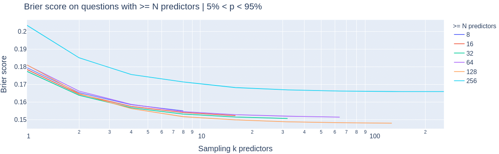
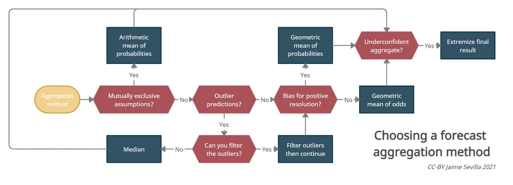

Forecasting Newsletter: October 2021.
==============

## Highlights

*   Polymarket is [being investigated](https://www.bloomberg.com/news/articles/2021-10-23/crypto-venue-for-bets-on-trump-jlo-and-covid-faces-u-s-probe) by the CFTC
*   Metaculus solves long-lasting UX problem: it now allows more expressive distributions.
*   David Friedman looks at the [track record of IPCC predictions](https://daviddfriedman.blogspot.com/2021/10/have-past-ipcc-temperature.html)

## Index

*   Prediction Markets & Forecasting Platforms
*   Job Board
*   In the News
*   Blog Posts
*   Long Content

You can sign up for this newsletter [on substack](https://forecasting.substack.com), or browse past newsletters [here](https://forum.effectivealtruism.org/s/HXtZvHqsKwtAYP6Y7). If you have a content suggestion or want to reach out, you can leave a comment or find me on [Twitter.](https://twitter.com/NunoSempere)

## Prediction Markets & Forecasting Platforms

### Polymarket

Polymarket is [being investigated by the US Commodity Futures Trading Commission](https://www.bloomberg.com/news/articles/2021-10-23/crypto-venue-for-bets-on-trump-jlo-and-covid-faces-u-s-probe) ([a](https://web.archive.org/web/20211027012345/https://www.bloomberg.com/news/articles/2021-10-23/crypto-venue-for-bets-on-trump-jlo-and-covid-faces-u-s-probe)). Back in 2008, several Nobel Prize winners and other academics [called on US agencies to clarify and establish regulations on prediction markets](https://www.hypermind.com/wp-content/uploads/2019/08/science_promise_of_prediction_markets.pdf) ([a](https://web.archive.org/web/20211101190109/https://www.hypermind.com/wp-content/uploads/2019/08/science_promise_of_prediction_markets.pdf)). So at this point, I feel it's on the US Securities Exchange Commission and the Commodity Futures Trading Commission to have regulated this sooner, not on Polymarket not to have acted somewhat unilaterally.

Otherwise, Polymarket has continued to make more incremental usability improvements which make it more convenient for users to trade, add and withdraw funds from the site.

### Metaculus

> "nobody freak out but now you can asymmetrically adjust the tails of your logistic curves on continuous input questions on Metaculus" — @casens

*   [SimonM](https://twitter.com/SmoLurks/) ([a](https://web.archive.org/web/20211001085003/https://twitter.com/SmoLurks/)) kindly curated the [top comments from Metaculus this past August](https://metaculusextras.com/top_comments?start_date=2021-08-01&end_date=2021-09-01) ([a](https://web.archive.org/web/20211101190208/https://metaculusextras.com/top_comments?start_date=2021-08-01&end_date=2021-09-01)). They are:
*   [SimonM](https://www.metaculus.com/questions/8024/us-debt-default-by-halloween/#comment-71429) ([a](https://web.archive.org/web/20211006063130/https://www.metaculus.com/questions/8024/us-debt-default-by-halloween/#comment-71429)) calculates a market-implied probability of US default
*   [TeeJayKay](https://www.metaculus.com/questions/6373/date-song-first-streamed-4b-times-on-spotify/#comment-71242) ([a](https://web.archive.org/web/20211102105614/https://www.metaculus.com/questions/6373/date-song-first-streamed-4b-times-on-spotify/#comment-71242)) gets deep into analysing Spotify's top songs
*   [Matthew\_Barnett](https://www.metaculus.com/questions/372/will-human-brain-emulation-be-the-first-successful-route-to-human-level-digital-intelligence/#comment-71441) ([a](https://web.archive.org/web/20211102112441/https://www.metaculus.com/questions/372/will-human-brain-emulation-be-the-first-successful-route-to-human-level-digital-intelligence/#comment-71441)) bets Robin Hanson that AGI will arrive before ems (and shares his logic)
*   [PeterWildeford](https://www.metaculus.com/questions/5049/if-trump-is-not-sworn-in-as-president-in-2021-will-he-become-the-republican-nominee-for-president-in-2024/#comment-71447) ([a](https://web.archive.org/web/20210714164026/https://www.metaculus.com/questions/5049/if-trump-is-not-sworn-in-as-president-in-2021-will-he-become-the-republican-nominee-for-president-in-2024/#comment-71447)) goes long on Trump
*   [SimonM](https://www.metaculus.com/questions/7557/sexlessness-in-the-us/#comment-71972) ([a](https://web.archive.org/web/20211017165156/https://www.metaculus.com/questions/7557/sexlessness-in-the-us/#comment-71972)) shares the historic General Social Survey data on sexlessness in young people
*   [NunoSempere](https://www.metaculus.com/questions/7340/new-megadonor-in-ea-in-2026/#comment-72142) ([a](https://web.archive.org/web/20211102112635/https://www.metaculus.com/questions/7340/new-megadonor-in-ea-in-2026/#comment-72142)) lays out his logic for the rate of new donors appearing in the EA space
*   Metaculus held a panel discussion on its [collaboration with the Virginia Health Department](https://forum.effectivealtruism.org/posts/nchmQavDQNRLiae7g/event-a-metaculus-open-panel-discussion-how-forecasts-inform) ([a](https://web.archive.org/web/20211101190233/https://forum.effectivealtruism.org/posts/nchmQavDQNRLiae7g/event-a-metaculus-open-panel-discussion-how-forecasts-inform)):

> Since March 2020, Metaculus has provided forecasting and modeling resources to public health professionals as they've made crucial decisions in tracking and combating COVID-19. These efforts include the ongoing Keep Virginia Safe and the recently concluded Virginia Lightning Round forecasting tournaments, which were developed in partnership with the Virginia Department of Health and the University of Virginia Biocomplexity Institute, and were designed to enhance COVID-19 modeling efforts while contributing to the ongoing public health policy conversation in Virginia.

I feel that there is a disconnect between the "crucial decisions" and the [very small prize pool of $1,000 given to forecasters](https://www.metaculus.com/tournament/vdh/) ([a](https://web.archive.org/web/20211025215250/https://www.metaculus.com/tournament/vdh/)). The moment that Metaculus' questions influence public health policy in Virginia at all, their Department of Health's willingness to pay should go through the roof.

In collaboration with Rethink Priorities (and with Michael Aird in particular), Metaculus has started [short](https://www.metaculus.com/tournament/nuclear-risk-forecasting-tournament/) ([a](https://web.archive.org/web/20211101190455/https://www.metaculus.com/tournament/nuclear-risk-forecasting-tournament/)) and [long-term](https://www.metaculus.com/project/nuclear-horizons/) ([a](https://web.archive.org/web/20211101185124/https://www.metaculus.com/project/nuclear-horizons/)) nuclear risk tournaments.

### Good Judgment

The best comments on Good Judgment Open for October, as curated by myself, were:

*   [Kogo](https://www.gjopen.com/comments/1341225) ([a](https://web.archive.org/web/20211102112703/https://www.gjopen.com/comments/1341225)) mentions that neither Europe nor China have the incentive to push for their Comprehensive Agreement on Investment in the current political standoff.
*   borisn outlines why the Democrats will most likely [loose the House of Representatives](https://www.gjopen.com/comments/1344706) ([a](https://web.archive.org/web/20211102112807/https://www.gjopen.com/comments/1344706)) but [retain control of the Senate](https://www.gjopen.com/comments/1344781) ([a](https://web.archive.org/web/20211102113101/https://www.gjopen.com/comments/1344781)), based on historical frequencies.
*   [dada](https://www.gjopen.com/comments/1345447) ([a](https://web.archive.org/web/20211102113343/https://www.gjopen.com/comments/1345447)) wonders why the Good Judgment Open crowd assigns such a low probability to Iran and the US rejoining the JCPOA by the end of this year.
*   [TerrySmith](https://www.gjopen.com/comments/1348767) ([a](https://web.archive.org/web/20211102130920/https://www.gjopen.com/comments/1348767)) mentions that Good Judgment Open seems to have beaten PredictIt on the 2020 election forecasts, so looking at betting odds might not be that informative for the Good Judgment Open crowd when discussing the upcoming election in Virginia.
*   [belikewater](https://www.gjopen.com/comments/1349426) ([a](https://web.archive.org/web/20211102113443/https://www.gjopen.com/comments/1349426)) mentions a [declassified intelligence report on COVID](https://www.dni.gov/files/ODNI/documents/assessments/Declassified-Assessment-on-COVID-19-Origins.pdf) ([a](https://web.archive.org/web/20211101223030/https://www.dni.gov/files/ODNI/documents/assessments/Declassified-Assessment-on-COVID-19-Origins.pdf)) which turned out to be inconclusive.

Good Judgment Open begins the [In The News](https://www.gjopen.com/challenges/57-in-the-news-2022) ([a](https://web.archive.org/web/20211102114847/https://www.gjopen.com/challenges/57-in-the-news-2022)) and [Dubai Future Experts](https://www.gjopen.com/challenges/59-dubai-future-experts-challenge) ([a](https://web.archive.org/web/20211011175902/https://www.gjopen.com/challenges/59-dubai-future-experts-challenge)) challenges.

### Odds and ends

[Futuur](https://futuur.com/) ([a](https://web.archive.org/web/20211014090559/https://futuur.com/)) is a prediction markets platform that recently came into my radar. They allow Americans to participate with a play-money currency, and the rest of the world to trade in dollars and in a variety of cryptocurrencies. They seem legitimate, and have been running a version of their site since 2017. But I would advise some caution: because all of their crypto-currencies go into the same pool, Futuur could be on the hook if the price of any one cryptocurrency moves too much too fast.

Reddit [expands their prediction functionality](https://techcrunch.com/2021/10/13/reddit-adds-a-new-way-to-post-with-launch-of-predictions-feature/) ([a](https://web.archive.org/web/20211101190727/https://techcrunch.com/2021/10/13/reddit-adds-a-new-way-to-post-with-launch-of-predictions-feature/)) (original sources: [1](https://www.reddit.com/r/modnews/comments/nqvw6g/ready_set_join_reddits_predictions_pilot/) ([a](https://web.archive.org/web/20211101190855/https://www.reddit.com/r/modnews/comments/nqvw6g/ready_set_join_reddits_predictions_pilot/)), [2](https://www.reddit.com/r/modnews/comments/nqvw6g/ready_set_join_reddits_predictions_pilot/) ([a](https://web.archive.org/web/20211101190855/https://www.reddit.com/r/modnews/comments/nqvw6g/ready_set_join_reddits_predictions_pilot/))). I've also become aware of a prediction community of Reddit at [r/Predictor](https://www.reddit.com/r/Predictor/) ([a](https://web.archive.org/web/20211101190934/https://www.reddit.com/r/Predictor/)). With 14.4k members on that community alone, Reddit might just have become one of the biggest prediction platforms around, almost without even trying. h/t [@marshallk](https://twitter.com/marshallk/status/1448349598439731203) ([a](https://web.archive.org/web/20211101191008/https://twitter.com/marshallk/status/1448349598439731203)).

Augur continues to focus on sports betting on Polygon with Augur Turbo, and saw upwards of $1M in trading volume, most likely because of the influx of [subsidized liquidity](https://www.coindesk.com/business/2021/09/30/polygon-bolsters-augur-betting-platform-with-1m-liquidity-program/) ([a](https://web.archive.org/web/20211102130940/https://www.coindesk.com/business/2021/09/30/polygon-bolsters-augur-betting-platform-with-1m-liquidity-program/)).

CSET-Foretell continues to [make progress](https://www.cset-foretell.com/questions?challenges=22) ([a](https://web.archive.org/web/20210930191516/https://www.cset-foretell.com/questions?challenges=22)) on their campaign around the [future of the relationship between the US Department of Defense and US tech companies](https://www.cset-foretell.com/issue-campaigns-dod-sv) ([a](https://web.archive.org/web/20211101191109/https://www.cset-foretell.com/issue-campaigns-dod-sv)). They will have an event discussing their preliminary findings on the [10th of November](https://cset.georgetown.edu/event/forecasting-the-future-of-the-dod-silicon-valley-relationship-the-wisdom-of-the-crowd-as-arbiter-of-expert-disagreement/) ([a](https://web.archive.org/web/20211022165259/https://cset.georgetown.edu/event/forecasting-the-future-of-the-dod-silicon-valley-relationship-the-wisdom-of-the-crowd-as-arbiter-of-expert-disagreement/)).

Hedgehog Markets concluded their first two competitions, and will launch new ones, still focused on crypto and sports. Kalshi has also made a few improvements on their desktop webpage, and added some range markets, such as [this one](https://kalshi.com/market-groups/CHIHIGHR) ([a](https://web.archive.org/web/20211102115205/https://kalshi.com/market-groups/CHIHIGHR)) on Chicago temperatures.

## Forecasting Job Board.

The Perry World House (PWH) team at the University of Pennsylvania is looking for a [Program Manager for the Future of the Global Order](https://wd1.myworkdaysite.com/en-US/recruiting/upenn/careers-at-penn/job/Perry-World-House/Global-Order-Program-Manager_JR00041470-1) ([a](https://web.archive.org/web/20211014125730/https://wd1.myworkdaysite.com/en-US/recruiting/upenn/careers-at-penn/job/Perry-World-House/Global-Order-Program-Manager_JR00041470-1)) because the current holder of the position is joining Founders Pledge. PWH has been "doing lots of work on implementing probabilistic forecasting methods in the U.S. government, and the person taking this job would likely continue work on those issues". One particularly high-quality piece of work by PWH previously mentioned in this newsletter was [Keeping Score: A New Approach to Geopolitical Forecasting](https://global.upenn.edu/sites/default/files/perry-world-house/Keeping%20Score%20Forecasting%20White%20Paper.pdf) ([a](https://web.archive.org/web/20211102115232/https://global.upenn.edu/sites/default/files/perry-world-house/Keeping%20Score%20Forecasting%20White%20Paper.pdf)).

The Global Priorities Institute is looking for a [Research Assistant](https://globalprioritiesinstitute.org/vacancy-ra-forecasting/) ([a](https://web.archive.org/web/20211024054015/https://globalprioritiesinstitute.org/vacancy-ra-forecasting/)) to aid its investigation into making forecasting a core research area. They are offering £17.48 ($23.85, 20.62€) per hour.

Metaculus is searching for ["analytical storytellers"](https://forum.effectivealtruism.org/posts/8Woxr3WWEfd5k9a9x/metaculus-seeking-analytical-storytellers-to-write-essays) ([a](https://web.archive.org/web/20211020114713/https://forum.effectivealtruism.org/posts/8Woxr3WWEfd5k9a9x/metaculus-seeking-analytical-storytellers-to-write-essays)) on a rolling basis, paying around $0.3 per word ("essays are compensated at $300 each and at $25 per forecast question, with additional compensation awarded for especially high-quality essays attracting a significant readership")

North Dakota is looking for [economic forecasting consultants](https://www.legis.nd.gov/news/rfp-prospective-economic-forecasting-consultants-0) ([a](https://web.archive.org/web/20211101191225/https://www.legis.nd.gov/news/rfp-prospective-economic-forecasting-consultants-0)). Although the offer seems to be aimed at individual consultants, I feel that it would also be interesting for forecasting platforms/prediction markets to apply.

## Blog Posts

Charles Dillon of Rethink Priorities and SimonM look at [How does forecast quantity impact forecast quality on Metaculus?](https://forum.effectivealtruism.org/posts/xF8EWBouJRZpRgFgu/how-does-forecast-quantity-impact-forecast-quality-on-1) ([a](https://web.archive.org/web/20211029014336/https://forum.effectivealtruism.org/posts/xF8EWBouJRZpRgFgu/how-does-forecast-quantity-impact-forecast-quality-on-1)). More forecasters increase forecast quality, but the effect is small beyond 10 or so forecasters.

Forecasting performance as a function of the number of predictors, by [SimonM](https://forum.effectivealtruism.org/posts/xF8EWBouJRZpRgFgu/how-does-forecast-quantity-impact-forecast-quality-on-1?commentId=3dtqzMEuccpBTubBe#comments) using Metaculus data.

Forecasting performance as a function of the number of predictors, by [SimonM](https://forum.effectivealtruism.org/posts/xF8EWBouJRZpRgFgu/how-does-forecast-quantity-impact-forecast-quality-on-1?commentId=3dtqzMEuccpBTubBe#comments) using Metaculus data.

One possible driver of this effect could be Metaculus allowing up to 10 forecasters to meaningfully coordinate in the public comments section, but not much beyond that.

David Friedman looks at whether the [past IPCC temperature projections/predictions have been accurate?](https://daviddfriedman.blogspot.com/2021/10/have-past-ipcc-temperature.html) ([a](https://web.archive.org/web/20211101191549/https://daviddfriedman.blogspot.com/2021/10/have-past-ipcc-temperature.html))

> The predictions look better now than they did in 2014, high three times out of four, low once, and only once has actual warming been below the predicted range. They are still running a little high but the results look consistent with random error. That makes it at least possible that the IPCC researchers are now modeling the climate system well enough to produce reasonable estimates of its future behavior.

Jaime Sevilla writes about his [current best guess on how to aggregate forecasts](https://forum.effectivealtruism.org/posts/acREnv2Z5h4Fr5NWz/my-current-best-guess-on-how-to-aggregate-forecasts) ([a](https://web.archive.org/web/20211015084806/https://forum.effectivealtruism.org/posts/acREnv2Z5h4Fr5NWz/my-current-best-guess-on-how-to-aggregate-forecasts)):

In [Learning from our (the USA's) defeat](https://scholars-stage.org/learning-from-our-defeat-the-skill-of-the-vulcans/) ([a](https://web.archive.org/web/20211028162144/https://scholars-stage.org/learning-from-our-defeat-the-skill-of-the-vulcans/)) Tanner Greer of The Scholar's Stage looks at the leadership team of the second Bush's administration. It seems very much worth reading in terms of improving one's models of the world.

A [Salesforce blogpost](https://www.salesforce.com/blog/crm-better-manufacturing-forecasting-technology/) ([a](https://web.archive.org/web/20211028120126/https://www.salesforce.com/blog/crm-better-manufacturing-forecasting-technology/)) advertises the wonders of cloud-based enterprise resource planning solutions (such as Salesforce itself.) Nonetheless, they still know what they are talking about.

## In the News

Quartz covers the [shutdown of Facebook's Forecast](https://qz.com/2069284/facebook-is-shutting-down-its-experimental-app-forecast/) ([a](https://web.archive.org/web/20211009201124/https://qz.com/2069284/facebook-is-shutting-down-its-experimental-app-forecast/)) in more depth.

[FiveThirtyEight](https://fivethirtyeight.com/features/bidens-approval-rating-isnt-bouncing-back/) ([a](https://web.archive.org/web/20211023165054/https://fivethirtyeight.com/features/bidens-approval-rating-isnt-bouncing-back/)) writes a data-driven analysis of Biden's approval ratings.

[US car sales are expected to plummet](https://www.cnbc.com/2021/09/30/us-auto-sales-forecast-to-plummet-in-third-quarter-as-chip-shortage-plagues-industry.html) ([a](https://web.archive.org/web/20211027093322/https://www.cnbc.com/2021/09/30/us-auto-sales-forecast-to-plummet-in-third-quarter-as-chip-shortage-plagues-industry.html)) due to chip shortage. I keep seeing this term "chip shortage", but it seems to me that this is more of a "supply chain mismanagement" issue because chips alone can't really make up that high a relative proportion of a vehicle's prize. Not also that Tesla doesn't seem to be affected by this shortage.

[Warmer-than-normal temperatures could help save Americans on home heating costs, which could be elevated this year due to high energy prices](https://edition.cnn.com/2021/10/21/weather/noaa-winter-forecast/index.html) ([a](https://web.archive.org/web/20211101085039/https://edition.cnn.com/2021/10/21/weather/noaa-winter-forecast/index.html)), reports CNN. I find this curious because I'd expect CNN to avoid mentioning anything that could suggest that climate change is not unalloyedly negative. Still, the article doesn't mention the impact of Biden on energy prices, nor climate change directly.

Sephora, a beauty products brand, [integrates AI more into its forecasting and replenishment software](https://chainstoreage.com/sephora-improves-forecasting-replenishment-ai) ([a](https://web.archive.org/web/20211101224057/https://chainstoreage.com/sephora-improves-forecasting-replenishment-ai)). To be clear, this is just business as normal, but it still feels like the kind of thing which is more likely in a [world with short AI timelines](https://www.lesswrong.com/s/5Eg2urmQjA4ZNcezy) ([a](https://web.archive.org/web/20211102132940/https://www.lesswrong.com/s/5Eg2urmQjA4ZNcezy)).

## Long Content

[Issues with Futarchy](https://forum.effectivealtruism.org/posts/E4QnGsXLEEcNysADT/issues-with-futarchy) ([a](https://web.archive.org/web/20211101204830/https://forum.effectivealtruism.org/posts/E4QnGsXLEEcNysADT/issues-with-futarchy)) compiles possible failure modes with a governance model proposed by Robin Hanson where decisions would be made based on prediction markets.

Note: Due to [EA Global](https://www.eaglobal.org/events/london2021/) ([a](https://web.archive.org/web/20211028205607/https://www.eaglobal.org/events/london2021/)), I now have a backlog of forecasting [effort posts](https://www.urbandictionary.com/define.php?term=effort+post]) ([a](https://web.archive.org/web/20210523085403/https://www.urbandictionary.com/define.php?term=effort+post)) posted during October. They will be incorporated into the next edition of this newsletter.

---

Note to the future: All links are added automatically to the Internet Archive, using this [tool](https://github.com/NunoSempere/longNowForMd) ([a](https://web.archive.org/web/20211101204955/https://github.com/NunoSempere/longNowForMd)). "(a)" for archived links was inspired by [Milan Griffes](https://www.flightfromperfection.com/) ([a](https://web.archive.org/web/20211031105043/https://www.flightfromperfection.com/)), [Andrew Zuckerman](https://www.andzuck.com/) ([a](https://web.archive.org/web/20211006070144/https://www.andzuck.com/)), and [Alexey Guzey](https://guzey.com/) ([a](https://web.archive.org/web/20211101205109/https://guzey.com/)).

---

> Are you Alex Lawsen? _The_ [Alex Lawsen](https://twitter.com/lxrjl)?

— Anonymous, EA Global 2021.
