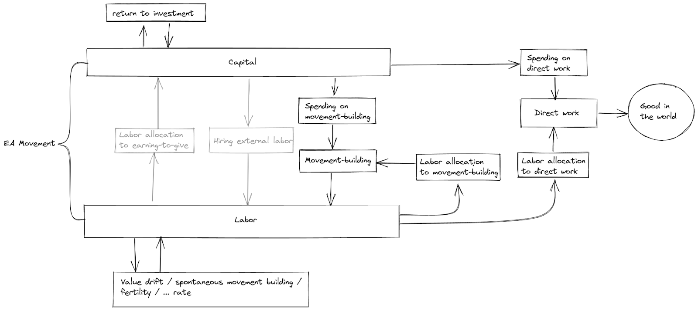

A Model of Patient Spending and Movement Building
==============

_This project began during Nuño's 2020 summer research fellowship at FHI. Phil was the project mentor._

## Motivation

The EA movement has tradeoffs to make about where to deploy its capital and labor. However, for now, these decisions seem like they are mostly made heuristically and intuitively.

To make those decisions more robust, we have set up a reasonably general [model](https://philiptrammell.com/static/Labor__Capital__and_Patience_in_the_Optimal_Growth_of_Social_Movements.pdf) to try to capture the most important dynamics. We hope that the model is informative enough to influence decisions directly, and that it motivates more gathering and systematization of empirical data about variables that the model finds crucial (rate of expropriation, the shape of returns to movement building, etc.).  We also hope that it inspires further modelling work.

## Setup

The model looks something like:

That is, the social movement has access to labor and capital.

In combination, they can be:

*   Allocated to paid movement-building efforts, which return more labor
*   Allocated to direct work, which returns goods in the world (malaria nets, etc.)

Alone, capital can be:

*   Transformed into more capital with time
*   Transformed into labor through hiring (only possible in one of the two models; this is why this step is greyed out  in the diagram)

Alone, labor can be:

*   Left alone to produce more labor, or decay, depending on the specifics of the model
*   Allocated to earning to give, which returns more capital (only possible in one of the two models; this is why this step is grayed out in the diagram)

Note that the diagram only lays out the possible flows of labor and capital, but many parameters and functions determine how exactly that flow looks in practice. The paper defines these in more detail, but some which turn out to be important are:

*   Utility is isoelastic in "direct work", meaning that as the quantity of "direct work" (e.g., malaria nets delivered) increases, the utility function is assumed to have constant curvature, in a certain sense. For instance, as the number of malaria nets delivered increases, they get sent to places where the need for them is less great: this would imply a curvature that is less than linear. In our model, this curvature is represented by _η_. _η_ = 1 defines a logarithmic utility function, _η_ > 1 defines a function which exhibits sharper diminishing returns than the logarithm, and _η_ < 1 defines a function that exhibits returns which diminish more slowly. (_η_ = 0 defines linear utility.)

Diminishing returns under some values for _η_ in a isoelastic utility function

*   Capital has a rate of return r
*   δ is the “discount rate” (more technically, the time preference), i.e. the rate of intrinsically caring less about the future (pure time preference) we have—if any—plus the annual rate at which we collectively face risks of expropriation, value drift, existential catastrophe, etc.
*   Labor, if left alone, depreciates (i.e., movement participants leave or die), at a rate _d_
*   Labor productivity grows at a rate _γ_, to reflect the growing labor productivity seen in the economy as a whole

Using these functions and parameters, we set up a system in terms of rather general functions for the production of direct work and recruitment. We then solve it to arrive at the optimal solution, either across all points in time (if we allow for both earning to give and hiring) or only asymptotically (if we don't.)

If you are familiar with what the terms "isoelastic" and "constant elasticity of substitution" mean, you might want to just [read the document](https://philiptrammell.com/static/Labor__Capital__and_Patience_in_the_Optimal_Growth_of_Social_Movements.pdf).

## Main results

If the social movement is "patient" (in that _δ_ < _r_ − _γη_), then under some reasonable assumptions about diminishing returns to movement building (see [this comment](https://forum.effectivealtruism.org/posts/FXPaccMDPaEZNyyre/a-model-of-patient-spending-and-movement-building?commentId=e2pPbGihSLGd2EwWB)), our model finds that total labor (i.e., total movement size) approaches a constant value. The fractions of labor that are allocated to direct work and movement building also approach a constant.

Spending on movement building and on direct work both grow exponentially, but at different rates (except under a knife-edge condition). Thus, eventually, close to all of the movement's spending will be directed to either movement building or direct work. This is because only one of the two can be the most efficient one at allowing capital to substitute for labor. That is, the movement eventually reaches either a Ponzi-esque state—where labor is much more scarce than capital and the best way to increase the absolute number of movement participants doing direct work is to use asymptotically all of its spending on movement-building—or a single-minded state where asymptotically all of its spending goes towards direct work.

We also make a tentative argument that the EA movement may not want to earn to give in the limit. The argument begins with the observation that, if both earning to give and hiring external labor are allowed, patient social movements generally want—in the long run—to hire external labor and have their participants do either direct work or movement building, but not earning to give. This suggests that, in the worlds where earning to give is feasible but hiring is not (at least for some tasks), patient movements will in the limit not want to engage in any earning to give.

## Applications to Effective Altruism and Future Work

Though the results of the model are fairly straightforward, there are complications to consider when trying to apply them to real-world EA movement strategy. For instance, we are modelling movement participants as homogeneous. In reality, even though the model concludes that earning to give doesn't make sense in general in the limit, it might make sense for participants whose capacity to earn is far greater than their capacity to engage in direct work or movement-building. Also, note that any conclusion about the undesirability of earning to give is only asymptotic: we do not dispute that earning to give can be worthwhile early in a patient movement's timeline, if it does not yet possess enough capital.

In short, we think this model supports the intuitive idea that as capital accumulates, earning to give should eventually be phased out, though as noted we are uncertain about whether EA has reached that point already. Ultimately, our results depend on empirical parameters (value drift rate, the production function for movement building, salary rates, etc.), about which we are also uncertain. But uncertainty about parameter values can be [reduced](https://forum.effectivealtruism.org/posts/eRQe4kkkH2pPzqvam/more-empirical-data-on-value-drift), and this should eventually allow our model to produce more concrete recommendations.

Another neglected complication is that our model doesn't address movement strategy when the movement can non-negligibly lower _δ_, e.g. by mitigating existential risks in the near term.  It also fails to model the impact of doing research that makes future direct work and/or movement-building more efficient. We believe that extending the model to account for these complexities would be a valuable subject for future work.

Despite these caveats, the model has produced at least one important update for us. As the stock of EA capital has grown more quickly than the stock of EA labor, it has been widely claimed that earning to give is less valuable, relative to direct work, than it used to be. On a March 2020 episode of the 80,000 Hours podcast, Phil had argued that this claim was mistaken, on the grounds that the EA "capital to labor ratio" should simply be expected to fluctuate over time, suggesting that we had no reason to expect a long-run trend in either direction. Earning to give is thus still highly valuable, he argued, in light of the opportunity to invest for a time in which EA projects are again more capital-constrained. The results of our model suggest to us that this particular argument for earning to give was incorrect. It is at least plausible that, relative to direct work, earning to give has indeed grown less valuable, and—temporary fluctuations notwithstanding—will continue to do so.