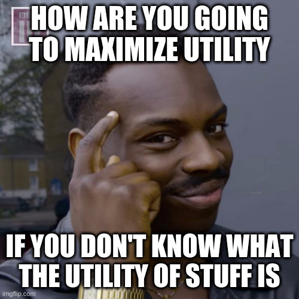
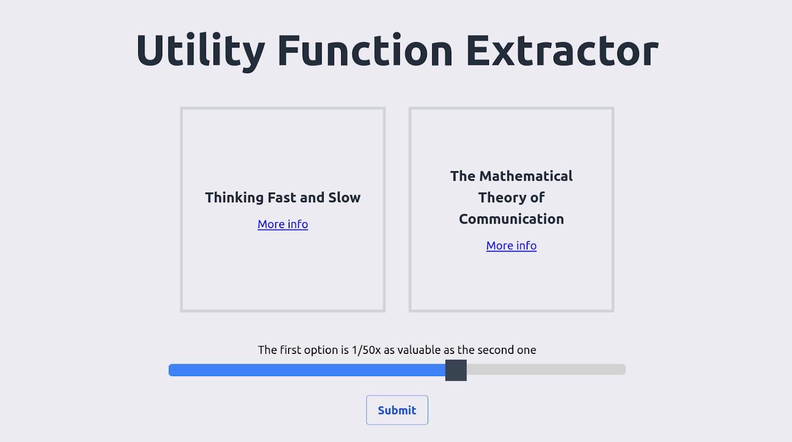
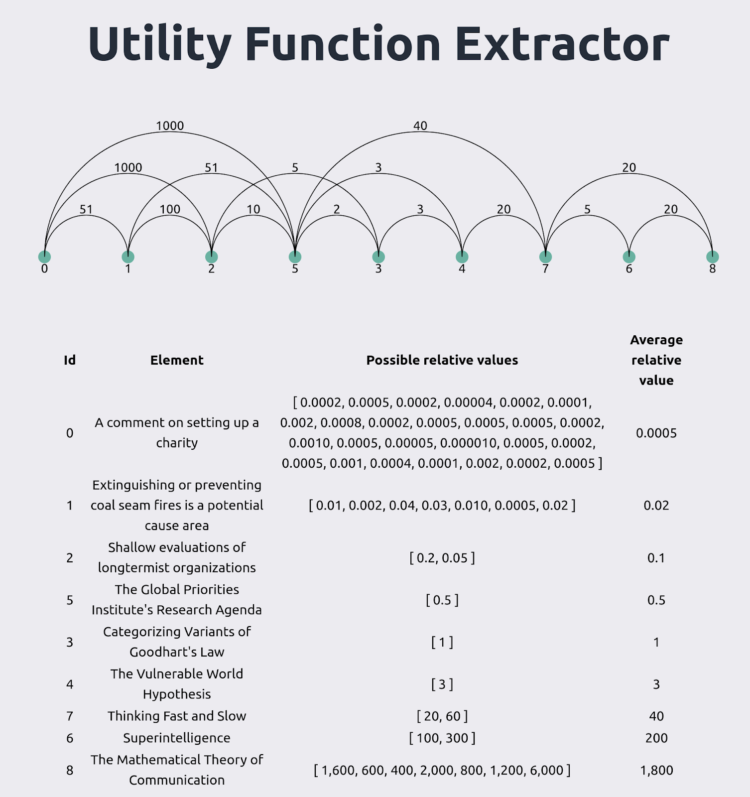
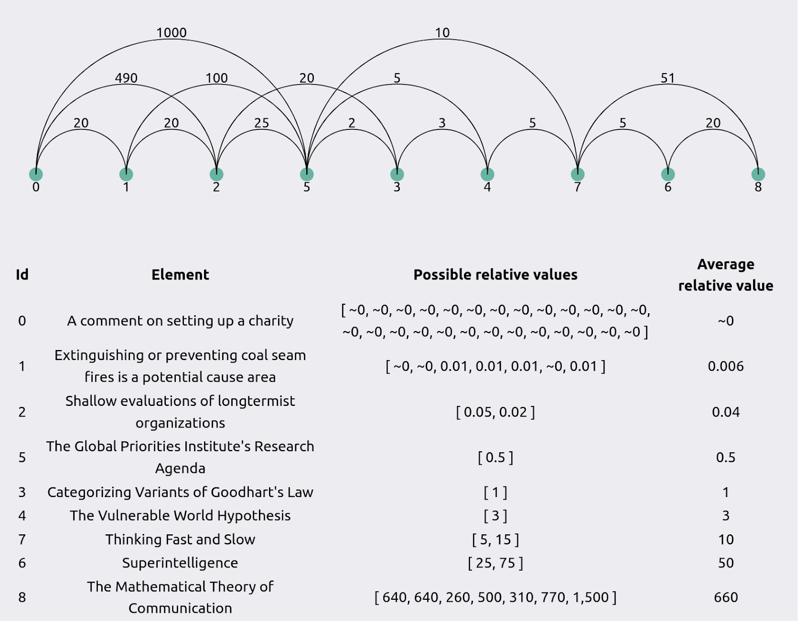
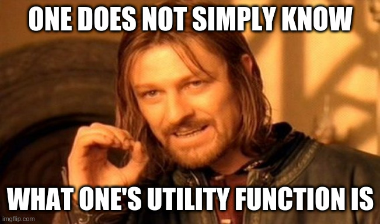

Simple comparison polling to create utility functions
==============

**tl;dr:**

*   The Utility Function Extractor is a small web application.
*   It guides individuals through a process of comparing different pairs of items, by asking them, _“How much more valuable is the first option compared to the second one?”_
*   This result is turned into a simple utility function that can be used to compare between all of the items in the set.
*   You can try the application [here](https://utility-function-extractor.quantifieduncertainty.org/research).
*   This technique can be used for comparing moral goods, research outputs, policy initiatives, and more.

**Introduction**

Say you have a list of items that you want to compare the value of. You just want to know how valuable every item is, in comparison to every other item. Perhaps these items are research documents, or the lives of people at different ages, or personal life improvements.

This meme exists because of Kat Woods' [Why boring writing is unethical.](https://forum.effectivealtruism.org/posts/dAbs7w4J4iNm89DjP/why-boring-writing-is-unethical-the-case-for-it-being-high)

You could try to come up with one standard unit (QALY, "adjusted research paper", "adjusted life improvement"), but this can be messy.

Instead, all you really need to do is to compare them in pairs. In each case, you say, roughly, "The first item is X% as valuable as the second". If you do this enough times \[1\], you can produce a simple utility function of all of the items. This would allow you to successfully be able to calculate the value of any two items in the set, even items you haven't directly compared. \[2\]

One problem with a naive approach is that your preferences might be inconsistent. After valuing A vs. B, B vs. C, and A vs. C, it might be the case that your numbers don't completely match each other. However, you could at least see these discrepancies, and make manual changes upon reflection. You might also _want_ to see the inconsistencies, rather than use some other method that smoothes them out from the beginning (like denominating all items in the same unit.)

I've developed a [simple web tool](https://utility-function-extractor.quantifieduncertainty.org/) to help people walk through the above steps. I've experimented with this on a few small lists of comparison items. This project is an early exploration of this idea. It would be great to later see much more sophisticated versions.

I originally built it while trying to be less confused about the value of research and about how to elicit information about it. But I recently realized that it also has a more immediate and less speculative application: the EA community could use it to elicit and aggregate [GiveWell's moral weights](https://docs.google.com/spreadsheets/d/11HsJLpq0Suf3SK_PmzzWpK1tr_BTd364j0l3xVvSCQw/edit#gid=1362437801) by allowing users to input their own comparisons.

By default, the site asks about GiveWell moral weights. If you instead want to compare research outputs, you can do so [here](https://utility-function-extractor.quantifieduncertainty.org/research). If you'd instead like to compare your own set of elements, you can do so under "Advanced Options", or you can reach out, and I'm happy to create a page specifically for a given project. Note that I'm saving the user's inputs because I think it might be interesting to aggregate them later.

## Potential use cases

*   Extract comparisons between different moral goods to use as an input to the giant GiveWell spreadsheet.
*   Poll associates about the value of projects one is considering doing.
*   Construct a utility function over different types of research outputs.
*   Construct a utility function over different types of policy initiatives.
*   Compare the moral weight of different types of sentient beings.
*   Allocate a prize fund proportionally to the value of entries.
*   ...

## Example

As an example, let's show the app working on comparing various [research documents](https://utility-function-extractor.quantifieduncertainty.org/research). Right now, we assume that all research is net-positive, and we assume that users feel comfortable estimating how valuable each document is versus each other document.

We're not trying to have a precise definition of "value". Instead, the app leaves this up to the user.

The user is at the start presented with the following screen:

The user then selects, say, that _The Mathematical Theory of Communication_ is worth ~50x as much as _Thinking Fast and Slow_—meaning that the user would be indifferent between ~50 books as valuable as _Thinking Fast and Slow_ or one paper as fundamental as _The Mathematical Theory of Communication_ \[3\]_._

After entering several such comparisons, the user arrives at a result like the following:

This produces a scale where _Categorizing Variants of Goodhart's Law_ is worth 1 unit. The lines between two nodes indicate how more valuable the node to the right is than the node to the left. For instance, in this graph node 1 (“Extinguishing...”) is ~50x as valuable \[3\] as node 0 (“A comment...”), and node 2 (“Shallow evaluations...”) is 100x times as valuable as node 1.  But node 2 is ~1000x as valuable as node 0, which is not ~50\*100x = ~5000x. So the comparisons are inconsistent by a factor of 5x.

In contrast, here is a screenshot taken from a previous version of this program:

At the time, I was being lazy and hadn’t gotten around to programming sensible rounding, so the value of the first element shows up as ~0. Notice that the comparisons are fairly different than in the previous image, even though the items are the same. To me, this suggests that this kind of method of elicitation could or should be repeated at different points in time—even by the same user—to find out how noisy user’s estimates are. Notice also that the comparisons between items are more consistent than in the first screenshot. 

## FAQ

### Why ask for binary comparisons rather than references to a set point?

Binary comparisons make inconsistencies apparent, and allow them to be aggregated. For example, one might think that:

*   A is 2x as valuable as B
*   A is 100x as valuable as C
*   B is 10x as valuable as C

This is inconsistent. But we can still be pretty sure that A > B > C. We can aggregate the different estimates to come to a final guess of how valuable A is in comparison to C—20x to 100x as valuable.

If we had only asked about comparisons to a set-point, we might get different answers depending on which set-point we used, and the uncertainty and inconsistencies would be hidden from sight.

That said, comparison against a set point is operationally much simpler, and there is also something to be said for reducing noise from the beginning.

In addition, if the app asked about the distribution of the ratio of the impacts—rather than about the ratio of the expected impacts—the app could then pick up that some elements are correlated or easier to compare than others.

### Why not uncertain comparisons?

Uncertain comparisons, e.g., being able to enter an estimate like "0.1 to 10x" would be good and/or interesting, but would make programming more difficult. If/when [Squiggle](https://github.com/foretold-app/squiggle) becomes more developed, I imagine this would be much easier. I could also just use the [foretold/cdf](https://www.npmjs.com/package/@foretold/cdf) library, but I'm hesitant to get too much into the weeds without a specific need.

### How could one aggregate estimates from different people?

The website outputs a utility function, where a reference point element is given a value of “1” (for instance, GiveWell uses “doublings of consumption”) as its reference unit. The naïve way to aggregate different estimates might be to just average the ratios with respect to the reference units. For instance, if A, B and C think that a life saved from some disease in some specific conditions is respectively L, M, N times as valuable as a doubling of consumption, one could take (L+N+M)/3 as the aggregate estimate.

However, this could get pretty messy, and might be very sensitive about what the reference point is. I imagine that one might do something more principled and sophisticated if one had access to distributions, or even without that one might still detect clusters within which values are similar.

### How does the underlying algorithm work?

I'm using [Merge sort](https://en.wikipedia.org/wiki/Merge_sort) to select the ranking. This means that directionally inconsistent comparisons are dealt with elegantly (loops of the form A > B, B > C, C > A don't happen). Worst-case performance for n inputs is given by the [sorting sequence](https://oeis.org/A001855), which grows as n\*log(n). To create the graph at the end, I'm choosing a value as a reference point, and I generate paths of increasing length from that value to values further and further away.

## What are some possible directions for future work?

Some directions for future work might be

1.  Make the user experience nicer
    1.  Think about how to elicit inputs that can range many orders of magnitude
    2.  A slider seems nicer to use than a text box, but its bounds might anchor users
2.  Make comparisons in terms of distributions, not of expected values
3.  Apply this method to specific elicitations, like:
    1.  Elicitations of GiveWell’s moral weights
    2.  Elicitations of the moral weights given to different animals
    3.  Elicitations of the value of different projects which one is considering
    4.  Elicitations of the value of the research produced by different AI alignment organizations. In particular, I’m curious to apply this method to [Larks](https://forum.effectivealtruism.org/users/larks)’ yearly AI Alignment Literature Review and Charity Comparison. By dividing by the number of FTEs, or the amount of funding, one can then get an estimate of the research productivity of different organizations.
    5.  Etc.
4.  Use the results of elicitations to construct a reference scale for how valuable comments are with respect to posts, posts are with respect to academic papers, and various forms or research outputs with respect to each other.

Note that the code for this website is [open source](https://github.com/QURIresearch/utility-function-extractor), and pull requests are very welcome.

## Conclusion

Although some organizations—like the [Global Priorities Institute](https://globalprioritiesinstitute.org/)—are working on the fundamentals of ethical theory, there doesn’t seem to be much practical tooling around estimating utility in practice. 

Tooling around estimating utility is important to EAs because doing the most good one can do seems like it would require good estimates of how much good different options produce. This is particularly  important for longtermism in particular, because longtermism is beset with uncertainty about how valuable different options are. Better ways of estimating the value of longtermist options might help with evaluation, prioritization, clarity, etc.

The Utility Function Extractoris relatively rough, but I hope it can help other people become less confused about the shape of their utility functions, and ideally aid in EA and longtermism’s evaluation efforts.

  
_Thanks to Ozzie Gooen and Kelsey Rodríguez for comments and editing suggestions_

## Footnotes

\[1\]: And in particular, O(n\*log(n)) times, not O(n^2) times. See the “How does the underlying algorithm work” section.

\[2\]: More technically: By the [Von Neumann–Morgenstern utility theorem](https://en.wikipedia.org/wiki/Von_Neumann%E2%80%93Morgenstern_utility_theorem), one can build, extract or deduce a utility function merely by considering many binary comparisons. But if we want to evaluate or rank something fuzzy or uncertain—like longtermist research or the value of different development interventions—this isn't of much practical help. On the one hand, this might be because quantifying and reasoning about what we care about is difficult. But on the other hand, practical tooling is just missing.

\[3\]: Why 51? Well, I'm using a log scale, but this means that inputs don't clearly map to round decimal numbers. This could be improved.