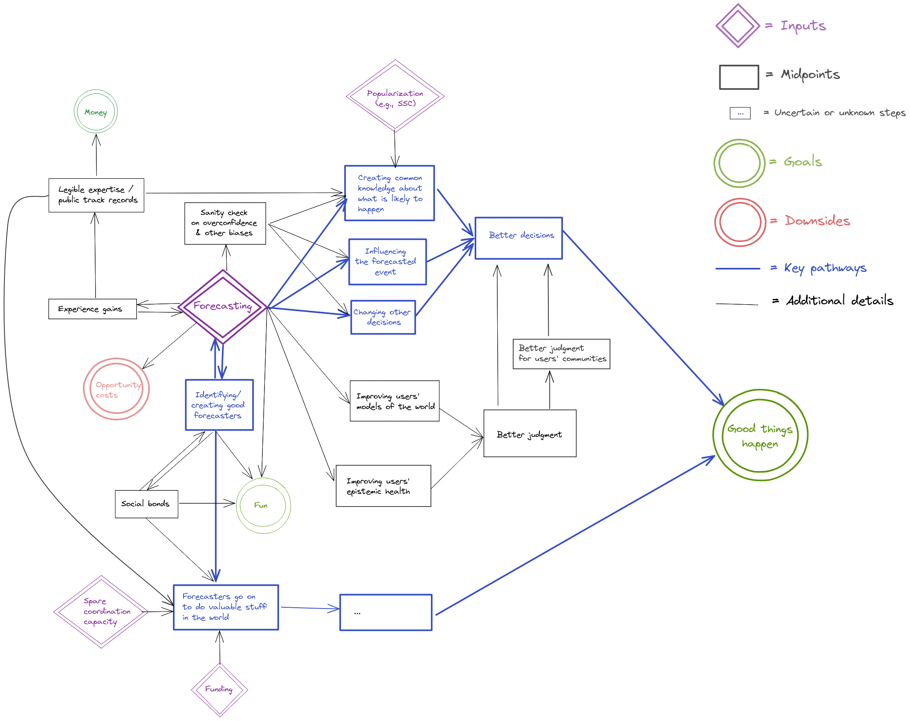
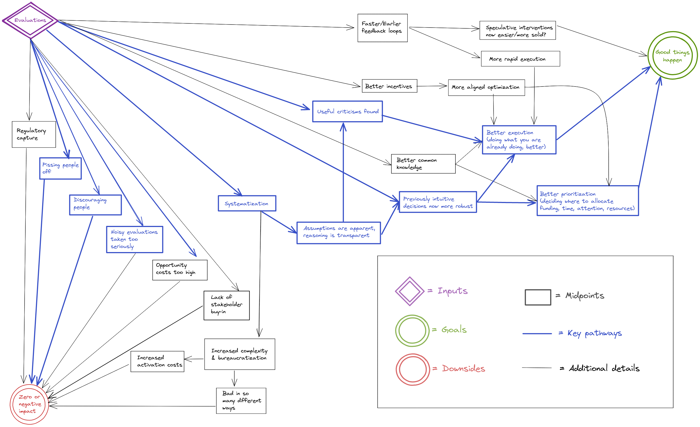

Pathways to impact for forecasting and evaluation
==============

_Epistemic status_: Represents my views after thinking about this for a few days.

## Motivation

As part of the [Quantified Uncertainty Research Institute](https://quantifieduncertainty.org/)'s (QURI) strategy efforts, I thought it would be a good idea to write down what I think the pathways to impact are for forecasting and evaluations. Comments are welcome, and may change what QURI focuses on in the upcoming year. 

## Pathways

### Forecasting

What this diagram is saying is that I think that the most important pathways to impact of forecasting are:

*   through influencing decisions,
*   through identifying good forecasters and allowing them to go on to do valuable stuff in the world.

There are also what I think are secondary pathways to impact, where legible forecasting expertise could make the judgment of whole communities better, or where individual forecasters could improve the judgment of whole communities.

### Evaluations

What this diagram is saying is that evaluations end up affecting the world positively through finding criticisms or things to improve, and by systematizing thinking previously done intuitively. This ends up cashing out in terms of better execution of something people were going to be doing anyways, or in better prioritization as people learn to discriminate better between the options available to them.

Note that although one might hope for the pathway “evaluation → criticism → better execution → impact”, in practice this might not materialize. So in practice, better prioritization (i.e., influencing the funding and labor which go into a project) might be the more impactful pathway to impact in practice. 

But there are also ways in which evaluations can have zero or negative impact. The one that worries me the most at the moment is people taking noisy evaluations too seriously, i.e., outsourcing too much of their thinking to imperfect evaluators. Lack of stakeholder buy-in doesn't seem like that much of a problem for the EA community: Reception for some of my evaluations posts was fairly warm, and funders seem keen to pay for evaluations.

## Reflections

Most of the benefit of these kinds of diagrams seems to me to come from the increased clarity they allow for when thinking about their content. Otherwise, I imagine that they might make QURI's and my own work more legible to outsiders by making our assumptions or steps more explicit, which itself might allow for people to point out criticism. Note that my guess about the main pathways are highlighted in bold, so one could disagree about that without disagreeing about the rest of the diagram.

I also imagine that the forecasting and evaluations pathways could be useful to organizations other than QURI (Metaculus, other forecasting platforms, people thinking of commissioning evaluations, etc.) 

It seems to me that producing these kinds of diagrams is easier over an extended period of time, rather than in one sitting because one can then come back to aspects that seem missing.

## Acknowledgments. 

Kudos to LessWrong's [The Best Software For Every Need](https://www.lesswrong.com/posts/zHS4FJhByRjqsuH4o/the-best-software-for-every-need?commentId=zvfBBtLCvmTXtjgrj) for pointing out the software I used to write these diagrams. They are produced using [excalidraw](https://excalidraw.com/); files one can edit can be found on [this Github repository](https://github.com/QURIresearch/pathways-to-impact). Thanks also to Misha Yagudin, Eli Lifland, Ozzie Gooen, and the Twitter hivemind for comments and suggestions.
