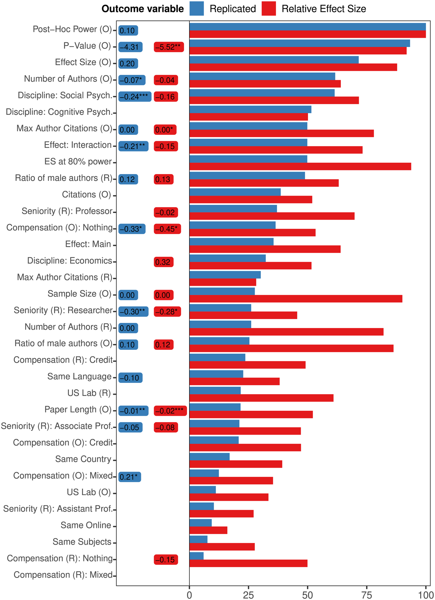
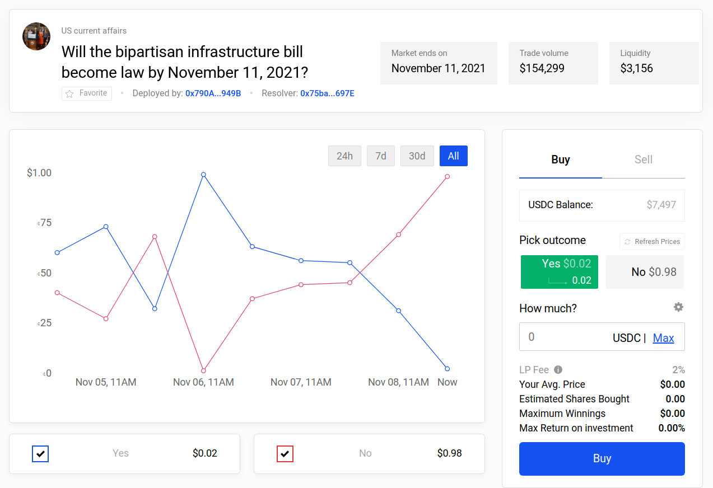
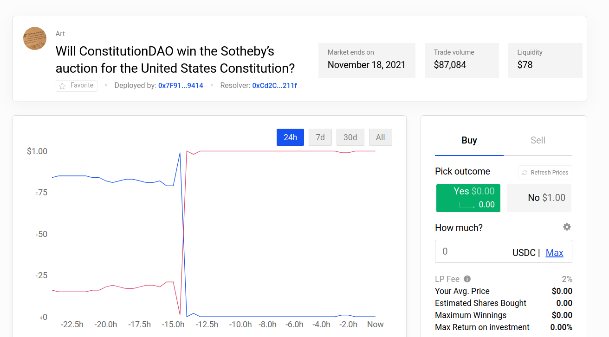
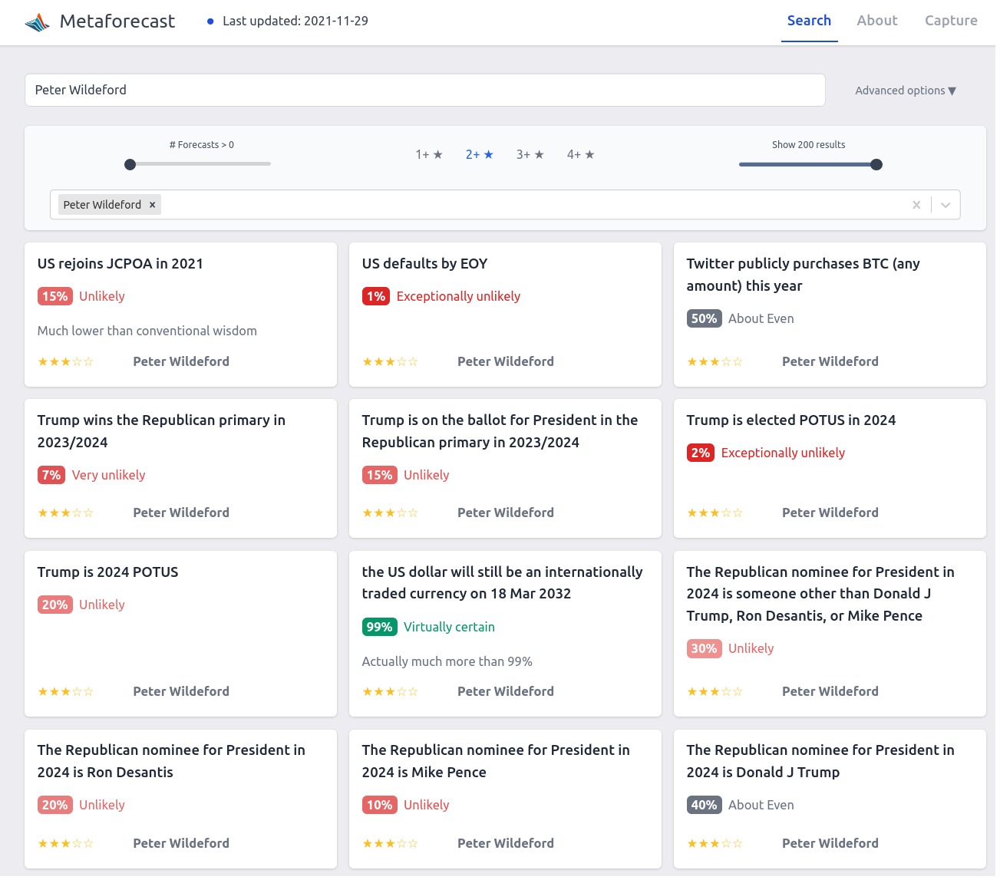

Forecasting Newsletter: November 2021
==============

## Highlights

*   Polymarket sees [record-high swings](https://twitter.com/Domahhhh/status/1461503351669989386)
*   Replication Markets [pays out $142k in forecaster rewards](https://www.replicationmarkets.com/index.php/2021/11/16/resolutions-for-replication-markets/)
*   The Economist features a [full page](https://www.economist.com/the-world-ahead/2021/11/10/the-experts-best-bets) with Good Judgment Open's forecasts

## Index

*   Prediction Markets & Forecasting Platforms
*   In The News
*   Blog Posts
*   Long Content

Sign up [here](https://forecasting.substack.com) ([a](https://web.archive.org/web/20211201185250/https://forecasting.substack.com/)) or browse past newsletters [here](https://forum.effectivealtruism.org/s/HXtZvHqsKwtAYP6Y7) ([a](https://web.archive.org/web/20211201185318/https://forum.effectivealtruism.org/s/HXtZvHqsKwtAYP6Y7)).

## Prediction Markets & Forecasting Platforms

### Replication Markets

Replication Markets ([a](https://web.archive.org/web/20211030141307/https://www.replicationmarkets.com/)) was a project to research how well prediction markets could predict whether papers would replicate. They are [paying out](https://www.replicationmarkets.com/index.php/2021/11/16/resolutions-for-replication-markets/) ([a](https://web.archive.org/web/20211202211156/https://www.replicationmarkets.com/index.php/2021/11/16/resolutions-for-replication-markets/)) $142k in cash rewards for the prediction markets part of the experiment. This corresponds to 121 resolved questions, which includes 12 meta-questions and 30 about covid papers.

The leaderboard for users is [here](https://www.replicationmarkets.com/index.php/2021/11/16/resolutions-for-replication-markets/) ([a](https://web.archive.org/web/20211117001100/https://www.replicationmarkets.com/index.php/2021/11/16/resolutions-for-replication-markets/)). I won a mere $809, and I don't remember participating all that much. In particular, I was excited at the beginning but lost interest because a user—or a bot—named "unipedal" seemed like it was taking all the good opportunities.

Now, a long writeup by "unipedal" himself can be read at [How I Made $10k Predicting Which Studies Will Replicate](https://fantasticanachronism.com/2021/11/18/how-i-made-10k-predicting-which-papers-will-replicate/) ([a](https://web.archive.org/web/20211201185551/https://fantasticanachronism.com/2021/11/18/how-i-made-10k-predicting-which-papers-will-replicate/)). The author started out with a simple quantitative model based on [Altmejd et al. (2019)](https://fantasticanachronism.com/2021/11/18/how-i-made-10k-predicting-which-papers-will-replicate/) ([a](https://web.archive.org/web/20211201185551/https://fantasticanachronism.com/2021/11/18/how-i-made-10k-predicting-which-papers-will-replicate/))

Predicting the replicability of social science lab experiments, [Altmejd et al](https://journals.plos.org/plosone/article?id=10.1371/journal.pone.0225826)., 2019.

But in later rounds, he dropped the quantitative model, and started "playing the market". That is, he found out that trying to predict how the market will move is more profitable than giving one's own best guess. Unipedal then later automated his trades when the market API was opened to users.

In contrast, I participated in a few rounds and put in 10x less effort while earning much more than 1/10th of the rewards. As unipedal points out, this is backwards:

> ...I think one of the most important aspects of "ideal" prediction markets is that informed traders can compound their winnings, while uninformed traders go broke. The market mechanism works well because the feedback loop weeds out those who are consistently wrong. This element was completely missing in the RM \[Replication Markets\] project.

The same author previously wrote: [What's Wrong with Social Science and How to Fix It: Reflections After Reading 2578 Papers](https://fantasticanachronism.com/2020/09/11/whats-wrong-with-social-science-and-how-to-fix-it/) ([a](https://web.archive.org/web/20211201185636/https://fantasticanachronism.com/2020/09/11/whats-wrong-with-social-science-and-how-to-fix-it/)), which is also based on his experiences with the Replication Markets competition.

Besides Replication Markets, DARPA has also founded another group to predict replications through their [SCORE](https://www.darpa.mil/program/systematizing-confidence-in-open-research-and-evidence) ([a](https://web.archive.org/web/20211201185705/https://www.darpa.mil/program/systematizing-confidence-in-open-research-and-evidence)) program. Based on preliminary results, this [second group](https://replicats.research.unimelb.edu.au/) ([a](https://web.archive.org/web/20210708092020/https://replicats.research.unimelb.edu.au/)) seems like they beat Replication Markets by using a more [Delphi-like](https://wikiless.org/wiki/Delphi_method?lang=en) ([a](https://web.archive.org/web/20211201185928/https://wikiless.org/wiki/Delphi_method?lang=en)) methodology to elicit predictions.

### Metaculus

It has been an active month for Metaculus.

For starters, they [rehauled](https://www.metaculus.com/questions/8506/new-metaculus-tournament-scoring-system-pt-1/) ([a](https://web.archive.org/web/20211201190001/https://www.metaculus.com/questions/8506/new-metaculus-tournament-scoring-system-pt-1/)) their scoring system for tournaments. Then, Metaculus' [Journal](https://www.metaculus.com/project/journal/) ([a](https://web.archive.org/web/20211201190024/https://www.metaculus.com/project/journal/)) started to give fruit: The article on forecasts of [Human-Level Language Models](https://www.metaculus.com/notebooks/8329/human-level-language-models/) ([a](https://web.archive.org/web/20211120104742/https://www.metaculus.com/notebooks/8329/human-level-language-models/)) (also on LessWrong [here](https://www.lesswrong.com/posts/tepqESMuRmyhtmDS7/forecasting-progress-in-language-models) ([a](https://web.archive.org/web/20211201190120/https://www.lesswrong.com/posts/tepqESMuRmyhtmDS7/forecasting-progress-in-language-models))) was of fairly high quality.

Metaculus also started to keep track of the accuracy of a small number of [Public Figures](https://www.metaculus.com/questions/8198/updated-public-figure-predictions/) ([a](https://web.archive.org/web/20211201190148/https://www.metaculus.com/questions/8198/updated-public-figure-predictions/)). Because Metaculus has so many questions, every time one of these figures makes a public prediction, it is likely enough that Metaculus also has a prediction on the same issue. Over time, this will allow Metaculus to see who is generally more accurate. This is a more adversarial version of Tetlock's original [Alpha Pundit](https://www.openphilanthropy.org/files/Grants/Tetlock/Revolutionizing_the_interviewing_of_alpha-pundits_nov_10_2015.pdf) ([a](https://web.archive.org/web/20211107070508/https://www.openphilanthropy.org/files/Grants/Tetlock/Revolutionizing_the_interviewing_of_alpha-pundits_nov_10_2015.pdf)) idea: instead of having experts willingly participate, Metaculus is just passively keeping track of how bad they are. Kudos!

Two comments worth highlighting from [SimonM](https://twitter.com/SmoLurks/)'s ([a](https://web.archive.org/web/20211101190138/https://twitter.com/SmoLurks/)) list of [top comments from Metaculus this past November](https://metaculusextras.com/top_comments?start_date=2021-08-01https://metaculusextras.com/top_comments?start_date=2021-08-01&end_date=2021-09-01)) ([a](https://web.archive.org/web/20211120051645/https://metaculusextras.com/top_comments?start_date=2021-08-01https://metaculusextras.com/top_comments?start_date=2021-08-01&end_date=2021-09-01)) are:

*   [juancambeiro](https://www.metaculus.com/questions/7211/us-conclude-covid-lab-leak-by-june-2022/#comment-73545) ([a](https://web.archive.org/web/20210531194019/https://www.metaculus.com/questions/7211/us-conclude-covid-lab-leak-by-june-2022/#comment-73545)) re-opens a previously closed question on whether or not a member of the IC community thinks COVID was a lab leak.
*   [ege\_erdil](https://www.metaculus.com/questions/8100/us-murder-rate-in-2030/#comment-73465) ([a](https://web.archive.org/web/20211202194728/https://www.metaculus.com/questions/8100/us-murder-rate-in-2030/#comment-73465)) thinks we should be extremely uncertain about crime. "Overall I think everyone in this thread is way too confident that they know what's going on with crime rates at some frequency scale. My opinion is that let alone understanding the long-term mechanisms which drive changes in crime rates, we don't even have a very good understanding of crime rates from the past. If Louis XIV's reign in France cut murder rates in half, we would never know it from the evidence available to us today."

In addition, Metaculus and its community worked at full speed to put up questions and produce forecasts on the [Omicron](https://www.metaculus.com/questions/8753/date-omicron-has-50-prevalence-in-us/) ([a](https://web.archive.org/web/20211201191253/https://www.metaculus.com/questions/8753/date-omicron-has-50-prevalence-in-us/)) [variant](https://www.metaculus.com/questions/8757/omicron-variant-deadlier-than-delta/) ([a](https://web.archive.org/web/20211130211219/https://www.metaculus.com/questions/8757/omicron-variant-deadlier-than-delta/)). Metaculus also added more questions to the [Keep Virginia Safe Tournament](https://www.metaculus.com/tournament/vdh/?order_by=-publish_timehttps://www.metaculus.com/tournament/vdh/?order_by=-publish_time&project=940&status=open)) ([a](https://web.archive.org/web/20211125130100/https://www.metaculus.com/tournament/vdh/?order_by=-publish_timehttps://www.metaculus.com/tournament/vdh/?order_by=-publish_time&project=940&status=open)), and increased the price pool somewhat to $2,500.

### Polymarket

Polymarket saw some extremely large swings, where [1:250](https://twitter.com/Domahhhh/status/1458182373674086405) ([a](https://web.archive.org/web/20211202195106/https://twitter.com/Domahhhh/status/1458182373674086405)) and [1:700](https://twitter.com/Domahhhh/status/1461503351669989386) ([a](https://web.archive.org/web/20211202195301/https://twitter.com/Domahhhh/status/1461503351669989386)) underdogs ended up winning. h/t [@Domahhhh](https://twitter.com/Domahhhh) ([a](https://web.archive.org/web/20211202201400/https://twitter.com/Domahhhh))

Zvi positively covers some Polymarket markets on Covid [here](https://www.lesswrong.com/posts/M9ngsjEMGjaYs84W8/covid-prediction-markets-at-polymarket) ([a](https://web.archive.org/web/20211202214649/https://www.lesswrong.com/posts/M9ngsjEMGjaYs84W8/covid-prediction-markets-at-polymarket)).

Polymarket also added support for [Metamask](https://docs.polymarket.com/getting-started/connecting/metamask) ([a](https://web.archive.org/web/20211202131933/https://docs.polymarket.com/getting-started/connecting/metamask)), one of the most popular crypto-wallets, making Polymarket ever more mainstream. They also had a bit of a brouhaha on a market on the number of [exoplanets](https://polymarket.com/market/will-nasa-have-confirmed-more-than-4580-existing-exoplanets-by-november-27) ([a](https://web.archive.org/web/20211122101641/https://polymarket.com/market/will-nasa-have-confirmed-more-than-4580-existing-exoplanets-by-november-27)) discovered, where the resolution source pointed to two different numbers.

### Odds and ends

Augur—a set of pioneering prediction market contracts on Ethereum and the community around it—is creating a [decentralized autonomous organization](https://wikiless.org/wiki/Decentralized_autonomous_organization?lang=en) ([a](https://web.archive.org/web/20211202133121/https://wikiless.org/wiki/Decentralized_autonomous_organization?lang=en)), [AugurDAO](https://augur.net/blog/augurdao/) ([a](https://web.archive.org/web/20211119030758/https://augur.net/blog/augurdao/)). I get the impression that the original developers have gotten tired of supporting Augur, whose current focus on sports markets merely makes it a very slow sportsbook.

But the move is also consistent with Augur's initial ethos of being decentralized. For example, the [Forecast Foundation](https://forecastfoundation.org/) ([a](https://web.archive.org/web/20211202133147/https://forecastfoundation.org/)) which supports Augur's development, seems to live under [Estonian jurisdiction](https://forecastfoundation.org/cookie-policy) ([a](https://web.archive.org/web/20211202132348/https://forecastfoundation.org/cookie-policy)), whereas a DAO arguably lives under no jurisdiction.

The Foresight Institute is hosting a ["Vision Weekend"](https://foresight.org/vision-weekend-2021/) ([a](https://web.archive.org/web/20211202200228/https://foresight.org/vision-weekend-2021/)) in the US and France. Although I remembered the Foresight Institute as [something that Eric Drexler founded before he went on to do other things](https://en.wikipedia.org/wiki/Foresight_Institute#History) ([a](https://web.archive.org/web/20211202200256/https://en.wikipedia.org/wiki/Foresight_Institute#History)), I did find some familiar names in the [list of presenters](https://www.eventbrite.com/e/vision-weekend-us-2021-tickets-169305889473) ([a](https://web.archive.org/web/20211202200325/https://www.eventbrite.com/e/vision-weekend-us-2021-tickets-169305889473)), and browsing the details the event is probably going to be of higher quality than I would have thought.

The Anticipation Hub is hosting a "[Global Dialogue Platform on Anticipatory Humanitarian Action](https://events.anticipation-hub.org/global-dialogue-platform-2021/) ([a](https://web.archive.org/web/20211202200108/https://events.anticipation-hub.org/global-dialogue-platform-2021/))", hosted online from the 7th to the 9th of December. Although it seems more focused on global health and development topics, it might be of interest to NGOs around the forecasting space more generally.

[The Global Priorities Institute](https://globalprioritiesinstitute.org/) ([a](https://web.archive.org/web/20211202132041/https://globalprioritiesinstitute.org/)) is dipping its toes into forecasting. As one might expect, so far there is a lot of academically-flavored discussions, but very little actual forecasting.

Hedgehog Markets had an [NFT-minting event](https://hedgehog-markets.medium.com/hedgie-hogs-make-predictions-with-nfts-faa26c773caf) ([a](https://web.archive.org/web/20211202210020/https://hedgehog-markets.medium.com/hedgie-hogs-make-predictions-with-nfts-faa26c773caf)), where users could buy NFTs which they will be able to use to participate in competitions closed-off to non-NFT holders. I don’t see the appeal, but others did and spent around $500k on these tokens (5000 NFTs at [0.5 SOL](https://www.coinbase.com/price/solana) ([a](https://web.archive.org/web/20211202210732/https://www.coinbase.com/price/solana)) per token).

A former US [Commodity Futures Trading Commission](https://en.wikipedia.org/wiki/Commodity_Futures_Trading_Commission) commissioner [joined Kalshi’s board](https://kalshi.com/blog/former-cftc-commissioner-brian-quintenz-joins-our-board) (a).

Hypermind started a [new contest](https://prod.hypermind.com/ngdp/en/welcomeHA.html) ([a](https://web.archive.org/web/20211128100119/https://prod.hypermind.com/ngdp/en/welcomeHA.html)) on the "future of Africa", with $6000 in prize money.

There is a [fairly neat calibration app](https://calibration-practice.neocities.org/) ([a](https://web.archive.org/web/20211202130621/https://calibration-practice.neocities.org/)) based on the exercises from The Scout Mindset.

I've added [Peter Wildeford's pubicly available predictions](https://docs.google.com/spreadsheets/d/1xcgYF7Q0D95TPHLLSgwhWBHFrWZUGJn7yTyAhDR4vi0/edit#gid=0&range=A238) to [Metaforecast](https://metaforecast.org/?query=Peter%20Wildeford&numDisplay=200&forecastingPlatforms=Peter%20Wildeford):

On the negative side, Metaforecast is experiencing some difficulties with updating with new forecasts, which I hope to get fixed in the coming week.

## In the News

The Economist featured a [full page with forecasts from Good Judgment Open](https://www.economist.com/the-world-ahead/2021/11/10/the-experts-best-bets) ([a](https://web.archive.org/web/20211130212826/https://www.economist.com/the-world-ahead/2021/11/10/the-experts-best-bets)) on their "The World in 2022" edition.

Reuters reports that [Climate change extremes spur U.N. plan to fund weather forecasting](https://www.reuters.com/business/cop/climate-change-extremes-spur-un-plan-fund-weather-forecasting-2021-11-03/) ([a](https://web.archive.org/web/20211202200426/https://www.reuters.com/business/cop/climate-change-extremes-spur-un-plan-fund-weather-forecasting-2021-11-03/)). My impression is that climate change fears are being used to fund much-needed bog-standard weather forecasting. I have mixed feelings about this.

An Excel competitor with some forecasting functionality, [Pigment](https://www.gopigment.com/) ([a](https://web.archive.org/web/20211202200500/https://www.gopigment.com/)), raises [$73M](https://techcrunch.com/2021/11/14/pigment-series-b-business-planning) ([a](https://web.archive.org/web/20211202201730/https://techcrunch.com/2021/11/14/pigment-series-b-business-planning/)).

## Blog Posts

Joe Carlsmith writes down his thoughts on [Solomonoff induction](https://forum.effectivealtruism.org/posts/JHWkvydmdaGzpA3dv/on-the-universal-distribution) ([a](https://web.archive.org/web/20211202204129/https://forum.effectivealtruism.org/posts/JHWkvydmdaGzpA3dv/on-the-universal-distribution)) (see a decent introduction of the concept [here](https://www.lesswrong.com/posts/EL4HNa92Z95FKL9R2/a-semitechnical-introductory-dialogue-on-solomonoff-1#iv___Simplicity) ([a](https://web.archive.org/web/20211202130749/https://www.lesswrong.com/posts/EL4HNa92Z95FKL9R2/a-semitechnical-introductory-dialogue-on-solomonoff-1#iv___Simplicity))). Although I was already familiar with the concept, I still feel like I learnt a bunch:

*   the [speed prior](https://people.idsia.ch/~juergen/speedprior.html) ([a](https://web.archive.org/web/20211202120624/https://people.idsia.ch/~juergen/speedprior.html)) is a nice hack to get around the fact that some programs can run forever, and you can't say which ones they are per the Halting problem.
*   There is some unavoidable sense in which one has to assign smaller probabilities to longer programs.
*   Solomonoff Induction requires that uncomputable processes like Solomonoff Induction be impossible. If the universe could include uncomputable processes, it could include a copy of your Solomonoff Induction process. In that case, the universe could function as a Solomonoff "anti-Inductor". That is, the universe could perfectly simulate what your Solomonoff Inductor will predict next and then feed you the opposite.

Tanner Greer of The Scholar's Stage has a new piece on [Sino-American Competition and the Search For Historical Analogies](https://scholars-stage.org/sino-american-competition-and-the-search-for-historical-analogies/) ([a](https://web.archive.org/web/20211123173728/https://scholars-stage.org/sino-american-competition-and-the-search-for-historical-analogies/)). His main point is that the tensions around Taiwan break the analogy between the current relationship between the US and China and the relationship between the US and the USSR during the Cold War.

Jaime Sevilla posts [A Bayesian Aggregation Paradox](https://www.lesswrong.com/posts/R28ppqby8zftndDAM/a-bayesian-aggregation-paradox?commentId=bmsJJfaY4C399fHYt) ([a](https://web.archive.org/web/20211202120721/https://www.lesswrong.com/posts/R28ppqby8zftndDAM/a-bayesian-aggregation-paradox?commentId=bmsJJfaY4C399fHYt)): There is no objective way of summarizing a Bayesian update over an event with three outcomes A:B:C as an update over two outcomes A:¬A. From the comments:

> Imagine you have a coin that's either fair, all-heads, or all-tails. If your prior is "fair or all-heads with probability 1/2 each", then seeing heads is evidence against "fair". But if your prior is "fair or all-tails with probability 1/2 each", then seeing heads is evidence for "fair". Even though "fair" started as 1/2 in both cases. So the moral of the story is that there's no such thing as evidence for or against a hypothesis, only evidence that favors one hypothesis over another.

## Long Content

[Are "superforecasters" a real phenomenon?](https://www.lesswrong.com/posts/uoyn67q3HtB2ns2Yg/are-superforecasters-a-real-phenomenon?commentId=ReNyzCBpKEwoDGYho) ([a](https://web.archive.org/web/20211202120754/https://www.lesswrong.com/posts/uoyn67q3HtB2ns2Yg/are-superforecasters-a-real-phenomenon?commentId=ReNyzCBpKEwoDGYho)). David Manheim, a superforecaster, answers:

> So in short, I'm unconvinced that superforecasters are a "real" thing, except in the sense that most people don't try, and people who do will do better, and improve over time. Given that, however, we absolutely should rely on superforecasters to make better predictions that the rest of people - as long as they continue doing the things that make them good forecasters.

---

Note to the future: All links are added automatically to the Internet Archive, using this [tool](https://github.com/NunoSempere/longNowForMd) ([a](https://web.archive.org/web/20211202120820/https://github.com/NunoSempere/longNowForMd)). "(a)" for archived links was inspired by [Milan Griffes](https://www.flightfromperfection.com/) ([a](https://web.archive.org/web/20211101205027/https://www.flightfromperfection.com/)), [Andrew Zuckerman](https://www.andzuck.com/) ([a](https://web.archive.org/web/20211127045748/https://www.andzuck.com/)), and [Alexey Guzey](https://guzey.com/) ([a](https://web.archive.org/web/20211127045753/https://guzey.com/)).

---

> It is curious to reflect that out of all the "experts" of all the schools, there was not a single one who was able to foresee so likely an event as the Russo-German Pact of 1939. And when news of the Pact broke, the most wildly divergent explanations were of it were given, and predictions were made which were falsified almost immediately, being based in nearly every case not on a study of probabilities but on a desire to make the U.S.S.R. seem good or bad, strong or weak. Political or military commentators, like astrologers, can survive almost any mistake, because their more devoted followers do not look to them for an appraisal of the facts but for the stimulation of nationalistic loyalties

— George Orwell, [Notes on Nationalism](https://www.orwellfoundation.com/the-orwell-foundation/orwell/essays-and-other-works/notes-on-nationalism/) ([a](https://web.archive.org/web/20211202121118/https://www.orwellfoundation.com/the-orwell-foundation/orwell/essays-and-other-works/notes-on-nationalism/)), 1945, h/t Scott Alexander.
