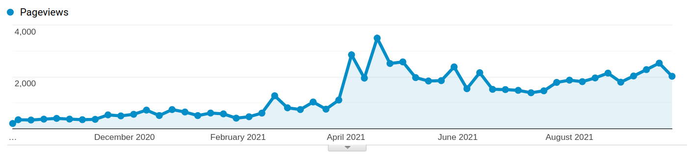
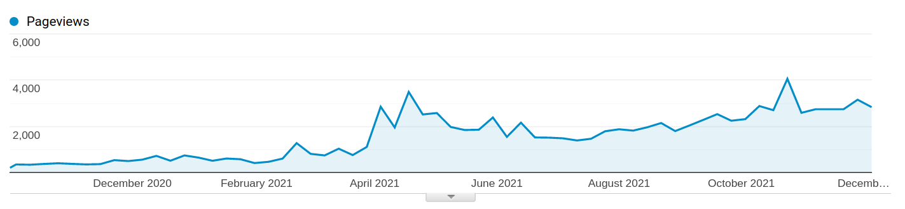
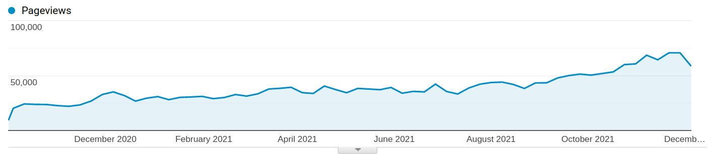
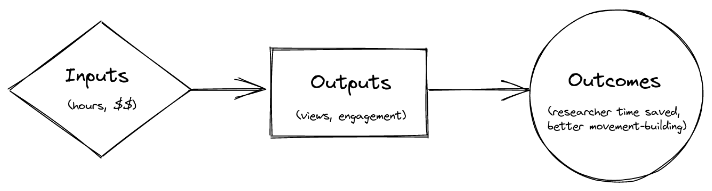
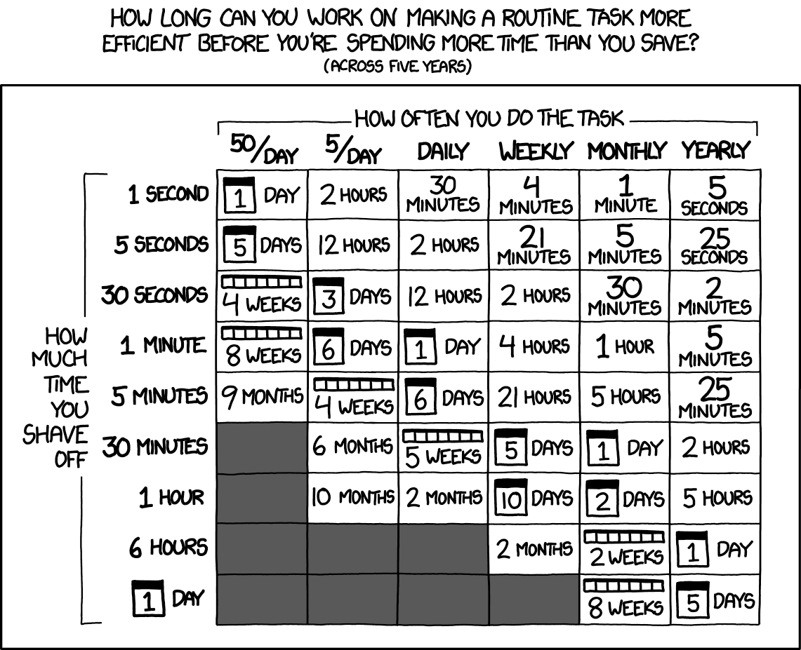

External Evaluation of the EA Wiki
==============

**tl;dr:** The EA Wiki seems probably worth funding, but it is not the most ambitious project that the main person behind it could be doing.

_Epistemic status_: Although we have data and forecasts for some EA Wiki metrics, the most important variables—such as future growth or impact—require speculation. Readers should care or listen to that speculation insofar as they think that I have good judgment. But although we have significant uncertainties, we can still meaningfully evaluate the EA Wiki. In the future, we might be keen to apply this level of evaluation to other interventions.

This evaluation is a project by the [Quantified Uncertainty Research Institute](https://quantifieduncertainty.org/), commissioned by Pablo Stafforini and Max Daniel, financed by the [EA Infrastructure Fund](https://forum.effectivealtruism.org/tag/effective-altruism-infrastructure-fund), and conducted by Nuño Sempere. Pablo and Max reviewed this document prior to publication. 

## Summary

The EA Wiki is a project which attempts to produce and organize EA content. It is hosted within the EA Forum on top of its tag system, and it is the latest attempt on a long line of EA Wiki projects which previously failed.

On the positive side, metrics like "words per dollar" and "views per dollar" are high. Also, Pablo Stafforini—the EA Wiki’s current lead—is a good fit for the project and is very prolific.

On the negative side, Pablo alone spends comparable amounts working on the wiki as users cumulatively spend reading it. The EA Wiki—and in particular the [editing festival](https://forum.effectivealtruism.org/posts/ADQ26DzhmdyuJjtwW/the-ea-forum-editing-festival-has-begun)—doesn't seem to have resulted in junior EAs doing many edits to the Wiki, suggesting that its movement-building-related benefits are on the low side. Further, the wiki doesn’t seem that useful right now in terms of helping current research efforts, such as those of EA research organizations or independent researchers.

On the neutral side, it seems like it will take more time—perhaps on the order of a few years—to determine whether the EA Wiki is successful or not. The case for the EA Wiki right now relies on its increased future usefulness. The wiki is early, so future software functionality and content might make existing content more valuable.

The fact that we need more time to know the influence of the wiki shouldn’t be particularly surprising. Given that similar projects previously failed, it would be surprising if this iteration immediately succeeded.

Some projects could be built on top of the EA Wiki, like more detailed and granular hierarchies of concepts, an accessible curated repository of EA forum posts with links and collected references, or more in-depth articles rather than stubs. Some more examples of projects are given in their own section below. I would feel more excited about the EA Wiki exploring some of these adjacent projects, rather than just continuing to host very short articles (stubs) as it does now.

Overall, I conclude that the EA Wiki seems worth funding for CEA. For Pablo himself, I think he might be able to find more ambitious work to do sometime in the future, but I recognize that this could be difficult.

## Introduction

### Background

The purpose of this evaluation was.

1.  Provide evidence and opinion to inform
    1.  whether Pablo Stafforini should decide to continue working on this project
    2.  whether the EA Infrastructure Fund should renew Pablo Stafforini’s grant
2.  If Pablo does continue to work on the EA wiki, make suggestions on how this could create more value.

As a frequent participant in the EA Forum, I (Nuño) began this evaluation with a skeptical to a negative impression of the EA Wiki. I found the tagging system useful, but I had otherwise not used the Wiki much myself.

### Stated goals of the EA Wiki

Per the two [grant](https://forum.effectivealtruism.org/posts/zAEC8BuLYdKmH54t7/ea-infrastructure-fund-may-2021-grant-recommendations#Pablo_Stafforini__EA_Forum_Wiki___34_200_) [rationales](https://funds.effectivealtruism.org/funds/payouts/april-2020-long-term-future-fund-grants-and-recommendations#pablo-stafforini-17000) evaluating the EA Wiki’s expected impact in April 2020 and June 2021, the two main hopes for it were:

**1\. That it might help onboard new EAs.**

“I advised in favor of this grant because I believe it is important for the EA community to organize its knowledge and make it easily accessible to the community. If successful, this resource would make it significantly easier for community members to:

*   familiarize themselves with EA knowledge,
*   introduce newcomers to EA ideas (see also some of the arguments outlined in The Value of Wikipedia Contributions in Social Sciences)”

— [April 2020](https://funds.effectivealtruism.org/funds/payouts/april-2020-long-term-future-fund-grants-and-recommendations#pablo-stafforini-17000) grant rationale by Jonas Vollmer

“Perhaps most notably, I think it could help improve the ‘onboarding’ experience of people who have recently encountered effective altruism and want to learn more about it online. For a couple of years, I have often encountered people – both ‘new’ and ‘experienced’ members of the EA community – who were concerned that it was hard to learn more about research and methods relevant to effectively improving the world, as well as about the EA community itself. They cited problems like a lack of ‘canonical’ sources, content being scattered across different online locations, and a paucity of accessible summaries. I believe that an actively maintained wiki with high-quality content could help address all of these problems.”

“Contributing to a wiki is a concrete way to add value and contribute to the community that is accessible to basically all community members. My impression is that opportunities like this are in significant demand, and currently severely undersupplied by the community. If the project goes well, many students, researchers, and professionals might contribute to the wiki in their spare time, and find the experience motivating and satisfying.”

— [May 2021](https://forum.effectivealtruism.org/posts/zAEC8BuLYdKmH54t7/ea-infrastructure-fund-may-2021-grant-recommendations#Pablo_Stafforini__EA_Forum_Wiki___34_200_) grant rationale by Max Daniel

**2\. That it might help organize existing knowledge**

“If successful, this resource would make it significantly easier for community members to \[...\] easily retrieve publications on a particular topic (currently spread out across many journals, blogs, research agendas, and websites).”

— [April 2020](https://funds.effectivealtruism.org/funds/payouts/april-2020-long-term-future-fund-grants-and-recommendations#pablo-stafforini-17000) grant rationale by Jonas Vollmer

  
 

“Wikis can establish shared terminology, and contribute to common knowledge in other ways.”

“Wiki articles provide natural focal points for content curation and ‘editorial decisions’. On many topics of relevance to EA, there is ample material scattered across academic journals, blogs, and other locations; however, there is little public information on which of these materials are most important, what the key takeaways are, and which areas are controversial versus broadly agreed upon. Writing wiki articles requires answering such questions. The wiki could thus incentivize more people to engage in this ‘editorial’ and ‘interpretative’ work, thereby reducing (some aspects of) [‘research debt’](https://distill.pub/2017/research-debt/).”

— [May 2021](https://forum.effectivealtruism.org/posts/zAEC8BuLYdKmH54t7/ea-infrastructure-fund-may-2021-grant-recommendations#Pablo_Stafforini__EA_Forum_Wiki___34_200_) grant rationale by Max Daniel

## Evaluating inputs/outputs

_Warning for this section_: Verbose. Casual readers might want to skip to the next section.

### Cost

The grant amounts given out to the EA Wiki were, respectively, $17k and $34.2k. The total is $51.2k. This figure ($51.2k) is used as the cost of the project, for cost-effectiveness estimates in this evaluation. Not all of this money went to Pablo. Pablo's salary comprises only 55% of the second grant ($34.2k) amount. The rest was used to hire a research assistant. However, this money was still used for the wiki, so I still used it for the cost-effectiveness numbers.

Pablo reports that he usually works 35 hours per week. However, in the past few months, his productivity declined to 20 hours per week due to personal issues tied to motivation, which could either be characterized as burnout, perhaps caused by a felt lack of appreciation for the EA Wiki. These work figures would correspond to an estimate of between 1,040 and 1,800 hours worked per year.

### Estimates of engagement

Note: A previous version of this section included the following contradictory information. For transparency's sake, it can be found on the [Wayback Machine](https://web.archive.org/web/20211214094830/https://forum.effectivealtruism.org/posts/kTLR23dFRB5pJryvZ/external-evaluation-of-the-ea-wiki).

Per [this comment](https://forum.effectivealtruism.org/posts/orcHMGjvzEKC59cGy/ea-forum-engagement-doubled-in-the-last-year?commentId=Sei4aSHAvkLFisMWJ) by Ben West of CEA, between October 1, 2020, and October 1, 2021, the EA Wiki received 65,000 views and 1,800 hours of engagement. This corresponds to 65,000 / 52 = 1,250 views and 1,800 / 52 = 34 hours of engagement per week.

This corresponds to a roughly 1:1 ratio between hours worked and hours of engagement. But Pablo only computes hours of relatively high-quality work, whereas engagement can vary in quality.

Per Google Analytics data made available to me by CEA,  from October 1st 2020 to October 1st 2021,  tag pages saw 68,627 pageviews, with an average time on page of 1:17, so a total engagement time of 1,016 hours. This is roughly the same as the data from Ben West's comment.

Pageviews on the EA Forum Wiki, created by going to Behavior → Site content → All pages → advanced, and creating a filter for pages that start with /tag, which roughly corresponds to the pages on the EA Wiki.

Pablo reduced his engagement with the Wiki while waiting for his grant to be renewed. But looking at the period from October 1st 2020 to December 11th 2021, this doesn't affect page-views that much:

In contrast, the views for the EA Forum as a whole look as follows:

I consider this a negative point when tallying up the costs and benefits of the EA Wiki because Pablo is a rather experienced EA. In contrast, readers of the Wiki are likely to be more junior. So a tradeoff of one hour of Pablo’s work for roughly hour of a random EA Wiki reader is probably not worth it. I expand on and justify these points in a later section.

### Costs per word compared to other industries

Per Pablo’s reckoning, as of September 2021, the EA Wiki contained around 115,000 words, of which:

*   65k were written by Pablo,
*   32k were imported from EA concepts
*   18k were contributed by volunteers

In personal conversation, Pablo mentions that estimates of words written are not a good proxy of productivity because he first writes them in his notes and then ports them over to the EA Wiki. He also mentions that he has over 200k words written in his notes, which translates into a ~500-page book.

It’s hard to estimate whether Pablo’s productivity provides a good value per grant dollar. One imperfect approach might be to compare it to the cost per word for adjacent industries:

| Price per word | Type of work                                             | Source                                                                                                                |
|----------------|----------------------------------------------------------|-----------------------------------------------------------------------------------------------------------------------|
| $0.05          | Editing                                                  | https://thewritelife.com/how-much-to-pay-for-a-book-editor/                                                           |
| $0.1           | Translation                                              | https://www.translatorsassociation.ie/interpreter-rates-and-translation-rates-survey/                                 |
| $0.25          | Pablo’s work on the EA Wiki, including unpublished notes | An estimated 200k words, for $51.2k                                                                                   |
| $0.3           | Metaculus analytical storyteller                         | https://forum.effectivealtruism.org/posts/8Woxr3WWEfd5k9a9x/metaculus-seeking-analytical-storytellers-to-write-essays |
| $0.3           | Experienced freelance writers                            | https://contentfly.com/blog/whats-the-average-freelance-writers-price-per-word                                        |
| $0.5           | Junior ghost-writer                                      | https://ddiy.co/ghostwriter-cost/                                                                                     |
| $0.79          | Pablo’s work published on the EA Wiki so far             | 65k words published for $51.2k                                                                                        |
| $1+            | Senior ghost-writing                                     | https://ddiy.co/ghostwriter-cost/                                                                                     |
| $1.5/word      | Top freelance writers, e.g., for WSJ, Forbes, etc.       | https://contentfly.com/blog/whats-the-average-freelance-writers-price-per-word                                        |

Although I quote sources, these can either be biased upwards (if they aim to interface with clients) or downwards (if they seek to interface with prospective writers.) I thus also drew from my past experience in the translation and writing fields to determine what rates are roughly reasonable.

In any case, Pablo’s work seems to be inexpensive in comparison to adjacent industries, particularly if compared with rates for writing about more specialized areas or rates for more experienced writers.

### Cost per view compared to other industries

| Cost per view | Type of work                          | Source                                                                                                                                                                            |
|---------------|---------------------------------------|-----------------------------------------------------------------------------------------------------------------------------------------------------------------------------------|
| $0.1          | Cost per view on Robert Miles’ videos | ~$50k per year for ~500k views/year (https://forum.effectivealtruism.org/posts/Ps8ecFPBzSrkLC6ip/2018-2019-long-term-future-fund-grantees-how-did-they-do#Robert_Miles___39_000_) |
| $0.75         | Cost per view on EA Wiki              | 68.6k views for ($51.2k = $17,000 + $34,200)                                                                                                                                      |
| $0.75         | Cost per view on my own work          | See details here: https://twitter.com/NunoSempere/status/1460972030216609799                                                                                                      |
| ~$1           | Rough cost per buy on Google ads      | https://www.webfx.com/blog/marketing/much-cost-advertise-google-adwords/                                                                                                          |

## Evaluating outcomes

_Thanks to Misha Yagudin for suggesting that this section ought to exist._

The EA Wiki takes in ~1,800 hours of researcher time per year, an additional ~1,800 hours of user engagement time, and lately around $70k per year. But views and hours of engagement don’t equate to “good in the world.” In terms of a straightforward [logic model](https://en.wikipedia.org/wiki/Logic_model), we are missing the “outcomes.”  
 

### Does the path to impact through better organizing research check out? 

The traditional way to organize research is through periodic literature reviews or reference works that occasionally summarize the state of the research. In contrast, a Wiki continuously summarizes the state of work it refers to. Pablo opines that:

> Subjectively, it doesn't feel like EA is progressing at a faster pace than I can keep up with. But this impression has limited evidential weight because only a small fraction of entries are substantive enough to require updating. It could be that once most articles cease to be stubs, I won't have enough time to keep them all updated.

Because so many people read Wikipedia, and because journal articles are inaccessible both in terms of paywalls and writing style, Wikipedia does seem like it warrants much of the effort put into it.

However, for a smaller wiki, this is less clear. One could imagine that more effort could go into it than the effort it saves, as illustrated by the following xkcd comic:

In the xkcd comic, some rectangles are grayed out, because one person can't save more than 24h every day. But if one cares about the time of many people, saving more than 24 hours of time every day becomes possible

In particular, because the EA Forum Wiki doesn’t directly target its summaries and literature reviews to specific EA Forum users, one could imagine that the EA Wiki puts more effort into creating wiki articles than the effort or time it helps save. For instance, one could imagine that the EA Wiki produces good literature reviews on the state of a specific topic, but that no EA researchers need a literature review on that particular topic.

Does the data above check that out? I’d say that this is unclear. Pablo put between 20 and 35 hours of work per week, and the EA Wiki received an average of ~34 hours of engagement per week. But this by itself doesn’t reveal how much researchers’ time the EA Wiki _saved_. In principle, this could have been more time, in the same way that Google saves people a lot of time even if they spend very little time searching. 

Conversely, it could have been less, because not all users might have been looking for something specific rather than browsing the EA Wiki casually or unfocusedly. Similarly, maybe most users were more inexperienced researchers, and trading off Pablo’s time for their time at a close to 1:1 ratio might not have been worth it.

Overall, I think that the path to impact through better organizing research probably does not check out, or does not check out yet. See the corresponding section below on how to consider future impact.

### Does the path to impact through movement-building check out?

As mentioned in the original grant rationale, one hope for the EA Wiki was that it would help engage less-experienced EAs in worthwhile projects. 

Readers can find a broader analysis of the editing festival [here](https://forum.effectivealtruism.org/posts/aZqce5PPtxyRckNyv/editing-festival-results-and-prizes). The distribution of karma and number of edits of EA forum users who participated in the EA Wiki looks as follows:

| user                  | karma | Wiki edits |
|-----------------------|-------|------------|
| Pablo Stafforini      | 5364  | 2142       |
| MichaelA              | 8600  | 734        |
| evelynciara           | 1716  | 49         |
| vaidehi_agarwalla     | 1887  | 45         |
| Stefan_Schubert       | 2967  | 30         |
| EdoArad               | 3407  | 29         |
| tessa                 | 1028  | 29         |
| Cullen_OKeefe         | 2070  | 18         |
| NunoSempere           | 3425  | 12         |
| MarisaJurczyk         | 566   | 10         |
| nil                   | 203   | 10         |
| JPAddison             | 1964  | 9          |
| MichaelStJules        | 4430  | 7          |
| BrianTan              | 2336  | 6          |
| HarrisonD             | 457   | 6          |
| Meg                   | 51    | 6          |
| GidonKadosh           | 565   | 3          |
| KathrynMecrow         | 852   | 3          |
| SamiM                 | 265   | 3          |
| TeoAjantaival         | 178   | 3          |
| velutvulpes           | 835   | 3          |
| finnhambly            | 3     | 2          |
| MaxDalton             | 1911  | 2          |
| saulius               | 3178  | 2          |
| abrahamrowe           | 1281  | 1          |
| Chi                   | 489   | 1          |
| gruban                | 76    | 1          |
| jablevine             | 7     | 1          |
| JasonSchukraft        | 1909  | 1          |
| JoanMM                | 47    | 1          |
| jwagstaff             | 17    | 1          |
| Larks                 | 5868  | 1          |
| lukefreeman           | 1116  | 1          |
| Max_Daniel            | 4518  | 1          |
| Neil_Dullaghan        | 1331  | 1          |
| Peter_Hurford         | 8126  | 1          |
| aaronmayer            | 167   | 0          |
| AbbyHoskin            | 460   | 0          |
| AdamBinks             | 33    | 0          |
| AndreaSR              | 17    | 0          |
| Andy_Schultz          | 108   | 0          |
| AnimalAsk             | 128   | 0          |
| 100 more participants | ...   | 0          |

Excluding Pablo Stafforini and Michael Aird, the distribution looks as follows:

Readers can find the entire distribution [here](https://docs.google.com/spreadsheets/d/12G0CTifo3f72sAPlO2frG3dZtv7fh49SmmX2tnrqyTA/edit#gid=0). I created it by running [this script](https://gist.github.com/NunoSempere/0959416ccf710a26974c8a95fb8431a6) over the users mentioned in the [editing festival post](https://forum.effectivealtruism.org/posts/aZqce5PPtxyRckNyv/editing-festival-results-and-prizes). Ideally, I’d analyze the data for all EA Forum users, but I don’t expect it to change the picture significantly.

Overall, I’d say that most participants were fairly experienced (as determined by their karma score), and the editing festival mostly failed at eliciting long-term wiki (rather than tagging) activity. By long-term wiki activity, I mean editing and writing wiki articles after the festival ended, rather than tagging EA Forum articles.

It also seems that, for less experienced participants, writing comments on regular forum posts, or creating their own posts, is fungible with writing wiki articles. If the EA Wiki was not available, users could substitute their wiki editing activities with writing comments and posts, which would probably have similar benefits.

Overall, I’d say that the two pathways to impact proposed in the initial grant rationales mainly haven’t materialized yet. 

## Considerations after seeing the data

### The EA Wiki probably needs more time until it can be determined whether it is a success or a failure

_Thanks to James Aung for a similar point on community building projects which inspired this section._ 

When I think about what paths to success the EA Wiki could go through, only a very small number turn out to contain overwhelming successes after its first year. So reaching a point where the EA Wiki is valuable requires enough grit to keep at it for several years.

“My most significant reservation about the wiki as a project is that most similar projects seem to fail – e.g., they are barely read, don’t deliver high-quality content, or are mostly abandoned after a couple of months. This seems to be the case both for wikis in general and for similar projects related to EA, including [_EA Concepts_](https://concepts.effectivealtruism.org/), [_PriorityWiki_](https://forum.effectivealtruism.org/posts/gFxgPhn3myvjo7NSo/announcing-prioritywiki-a-cause-prioritization-wiki), the [_LessWrong Wiki_](https://wiki.lesswrong.com/wiki/LessWrong_Wiki), and [_Arbital_](https://www.lesswrong.com/posts/kAgJJa3HLSZxsuSrf/arbital-postmortem). While some of these may be ambiguous successes rather than outright failures, my impression is that they provide only limited value – they certainly fall short of what I envision as the realistic best case for the EA Forum wiki.”

— [May 2021](https://forum.effectivealtruism.org/posts/zAEC8BuLYdKmH54t7/ea-infrastructure-fund-may-2021-grant-recommendations#Pablo_Stafforini__EA_Forum_Wiki___34_200_) grant rationale by Max Daniel

My impression is that given that the previous wiki projects failed, there probably wasn’t/isn’t a burning need for an EA Wiki, and the Wiki’s case depends instead on cumulatively building value and increasing usage over several years. The EA Wiki’s progress in the last year seems on track for that.

I think that there are two ways one could react to this consideration:

1.  A neutral update: Given that the evaluation six and twelve months ago determined that the grant was worth it, I don’t think that all that much information has surfaced since, because the EA Wiki would have taken longer to succeed in most worlds. So if the wiki was promising then, it is still promising now.
2.  A negative update: The relative lack of participation and the smallish ratios between Pablo’s time and engagement suggest there isn’t a burning need for an EA Wiki. Sure, if we are still confident that EAs will eventually use the EA Wiki a lot, we might continue to invest in it, but initial results might make us think that this is fairly unlikely.

In particular, considerations around movement building like 

“Contributing to a wiki is a concrete way to add value and contribute to the community that is accessible to basically all community members. My impression is that opportunities like this are in significant demand, and currently severely undersupplied by the community. If the project goes well, many students, researchers, and professionals might contribute to the wiki in their spare time, and find the experience motivating and satisfying.”

— [May 2021](https://forum.effectivealtruism.org/posts/zAEC8BuLYdKmH54t7/ea-infrastructure-fund-may-2021-grant-recommendations#Pablo_Stafforini__EA_Forum_Wiki___34_200_) grant rationale by Max Daniel

lends itself more to negative updates, where previous reasons for excitement were at least somewhat falsified. 

On the other hand, considerations about investing in plumbing and infrastructure for future research seem like they lend themselves to more neutral updates. In particular, it would be weird to update negatively much after trying out something one knows is difficult and might take a while to see returns, and then starting out and confirming that the thing is indeed difficult. 

### The case for the EA Wiki relies on increased usefulness in future years.

The value that the EA Wiki has produced in the past doesn’t seem large enough yet to justify its monetary cost. The case for its existence depends almost solely on its potential future value.

Note that the EA Forum has been growing at 100% per year, and it’s unclear whether it can keep up that growth. I mention this because the EA Forum hosts the EA Wiki, and increased usage of the forum might produce increased use of the wiki.

Note that the wiki software right now seems to be fairly basic—and Pablo seems like he has mainly focused on content, not software. If the software improves, that could also increase readership further. However, Pablo adds:

> A mild reason for pessimism is that the software developments that have occurred so far do not seem to have increased engagement. For example, I don't think the ability to vote on wiki edits has made a difference (though it may be worth verifying if this is in fact the case). FWIW, my prior expectation was that it would make a difference, so I was somewhat surprised by this.

**Metaculus predictions** 

Earlier this year, Pablo posted a few Wiki-related questions on Metaculus, which can be found [here](https://metaforecast.org/?query=EA%20Wiki&numDisplay=6). They've so far gotten a few answers. Some of the more relevant predictions are:

1.  EA Wiki will probably [continue to exist](https://www.metaculus.com/questions/7892/ea-wiki-alive-by-2023/) (70%, estimate made by ten forecasters)
2.  receive between [3 and 30%](https://www.metaculus.com/questions/7887/ea-wiki-fraction-of-ea-forum-traffic/) of the EA Forum’s traffic (90% confidence interval, 16 forecasters)
3.  The EA Wiki will primarily [not be written](https://www.metaculus.com/questions/7888/ea-wiki-fraction-written-by-volunteers/) by volunteers (16%, 6 forecasters)

Overall, as evidenced by the very large confidence intervals on the percentage of EA Forum traffic, I don’t think that the Metaculus crowd is very confident.

### The EA Wiki can be used as a launchpad for related projects

Some types of activities seem like they could be carried out naturally as part of an EA wiki. Some that Pablo previously proposed are:

*   Commissioning articles from experts
*   Repurposing existing EA content from other scattered sources
*   Publishing the Wiki as a book or self-contained online guide
*   Integrating the Wiki with spaced-repetition
*   Extracting a glossary of key EA terms

Some other directions suggested by EA Wiki survey respondents (quoted or paraphrased):

*   “forum authors should be able to include links to relevant Forum Wiki articles for terms that the reader may not be familiar with and the reader, by hovering with the mouse pointer over the linked term, would see a 1-2 sentence glossary definition of that term (i.e., without having to click on the link)”
*   Concept mapping
*   More detailed and granular hierarchies of concepts
*   Better ways of organizing editors and directing their attention, like how Wikipedia has various "projects" and has at the top of Talk pages the box showing how high priority and how developed an article is
*   More in-depth articles rather than stubs
*   Original research
*   SEO work on the wiki. “I think it would be really cool if people searching for "diminishing returns" or "consequentialism" or "gene drives" or whatever get sent to the Forum, which might draw them into EA ideas.”
*   Coordinated with the other existing wikis, like [causeprioritization.org](https://causeprioritization.org/), to merge old content

Some other potential ideas for projects to build on top of the EA Wiki might be:

*   suggesting bibliographies to EA forum posts,
*   trying to criticize EA from the inside,
*   trying to make EA Forum content less ephemeral,
*   using the EA Forum to send out surveys,
*   an accessible curated repository of EA forum posts with links and collected references,
*   etc.

Right now, content on the EA Forum feels ephemeral, meaning that articles in the EA Forum mostly just get engagement when they are published. Yearly reviews or similar activities, or a rotating bar of high-quality past articles, like on LessWrong, could also fit within the EA Wiki’s purview.

If asked to brainstorm, EA community members might also have some ideas about how to increase or x10 the impact and reach of the wiki.

I would feel more excited about Pablo trying out some of those projects alongside or in combination with working on the Wiki, rather than working on the EA Wiki full-time. 

### More details could be gathered about the EA Wiki’s usefulness

I was going to suggest using a few surveys to gather information about researchers' and community builders’ levels of excitement about the EA Wiki, but Pablo has sent some surveys already. If their answers are very positive or very negative, I imagine that this could more directly inform whether to continue with the EA Wiki or not. Analyzing the survey results in depth seems outside the scope of this evaluation, but so far, they seem ok.

One possible survey question might be about willingness to pay. My impression is that some organizations, chiefly Rethink Priorities, might be willing to pay somewhere between $100 and $500 per month for their posts to be tagged, categorized, and incorporated into a Wiki.

In my experience as an engaged EA Forum user, I haven’t used the EA Wiki much, though I have found the tagging system useful occasionally. I also think the local groups I’m involved with (EA Austria and EA Spain) don’t use it that much.

In contrast, Michael Aird (of both Rethink Priorities and FHI) reported a highly positive experience. He edits the EA Wiki a fair amount and finds himself often sharing articles with newcomers who could use them.

I would expect the [tags dashboard](https://forum.effectivealtruism.org/tags/dashboard) to pick up editing activity if the EA Wiki’s use was more widespread. And there is some activity besides Pablo and Michael Aird’s edits, but I’d call it a very small amount. 

### The EA Wiki is probably not the very best use of the corresponding researcher time

The EA Wiki seems like it has tractability and neglectedness going for it, but not scale or urgency. In particular, other research opportunities, such as joining Rethink Priorities’s rapidly expanding longtermist team, helping out Charity Entrepreneurship or the Forethought Foundation with their research, or doing some high-value original research, might be more promising.

That is, given an additional full-time equivalent (FTE) researcher in the abstract, I would probably allocate it to other opportunities. That said, producing research and producing content for a wiki are not completely interchangeable skills or activities.

### Pablo’s personal fit is solid

In contrast with the above point, previous grant rationales pointed out that Pablo has a particular affinity to wikis, meaning he is better than average and feels more at home with them. 

### Pablo himself might have the best intuitions about the EA Wiki’s value, and he still views it as worth doing

Although I’ve spent a fair bit working on this evaluation, Pablo has been working for upwards of a year. He is an excellent [forecaster](https://www.metaculus.com/accounts/profile/101341/), and I imagine that his models of the world are more developed than my own around wikis.

Per personal communication, Pablo still feels fairly excited about the EA Wiki. However, also per personal communication, he has experienced some burnout. It seems plausible to me that mental health considerations might dominate.

## Summary of considerations

Positive:

*   Words per dollar are similar or cheap compared to adjacent industries.
*   Pablo could use the EA Wiki as a launchpad for related projects.
*   Pablo’s personal fit is solid.
*   Pablo himself might have the best intuitions about the EA Wiki’s value, and he still views it as worth doing.

Negative:

*   Pablo is spending comparable amounts of time working on the wiki as users (who are presumably less senior) are spending browsing it.
*   The EA Wiki—and in particular the editing festival—doesn't seem to have resulted in great movement-building efforts.
*   The EA Wiki doesn't seem that useful right now in terms of organizing research efforts.
*   The EA Wiki is probably not the very best use of the corresponding researcher time.

Neutral:

*   The EA Wiki probably needs more time until it can be determined whether it is a success or a failure.
*   The case for the EA Wiki relies on increased usefulness in future years.
*   More details could be gathered about the EA Wiki’s usefulness.

## Conclusion about the EA Wiki for grantmakers

Overall, I tend to think that considerations in its favour outweigh considerations against it. With CEA looking like it will invest in the EA Forum and movement-building for the long-term, the EA Wiki’s usefulness will probably rise as there are more EAs and the EA body of knowledge grows wider.

However, I would still pay attention to metrics like user engagement, feedback in surveys, and a general sense of whether the wiki is being useful. I’d update against there being a burning need in the EA community to edit wiki articles.

## Conclusion about the EA Wiki for Pablo Stafforini

As in the previous section, I think the EA Wiki is worth it, but I don’t think it’s the most valuable or ambitious thing Pablo could be doing. In particular, I dislike that users—whom I believe are on average more junior than Pablo—use the EA wiki for roughly as many hours as Pablo put into it. 

Doing projects on top of the EA Wiki and writing more in-depth articles rather than stubs seems like it would be robustly good. Pablo could also take value-of-information options, like trying out original research.

Also, Pablo could consider posting particularly in-depth articles to the EA Forum as posts first, purely as an intervention to improve motivation.

## Acknowledgments

This evaluation is a project by the [Quantified Uncertainty Research Institute](https://quantifieduncertainty.org/), commissioned by Pablo Stafforini and Max Daniel, financed by the [EA Infrastructure Fund](https://forum.effectivealtruism.org/tag/effective-altruism-infrastructure-fund), and conducted by Nuño Sempere. Pablo and Max reviewed this document prior to publication. 

Thanks to Misha Yagudin, Ozzie Gooen, Michael Aird, and Vivian Belenky for their comments and suggestions. Thanks also to the EA Forum Team for access to their Google Analytics data. Thanks lastly to Pablo Stafforini for reaching out to suggest this project. 

## Appendix: A Guesstimate for the Impact of the EA Forum

[This guesstimate](https://www.getguesstimate.com/models/19443) estimates that there are about 7 hours (3 to 13 hours) of engagement per hour that the EA Forum team puts into it (I imagine that CEA might be able to get more granular estimates). 

When taking into account the time other agents put in (the LessWrong team, Rethink Priorities, other authors, readers), the Shapley value for the Forum team might be around 2 hours (0.86 to 3.5 hours) of engagement per hour put into it. 

I’m not yet sure how to interpret that, but it seemed like an interesting fact to note. Less sloppy accounting might also consider that some contributions to the EA Forum codebase also go to LessWrong and the Alignment Forum.

## Appendix: Thoughts and Reflections

### Background

In 2020-2021, Pablo Stafforini got a grant from CEA. As part of the grant, they asked him to get the project evaluated. He reached out to me to do this work. This evaluation was meant to take 10 to 30 hours, with funding coming from CEA. I’m doing this evaluation on behalf of the [Quantified Uncertainty Research Institute](https://quantifieduncertainty.org/).

### Reflections

This evaluation took me approximately 50-80 hours to write. I got feedback from Misha Yagudin, Michael Aird, and Vivian Belenky, which likely cost between 4 to 10 hours of their time. Ozzie Gooen helped oversee and edit the evaluation; this took approximately 12 hours of his time.

This is the first paid evaluation that QURI has done. As such, our team spent more time with it than the project was budgeted for, and our team made some mistakes that we’ll learn from for future evaluations. In particular, I was intending to spend 10 to 30 hours, but that proved insufficient, so I ended up spending 50 to 80 hours instead. The difference in hours won’t be charged to CEA.

Overall, the things I would do better are:

*   Don’t start the evaluation until I get the Google Analytics data
*   Talking to Pablo sooner would have been beneficial

Comments and my own perfectionism made this evaluation significantly better, but also resulted in me spending significantly much more time. But I don’t exactly know how much time I’ve spent on this, because I didn’t really have a good time-tracking software. I’ve installed a [simple time-tracker](https://michalklempa.com/2020/04/tt-simplest-time-tracking-using-dmenu/) in order to solve this in the future.

Overall, there seems to be some missing theory and practice for evaluations about speculative/longtermist interventions, which I’m hoping to develop in the coming months. For a specific example, there really weren’t any evaluation templates I could use.

It also seems like this evaluation was unusually hardcore, spending $4k worth of time in an evaluation for a $50k project seems somewhat unusual as far as I can tell. But on the other hand, given significant uncertainty about how valuable speculative/longtermist projects can be, it’s not clear that this would be unreasonable, and I’d be curious to repeat this for other individuals, organizations, or projects.
