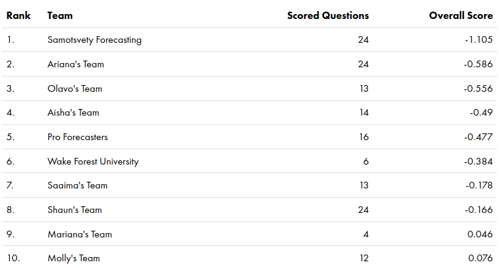
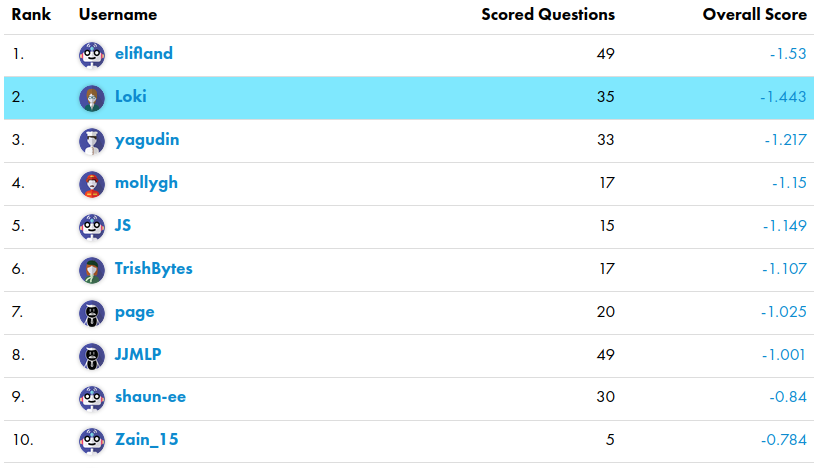
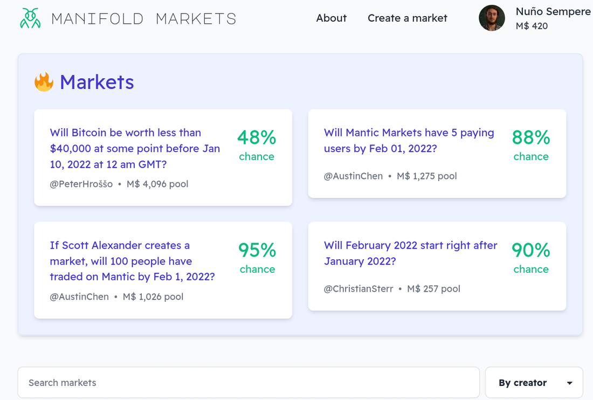
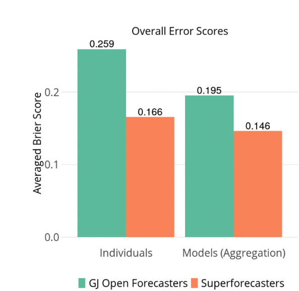
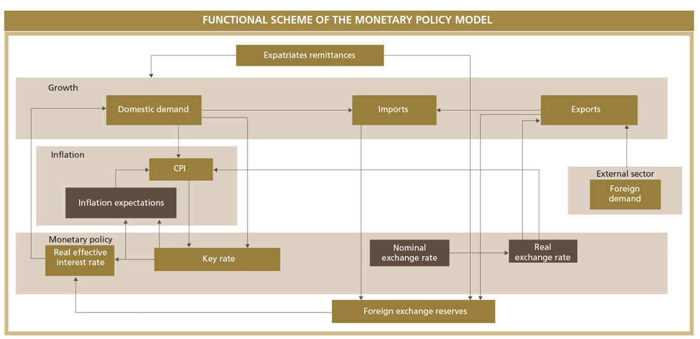

Forecasting Newsletter: December 2021
==============

## Highlights

*   Polymarket’s future is uncertain after it [settled with the CFTC for $1.4M](https://www.cftc.gov/PressRoom/PressReleases/8478-22)
*   Astral Codex Ten gives out $40k to [forecasting projects](https://astralcodexten.substack.com/p/acx-grants-results)
*   Many people, including [Mathew Yglesias](https://www.slowboring.com/p/predictions-are-hard), write predictions for 2022.
*   Eli Lifland writes _the_ reference piece on [bottlenecks to impactful forecasting](https://forum.effectivealtruism.org/posts/S2vfrZsFHn7Wy4ocm/bottlenecks-to-more-impactful-crowd-forecasting-2)
*   Google reveals the existence of a gigantic new [internal prediction market](https://cloud.google.com/blog/topics/solutions-how-tos/design-patterns-in-googles-prediction-market-on-google-cloud)
*   A new forecasting platform appears, [Manifold Markets](https://manifold.markets/)

## Index

*   Prediction Markets & Forecasting Platforms
*   Long Content
*   Blog Posts
*   In The News

You can sign up for this newsletter on [substack](https://forecasting.substack.com) ([a](https://web.archive.org/web/20220109140854/https://forecasting.substack.com/)), or browse past newsletters [here](https://forum.effectivealtruism.org/s/HXtZvHqsKwtAYP6Y7) ([a](https://web.archive.org/web/20220109140942/https://forum.effectivealtruism.org/s/HXtZvHqsKwtAYP6Y7)). If you have a content suggestion or want to reach out, you can leave a comment or find me on [Twitter](https://twitter.com/NunoSempere). A big hat tip goes to Nathan Young and Clay Graubard for comments and suggestions on this edition.

## Prediction Markets & Forecasting Platforms

### Polymarket

The US Commodity Futures Trading Commission (CFTC) has [fined Polymarket $1.4M](https://www.cftc.gov/PressRoom/PressReleases/8478-22) ([a](https://web.archive.org/web/20220109141059/https://www.cftc.gov/PressRoom/PressReleases/8478-22)). For reference, Polymarket's seed funding amounted to [$4M](https://www.forbes.com/sites/rorymurray/2020/10/19/polymarket-raises-massive-4-million-round-from-polychain-naval-ravikant-other-notable-investors/) ([a](https://web.archive.org/web/20210903000732/https://www.forbes.com/sites/rorymurray/2020/10/19/polymarket-raises-massive-4-million-round-from-polychain-naval-ravikant-other-notable-investors/)) and were in talks for another round at a [nearly $1B valuation](https://www.bloomberg.com/news/articles/2021-10-23/crypto-venue-for-bets-on-trump-jlo-and-covid-faces-u-s-probe) ([a](https://web.archive.org/web/20220110174726/https://www.bloomberg.com/tosv2.html?vid=&uuid=5f912993-723d-11ec-b799-767175764d59&url=L25ld3MvYXJ0aWNsZXMvMjAyMS0xMC0yMy9jcnlwdG8tdmVudWUtZm9yLWJldHMtb24tdHJ1bXAtamxvLWFuZC1jb3ZpZC1mYWNlcy11LXMtcHJvYmU=)) prior to the investigation.

> The order requires that Polymarket pay a $1.4 million civil monetary penalty, facilitate the resolution (i.e. wind down) of all markets displayed on Polymarket.com that do not comply with the Commodity Exchange Act (CEA) and applicable CFTC regulations, and cease and desist from violating the CEA and CFTC regulations, as charged.

With this, Polymarket's future seems now very uncertain. The Polymarket team has been mostly silent, though it recently released an [update](https://docs.google.com/document/d/1ybiU-NtzBtuvjJPDJxJBzQhR8yfUoU_HjxW3PpMI27I/edit) ([a](https://web.archive.org/web/20220109183909/https://docs.google.com/document/d/1ybiU-NtzBtuvjJPDJxJBzQhR8yfUoU_HjxW3PpMI27I/edit)) as a Google doc, which promised that they were just "getting started".

To quantify this uncertainty, I asked a more experienced prediction market trader—who wishes to remain anonymous—for his probability estimate that Polymarket would be "pretty much dead". This was operationalized as there being no new markets with more than $100k in volume by November 2022. **His guess ranged from 30% to 50% that it'd in fact be dead.**

This is terrible news. Polymarket has recently been one of the very few real-money markets where one could find highly liquid markets on things of actual importance, like the covid pandemic. I don't tire of mentioning this [¡2008! piece](https://mason.gmu.edu/~rhanson/PromisePredMkt.pdf) ([a](https://web.archive.org/web/20220109141315/https://mason.gmu.edu/~rhanson/PromisePredMkt.pdf)) by several Nobel prize winners and other notable figures urging the CFTC to essentially allow these markets to exist.

\[As an aside, I'll elaborate a bit on the method of elicitation, because I thought it was bloody ingenious, and it might be more standard in the future. I offered him $100 to suggest a bet on Polymarket being dead where I can take either side. He selects the odds, and is also allowed to have a spread, i.e., a difference between the bets against and the bets in favor. Then, I can choose to take the bet on either side, or to leave at that. In effect, I was paying him to potentially act as a bookie, where this costs him some effort and produces some probabilities I’m interested in as a side effect.

As a result of this process, he offered me bets ranging from 3:7 to 1:1, corresponding to between a 30% and a 50% probability of Polymarket being dead. So his revealed confidence was that the probability of it happening is in between.

This process was messier and involved some negotiation. But in the future, conditions could be standardized, e.g., instead of “a few thousands”, either side’s maximum bet could be predetermined to be $5k, as we finally agreed. One would also have to think about the policy around making this kind of bet public. In particular, there are some issues around adversarial selection, or insider trading. If I or others had some private information about whether Polymarket was going to survive, I could extract money from the other party.\]

### CSET-Foretell

[CSET-Foretell](https://www.cset-foretell.com/) (a) is a forecasting platform that aimed to produce policy-relevant predictions and insights to influence US policy.

Foretell is now moving from being hosted by the [Center For Security and Emerging Technologies](https://cset.georgetown.edu/) ([a](https://web.archive.org/web/20220109141344/https://cset.georgetown.edu/)) (CSET) at Georgetown University, to being hosted by the ["Applied Research Laboratory for Intelligence and Security"](https://www.arlis.umd.edu/) ([a](https://web.archive.org/web/20220109141410/https://www.arlis.umd.edu/)) (ARLIS) at the University of Maryland.

The University of Maryland is generally less prestigious than the University of Georgetown, but Maryland ranks in the top 5 for [Homeland Security Graduate Schools](https://www.usnews.com/best-graduate-schools/top-public-affairs-schools/natsec-emergency-management-rankings) ([a](https://www.usnews.com/best-graduate-schools/top-public-affairs-schools/natsec-emergency-management-rankings https://web.archive.org/web/20220110192529/https://www.usnews.com/best-graduate-schools/top-public-affairs-schools/natsec-emergency-management-rankings)). ARLIS is also one of a very few Department of Defense [University Affiliated Research Centers](https://www.securitymagazine.com/articles/96639-university-of-maryland-and-dod-open-security-research-lab) (UARCs) ([a](https://web.archive.org/web/20220110192620/https://www.securitymagazine.com/gdpr-policy?url=https%3A%2F%2Fwww.securitymagazine.com%2Farticles%2F96639-university-of-maryland-and-dod-open-security-research-lab)) and the only one in the [DC-Metro Area](https://en.wikipedia.org/wiki/University_Affiliated_Research_Center) ([a](https://web.archive.org/web/20220110192658/https://wikiless.org/wiki/University_Affiliated_Research_Center?lang=en)).

I feel bitter about this, because I had high hopes for the platform, and because I expect ARLIS to be worse than CSET according to my values. On the one hand, CSET has received $100M from [OpenPhilanthropy](https://www.openphilanthropy.org/giving/grants) ([a](https://web.archive.org/web/20220102124102/https://www.openphilanthropy.org/giving/grants)) within a few years, whereas organizations similar to ARLIS historically receive [one million to $50M a year](https://www.gao.gov/assets/gao-19-64.pdf) ([a](https://web.archive.org/web/20211026005936/https://www.gao.gov/assets/gao-19-64.pdf)) (page 55), and I'd expect ARLIS to receive an amount on the lower end of that range.

I'd also prefer funding which, broadly speaking, cares about people generally—like that of OpenPhil—over funding from the Department of Defense—which I'd expect would be more focused on the interests of the US alone.

On the positive side, ARLIS seems more deeply enmeshed into the US government's bureaucracy, and may [have the ear](https://www.defense.gov/News/Transcripts/Transcript/Article/2861605/deputy-secretary-of-defense-dr-kathleen-hicks-and-under-secretary-of-defense-fo/) ([a](https://web.archive.org/web/20220109141614/https://www.defense.gov/News/Transcripts/Transcript/Article/2861605/deputy-secretary-of-defense-dr-kathleen-hicks-and-under-secretary-of-defense-fo/)) of [Kathleen Hicks](https://wikiless.org/wiki/Kathleen_Hicks?lang=en) ([a](https://web.archive.org/web/20220109141652/https://wikiless.org/wiki/Kathleen_Hicks?lang=en)), a high-ranking US government official.

CSET's Michael Page also published [Wisdom of the Crowd as Arbiter of Expert Disagreement](https://cset.georgetown.edu/wp-content/uploads/CSET-Wisdom-of-the-Crowd-as-Arbiter-of-Expert-Disagreement.pdf) ([a](https://web.archive.org/web/20211214151152/https://cset.georgetown.edu/wp-content/uploads/CSET-Wisdom-of-the-Crowd-as-Arbiter-of-Expert-Disagreement.pdf)), which outlines a methodology for using forecasts to resolve policy debates.

As in the first season, Samotsvety Forecasting, a team made up of Eli Lifland, Misha Yagudin, and myself, completely demolished the competition. We were around twice as good as the next-best team in terms of the relative Brier score.

Amusingly, all three of us are in the top 3 of all time (out of 1035 contenders.)

### Metaculus

[SimonM](https://twitter.com/SmoLurks/) highlights some comment threads [from Metaculus this past December](https://metaculusextras.com/top_comments?start_date=2021-12-01&end_date=2021-12-31) ([a](https://web.archive.org/web/20220109141907/https://metaculusextras.com/top_comments?start_date=2021-12-01&end_date=2021-12-31)). They are:

*   Discussion on [Roe vs Wade](https://www.metaculus.com/questions/1011/roe-v-wade-overturned-by-jul-31-2028/#comment-75292) ([a](https://web.archive.org/web/20220109141933/https://www.metaculus.com/questions/1011/roe-v-wade-overturned-by-jul-31-2028/#comment-75292)), [part 2](https://www.metaculus.com/questions/1011/roe-v-wade-overturned-by-jul-31-2028/#comment-75362) ([a](https://web.archive.org/web/20220109141933/https://www.metaculus.com/questions/1011/roe-v-wade-overturned-by-jul-31-2028/#comment-75362)), [part 3](https://www.metaculus.com/questions/1011/roe-v-wade-overturned-by-jul-31-2028/#comment-75279) ([a](https://web.archive.org/web/20220109141933/https://www.metaculus.com/questions/1011/roe-v-wade-overturned-by-jul-31-2028/#comment-75279))
*   Discussion on whether or not [Russia will invade Ukraine in 2022](https://www.metaculus.com/questions/8898/russian-invasion-of-ukraine-before-2023/#comment-75962) ([a](https://web.archive.org/web/20220109142045/https://www.metaculus.com/questions/8898/russian-invasion-of-ukraine-before-2023/#comment-75962)), [part 2](https://www.metaculus.com/questions/8898/russian-invasion-of-ukraine-before-2023/#comment-75971) ([a](https://web.archive.org/web/20220109142045/https://www.metaculus.com/questions/8898/russian-invasion-of-ukraine-before-2023/#comment-75971)), [part 3](https://www.metaculus.com/questions/8898/russian-invasion-of-ukraine-before-2023/?invite=joX2Fj#comment-76078) ([a](https://web.archive.org/web/20220109142134/https://www.metaculus.com/questions/8898/russian-invasion-of-ukraine-before-2023/?invite=joX2Fj#comment-76078))
*   Discussion on [how dangerous Omicron is](https://www.metaculus.com/questions/8766/omicron-variant-less-deadly-than-delta/#comment-75596) ([a](https://web.archive.org/web/20220109142204/https://www.metaculus.com/questions/8766/omicron-variant-less-deadly-than-delta/#comment-75596)), [part 2](https://www.metaculus.com/questions/8766/omicron-variant-less-deadly-than-delta/#comment-75727) ([a](https://web.archive.org/web/20220109142204/https://www.metaculus.com/questions/8766/omicron-variant-less-deadly-than-delta/#comment-75727)), [part 3](https://www.metaculus.com/questions/8766/omicron-variant-less-deadly-than-delta/#comment-76215) ([a](https://web.archive.org/web/20220109142204/https://www.metaculus.com/questions/8766/omicron-variant-less-deadly-than-delta/#comment-76215))

Otherwise, the Economist partnered with Metaculus for a [Global trends in 2022](https://www.metaculus.com/tournament/economist2022/) ([a](https://web.archive.org/web/20220109142327/https://www.metaculus.com/tournament/economist2022/)) tournament. Tom Chivers wrote a piece on solar power [for Metaculus](https://www.metaculus.com/notebooks/8938/solar-power-current-challenges-encouraging-progress/) ([a](https://web.archive.org/web/20220109142347/https://www.metaculus.com/notebooks/8938/solar-power-current-challenges-encouraging-progress/)). 

### Odds and ends

Hedgehog Markets announced their [liquidity provider program](https://hedgehog-markets.medium.com/announcing-our-lp-program-closed-beta-8892d41cfd96) ([a](https://web.archive.org/web/20220109192939/https://hedgehog-markets.medium.com/announcing-our-lp-program-closed-beta-8892d41cfd96)). The idea is to use the money which prediction market participants park to generate some return, which can then be given out as a reward to the best predictors. And Hedgehog Market is looking for partners, e.g., other Solana protocols, to generate that return for them.

Although the idea is interesting and innovative, [Hedgehog Markets](https://hedgehog.markets/) ([a](https://web.archive.org/web/20220109142421/https://hedgehog.markets/)) continues to focus on sports, crypto, e-sports and NFT markets. And I view these topics as not being all that valuable to predict.

Still, Hedgehog Markets has the advantage that it allows participants to bet without losing their money. If the participant finally withdraws their money after a time, the scheme could be viewed as somewhat similar to a [tontine](https://en.wikipedia.org/wiki/Tontine) ([a](https://web.archive.org/web/20220109142448/https://en.wikipedia.org/wiki/Tontine)), or to a [susu](https://en.wikipedia.org/wiki/Susu_%28informal_loan_club%29) ([a](https://web.archive.org/web/20220109142514/https://en.wikipedia.org/wiki/Susu_%28informal_loan_club%29)), i.e., as a very simple savings device.

[Astral Codex Ten](https://astralcodexten.substack.com/p/acx-grants-results) ([a](https://web.archive.org/web/20220109142637/https://astralcodexten.substack.com/p/acx-grants-results)) awarded $1.55 million in grants, of which $40k (2.5%) went to forecasting related projects. These were:

*   [James Grugett](https://twitter.com/jahooma), Stephen Grugett and [Austin Chen](https://twitter.com/akrolsmir), $20,000, for a new prediction market—Manifold Markets. If every existing prediction market is Lawful Good, this team proposes the Chaotic Evil version: anyone can submit a question, questions can be arbitrarily subjective, and the resolution is decided by the submitter, no appeal is allowed
*   [Nikos Bosse](https://twitter.com/NikosBosse), $5,000, to seed a wiki about forecasting
*   [Nathan Young](https://twitter.com/NathanpmYoung), $5,000, to fund his continued work writing Metaculus questions and trying to build bridges between the forecasting and effective altruist communities
*   Nuño Sempere (myself), $10,000, to fund his continued work on [metaforecast.org](https://metaforecast.org/) and the [@metaforecast](https://twitter.com/metaforecast) bot.

[Manifold Markets](https://manifold.markets/) ([a](https://web.archive.org/web/20220109142701/https://manifold.markets/)) was previously called Mantic Markets because of a section on Astral Codex Ten named "Mantic Mondays", but recently changed its name to allow that section to remain impartial. I find the platform rather neat.

In particular, most other prediction markets/forecasting platforms—like Hypermind, CultivateLabs, Betfair, Metaculus, etc.—were mostly programmed in or before 2015, with the web technologies of the time. Unlike them, Manifold Markets looks and feels more modern, which is something that I appreciate a lot as a heavy user of various forecasting platforms.

Moreover, the team has a couple of ex-Googlers, so beating everyone else in the technology front seems like a plausible pathway to dominance. I encourage people to [give it a try](https://manifold.markets/) ([a](https://web.archive.org/web/20220109142701/https://manifold.markets/)). Some of the markets are entertaining, and for now, it's just play money.

For those curious, an explanation of Manifold Markets' tricky dynamic parimutuel betting system can be found [here](https://manifoldmarkets.notion.site/Technical-Overview-b9b48a09ea1f45b88d991231171730c5) ([a](https://web.archive.org/web/20220109142731/https://manifoldmarkets.notion.site/Technical-Overview-b9b48a09ea1f45b88d991231171730c5)).

In the interest of transparency, and because I think it's interesting in its own right, my application can be found [here](https://github.com/NunoSempere/nunosempere.github.io/blob/master/maths-prog/acx-application-2021-public.md) ([a](https://web.archive.org/web/20220109151335/https://github.com/NunoSempere/nunosempere.github.io/blob/master/maths-prog/acx-application-2021-public.md)).

I applied to a large extent because [Nathan Young](https://twitter.com/NathanpmYoung) specifically was cheerleading the embryonic capabilities of the current [@metaforecast](https://twitter.com/metaforecast) bot, and proposing new things that could be built on top of it. I realized that server costs could stack up fairly quickly, particularly in the best case scenario where a lot of people use it, as in the case of @threaderapp. And if ACX wanted to bankroll a weekend project of mine, why not.

With the benefits of hindsight, I should also have applied for more money and for more ambitious projects, and for the [Quantified Uncertainty Research Institute](https://quantifieduncertainty.org/) ([a](https://web.archive.org/web/20220109142841/https://quantifieduncertainty.org/)), the org for which I work, rather than for hobby projects. But I forgive myself, because initially this was going to be a $200k grant round, before Vitalik Buterin and others bumped it up to $1.55M.

Lastly, it's kind of interesting how $40k feels like a significant quantity of all the funding there is for small experiments in the forecasting space. This is probably suboptimal.

Nathan Young and I are organizing a chill online meetup at 7:00 PM [UTC](https://time.is/es/UTC) on the [9th of February in the LessWrong online Walled Garden](http://garden.lesswrong.com?code=0Jpv&event=forecasting-meetup). The LessWrong Walled Garden is great because you can leave and join conversations as you wish, allowing better flowing conversations. The event will officially finish 2 hours after it starts, but anyone is welcome to stay later

## Long Content

Eli Lifland publishes what is now [the reference piece on bottlenecks to more impactful forecasting](https://forum.effectivealtruism.org/posts/S2vfrZsFHn7Wy4ocm/bottlenecks-to-more-impactful-crowd-forecasting-2) ([a](https://web.archive.org/web/20220109183334/https://forum.effectivealtruism.org/posts/S2vfrZsFHn7Wy4ocm/bottlenecks-to-more-impactful-crowd-forecasting-2)). It crystallizes his knowledge from a few years of his forecasting on Metaculus, CSET-Foretell and Good Judgment Open.

The data from the original Good Judgment Project is [available publicly](https://dataverse.harvard.edu/dataset.xhtml?persistentId=doi%3A10.7910%2FDVN%2FBPCDH5) ([a](https://web.archive.org/web/20220109183400/https://dataverse.harvard.edu/dataset.xhtml?persistentId=doi%3A10.7910%2FDVN%2FBPCDH5)), and has been for some time.

Together with my co-authors Misha Yagudin and Eli Lifland, I posted a fairly thorough investigation into [Prediction Markets in The Corporate Setting](https://forum.effectivealtruism.org/posts/dQhjwHA7LhfE8YpYF/prediction-markets-in-the-corporate-setting) ([a](https://web.archive.org/web/20220108173353/https://forum.effectivealtruism.org/posts/dQhjwHA7LhfE8YpYF/prediction-markets-in-the-corporate-setting)). The academic consensus seems to overstate their benefits and promisingness. Lack of good tech, the difficulty of writing good and informative questions, and social disruptiveness are likely to be among the reasons contributing to their failure. In the end, our report recommended not having company-internal prediction markets.

Dan Schwarz, who leads the below-mentioned prediction market at Google, answered on Twitter [here](https://twitter.com/dschwarz26/status/1477369773092532227). Ozzie Gooen, of my own Quantified Uncertainty Research Institute, left some criticisms [here](https://forum.effectivealtruism.org/posts/dQhjwHA7LhfE8YpYF/prediction-markets-in-the-corporate-setting?commentId=LkzaDDujG7WF5ZnKs) ([a](https://web.archive.org/web/20220109143034/https://forum.effectivealtruism.org/posts/dQhjwHA7LhfE8YpYF/prediction-markets-in-the-corporate-setting?commentId=LkzaDDujG7WF5ZnKs)), emphasizing that small experiments may nonetheless be worth it, and that experimenting with prediction setups could have large externalities if they work.

A [white paper by the Good Judgment project](https://goodjudgment.com/wp-content/uploads/2021/10/Superforecasters-A-Decade-of-Stochastic-Dominance.pdf) ([a](https://web.archive.org/web/20211103182819/https://goodjudgment.com/wp-content/uploads/2021/10/Superforecasters-A-Decade-of-Stochastic-Dominance.pdf)) compares the performance of superforecasters vs Good Judgment Open forecasters. I recommend mostly skipping the text because of the information is contained in the charts.

The paper also doesn’t have the visceral impact of the comparison in the Superforecasting book, where the original Good Judgment project beat intelligence analysts with classified information. This time, the paper compares paid superforecasters against unpaid hobbyists. I guess I’d have liked to see a comparison between different platforms, e.g., a Good Judgment vs Metaculus or vs PredictIt head-to-head fight.

Jaime Sevilla looks at [aggregating forecasts in a principled way](https://forum.effectivealtruism.org/s/hjiBqAJNKhfJFq7kf/p/biL94PKfeHmgHY6qe) ([a](https://web.archive.org/web/20220109143140/https://forum.effectivealtruism.org/s/hjiBqAJNKhfJFq7kf/p/biL94PKfeHmgHY6qe)), building on his [previous work](https://forum.effectivealtruism.org/s/hjiBqAJNKhfJFq7kf) ([a](https://web.archive.org/web/20220109143221/https://forum.effectivealtruism.org/s/hjiBqAJNKhfJFq7kf)). This time, he explains [a result by Neyman et al.](https://arxiv.org/abs/2111.03153) ([a](https://web.archive.org/web/20220109143254/https://arxiv.org/abs/2111.03153)), and tests it on past Metaculus data. He finds that it beats Metaculus' own prediction, as well as all other aggregation methods commonly considered.

## Blog Posts

The Machine Intelligence Research Institute has published a few [conversations on future AI capabilities](https://www.lesswrong.com/s/n945eovrA3oDueqtq) ([a](https://web.archive.org/web/20220109143627/https://www.lesswrong.com/s/n945eovrA3oDueqtq)). Of these, readers of this newsletter might be particularly interested in the [Conversation on technology forecasting and gradualism](https://www.lesswrong.com/posts/nPauymrHwpoNr6ipx/conversation-on-technology-forecasting-and-gradualism) ([a](https://web.archive.org/web/20220109143714/https://www.lesswrong.com/posts/nPauymrHwpoNr6ipx/conversation-on-technology-forecasting-and-gradualism)).

[Epidemic tracking and forecasting: Lessons learned from a tumultuous year](https://www.pnas.org/content/118/51/e2111456118) ([a](https://web.archive.org/web/20220109143750/https://www.pnas.org/content/118/51/e2111456118)) summarizes a collection of papers on the PNAS (Proceedings of the National Academy of Science). The main lessons are:

1.  Data was often unreliable
2.  It is important to understand what process generates the data.
3.  Mandated reporting was burdensome and inflexible
4.  Human behavior was hard to model.

See also Valentine's [What are sane reasons that Covid data is treated as reliable?](https://www.lesswrong.com/posts/ajHBujvstNYH7pykq/what-are-sane-reasons-that-covid-data-is-treated-as-reliable) ([a](https://web.archive.org/web/20220109143829/https://www.lesswrong.com/posts/ajHBujvstNYH7pykq/what-are-sane-reasons-that-covid-data-is-treated-as-reliable)).

[A non-magical explanation of Jeffrey Epstein](https://www.lesswrong.com/posts/hurF9uFGkJYXzpHEE/a-non-magical-explanation-of-jeffrey-epstein#comments) ([a](https://web.archive.org/web/20220109143501/https://www.lesswrong.com/posts/hurF9uFGkJYXzpHEE/a-non-magical-explanation-of-jeffrey-epstein#comments)) attempts to model Epstein's death and the organizations around it. However, see [this comment](https://www.lesswrong.com/posts/hurF9uFGkJYXzpHEE/a-non-magical-explanation-of-jeffrey-epstein?commentId=emDGRNtWAtmAedavs#comments) ([a](https://web.archive.org/web/20220109143545/https://www.lesswrong.com/posts/hurF9uFGkJYXzpHEE/a-non-magical-explanation-of-jeffrey-epstein?commentId=emDGRNtWAtmAedavs#comments)) for pushback.

> It's easy to make fun of Alex Jones tier conspiracy theories. But if we're being honest, it's really hard for any regular person to model opaque organizations like their local police department, their district attorney's office, the FBI, the NSA, the state department, or Congress. I think deep down most people are not conspiracy theorists, simply because they do not have the tools equipped to understand those organizations. Some of this is due to a lack of knowledge about what these organizations do and what their internal politics are. Some of this is due to the fact it's socially encouraged to have a non-sensibly cynical attitude when it comes to clandestine organizations, lest we be accused of being too naive by our wizened and grizzled friends.
> 
> But a lot of it is just because, by default, we no longer use the operationally important reasoning for understanding the behavior of people we actually know. Instead we feel free to shift into far-mode thinking, and posit relationships and arrangements that do not actually occur in the wild. The things our theories say about us and let us get to believe become more important than their predictive value. We don't actually see any of these grand coverups happen, but it's cool to imagine they do, especially when we get to imagine our political enemies doing it. Sometimes the long downtime between regime changes are so boring that it's easier and more exciting to just assume it's happening all the time, everywhere, right out of sight.

R Street, a libertarian policy think tank, offers an analysis of [A cybersecurity forecasting platform.](https://www.rstreet.org/wp-content/uploads/2021/12/FINAL_RSTREET248.pdf) ([a](https://web.archive.org/web/20211208143913/https://www.rstreet.org/wp-content/uploads/2021/12/FINAL_RSTREET248.pdf))

A new substack blogger and old Metaculus forecaster looks at [ordered prediction markets](https://pepeblog.substack.com/p/ordered-prediction-markets) ([a](https://web.archive.org/web/20220109143915/https://pepeblog.substack.com/p/ordered-prediction-markets)), which might allow markets to extract probability distributions, rather than just probabilities. See also [here](https://cdetr.io/smart-markets/) ([a](https://web.archive.org/web/20220109143942/https://cdetr.io/smart-markets/)) for a more academic treatment of the topic.

## In the News

Google has revealed the existence of a new [internal prediction market](https://cloud.google.com/blog/topics/solutions-how-tos/design-patterns-in-googles-prediction-market-on-google-cloud) ([a](https://web.archive.org/web/20220109144026/https://cloud.google.com/blog/topics/solutions-how-tos/design-patterns-in-googles-prediction-market-on-google-cloud)), with over 175,000 predictions from over 10,000 Google employees.

[NeuralProphet](https://arxiv.org/abs/2111.15397) ([a](https://web.archive.org/web/20220109144447/https://arxiv.org/abs/2111.15397)) aims to be an update over [Facebook's Prophet library](https://github.com/facebook/prophet) ([a](https://web.archive.org/web/20220109144520/https://github.com/facebook/prophet)), which offers time series data prediction in a box. I haven't tried it out, but it looks promising.

The Bank Al-Maghrib—the central bank of Morocco—has a very clearly written report on [monetary policy](https://www.bkam.ma/en/content/download/744906/8479246/RPM%20%20ang%20Q3%202021.pdf) ([a](https://web.archive.org/web/20220109144144/https://www.bkam.ma/en/content/download/744906/8479246/RPM%20%20ang%20Q3%202021.pdf)). I found the international comparisons on growth, interest and inflation rates to be particularly interesting.

Some news media & individuals wrote some quantified predictions for 2022: [Vox](https://www.vox.com/future-perfect/22824620/predicting-midterms-covid-roe-wade-oscars-2022) ([a](https://web.archive.org/web/20220109144227/https://www.vox.com/future-perfect/22824620/predicting-midterms-covid-roe-wade-oscars-2022)), [UnHerd](https://unherd.com/2022/01/my-predictions-for-2022/) ([a](https://web.archive.org/web/20220110184541/https://unherd.com/2022/01/my-predictions-for-2022/)), [The Economist](https://www.economist.com/graphic-detail/2022/01/01/what-prediction-markets-suggest-will-happen-in-2022) ([a](https://web.archive.org/web/20220110184632/https://www.economist.com/graphic-detail/2022/01/01/what-prediction-markets-suggest-will-happen-in-2022)), [Ipsos](https://www.ipsos.com/en/global-predictions-2022) ([a](https://web.archive.org/web/20220110184849/https://www.ipsos.com/en/global-predictions-2022)), [Matt Rickard](https://matt-rickard.com/2022-predictions/) ([a](https://web.archive.org/web/20220110185055/https://matt-rickard.com/2022-predictions/)), [Avraham Eisenberg](https://misinfounderload.substack.com/p/predictions-for-2022) ([a](https://web.archive.org/web/20220110185128/https://misinfounderload.substack.com/p/predictions-for-2022)), [Mathew Yglesias](https://www.slowboring.com/p/predictions-are-hard) ([a](https://web.archive.org/web/20220110185219/https://www.slowboring.com/p/predictions-are-hard)), [The Atlantic Council](https://www.atlanticcouncil.org/content-series/atlantic-council-strategy-paper-series/the-top-twelve-risks-and-opportunities-for-2022/) ([a](https://web.archive.org/web/20220110185255/https://www.atlanticcouncil.org/content-series/atlantic-council-strategy-paper-series/the-top-twelve-risks-and-opportunities-for-2022/)), and [Blackrock](https://www.blackrock.com/corporate/insights/blackrock-investment-institute/interactive-charts/geopolitical-risk-dashboard) ([a](https://web.archive.org/web/20220110185321/https://www.blackrock.com/corporate/insights/blackrock-investment-institute/interactive-charts/geopolitical-risk-dashboard)). h/t to Clay Graubard for [this longer list of 2022 predictions](https://docs.google.com/document/d/1cvKZZ6PKdJh6WIcdyQ-k8kNjq7tOLjV-t9IRaCHCp7Y/edit#), from which some of the aforementioned were taken. It feels like there are more of these than last year, and the Mathew Yglesias piece is by a particularly mainstream author, which might be indicative that forecasting is becoming something less niche.

I tried to get Vox to make some bets against me [on](https://twitter.com/NunoSempere/status/1479808503506165764) Twitter, but my megaphone wasn't big enough to get their attention.

---

Note to the future: All links are added automatically to the Internet Archive, using this [tool](https://github.com/NunoSempere/longNowForMd) ([a](https://web.archive.org/web/20220109144543/https://github.com/NunoSempere/longNowForMd)). "(a)" for archived links was inspired by [Milan Griffes](https://www.flightfromperfection.com/) ([a](https://web.archive.org/web/20220109144604/https://www.flightfromperfection.com/)), [Andrew Zuckerman](https://www.andzuck.com/) ([a](https://web.archive.org/web/20211202120912/https://www.andzuck.com/)), and [Alexey Guzey](https://guzey.com/) ([a](https://web.archive.org/web/20220109144733/https://guzey.com/)).

---

> I critique here in such detail because, despite all our disagreements and my worries, I love and I care.

Zvi, [Thoughts on the Survival and Flourishing Fund](https://thezvi.wordpress.com/2021/12/14/zvis-thoughts-on-the-survival-and-flourishing-fund-sff/) ([a](https://web.archive.org/web/20220109144753/https://thezvi.wordpress.com/2021/12/14/zvis-thoughts-on-the-survival-and-flourishing-fund-sff/))

---
