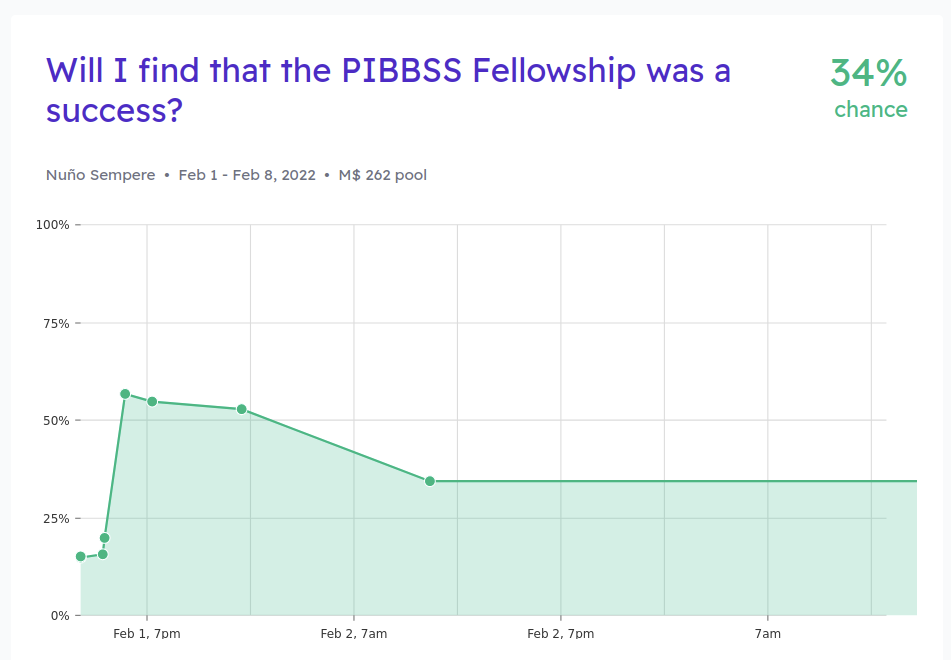
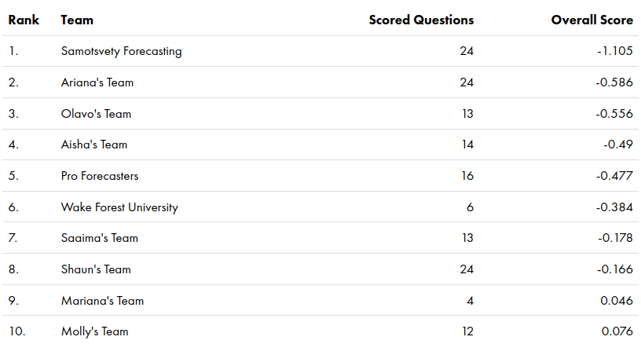
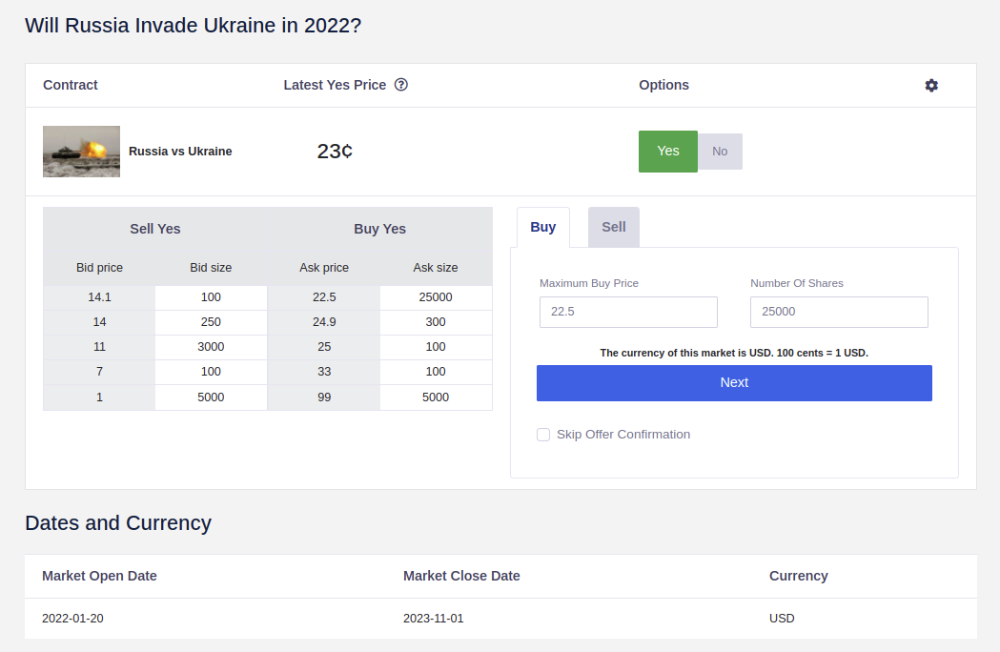

Forecasting Newsletter: January 2022
==============

## Highlights

*   Polymarket now operates out of [Panama](https://polymarket.com/tos)
*   Aver, a new Solana-based betting site, raised [$7.5M in seed funding](https://averbet.medium.com/aver-the-worlds-first-fully-decentralized-web3-betting-platform-closes-7-5m-seed-funding-round-8b38a493aed9)
*   Announcing the Forecasting Newsletter $10,000 Micro-Grants Program
*   Forecasting meetup next Wednesday (9th Feb) at 19:00 UTC in the [LessWrong online garden](https://www.lesswrong.com/walledGardenPortal/?code=0Jpv&event=forecasting-meetup)

## Index

*   Prediction Markets & Forecasting Platforms
*   Forecasting Newsletter Micro-Grants Program
*   Blog Posts

You can sign up for this newsletter on [substack](https://forecasting.substack.com), or browse past newsletters [here](https://forum.effectivealtruism.org/s/HXtZvHqsKwtAYP6Y7). If you have a content suggestion or want to reach out, you can leave a comment or find me on [Twitter](https://twitter.com/NunoSempere).

## Prediction Markets & Forecasting Platforms

### Polymarket

Since Polymarket [settled with the CFTC last month](https://www.cftc.gov/media/6891/enfblockratizeorder010322/download) ([a](https://web.archive.org/web/20220125235408/https://www.cftc.gov/media/6891/enfblockratizeorder010322/download)), they have moved out of US jurisdiction. They are now operating from [Panama](https://polymarket.com/tos) ([a](https://web.archive.org/web/20220202214231/https://polymarket.com/tos)). Their terms of use now prohibit users from the US from participating on the platform, and likewise [prohibits use of a VPN to circumvent this prohibition](https://en.wikipedia.org/wiki/John_Gilmore_%28activist%29#Activism) ([a](https://web.archive.org/web/20220202214301/https://en.wikipedia.org/wiki/John_Gilmore_%28activist%29#Activism)). They have now started using [UMA](https://umaproject.org/) ([a](https://web.archive.org/web/20220202214341/https://umaproject.org/)) as a market resolver. Personally, I am glad Polymarket has survived.

### Manifold Markets

[Manifold Markets](https://manifold.markets/) ([a](https://web.archive.org/web/20220202214710/https://manifold.markets/)), a new play-money prediction market, has kept its frantic development pace. They will be "launching" on February the 8th, from their current open beta. They outline some of their hopes and plans in their [substack newsletter](https://manifold.markets/) ([a](https://web.archive.org/web/20220202214710/https://manifold.markets/)).

I created some markets on whether I will consider the [Principles of Intelligent Behavior in Biological and Social Systems](https://www.pibbss.ai/) fellowship to be ["a success"](https://manifold.markets/Nu%C3%B1oSempere/will-i-find-that-the-pibbss-fellows) ([a](https://web.archive.org/web/20220202214733/https://manifold.markets/Nu%C3%B1oSempere/will-i-find-that-the-pibbss-fellows)), on [the number of subscribers to this newsletter](https://manifold.markets/Nu%C3%B1oSempere/how-many-additional-subscribers-wil) ([a](https://web.archive.org/web/20220202214804/https://manifold.markets/Nu%C3%B1oSempere/how-many-additional-subscribers-wil)), and on whether [my current employer will still be alive by the end of 2022](https://manifold.markets/Nu%C3%B1oSempere/will-the-quantified-uncertainty-res) ([a](https://web.archive.org/web/20220202214836/https://manifold.markets/Nu%C3%B1oSempere/will-the-quantified-uncertainty-res)). The process was extremely painless, and I recommend that readers [give it a try](https://manifold.markets/).

### CSET-Foretell is now INFER

CSET-Foretell moved from being hosted by [CSET](https://cset.georgetown.edu/) ([a](https://web.archive.org/web/20220202214401/https://cset.georgetown.edu/)) at Georgetown to being hosted by [ARLIS](https://www.arlis.umd.edu/home) ([a](https://web.archive.org/web/20220202214435/https://www.arlis.umd.edu/home)) at Maryland. ARLIS also received an [$8M grant](https://www.openphilanthropy.org/giving/grants/applied-research-laboratory-for-intelligence-and-security-forecasting-platforms) ([a](https://web.archive.org/web/20220202214510/https://www.openphilanthropy.org/giving/grants/applied-research-laboratory-for-intelligence-and-security-forecasting-platforms)) from Open Philanthropy for forecasting specifically. 

This is a fairly large amount of [EA](https://en.wikipedia.org/wiki/Effective_altruism) funding for forecasting projects. For reference, Metaculus recently received [$250k](https://forum.effectivealtruism.org/posts/pwnvva4AHfxYZmaGM/ea-infrastructure-fund-may-august-2021-grant-recommendations#Grants_evaluated_by_Michael_Aird) ([a](https://web.archive.org/web/20220102180351/https://forum.effectivealtruism.org/posts/pwnvva4AHfxYZmaGM/ea-infrastructure-fund-may-august-2021-grant-recommendations#Grants_evaluated_by_Michael_Aird)), and Phil Tetlock and associates previously received [two](https://forum.effectivealtruism.org/posts/HYKDh2mLjapsgj9nB/long-term-future-fund-july-2021-grant-recommendations#Ezra_Karger__Pavel_Atanasov__Philip_Tetlock___572_000_) ([a](https://web.archive.org/web/20220127170647/https://forum.effectivealtruism.org/posts/HYKDh2mLjapsgj9nB/long-term-future-fund-july-2021-grant-recommendations#Ezra_Karger__Pavel_Atanasov__Philip_Tetlock___572_000_)) ~[$500k](http://www.openphilanthropy.org/giving/grants/university-pennsylvania-philip-tetlock-forecasting#Internal_forecasts) ([a](https://web.archive.org/web/20211212130427/https://www.openphilanthropy.org/giving/grants/university-pennsylvania-philip-tetlock-forecasting)) grants. Open Philanthropy also previously gave ~$55M [CSET](https://www.openphilanthropy.org/giving/grants/georgetown-university-center-security-and-emerging-technology) ([a](https://web.archive.org/web/20211212104645/https://www.openphilanthropy.org/giving/grants/georgetown-university-center-security-and-emerging-technology)), as well as later [top-up](https://www.openphilanthropy.org/focus/global-catastrophic-risks/potential-risks-advanced-artificial-intelligence/center-security-and-emerging-technology-general-support) ([a](https://web.archive.org/web/20211212102234/https://www.openphilanthropy.org/focus/global-catastrophic-risks/potential-risks-advanced-artificial-intelligence/center-security-and-emerging-technology-general-support)) [grants](https://www.openphilanthropy.org/focus/global-catastrophic-risks/potential-risks-advanced-artificial-intelligence/center-security-and-emerging-technology-general-support-august-2021) ([a](https://web.archive.org/web/20211212101722/https://www.openphilanthropy.org/focus/global-catastrophic-risks/potential-risks-advanced-artificial-intelligence/center-security-and-emerging-technology-general-support-august-2021)). But this was for a broader think tank, rather than for forecasting specifically.

In [the December issue](https://forecasting.substack.com/p/forecasting-newsletter-december-2021) of this newsletter, I assessed that the move from CSET to ARLIS was probably a negative development, partially because I thought that funding from Open Philanthropy was much better than government funding. As it happens, ARLIS has just now received funding from Open Philanthropy as well. Multiple people also reached out to comment that the move was probably neutral or positive, on account of ARLIS' deeper involvement with the US government. My independent impression is that I still dislike the move, but my all-things-considered view is that it's probably ok and I was wrong. As to how wrong, we’ll see.

Separately, because their Pro Forecaster program still only pays $20/hour, my team—Samotsvety Forecasting, which overwhelmingly won the last two seasons—might not be participating going forward, though we are trying to negotiate with them. I talked to a few super-forecasters about this, and $20/hour isn't going to get ARLIS the best forecasters. Their open call for pro forecasters can be found [here](https://www.infer-pub.com/open-call-pro-forecasters) ([a](https://web.archive.org/web/20220202214636/https://www.infer-pub.com/open-call-pro-forecasters)).

But this isn’t a problem unique to INFER. Generally, forecasting platforms such as [Metaculus](https://www.metaculus.com/questions/?show-welcome=true) ([a](https://web.archive.org/web/20220121195415/https://www.metaculus.com/questions/?show-welcome=true)), [Hypermind](https://www.hypermind.com/en/) ([a](https://web.archive.org/web/20211025232223/https://www.hypermind.com/en/)), or the [Social Science Prediction Platform](https://socialscienceprediction.org/) ([a](https://web.archive.org/web/20220121195415/https://www.metaculus.com/questions/?show-welcome=true)), just don’t pay that much to forecasters. This leads to predictable problems, such as forecasters [moving to crypto prediction markets](https://forecasting.substack.com/p/looking-back-at-2021), or experiencing burnout after forecasting in an unsustainable way for little reward, as happened to some top covid forecasters.

### Metaculus

[SimonM](https://twitter.com/SmoLurks/) ([a](https://web.archive.org/web/20220202213823/https://twitter.com/SmoLurks/)) kindly curated the [top comments from Metaculus this past January](https://metaculusextras.com/top_comments?start_date=2022-01-01&end_date=2022-02-01) ([a](https://web.archive.org/web/20220202213850/https://metaculusextras.com/top_comments?start_date=2022-01-01&end_date=2022-02-01)). They are:

On the potential invasion of Ukraine by Russia:

*   [Tilter](https://www.metaculus.com/questions/8898/russian-invasion-of-ukraine-before-2023/#comment-79292) ([a](https://web.archive.org/web/20220202213910/https://www.metaculus.com/questions/8898/russian-invasion-of-ukraine-before-2023/#comment-79292)) believes that Russia's slow deployment of troops is a move intended to scare NATO into keeping out of Ukraine. If Russia was going to invade, they would just do that quickly, as has been their manner of operating in the past.
    *   [jmason](https://www.metaculus.com/questions/8898/russian-invasion-of-ukraine-before-2023/#comment-78801) ([a](https://web.archive.org/web/20220202213910/https://www.metaculus.com/questions/8898/russian-invasion-of-ukraine-before-2023/#comment-78801)) points out that the US State Department just issued a Do Not Travel warning for Ukraine and [Belarus](https://travel.state.gov/content/travel/en/traveladvisories/traveladvisories/belarus-travel-advisory.html) where Russian forces are massing for a declared joint-military exercise.
    *   Note that most of the major platforms have forecasts on Russia/Ukraine as well. They can be found on [Metaforecast](https://metaforecast.org/?query=Russia%20Ukraine&numDisplay=50).
*   [EvanHarper](https://www.metaculus.com/questions/9021/jwst-sees-first-light-6-weeks-after-launch/#comment-78984) ([a](https://web.archive.org/web/20220202214009/https://www.metaculus.com/questions/9021/jwst-sees-first-light-6-weeks-after-launch/#comment-78984)) emails NASA to resolve a Metaculus question.
*   [alwaysrinse](https://www.metaculus.com/questions/6554/astral-codex-ten-mentions-this-question/#comment-76943) ([a](https://web.archive.org/web/20220202214040/https://www.metaculus.com/questions/6554/astral-codex-ten-mentions-this-question/#comment-76943)) notices that Scott Alexander successfully trolled the Metaculus community.

Metaculus' updated public figure predictions can be found [here](https://www.metaculus.com/questions/8198/updated-public-figure-predictions/) ([a](https://web.archive.org/web/20220202214112/https://www.metaculus.com/questions/8198/updated-public-figure-predictions/)).

### Forecasting meetup

[Nathan Young](https://twitter.com/NathanpmYoung) and I are organizing a forecasting and prediction markets online meetup at 7:00 PM [UTC](https://time.is/es/UTC) on the [9th of February in the LessWrong online Walled Garden](https://www.lesswrong.com/walledGardenPortal/?code=0Jpv&event=forecasting-meetup). The LessWrong Walled Garden is great because you can move around and leave and join conversations as you wish, allowing better flowing conversations, mentions Nathan. The event will officially finish 2 hours after it starts, but anyone is welcome to stay for longer.

### Odds and ends

The sixth [Makridakis Competition](https://en.wikipedia.org/wiki/Makridakis_Competitions) ([a](https://web.archive.org/web/20220202215015/https://en.wikipedia.org/wiki/Makridakis_Competitions))—a well-known open competition to evaluate and compare the accuracy of different time series forecasting methods—has been announced. Total prizes—amongst many rounds and many forecasters—[sum up to $300,000](https://forecasters.org/blog/2022/01/19/announcing-the-m6-forecasting-competition/) ([a](https://web.archive.org/web/20220202215041/https://forecasters.org/blog/2022/01/19/announcing-the-m6-forecasting-competition/)). The deadline for the first submission point is the 6th of March, though there is a trial round in February. More details can be found on their [webpage](https://m6competition.com/) ([a](https://web.archive.org/web/20220202215101/https://m6competition.com/))

[Aver](https://aver.bet/) ([a](https://web.archive.org/web/20220202214909/https://aver.bet/)), a prediction market built on top of the Solana chain, announced a [$7.5M seed round](https://averbet.medium.com/aver-the-worlds-first-fully-decentralized-web3-betting-platform-closes-7-5m-seed-funding-round-8b38a493aed9) ([a](https://web.archive.org/web/20220202214939/https://averbet.medium.com/aver-the-worlds-first-fully-decentralized-web3-betting-platform-closes-7-5m-seed-funding-round-8b38a493aed9)). My impression is that they will start with sports and crypto, which are easier to resolve. But I imagine that they will also have the flexibility to also experiment with some markets whose probabilities are valuable to the general public. Based on the typical amount sold during the first financing round, their valuation is probably between $30M and $80M.

Insight Prediction has launched a real-money beta with limited access and is looking for members of the prediction market community to test the site and give feedback. They are running a [Russian Invasion of Ukraine Market](https://insightprediction.codebnb.me/markets/129) ([a](https://web.archive.org/web/20220202231900/https://insightprediction.codebnb.me/markets/129)), as well as a weekly [US covid total death markets](https://insightprediction.codebnb.me/markets/110) ([a](https://web.archive.org/web/20220202231932/https://insightprediction.codebnb.me/markets/110)). Their rationale is that these might make some people uncomfortable, but they think that these markets are the most important for policymakers and users in terms of the information they provide. I agree with that reasoning. 

On the negative side, Insight Prediction had previously been stuck in development for a long time. They were originally planning to launch in June or July 2021, though at the time one of the funders refused to take a $20 bet I offered on their timelines. Reliable anonymous sources have also expressed some skepticism about the project—not necessarily in the sense of being a scam, but rather in terms of their plans being unfocused. 

Prediction market players who want to participate in the early access beta can reach out per [email](mailto:insightprediction@gmail.com).

## Announcing the Forecasting Newsletter $10,000 Micro-Grant Program

After the apparent success of [ACX grants](https://astralcodexten.substack.com/p/acx-grants-results) ([a](https://web.archive.org/web/20220203090546/https://astralcodexten.substack.com/p/acx-grants-results)), [Misha Yagudin](https://twitter.com/mishayagudin) and I received $10k from an anonymous donor to give out as micro-grants through this newsletter.

Some examples of projects we'd be excited to fund might be:

*   Open-source software and tooling to automate forecasting. Bonus points if Metaculus users or other forecasters start using it.
*   Giving a shot at forecasting or making models of a difficult yet useful and decision-relevant area. Think of [Rootclaim](https://www.rootclaim.com/) ([a](https://web.archive.org/web/20220202215123/https://www.rootclaim.com/)) analyzing the lab-escape story of Omicron.
*   Pieces similar in quality to the ones mentioned in "[best pieces on forecasting from 2021](https://forecasting.substack.com/p/looking-back-at-2021) ([a](https://web.archive.org/web/20220202215143/https://forecasting.substack.com/p/looking-back-at-2021))”, in [Forecasting Prize Results](https://forum.effectivealtruism.org/posts/8QFWHzmur4roAcnCf/forecasting-prize-results) ([a](https://web.archive.org/web/20211020014907/https://forum.effectivealtruism.org/posts/8QFWHzmur4roAcnCf/forecasting-prize-results)), or in [some possible research areas](https://forum.effectivealtruism.org/posts/8Nwy3tX2WnDDSTRoi/announcing-the-forecasting-innovation-prize#Some_Possible_Research_Areas) (a).
*   Trying to estimate many uncertain parameters, e.g., the quality of all US or UN organizations, quality of academic fields, whether a large list of organizations will fail, enlightened willingness to pay for many products, the accuracy of many public figures, etc.
*   Create a [microcovid](https://www.microcovid.org/) ([a](https://web.archive.org/web/20220202215203/https://www.microcovid.org/)) or [foodimpacts](https://foodimpacts.org/) ([a](https://web.archive.org/web/20220202215225/https://foodimpacts.org/)) but for other areas, like micro-marriages, micro-insights, micro-dooms, etc. Do this in a way that easily allows the creation of many of these calculators.
*   Improve [metaforecast](https://metaforecast.org/) ([a](https://web.archive.org/web/20220202215250/https://metaforecast.org/)) (which is [open source](https://github.com/QURIresearch/metaforecast-website-nextjs) ([a](https://web.archive.org/web/20220202215420/https://github.com/QURIresearch/metaforecast-website-nextjs))) in some interesting way, e.g., improve the estimates of forecast quality.

The application form is [HERE](https://docs.google.com/forms/d/e/1FAIpQLSfqRa4YAiRKERfswee2Uapve0_UT62GayVF1JjtOvUobScEoQ/viewform) ([a](https://web.archive.org/web/20220202215545/https://docs.google.com/forms/d/e/1FAIpQLSfqRa4YAiRKERfswee2Uapve0_UT62GayVF1JjtOvUobScEoQ/viewform)). Feel free to apply for more than $10k: we don't anticipate having much difficulty getting more funding for promising applications, and we may refer these to other funders (e.g., the [EA Infrastructure Fund](https://funds.effectivealtruism.org/funds/ea-community) ([a](https://web.archive.org/web/20220202215620/https://funds.effectivealtruism.org/funds/ea-community))) if we can't. 

We will be accepting applications until March 15, though we may extend this period if we don't receive enough high-quality submissions. We preliminarily plan to make decisions by April the 1st.

Otherwise, Luke Muehlhauser [comments](https://www.lesswrong.com/posts/MDfesb7oYu8KhGvLR/forecasting-newsletter-december-2021?commentId=h53cogLD6t6xbnDFL#comments) ([a](https://web.archive.org/web/20220202215653/https://www.lesswrong.com/posts/MDfesb7oYu8KhGvLR/forecasting-newsletter-december-2021?commentId=h53cogLD6t6xbnDFL#comments)) that forecasting related projects might be a good fit for the [EA Infrastructure Fund](https://funds.effectivealtruism.org/funds/ea-community) ([a](https://web.archive.org/web/20220202215620/https://funds.effectivealtruism.org/funds/ea-community)). Jonas Vollmer, who runs EA Funds, [confirms this](https://www.lesswrong.com/posts/MDfesb7oYu8KhGvLR/forecasting-newsletter-december-2021?commentId=uShQ4NAtaEdYJbJHD#comments) ([a](https://web.archive.org/web/20220202215743/https://www.lesswrong.com/posts/MDfesb7oYu8KhGvLR/forecasting-newsletter-december-2021?commentId=uShQ4NAtaEdYJbJHD#comments))

For larger projects, the Survival and Flourishing Fund, backed by philanthropists Jaan Tallinn and Jed McCaleb, is organizing the distribution of around [$6M-$10M in grants](https://survivalandflourishing.fund/sff-2022-h1-application) ([a](https://web.archive.org/web/20220202215820/https://survivalandflourishing.fund/sff-2022-h1-application)) this June, with applications due on Feb 21. They generally only accept applications from registered charities, but [speculation grants](https://survivalandflourishing.fund/speculation-grants) ([a](https://web.archive.org/web/20220202215854/https://survivalandflourishing.fund/speculation-grants)) might be a good fit for smaller projects (40%).

## Blog Posts

Scott Alexander posts [Predictions for 2022](https://astralcodexten.substack.com/p/predictions-for-2022-contest) ([a](https://web.archive.org/web/20220202215948/https://astralcodexten.substack.com/p/predictions-for-2022-contest)) and [grades his own probabilities for 2021](https://astralcodexten.substack.com/p/grading-my-2021-predictions) ([a](https://web.archive.org/web/20220202220035/https://astralcodexten.substack.com/p/grading-my-2021-predictions)). Zvi [gives his own probabilities for them.](https://www.lesswrong.com/posts/wG6GQ7NpdBFsHgA6y/2022-acx-predictions-buy-sell-hold) ([a](https://web.archive.org/web/20220202220111/https://www.lesswrong.com/posts/wG6GQ7NpdBFsHgA6y/2022-acx-predictions-buy-sell-hold)).

Ege Erdil writes about [retrospective forecasting](https://www.lesswrong.com/posts/qgm3u5XZLGkKp8W8b/retrospective-forecasting) ([a](https://web.archive.org/web/20220202220148/https://www.lesswrong.com/posts/qgm3u5XZLGkKp8W8b/retrospective-forecasting)): In order to use Bayes' theorem, we need to somehow get the probabilities before the thing we are interested in happened. He links to [this interesting blogpost/paper](https://www.overcomingbias.com/2007/11/us-south-had-42.html) ([a](https://web.archive.org/web/20220202220246/https://www.overcomingbias.com/2007/11/us-south-had-42.html)) extracting a 42% that the Confederacy would win the US civil war from the value of their gold bonds in Amsterdam. On this topic, see also Lustick and Tetlock’s [The simulation manifesto](https://live-sas-www-polisci.pantheon.sas.upenn.edu/sites/default/files/LUSTICK%20ffo2.64_Simulation%20Manifesto_Lustick_Tetlock_0.pdf).

---

Note to the future: All links are added automatically to the Internet Archive, using this [tool](https://github.com/NunoSempere/longNowForMd) ([a](https://web.archive.org/web/20220202220325/https://github.com/NunoSempere/longNowForMd)). "(a)" for archived links was inspired by [Milan Griffes](https://www.flightfromperfection.com/) ([a](https://web.archive.org/web/20211216141007/https://www.flightfromperfection.com/)), [Andrew Zuckerman](https://www.andzuck.com/) ([a](https://web.archive.org/web/20220202220418/https://www.andzuck.com/)), and [Alexey Guzey](https://guzey.com/) ([a](https://web.archive.org/web/20220202220558/https://guzey.com/)).

h/t to [Nathan Young](https://twitter.com/NathanpmYoung), [Ozzie Gooen](https://twitter.com/ozziegooen) and [Clay Graubard](https://twitter.com/ClayGraubard) for comments and suggestions on this edition.

---

> Jefferson, in his forecast, had anticipated this, as the "rock upon which the old Union would split." He was right. What was conjecture with him, is now a realized fact.

Alexander H. Stephens, [Cornerstone Speech](https://en.wikipedia.org/wiki/Cornerstone_Speech#Cornerstone).