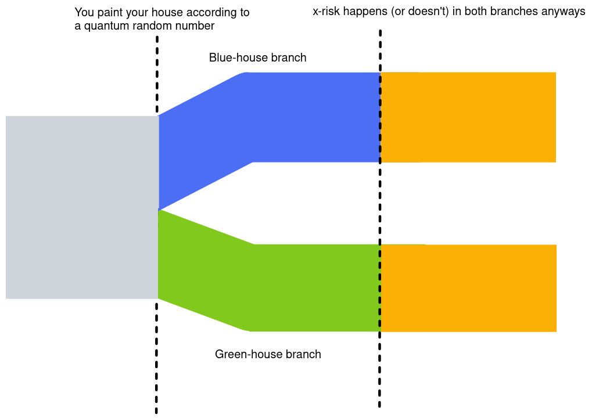
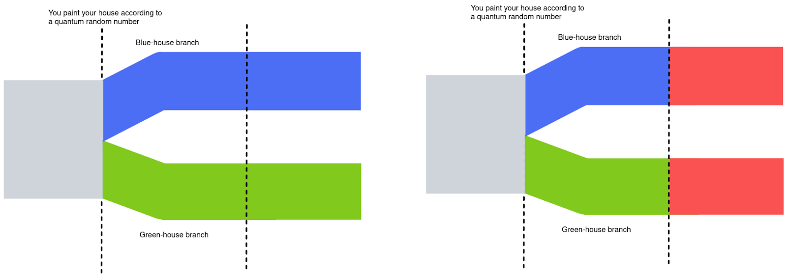
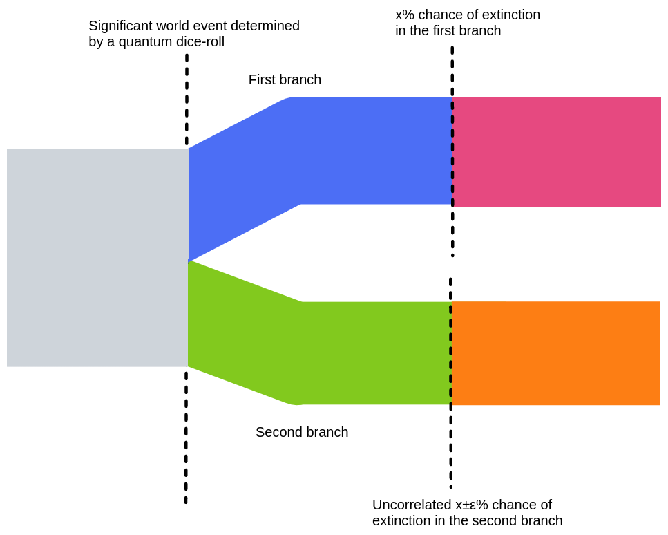
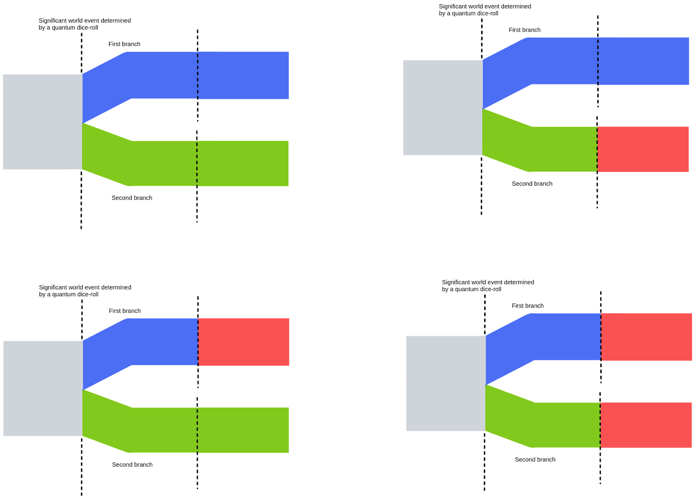
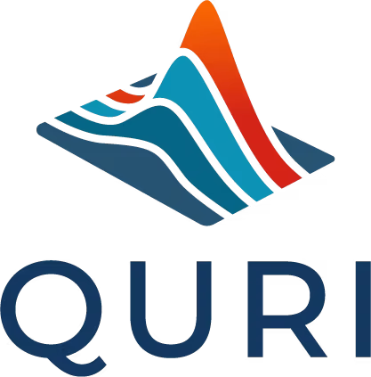

Splitting the timeline as an extinction risk intervention
==============

Edit: No longer as excited. Per [this comment](https://forum.effectivealtruism.org/posts/LKdwFsJXaFKHCE9ms/splitting-the-timeline-as-an-extinction-risk-intervention?commentId=aeRjceosPRoFwLyiP#comments):

> I also think it is astronomically unlikely that a world splitting exercise like this would make the difference between 'at least _one_ branch survives' and 'no branches survive'. The reason is just that there are so, _so_ many branches

and per [this comment](https://forum.effectivealtruism.org/posts/LKdwFsJXaFKHCE9ms/splitting-the-timeline-as-an-extinction-risk-intervention?commentId=LwoszJEaZ3DugiHBo#comments):

> An ingenious friend just pointed out a likely much larger point of influence of quantum particle-level noise on humanity: the randomness in DNA recombination during meiosis (gamete formation) is effectively driven by single molecular machine and the individual crossovers etc likely strongly depends on the Brownian-level noise. This would mean that some substantial part of people would have slightly different genetic makeup, from which I would expect substantial timeline divergence over 100s of years at most (measuring differences on the level of human society).

## Explanation of the idea

Under my understanding of the many-worlds interpretation of quantum mechanics, we have a probability measure, and every time there is a quantum event, the measure splits into mutually unreachable branches.

This in itself doesn't buy you much. If you choose which color to paint your house based on quantum randomness, you still split the timeline. But this doesn't affect the probability in any of the branches that an AI, asteroid or pandemic comes and kills you and everything you care about.

Quantum randomness over small-scale choices doesn't buy you anything...

...because the extinction risk in both worlds is (almost perfectly) correlated

But we could also split the timeline such that the chances of extinction risk happening are less than perfectly correlated in each of the branches.

We choose a significant event according to the result of a random quantum measurement, and we hope this makes extinction risk in each of the branches less correlated.

If the chances of an x-risk in each branch are less correlated, the chances of at least one branch surviving are higher.

This second option doesn't buy you a greater overall measure. Or, in other words, if you're inside a branch, it doesn't increase your probability of survival. But it _does_ increase the probability that at least one branch will survive (For instance, if the probability of x-risk is 50%, it increases it from 50% to 75%).

### Implementation details

I don't really buy the "butterfly effect" as it corresponds to extinction risk. That is, I think that to meaningfully affect chances of survival, you can't just quantum-randomize small-scale events. You have to randomize events that are significant enough that the chances of survival within each of the split timelines become somewhat uncorrelated. So the butterfly effect would have to be helped along.

Or, in other words, it doesn't much matter if you quantum-randomize the color of all houses, you have to randomize something that makes extinction-risk independent.

Further, note that the two branches don't actually have to be independent. You can still get partial protection through partial uncorrelation.

In practice, I'm thinking of splitting our timeline many, many times, rather than only once.

## General randomness vs targeted randomness

### General randomness

Still, one way which one could get enough independence would in fact be to indiscriminately add quantum randomness, and hope that some of it sticks and buys you some uncorrelation. 

For instance, instead of asking his Twitter followers, Elon Musk could have quantum-randomized whether or not to sell $10 billion of stock. This in itself doesn't seem like it would affect extinction risk. But accumulating enough changes like that could add up.

Another way of creating a lot of indiscriminate quantum randomness might be by having [random.org](https://www.random.org/) output random numbers based on quantum effects, in a similar manner to how [this site does](https://qrng.anu.edu.au/), presumably thus affecting the actions of a lot of people. 

One could also build the infrastructure for, e.g., cryptocurrency contracts to access quantum randomness, and hope and expect that many other people build upon them (e.g., to build quantum lotteries that guarantee you'll be the winner in at least some branch). 

These later interventions seem like they could plausibly cost <10 million of seed investment, and produce significant amounts of quantum splitting. Cryptocurrencies or projects in some hyped-up blockchain seem like they could be great at this, because the funders could presumably recoup their investment if newly rich crypto-investors or users find the idea interesting enough.

General, indiscriminate random also seems like it would protect against (anthropogenic) risks we don't know about.

### Targeted randomness

Instead of indiscriminate splitting, one could also target randomness to explicitly maximize the thatindependence of the branches. For instance, if at some point some catastrophe looms large on the horizon and there are mutually exclusive paths which seem like they are roughly equal in probability, we could quantum-randomize which path to take.

An example intervention of the sort I'm thinking about might involve, for example, OpenPhil deciding whether to [invest or not in OpenAI](https://www.openphilanthropy.org/focus/global-catastrophic-risks/potential-risks-advanced-artificial-intelligence/openai-general-support), or doubling down or not on their initial investment, depending on the result of a quantum roll of the dice. Large donor lotteries also seem like they could be a promising target for quantum randomization. One issue is that we don't really know how significant an event has to be to meaningfully change/make independent some probabilities of survival. I would lean on the large side. Something like, e.g., shutting down OpenAI seems like it could be a significant enough change in the AI landscape that it could buy some uncorrelation, but it doesn’t seem that achievable.

Targeted randomness might provide less protection against risks we don't know much about, but I'm not sure.

## Downsides

One big cost could be just the inconvenience of doing this. There are a lot of cases where we know what the best option is, so adding randomness would on average hurt things. It would be good to have a better estimate of benefit (or broad ways of calculating benefit), so that we can see what we’re trading off.

This proposal also relies on the many-worlds interpretation of quantum mechanics to be correct, and this could be wrong or confused. If this was the case, this proposal would be totally useless. Nonetheless, the many-worlds interpretation just seems correct, and I'm ok with EA losing a bunch of money on speculative projects, particularly if the downside seems bounded.

I haven't really thought all that much about how this would interact with existential risks other than extinction. 

## Acknowledgments

This article is a project by the [Quantified Uncertainty Research Institute](https://quantifieduncertainty.org/), 

Thanks to Gavin Leech and Ozzie Gooen for comments and suggestions. The idea also seems pretty natural. Commenters pointed out that Jan Tallin and/or Jan Kulveit came up with a similar idea. In particular, I do know that the acceptance of some students to [ESPR](https://espr-camp.org/) in ¿2019? was quantum-randomized.
