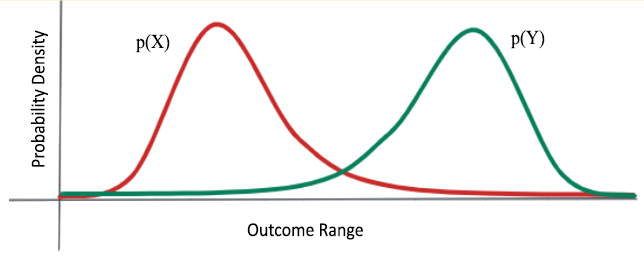
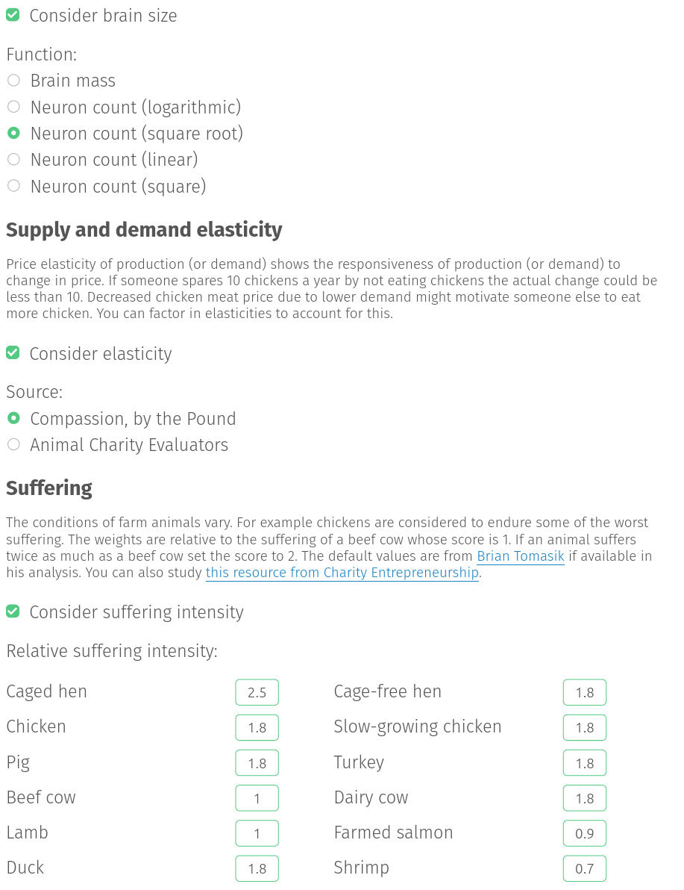
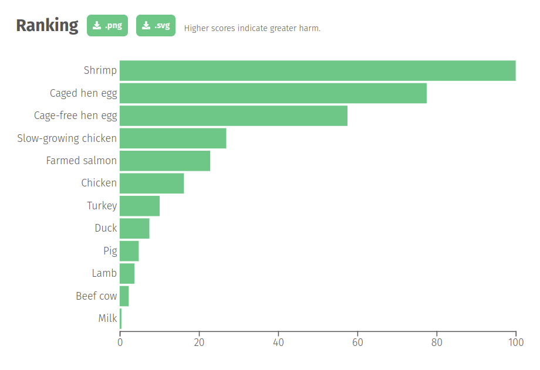

Five steps for quantifying speculative interventions
==============

## Summary

Currently, we can’t compare the impact of speculative interventions in a principled way. When making a decision about where to work or donate, longtermists or risk-neutral neartermists may have to choose an organization based on status, network effects, or expert opinion. This is, obviously, not ideal.

I propose a simple solution, if not an easy one. First, estimate the impact of an intervention in narrow units (such as micro-covids, or estimates of research quality). Then, convert those narrow units to more and more general units (such as QALYs, or percentage reduction in x-risk).

Quantifying the value of speculative interventions to a standard similar to GiveWell’s represents a lot of work on a messy problem. In this post, I’ll break it down to these five steps:

1.  Create narrow units for specific types of interventions
2.  Use narrow units to evaluate interventions
3.  Create more general units, and conversion factors from narrow units to general units
4.  Resolve or quantify crucial considerations in order to generalize further
5.  Scale-up evaluations: do more evaluations, better, more cheaply, about more things.

As we make progress on these subproblems, relative value comparisons would become more robust, principled and transparent, which would improve the quality of our decision-making around funding and prioritization. Decisions about where to work or where to donate might still be informed by some subjective factors (e.g., personal fit, value differences), but they would be more grounded in research and expected utility calculations.

This proposal grew out of my frustrations with quantitatively [evaluating longtermist organizations](https://forum.effectivealtruism.org/posts/xmmqDdGqNZq5RELer/shallow-evaluations-of-longtermist-organizations#Notes) or [EA projects more generally](https://forum.effectivealtruism.org/s/AbrRsXM2PrCrPShuZ) without a developed framework. Nobody has really been doing this kind of evaluation[\[1\]](#fndkvcfr5uhmk), so the infrastructure and know-how is just not there. 

It’s not even clear what the bar for funding longtermist interventions should be–we don’t know how much good "the last longtermist dollar" will [accomplish](https://forum.effectivealtruism.org/posts/cKPkimztzKoCkZ75r/how-many-ea-2021-usds-would-you-trade-off-against-a-0-01). Without that key number, funders have to make grants to the best of their abilities by using heuristics and intuitions, which naturally has limitations.

It has been argued that expected utility calculations can be [misleading or counter-productive](https://forum.effectivealtruism.org/tag/optimizer-s-curse). But these calculations don't have to be perfect, they just have to be better than the alternative—whatever non-quantitative methods people would have used instead. It also doesn’t matter in practice whether one can reach expected value calculations in all their glory, as long as the efforts towards quantification end up paying off (e.g., in terms of better decisions). 

So from my perspective, one of the most powerful tools in the EA arsenal has been left gathering dust, mostly for [unclear](https://forum.effectivealtruism.org/posts/myp9Y9qJnpEEWhJF9/shortform?commentId=eQncvj8td8uCjfcAi) [reasons](https://forum.effectivealtruism.org/posts/GseREh8MEEuLCZayf/nunosempere-s-shortform?commentId=Cq2YTHcLv5NbaKbg3).

In the short term, intuition or heuristics can fill in the gap. But in the long term, as EA moves billions of additional dollars, we will need to upgrade intuition-based human factors to auditable, scalable and more powerful evaluation methods.

## Step 1: Create narrow units for specific types of interventions

The simplest and cheapest way to start seems with units tailored to one particular intervention or type of intervention. I’m going to call these “narrow units”, as opposed to more general (e.g., QALYs, which could denominate many types of interventions) or abstract ones (e.g., measures of “research value”). 

With narrow units, we can ask if a unit captures most of what we care about in an intervention, and evaluate a new unit on that metric. In the case of research at EA organizations, we care about how it directly influences decisions, but also about the further research it enables, the mentorship around it, the prestige that the authors attain, etc. A unit intended to capture the value of research could start by just trying to estimate its impact on decisions, and progressively become more complicated.

Units can be either additive units, where twice as much is twice as good or bad, or non-additive units, where that is not the case. Some examples of additive units are [micro-covids](https://www.microcovid.org/), created for the micro-covid calculator; [discounted impact-adjusted years of work](https://docs.google.com/document/d/1rWfQ3Lja2kYoUm_t9uNqBgEn5nz6KL8fmNP5db8cZRU/edit#heading=h.48uppsoillq), created for 80,000 hours’ evaluation of itself; expected malaria deaths averted per dollar, or [quality and relevance-adjusted research projects](https://forum.effectivealtruism.org/posts/GseREh8MEEuLCZayf/shortform?commentId=gcpxyWFeZ5arrvWMe). Some examples of non-additive units are [Charity Entrepeneurship’s idea scores](https://www.charityentrepreneurship.com/post/using-a-spreadsheet-to-make-good-decisions-five-examples), [Brier scores](https://en.wikipedia.org/wiki/Brier_score), the [h-index](https://en.wikipedia.org/wiki/H-index), academic examination scores (e.g., the [SAT](https://wikiless.org/wiki/SAT?lang=en), [ACT](https://en.wikipedia.org/wiki/ACT_(test)), [GRE](https://en.wikipedia.org/wiki/Graduate_Record_Examinations), [GPA](https://wikiless.org/wiki/Grade_point_average?lang=en), etc.), ELO ratings, or [food grading systems](https://wikiless.org/wiki/Food_grading?lang=en). 

If we can have them, we want additive units. They allow us to easily do calculations, like summing up the estimated value of an organization and dividing it by funding raised to estimate the impact per dollar. On the other hand, non-additive units are much cheaper to create, and they still allow us to produce relative rankings, or to notice directional improvement. For instance, a 2x improvement in the Brier score (one possible “forecasting score”) is not twice as useful, but the Brier score still allows us to get a good sense of which forecasters are the most accurate.

Ideally, narrow units would refer to the end goal of an intervention, but measuring intermediary outputs is still useful. In some cases, it may be the only option. For instance, if two movement-building interventions cost the same but one produces more promising new EAs, we can still choose the second, even if we don’t know how promising new EAs cash out in terms of ultimate impact. Similarly, measuring the usefulness of forecasts is difficult, but we can measure forecast accuracy and incentivize forecasters in proportion to it if we suspect that it strongly correlates with the quality of the decisions the forecasts influence.

A narrow unit doesn't have to be perfect to be useful when comparing interventions within the same cause area. In some cases, it’s possible to show that one option vastly dominates others even when using fairly crude units. For instance, one research group might be significantly more productive or efficient than another, or the [majority of forecasting questions on Metaculus might not matter](https://forum.effectivealtruism.org/posts/zyfeDfqRyWhamwTiL/an-estimate-of-the-value-of-metaculus-questions). In these two cases, the units were crude estimates of research output divided by number of staff, and an index of question usefulness. 

Each of these units attempts to capture something about why or how a given intervention is valuable. They can then be used to track and incentivize progress if the units are more developed, or to sanity-check intuitions if they are fairly imperfect proxies. 

## Step 2: Evaluate interventions using their narrow units

Intervention evaluations vary significantly by legibility, methodology, and effortfulness. Some are more like calculations, others like judgment calls; some include explicit uncertainty bounds, others implicit ones. Some are multi-million dollar months-long affairs; others are brief forum posts.

In order to quantify speculative interventions, we will want our evaluations to be composable. That is, we want evaluations of small-scale interventions to be such that they can be built upon and combined to express more complicated relationships, like the relative value of cause areas or of organizations. We also want to combine estimates of what is most valuable in the abstract with estimates of people’s comparative advantages to produce estimates of what is best for particular people to do. 

For this, it would be useful to have legible evaluations with explicit uncertainty bounds. The legibility helps because to trust the end process, it helps if we can verify each of the components. Explicit uncertainty bounds helps with the mathematical manipulations needed to combine various guesses. Explicit quantification could also help catch and correct human biases.

The examples that I’m aware of that come closest to the type of evaluation that I’m talking about are Gordon Irlam’s [Back of the Envelope Guide to Philanthropy](https://www.beguide.org/index.html) and The Copenhagen Consensus’s list of [most promising interventions](https://www.copenhagenconsensus.com/post-2015-consensus). These two stand out because they are _broad_—they try to evaluate many different types of interventions, and because they are _quantified_—they put a number on the value of the interventions they consider. However, the Back of The Envelope Guide lacks a bit in depth and mostly stays at the general level, and the Copenhagen Consensus mostly keeps itself to mainstream interventions, and they are both a bit outdated.

The EA community also has some examples of evaluations that are somewhat similar to what I’m proposing, but which fall short in breadth, quantification, composability:

*   [Animal Charity Evaluators](https://animalcharityevaluators.org/), focuses on animal welfare, but their evaluations are non-quantified and thus [on occasion](https://forum.effectivealtruism.org/posts/KtNvfogcxLNfc2dsD/announcing-our-2021-charity-recommendations#comments) subject to opaque judgment calls.
*   [The Abdul Latif Jameel Poverty Action Lab (J-PAL)](https://www.povertyactionlab.org/), focusing almost on interventions in global development
*   Larks' non-quantified [evaluations](https://forum.effectivealtruism.org/posts/K7Z87me338BQT3Mcv/2020-ai-alignment-literature-review-and-charity-comparison) of the research output of AI alignment research organizations
*   My own [very shallow evaluations](https://forum.effectivealtruism.org/posts/xmmqDdGqNZq5RELer/shallow-evaluations-of-longtermist-organizations) of longtermist organizations, using mostly custom or no units for each evaluation

Of course, there is GiveWell. Their method is to evaluate each organization on its own terms, using its own units (e.g., expected deaths of malaria averted, doublings of consumption, etc.). GiveWell then converts these evaluations to “doublings of consumption equivalents” (see step 3: more and more general units). This method is justifiably expensive; GiveWell spent around $8.5M in salaries and other expenses in 2020 to move [hundreds of millions of dollars](https://blog.givewell.org/2021/11/12/givewells-money-moved-in-2020/).

However, though widely considered a gold standard for impact evaluation, GiveWell’s evaluations lack some nice properties, such as composability and the explicit use of distributions. This means that one can’t just take GiveWell’s approach and expand it to another area, like one could with e.g., the [microcovid calculator](https://www.microcovid.org/). They are also constrained to global health and development interventions.

If we are aiming, either as individuals or as a community, to do the most good we can do, we need to be able to determine what the most good actually is. For this, we need to be able to evaluate many things in a way which enables comparisons between different types of things. In this, quantified evaluation, with explicit uncertainty bounds and other bells and whistles, would really shine.

## Step 3: Create more general units, and conversion factors from narrow units to general units.

From tonnes of CO2 emissions, we generalize to [CO2-equivalents](https://en.wikipedia.org/wiki/Global_warming_potential). From micro-covids, to [micromorts](https://en.wikipedia.org/wiki/Micromort). From lives saved from malaria, or people cured from blindness, to Quality-Adjusted Life Years (QALYs). These can in turn be generalized further, e.g., from QALYs to "intensity-of-consciousness adjusted QALYs". This allows us to compare human and [animal interventions](https://reducing-suffering.org/how-much-direct-suffering-is-caused-by-various-animal-foods/#Results_table), or to compare different types of animal suffering interventions to each other.

To do this kind of generalization, it is necessary to have “conversion factors” from narrower to broader units [\[2\]](#fniv51a8rld3f). Health interventions can be compared by tallying how much pain and suffering they each avert, in QALYs. Then that suffering can be compared to economic interventions by having some conversion between doubling of consumptions and QALYs. This information can be found by doing surveys of potential beneficiaries, or by studying their revealed preferences. That in turn can be compared to climate change interventions—e.g., as in [this post](https://forum.effectivealtruism.org/posts/GEM7iJnLeMkTMRAaf/updated-global-development-interventions-are-generally-more)—by coming up with an estimate for the social cost of carbon. Then we can estimate the value of the long-term future, and come up with a (very uncertain) estimate of how much we should trade off a chance of affecting the world in the short term now vs a chance of affecting the long-term future.

As we generalize our units, our confidence intervals become wider. We might be very sure that we emitted such-and-so-many tonnes of such a gas, not exactly sure how many CO2-equivalents that is, and very unsure about how many QALYs this destroys. 

It’s unclear whether this growing uncertainty will pose a practical problem. If uncertainty is extremely high, we might want to invest more time into applied global priorities research, or into [revelatory grantmaking](https://en.wikipedia.org/wiki/Multi-armed_bandit) (making funding decisions not only in terms of their raw expected value, but also in terms of the expected value of the information they provide). Conversely, if each distribution is spread across many orders of magnitude, it might still be relatively clear which among many options is optimal. I’d imagine we’d find a mix of the two, but also that quantification would be much better than human intuition at differentiating the two cases[\[3\]](#fntgic4g8u64r).

The red and the green distribution could range over many orders of magnitude, and it might still be clear which one is the better bet.

Less elegantly, we could use “willingness to pay” as a way to convert all units into money by relying on revealed preferences. This has the advantage that it is instant and easy to do, but the disadvantage is that it might capture biased or suboptimal actions. Ozzie Gooen and others have suggested using “[enlightened willingness to pay](https://forum.effectivealtruism.org/posts/9Xz7ucKYKkiPTZc9h/best-units-for-comparing-personal-interventions)” instead, an estimate of what one’s willingness to pay would be if they thought more about it and had more information.

Normally, we will have two types of uncertainty that seem worth separating. On the one hand, we have uncertainty about how much X we have (how many deaths from malaria are prevented, how many covid cases, how many percentage points in existential risk reduction). And on the other hand, we have uncertainty about how good X is compared to other things (e.g., how good is preventing deaths from malaria is in comparison to preventing other diseases, or how good human suffering interventions are compared to animal suffering interventions, or to reducing existential risk). We’ll want to capture uncertainty of the first type in narrow units, and uncertainty of the second type in the conversion factors from narrow to more general units.

We can’t observe "percentage points in existential risk reduction." But we can estimate it by forecasting the existential risk before and after an intervention. Prediction could also [amplify](https://forum.effectivealtruism.org/posts/ZTXKHayPexA6uSZqE/part-2-amplifying-generalist-research-via-forecasting) a trusted forecaster to do this, i.e., have other forecasters, prediction markets or machine learning systems try to predict what the trusted forecaster will think. In practice, current forecasting systems are too weak to reliably do this, so improving forecasting may be another priority to improve our ability to do good evaluations.

Lastly, if other methods fail, [enough comparisons between elements of interest can be enough to generate a unit, or a scale](https://forum.effectivealtruism.org/posts/9hQFfmbEiAoodstDA/simple-comparison-polling-to-create-utility-functions). For instance, we have a bunch of papers on a topic, we can pick one that’s about in the middle, give it a value of “1 quality adjusted paper”, and estimate the value of other papers as their relative value compared to the reference paper. This would be a rudimentary measure of quality, but might still beat the h-index in helping determine who the most valuable authors are.

## Step 4: Resolve or quantify crucial considerations in order to generalize further

As two interventions grow more and more different, the relevant considerations for comparing  them grow more and more abstract, philosophical, or value-dependent. These crucial considerations might include: 

*   How easy is high-fidelity movement-building?
*   How valuable are different types of animals compared to humans?
*   How heavily should you discount the future?
*   How many people haven’t been born yet?
*   What is the return rate of the best investment opportunities that EA has access to?
*   Is faster economic growth good?
*   How valuable is reducing suffering compared to increasing happiness?

For the crucial considerations that are particularly value-dependent, quantification tooling could ask the user about their best guesses on some of these controversial parameters (e.g., the discount rate, the value drift rate, the probability of success of various interventions, the value of human vs animal lives, etc.), and then carry out calculations using those guesses. [Food Impacts has such a tool](https://foodimpacts.org/) for animal suffering prioritization: 

[Food Impacts](https://foodimpacts.org/ ): Which animal products should we avoid? h/t Vivian Belenky.

More sophisticated versions of this kind of tool could let users bake in different assumptions. For example, we could add in the [time horizon](https://en.wikipedia.org/wiki/Global_warming_potential#Importance_of_time_horizon) over which greenhouse gases have a warming effect, the value of saving the life of a five-year-old child vs a ten-year-old child, or the ratio of the value of various animal lives to a human life.

As another example, [GiveWell's spreadsheet](https://docs.google.com/spreadsheets/d/1B1fODKVbnGP4fejsZCVNvBm5zvI1jC7DhkaJpFk6zfo/edit#gid=1362437801) allows one to tweak how valuable "a statistical life saved from malaria" is compared to "a doubling in consumption". But it doesn't allow for changing the assumption that different doublings of consumption are differently valuable.

As our tools become more sophisticated, the quantifications they output might become more modular and composable, more akin to computer programs than to excel spreadsheets or webpages. For instance, the user could set a utility-of-consumption function that isn't logarithmic, which might value doublings more at lower levels of consumption, or which takes into account the shape of possible poverty traps.

Crucial considerations could also be resolved by better long-term forecasting capabilities, increasing the importance of investing in them. This might involve creating very liquid prediction markets for topics of interest, finding out the equivalent of superforecasting techniques for time-series predictions, or other approaches, but this is out of scope for this piece.

## Step 5: Scale up evaluations

If the infrastructure to quantify uncertain interventions exists and proves valuable, it can be scaled, potentially even automated.

There are three obvious ways to scale:

1.  More conventional researchers: more people doing a larger number of more in-depth evaluations.
2.  Crowdsourcing to larger communities: Have forecasters predict what the results of an evaluation would be, and expensive evaluations are only carried out some of the time (cf. [amplification](https://forum.effectivealtruism.org/posts/ZCZZvhYbsKCRRDTct/part-1-amplifying-generalist-research-via-forecasting-models))
3.  Automation: Use software to automate some of the evaluation steps, either by building workflows, pipelines, templates, etc., or by trying to use some machine learning approach, e.g., using Ought’s assistant. (cf. [pedant](https://forum.effectivealtruism.org/posts/xue4yQ5rn6iDsHdmM/pedant-a-type-checker-for-cost-effectiveness-analysis), [squiggle](https://github.com/foretold-app/squiggle))

Consider hedge-funds, which have specialized teams of researchers, programmers, and traders, with each of these teamsi aided by research assistants, test engineers, and specialized software. Likewise, to lengthen their reach, current grantmakers could augment their abilities with computer assistance, delegate part of their work to junior people, or eventually just oversee automated processes.

Although I’ve mostly been talking about complex and expensive evaluations, we could also go in the other direction: have many more very cheap evaluations, about many more things. Purely automated measures (such as citation count), or crowdsourced measures (like Amazon Reviews) could also be cost-effective, because they will tend to be very cheap. For example, when developing [Metaforecast](https://metaforecast.org/), I implemented some crude 1-5 rankings of the quality of predictions. These are very imperfect, but still useful enough to be of practical use, and they could be automated.

Note that efficiency increases in evaluation might make very new approaches viable: if all actions or all politicians or the optimal career for a large number of people can be evaluated, this might expand the domains which can be optimized. If you’re a software engineer and this sounds like something you might want to build, I want to [hear from you](mailto:nuno@quantifieduncertainty.org).

## Conclusion

Cheap and simple estimation tools (non-additive units, or [unitless evaluations](https://animalcharityevaluators.org/charity-reviews/all-charity-reviews/), or intuitive evaluations) were fine and even unavoidable as EA was growing up. But as EA’s scope increases it makes sense to invest in more expensive and complicated tools. Longtermism especially faces a significant challenge. Before GiveWell got started, there was already a broader ecosystem around global health and development which could be built upon–not so in the case of longtermism.

Right now, it doesn't seem like there is that much of a central nervous system that is quantifying, prioritizing and exploring longtermist interventions. Open Philanthropy does commission occasional thorough birds-eye-view reports to inform their worldview, but overall the state of things could be much more quantified.

There is room for an organization that quantifies and compares large numbers of possible interventions to recommend the best ones. But before this, or before other quantification initiatives are possible, we need to build the tooling and the know-how, maybe by following the steps outlined above.

This is part of what we have been doing at the Quantified Uncertainty Research Institute. On the research side, we have my series on [estimating value](https://forum.effectivealtruism.org/s/AbrRsXM2PrCrPShuZ), as well as efforts to make [forecasting more accessible](https://metaforecast.org/). And on the programming and tooling side, we have [Guesstimate](https://www.getguesstimate.com/), [Foretold](https://www.foretold.io/) and most recently, [Squiggle](https://www.lesswrong.com/posts/i5BWqSzuLbpTSoTc4/squiggle-an-overview). If this sounds interesting to you, consider [reaching out](mailto:nuno@quantifieduncertainty.org) to work with us as a contractor or as a collaborator.

I believe that a rigorous evaluation framework for quantified uncertainty is well worth attempting. But it could easily be worth nothing if decision-makers don’t use these tools. If you’re currently working in grantmaking (and also if you don’t), I want to hear from you. Does this approach seem useful to you? Would you use these kinds of tools, or would you want your successors to? If not, why not? Please let me know in the comments, or reach out over [email](mailto:nuno@quantifieduncertainty.org).

## Acknowledgments 

  
 

This post is a project by the [Quantified Uncertainty Research Institute](https://quantifieduncertainty.org/). It was written by Nuño Sempere. Thanks to Ozzie Gooen, Eli Lifland, Gavin Leech, Misha Yagudin, Michael Townsend, Michael Aird and Linch Zhang for their comments and suggestions, and to Vivian Belenky for thoughtful editing.

1.  **[^](#fnrefdkvcfr5uhmk)**
    
    I’m not sure whether, e.g, OpenPhil has more hardcore expected value calculations in the background. On the one hand, it wouldn’t be all that surprising. But on the other hand, I am still pretty sure that they are missing a systematic approach. For instance, their division into focus areas is kind of inelegant from an expected utility perspective. They're also doing calculations from a much higher "birds-eye view", so even if OpenPhil has their expected utility calculations down-pat, there would still be room for their incorporation in smaller funders.
    
2.  **[^](#fnrefiv51a8rld3f)**
    
    For instance, the IPCC estimates that one tonne of methane is as bad as thirty tonnes of CO2 over a hundred years, and GiveWell  [estimates](https://docs.google.com/spreadsheets/d/1B1fODKVbnGP4fejsZCVNvBm5zvI1jC7DhkaJpFk6zfo/edit#gid=1362437801) that saving a life under 5 is equivalent to 117x doublings of yearly consumption (e.g., increasing the earning of someone who earns $200 a year to $400 a year, for 117 different people).
    
3.  **[^](#fnreftgic4g8u64r)**
    
    From forecasting, I have the intuition that irreducible uncertainty is actually relatively rare. That is, after deeply understanding a topic—or two topics in the case of comparisons—it seems relatively unlikely that they will have very similar expected values, rather than there being a clear best guess. Specifically, I'm expecting that for any given pair of interventions, reasonable credences about which is better will be more likely to fall in the 70-85% region than the 40-60% region
