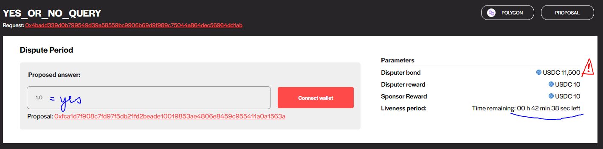

casting Newsletter: February 2022
==============

## Highlights

*   The FTX foundation will potentially give out millions in forecasting
*   Insight Predictions and Futuur have real-money prediction markets on the invasion of Ukraine
*   At least $444k paid out in over the counter bets on the invasion of Ukraine

## Index

*   Thoughts on The FTX Foundation Funneling Funds to Forecasting
*   Prediction Markets & Forecasting Platforms
*   Forecasting Job Board
*   Odds and Ends
*   Long Content

You can sign up for this newsletter on [substack](https://forecasting.substack.com/), or browse past newsletters [here](https://forum.effectivealtruism.org/s/HXtZvHqsKwtAYP6Y7). If you have a content suggestion or want to reach out, you can leave a comment or find me on [Twitter](https://twitter.com/NunoSempere).

## Thoughts on the FTX Foundation Funneling Funds to Forecasting

The FTX Foundation announced a massive [$100M to $1B/year](https://forum.effectivealtruism.org/posts/2mx6xrDrwiEKzfgks/announcing-the-future-fund-1) ([a](http://web.archive.org/web/20220305092711/https://forum.effectivealtruism.org/posts/2mx6xrDrwiEKzfgks/announcing-the-future-fund-1)) Future Fund. Amongst their [areas of interest](https://ftxfuturefund.org/area-of-interest/) ([a](http://web.archive.org/web/20220304222631/https://ftxfuturefund.org/area-of-interest/)) and [project ideas](https://ftxfuturefund.org/projects/) ([a](https://web.archive.org/web/20220301095154/https://ftxfuturefund.org/projects/)) are:

> _More forecasting_. We’re huge fans of prediction markets and forecasting tournaments. We’d love to see these widely adopted and used to inform political decision-making. We’re particularly excited about long-term forecasting (10+ years out), and methods that might make long-term forecasting more feasible.
> 
> _Prediction markets_. We’re excited about new prediction market platforms that can acquire regulatory approval and widespread usage. We’re especially keen if these platforms include key questions relevant to our priority areas, such as questions about the future trajectory of AI development.
> 
> _Forecasting Our World in Data_. We’d love to see a project that takes one hundred of the most important charts in Our World in Data (we think the Technological Progress charts would be especially interesting) and employs superforecasters to plot out how the charts will go over the next one, three, ten, thirty and one hundred years. Ideally, the output would be well-presented and easily understandable, and display probability distributions for each year.
> 
> _Forecasting that will affect important decisions_. We think a key challenge for making forecasting organizations better is ensuring that the questions asked are interesting and important. We’d be especially excited about forecasting projects that have a great plan for ensuring that the questions asked are of significant interest to influential and altruistic actors, potentially including thoughtful government officials and large funders in the EA ecosystem.
> 
> More generally, we’re interested in a “superforecasting institute.” Few jobs are more important than rigorously forecasting the future, but currently it’s hard to do that job full-time. We want to allow excellent forecasters to make superforecasting their career. And we want to explore creating prizes and fellowships that will optimally incentivize outstanding forecasting work.

They also have a [project ideas competition](https://forum.effectivealtruism.org/posts/KigFfo4TN7jZTcqNH/the-future-fund-s-project-ideas-competition) ([a](http://web.archive.org/web/20220305092904/https://forum.effectivealtruism.org/posts/KigFfo4TN7jZTcqNH/the-future-fund-s-project-ideas-competition)), which closes by Monday the 7th, which feels too short, as well as various other [applications](https://ftxfuturefund.org/apply/) ([a](https://web.archive.org/web/20220301041718/https://ftxfuturefund.org/apply/)) on their website.

In comparison and contrast to Open Philanthropy, they seem to be moving fairly quickly. I'm hoping they will donate to smaller and nimbler forecasting projects which have a chance to be very valuable, rather than to larger, already established projects that are more sure to produce a perhaps more certain but also perhaps more mediocre impact.

Some signposts to look at will be:

*   Whether they will use crypto-prediction markets (+)
*   Whether they give money to Tetlock collaborators (-)
*   Whether the projects they invest in will pay forecasters well (+)
*   Whether they invest in projects that interact with large bureaucracies (--)
*   Whether they will use forecasting tournaments (¿-?) or real-money prediction markets (¿+?)
*   Whether forecasting systems will be used to legitimize what one believes (-), or to find out what is the case (+)
*   Whether they will use Hypermind, CultivateLabs infrastructure (-), or more innovative platforms, like Manifold Markets (+)

The observation that I'm trying to point at is that there are sure options that [have been tried before](https://mason.gmu.edu/~rhanson/PromisePredMkt.pdf) ([a](http://web.archive.org/web/20220109141315/https://mason.gmu.edu/~rhanson/PromisePredMkt.pdf)) and [mostly failed](https://forecasting.substack.com/p/looking-back-at-2021) ([a](http://web.archive.org/web/20220210081915/https://forecasting.substack.com/p/looking-back-at-2021)), and innovative options which might feel more risky, and might yet fail, but which explore uncharted lands.

That is, there is an spectrum between three letter intelligence agencies and Polymarket, between superforecasters-trademark-registered and [rogueish crypto traders](https://www.lesswrong.com/users/deluks917) ([a](http://web.archive.org/web/20220304211128/https://www.lesswrong.com/users/deluks917)), between the [$2,500.00 Keep Virginia Safe Tournament](https://www.metaculus.com/tournament/vdh/) ([a](http://web.archive.org/web/20220304211148/https://www.metaculus.com/tournament/vdh/)) and the [Russian Invasion of Ukraine question](https://metaculus.com/questions/8898/russian-invasion-of-ukraine-before-2023/#comment-82655).

My sympathies lie with the later. There are tradeoffs between exploration and stability, between moving fast and being really legible to outsiders, or between interacting with large bureaucracies and everything else. And because forecasting is not yet as useful as I think it could be, I mostly think that exploration is the right choice.

This is not to say that large projects that interact with large bureaucracies such as the US government using Cultivate Labs' stable infrastructure don't have a place. In particular, the tried and true options allow one to conserve [weirdness points](https://forum.effectivealtruism.org/posts/MH9suFZbxXCYsr5Z5/you-have-a-set-amount-of-weirdness-points-spend-them-wisely) ([a](https://web.archive.org/web/20220305153627/https://forum.effectivealtruism.org/posts/MH9suFZbxXCYsr5Z5/you-have-a-set-amount-of-weirdness-points-spend-them-wisely)) while doing something weird somewhere else.

But with FTX spending so much money, they will also get to shape the forecasting community as a whole. Ideally, I would prefer to see a [fully alternative stack](https://thezvi.wordpress.com/2020/01/31/create-a-full-alternative-stack/) ([a](http://web.archive.org/web/20220203225053/https://thezvi.wordpress.com/2020/01/31/create-a-full-alternative-stack/)) in which people can radically focus on "doing the thing". FTX's Fund would be in a position to implement such a thing. But they probably won't. Still, I'm curious about whether FTX's Fund will be willing or able to identify and fund tasteful and ambitious forecasting projects while moving so much money, so fast.

## Prediction Markets & Forecasting Platforms

### Metaculus

[SimonM](https://twitter.com/SmoLurks/) ([a](http://web.archive.org/web/20220202213823/https://twitter.com/SmoLurks/)) kindly curated the [top comments from Metaculus this past February](https://metaculusextras.com/top_comments?start_date=2022-02-01&end_date=2022-03-01) ([a](https://web.archive.org/web/20220305153800/https://metaculusextras.com/top_comments?start_date=2022-02-01&end_date=2022-03-01)). They are:

*   [New highest voted comment of all time](https://www.metaculus.com/questions/8898/russian-invasion-of-ukraine-before-2023/#comment-82655) reports how Metaculus helped an Ukranian escape Kyiv. "Just want to say that I moved from Kyiv to Lviv on Feb 13 /entirely/ thanks to this prediction thread and the Metaculus estimates. (Still in Lviv but leaving Ukraine later today.)."
*   [Russia invades Ukraine](https://www.metaculus.com/questions/8898/russian-invasion-of-ukraine-before-2023/?invite=suIjOH#comment-82347)
*   User [Laplace](https://www.metaculus.com/questions/9930/russian-invasion-of-another-country-in-2022/#comment-82769) ([a](https://web.archive.org/web/20220305153738/https://www.metaculus.com/questions/9930/russian-invasion-of-another-country-in-2022/#comment-82769)) calculates the base rate of Russia invading its neighbours, using a Poisson process.
*   fianxu calls question writers [to arms](https://www.metaculus.com/questions/8898/russian-invasion-of-ukraine-before-2023/#comment-82387)
*   wobblybobby looks at the [distribution for casualties in the Ukrainian-Russian war](https://www.metaculus.com/questions/9935/25k-russo-ukrainian-war-deaths-in-2022/#comment-82899). "Bottom line, estimating under 25,000 deaths requires a near term end to the war. If it drags on, deaths in excess of 50,000 to 100,000 are very likely."

Due to the war in Ukraine, there were an increased number of [quality contributions](https://metaculusextras.com/top_comments?start_date=2022-02-01&end_date=2022-03-01) ([a](https://web.archive.org/web/20220305153800/https://metaculusextras.com/top_comments?start_date=2022-02-01&end_date=2022-03-01)), which might be worth reading. Metaculus mobilized more money to pay for forecasters and created many on-topic questions on short notice. Kudos!

In particular, they created the [Ukraine conflict tournament](https://www.metaculus.com/tournament/ukraine-conflict/) ([a](http://web.archive.org/web/20220225035734/https://www.metaculus.com/tournament/ukraine-conflict/)), which already has 60 questions and a $10k prize pool. They also quickly recruited forecasters and put some thought into how to best structure high-risk forecasting. For instance, some nuclear questions have gone private. Forecasters who already predicted those questions can still see them, so some of you might not have noticed. Metaculus is reviewing their policy on questions like these; they’re working hard and will update when they’re ready. If you would like specific questions you can submit them as normal, or send a message to [Nathan Young](https://twitter.com/NathanpmYoung/status/1499351768261705728) ([a](http://web.archive.org/web/20220304223118/https://twitter.com/NathanpmYoung/status/1499351768261705728)), who has been writing questions around this.

Metaculus also added a feature allowing forecasters to predict on the same question at different points in time. So far, it seems to only be available on [questions](https://www.metaculus.com/questions/9869/flu-hospitalizations-for-ca/) ([a](http://web.archive.org/web/20220304223132/https://www.metaculus.com/questions/9869/flu-hospitalizations-for-ca/)) in the [Flu Sight](https://www.metaculus.com/tournament/flusight-challenge/) ([a](http://web.archive.org/web/20220224002831/https://www.metaculus.com/tournament/flusight-challenge/)) tournament.

### Polymarket

Polymarket used the more novel [Uniswap 3](https://uniswap.org/whitepaper-v3.pdf) ([a](http://web.archive.org/web/20211215034622/https://uniswap.org/whitepaper-v3.pdf)) algorithm to provide liquidity during the [Super Bowl](https://sb.polymarket.com/) ([a](http://web.archive.org/web/20220212064311/https://sb.polymarket.com/)). This allowed users to bet larger amounts without the odds moving as much.

They also introduced a [liquidity mining/trading rewards program](https://docs.polymarket.com/liquidity-mining-and-trading-rewards) ([a](http://web.archive.org/web/20220218015439/https://docs.polymarket.com/liquidity-mining-and-trading-rewards)), to subsidize participants to add liquidity (automatic market-making), as well as high-volume traders. The hope in the community is that this could avoid some damaging kinds of front-running bots ([sandwichers](https://coinmarketcap.com/alexandria/article/what-are-sandwich-attacks-in-defi-and-how-can-you-avoid-them) ([a](http://web.archive.org/web/20211220075613/https://coinmarketcap.com/alexandria/article/what-are-sandwich-attacks-in-defi-and-how-can-you-avoid-them))) by increasing fees for everyone and then doing rebates to all users except those that take part in malicious behaviour.

Polymarket is currently using [UMA](https://medium.com/uma-project/polymarket-integrates-umas-optimistic-oracle-7fa89cae493e) ([a](http://web.archive.org/web/20220214114734/https://medium.com/uma-project/polymarket-integrates-umas-optimistic-oracle-7fa89cae493e)) to resolve their markets. As explained on the Polymarket Discord by Monsieur Dimanche, a well-known community member (taken with permission, and lightly edited):

> There are no markets resolved by the Polymarket team anymore. Everything goes through UMA. However, Polymarket still needs to ask UMA to resolve markets, and users can still use the Discord channel to tell Polymarket that we think a market has met the criteria for resolution.
> 
> What happens next is this: Poly thinks a market is ripe for resolution, so they ask UMA for a settlement. To incentivize this settlement, they give UMA a small amount of money (think 10 to 50 USD) that will be used as rewards. Once this is done, the market lands on [oracle.umaproject.org](https://oracle.umaproject.org/) ([a](https://web.archive.org/web/20220305153843/https://oracle.umaproject.org/)).
> 
> At this point, anyone can propose an outcome for the market in order to earn the reward that Poly gave UMA. But when you do it, you have to bond a large amount of money (thousands of dollars). So you have to be careful before submitting an outcome: if you submit a wrong outcome that is rightfully contested, you will lose your bond. Of course this is intended behaviour, meant to heavily discourage people from proposing bad answers.
> 
> Here's an example. The market for "below 100k cases before April 15" has a current proposed answer of "yes" (meaning it did in fact happen before April 15). If you click on the market you get to this page:
> 
> 
> 
> If nobody contests the proposed answer, the market will resolve "yes" in 42 minutes. Anyone can dispute an outcome but as you can see, it costs $11500 to contest, and of course you lose that amount if you're wrong (if you're right however, you get it back, and it's the original proposer who loses the 11k). This is quite expensive and should deter people from trying dumb contests, like the ones that plagued Augur during the 2020 election aftermath.
> 
> Should an answer be contested, the price to contest would escalate and in the end go to a vote where all UMA tokenholders could vote on the correct outcome.
> 
> In comparison, the first contests for Augur were done with a tiny amount. I remember traders being annoyed that you could block the resolution of a multi million dollar market with the price of a movie ticket.
> 
> Another difference is that the vote would happen within 2-4 days, whereas the Augur process was painfully slow. This, coupled with the high threshold for contest, makes it a vast improvement in practice, even if the general idea stays the same.

On account of reading this, I bought a medium amount of the UMA governance token on [Uniswap](https://app.uniswap.org/#/swap?chain=mainnet) ([a](https://web.archive.org/web/20220303100824/https://app.uniswap.org/#/swap?chain=mainnet)). Polymarket previously was a few steps ahead of the competition when choosing Polygon, and if they are displaying a similar degree of foresight when choosing UMA, the price of its governance token could likewise go up. Also, “a version of Augur that actually works” is a pretty enticing proposition. This is not investment advice, etc., etc.

### Manifold Markets

Manifold markets [received an EA grant](https://manifold.markets/AustinChen/will-manifold-markets-win-an-ea-gra) ([a](http://web.archive.org/web/20220304020932/https://manifold.markets/AustinChen/will-manifold-markets-win-an-ea-gra))

They report over their updates at [Above the fold](https://manifoldmarkets.substack.com/) ([a](http://web.archive.org/web/20220304020959/https://manifoldmarkets.substack.com/)): they've been adding new features at a steadily fast pace. For instance, Manifold now supports free-form answers. So when betting on the 2024 election, one could have an initial lineup including the expected candidates, but if a dark horse candidate rises to prominence, it could later be added.

Manifold also released a [beautifully documented API](https://manifoldmarkets.notion.site/Manifold-Markets-API-5e7d0aef4dcf452bb04b319e178fabc5) ([a](http://web.archive.org/web/20220304021025/https://manifoldmarkets.notion.site/Manifold-Markets-API-5e7d0aef4dcf452bb04b319e178fabc5)).

### INFER

INFER released a [few blogposts](https://www.infer-pub.com/the-pub) ([a](https://web.archive.org/web/20220305153942/https://www.infer-pub.com/the-pub)) outlining their current thinking and future plans. Of these, [Understanding strategic question decomposition](https://www.infer-pub.com/the-pub/question-issue-decomposition) ([a](http://web.archive.org/web/20220222154450/https://www.infer-pub.com/the-pub/question-issue-decomposition)) is worth reading as a cute illustrated recap of the [best current approach](https://cset.georgetown.edu/publication/future-indices/) ([a](http://web.archive.org/web/20211202012714/https://cset.georgetown.edu/publication/future-indices/)) for using forecasting systems to give insight on big picture questions.

They are also running a lottery to give $2,000 to one lucky forecasting team. Teams have to be of 6 people, and the lottery is such that chances are maximized if they predict every day. Suppose that making a forecast one is not ashamed of takes 5 minutes and that 5 new teams are created. Then the expected prize winnings per hour are $2000 \* 60 mins per hour / ( 5 teams \* 5 mins per forecast per day \* 30 days \* 5 forecasters per team ) = $26 / hour, or not enough for me to do it.

INFER also tweaked its algorithm for aggregating predictions to give more deference to better forecasters.

## Forecasting Job Board

Cultivate Labs, the company that maintains the forecasting infrastructure behind Good Judgment Open, INFER, and the Cosmic Bazaar, is [hiring](https://www.cultivatelabs.com/jobs) ([a](http://web.archive.org/web/20220127105259/https://www.cultivatelabs.com/jobs)) for Government Consultant and Senior Rails Developer positions. Applicants must be US citizens.

Amazon is hiring for [Senior Program Manager, Network Forecasting and Planning](https://www.amazon.jobs/en/jobs/1956106/sr-program-manager-network-forecasting-and-planning) ([a](https://web.archive.org/web/20220305154023/https://www.amazon.jobs/en/jobs/1956106/sr-program-manager-network-forecasting-and-planning)), as well as for an ["Applied Scientist"](https://www.amazon.jobs/en/jobs/1946877/applied-scientist-cloudtune-forecasting-and-analytics) ([a](https://web.archive.org/web/20220305154054/https://www.amazon.jobs/en/jobs/1946877/applied-scientist-cloudtune-forecasting-and-analytics)) role for one of their forecasting teams.

The [Quantified Uncertainty Reseach Institute](https://quantifieduncertainty.org/) ([a](http://web.archive.org/web/20220304021054/https://quantifieduncertainty.org/)), the non-profit for which I work, will be hiring for researcher, software engineering, operations specialists, and product manager positions. We write software (like [Squiggle](https://www.squiggle-language.com/) ([a](http://web.archive.org/web/20220304021129/https://www.squiggle-language.com/)) or [Metaforecast](https://metaforecast.org/) ([a](https://web.archive.org/web/20220305154121/https://metaforecast.org/))), and write [research](https://forum.effectivealtruism.org/tag/quantified-uncertainty-research-institute) ([a](http://web.archive.org/web/20220304021207/https://forum.effectivealtruism.org/tag/quantified-uncertainty-research-institute)). If that sounds interesting, consider [reaching out](mailto:nuno.sempere@protonmail.com).

Separately, my network currently has more opportunities for forecasting consulting, tournament creation, and general forecasting-related work than we know what to do with them. If you are an excellent forecaster or an excellent organizer, consider [reaching out](mailto:nuno.sempere@protonmail.com).

Finally, an anonymous benefactor increased the size of this newsletter's [microgrants program](https://forum.effectivealtruism.org/posts/oqFa8obfyEmvD79Jn/we-are-giving-usd10k-as-forecasting-micro-grants) ([a](https://web.archive.org/web/20220305154156/https://forum.effectivealtruism.org/posts/oqFa8obfyEmvD79Jn/we-are-giving-usd10k-as-forecasting-micro-grants)), so if you have a forecasting or epistemics-related project you'd be keen to implement, consider applying. We recently gave our first $5k grant to Clay Graubard, for work related to his [quantified journalism](https://globalguessing.com/russia-ukraine-forecasts/) ([a](https://web.archive.org/web/20220305185040/https://globalguessing.com/russia-ukraine-forecasts/)) on the Ukraine invasion.

## Odds and Ends

Clay Graubard collects how the different forecasting platforms did at predicting the invasion of Ukraine. He [describes the situation](https://inews.co.uk/news/world/russia-ukraine-crisis-super-forecasters-putin-troops-1475721) ([a](http://web.archive.org/web/20220224205549/https://inews.co.uk/news/world/russia-ukraine-crisis-super-forecasters-putin-troops-1475721)) as "not the forecasting community’s finest hour". It's not clear to me that this is a fair assessment:

Not pictured there are prediction markets such as [Insight Markets](https://insightprediction.com/markets/129) ([a](http://web.archive.org/web/20220224130825/https://insightprediction.com/markets/129)), where my forecasting group and I won $20k betting on the Russian invasion, or [Futuur](https://futuur.com/q/tag/ukraine-conflict) ([a](http://web.archive.org/web/20220225193740/https://futuur.com/q/tag/ukraine-conflict)), which likewise has real money markets on Ukraine.

Although I'm fairly sure they're not, they could yet be scams, so prospective participants should tread carefully. That said, I admire the courage of these two platforms for having markets on this topic.

The forecasting community also saw a few over-the-counter bets on Ukraine:

TarasBob paid them all. He also happens to have a surprisingly interesting [website](https://taras.com/) ([a](https://web.archive.org/web/20220225093559/https://taras.com/)).

Various excellent forecasters wrote a bunch about the Ukraine invasion. Michał Dubrawski collects a bunch of them [here](https://twitter.com/MDubrawski/status/1496250612899627009) ([a](http://web.archive.org/web/20220305154822/https://twitter.com/MDubrawski/status/1496250612899627009)), but these pieces become outdated pretty quickly. Zvi likewise covered [various prediction platforms](https://thezvi.wordpress.com/2022/02/28/ukraine-post-1-prediction-markets/) ([a](http://web.archive.org/web/20220228212449/https://thezvi.wordpress.com/2022/02/28/ukraine-post-1-prediction-markets/)) on Ukraine.

The US is facing a helium shortage, and thus [sending fewer atmospheric balloons](https://www.mypanhandle.com/weather/weather-stories/nationwide-helium-shortage-may-affect-weather-forecasting/) ([a](https://web.archive.org/web/20220305154908/https://www.mypanhandle.com/weather/weather-stories/nationwide-helium-shortage-may-affect-weather-forecasting/)), which could affect weather forecasters. The long-run explanation involves US mismanagement, which led to the US [selling off its reserves starting in the 90s](https://en.wikipedia.org/wiki/Helium_production_in_the_United_States) ([a](http://web.archive.org/web/20220304021436/https://en.wikipedia.org/wiki/Helium_production_in_the_United_States)). The short-run explanation also involves US mismanagement, but this time also combined with [over-reliance on Qatar and Russia](https://www.gasworld.com/helium-markets-now-experiencing-helium-shortage-40/2022650.article) ([a](http://web.archive.org/web/20220304021559/https://www.gasworld.com/helium-markets-now-experiencing-helium-shortage-40/2022650.article)).

The [$4k Impactful Forecasting Prize](https://forum.effectivealtruism.org/posts/HDoMrQFG76QtkdrZJ/impactful-forecasting-prize-for-forecast-writeups-on-curated) is still running until the 11th of March. It has not yet [seen many entries](https://manifold.markets/EliLifland/will-the-impactful-forecasting-priz-8792c905ed4e), so the expected value of applying seems high.

NVIDIA released some [complex time-series forecasting infrastructure](https://developer.nvidia.com/blog/time-series-forecasting-with-the-nvidia-time-series-prediction-platform-and-triton-inference-server/) ([a](http://web.archive.org/web/20220304021300/https://developer.nvidia.com/blog/time-series-forecasting-with-the-nvidia-time-series-prediction-platform-and-triton-inference-server/)) (code [here](https://github.com/NVIDIA/DeepLearningExamples/tree/master/PyTorch/Forecasting/TFT) ([a](http://web.archive.org/web/20220304021324/https://github.com/NVIDIA/DeepLearningExamples/tree/master/PyTorch/Forecasting/TFT))) to allow testing many different time-series models.

I enjoyed [Ege Erdil's quantified essay on Computability and Complexity](https://www.metaculus.com/notebooks/9729/computability-and-complexity/) ([a](http://web.archive.org/web/20220208171631/https://www.metaculus.com/notebooks/9729/computability-and-complexity/)) on Metaculus.

## Long Content

[No One Cared About My Spreadsheets](https://www.econlib.org/no-one-cared-about-my-spreadsheets/) ([a](http://web.archive.org/web/20220304021758/https://www.econlib.org/no-one-cared-about-my-spreadsheets/)). Bryan Caplan, the author of _The Case Against Education_, mentions that nobody criticized the painstakingly-made calculations underlying his book.

[Evident Method](https://www.evidentmethod.com) ([a](http://web.archive.org/web/20220304021822/https://www.evidentmethod.com/)) was a forecasting training consultancy by the now presumably very busy [Danny Hernandez](https://twitter.com/hernandez_danny) ([a](http://web.archive.org/web/20220304021847/https://twitter.com/hernandez_danny)). The website is beautiful, and in a world where I had more time, I might want to take over it.

> I’ll show that a 20% improvement in identifying upfront which projects are destined to be failures based on cost is tractable (they were going to take so long that the organization would regret starting them if it’d known the true cost).

---

Note to the future: All links are added automatically to the Internet Archive, using this [tool](https://github.com/NunoSempere/longNowForMd) ([a](http://web.archive.org/web/20220304021930/https://github.com/NunoSempere/longNowForMd)). "(a)" for archived links was inspired by [Milan Griffes](https://www.flightfromperfection.com/) ([a](http://web.archive.org/web/20220304021952/https://www.flightfromperfection.com/)), [Andrew Zuckerman](https://www.andzuck.com/) ([a](http://web.archive.org/web/20220211080149/https://www.andzuck.com/)), and [Alexey Guzey](https://guzey.com/) ([a](http://web.archive.org/web/20220304022034/https://guzey.com/)).

---

> I have their priors, I give them information, I can observe whether they update like a Bayesian would.

— Eva Vivalt
