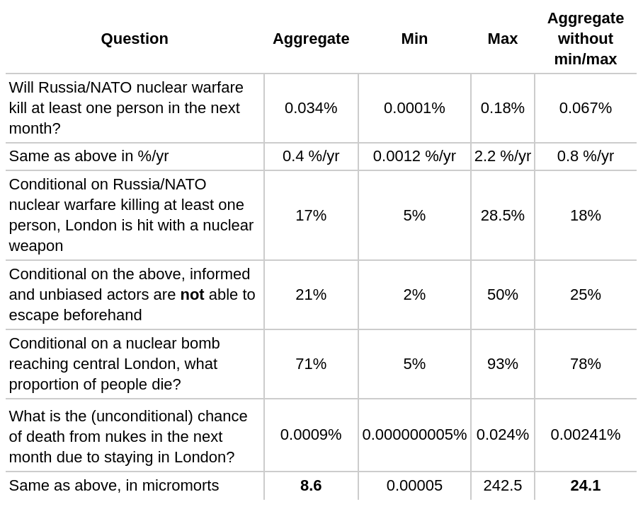
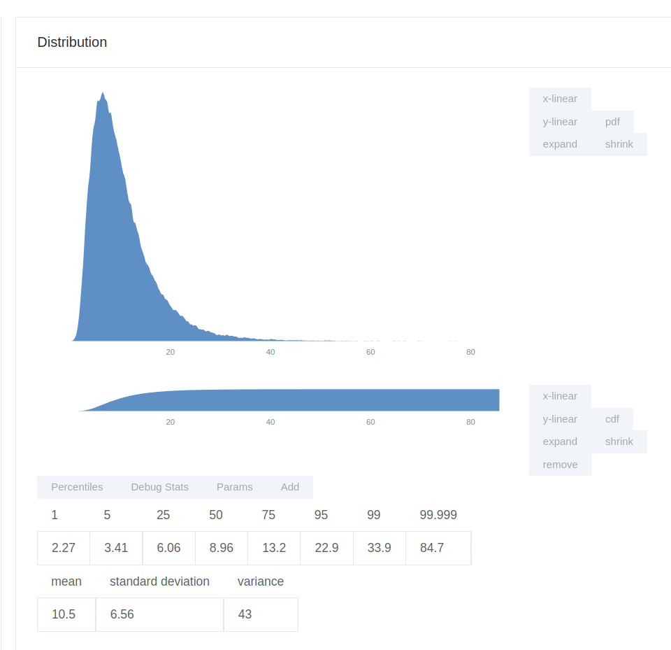
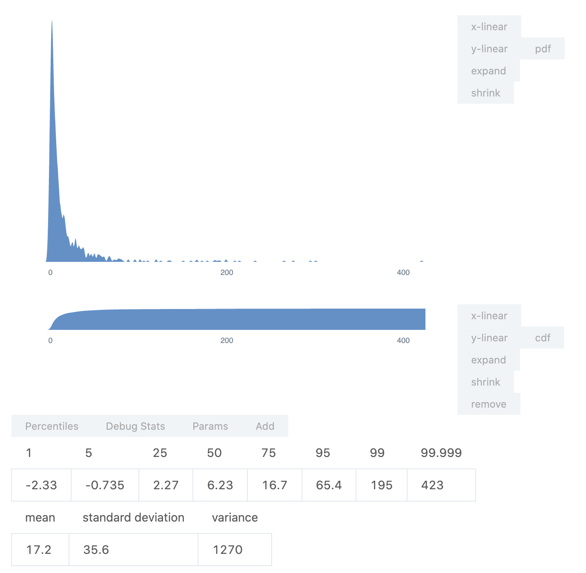

Samotsvety Nuclear Risk Forecasts — March 2022
==============

_Thanks to Misha Yagudin, Eli Lifland, Jonathan Mann, Juan Cambeiro, Gregory Lewis, @belikewater, and Daniel Filan for forecasts. Thanks to Jacob Hilton for writing up an earlier analysis from which we drew heavily. Thanks to Clay Graubard for sanity checking and to  Daniel Filan for independent analysis. This document was written in collaboration with Eli and Misha, and we thank those who commented on an earlier version._

## Overview

In light of the war in Ukraine and fears of nuclear escalation[\[1\]](#fn1tt4cl1ut8si), we turned to forecasting to assess whether individuals and organizations should leave major cities. We aggregated the forecasts of 8 excellent forecasters for the question _**What is the risk of death in the next month due to a nuclear explosion in London?**_ Our aggregate answer is 24 micromorts (7 to 61) when excluding the most extreme on either side[\[2\]](#fnl2youss95ij). A micromort is defined as a 1 in a million chance of death. Chiefly, we have a low baseline risk, and we think that escalation to targeting civilian populations is even more unlikely. 

For San Francisco and most other major cities[\[3\]](#fncfroiodaps), we would forecast 1.5-2x lower probability (12-16 micromorts). We focused on London as it seems to be at high risk and is a hub for the effective altruism community, one target audience for this forecast.

Given an estimated 50 years of life left[\[4\]](#fnpt69xmy0uqf), this corresponds to ~10 hours lost. The forecaster range without excluding extremes was <1 minute to ~2 days lost. Because of productivity losses, hassle, etc., we are currently not recommending that individuals evacuate major cities. 

## Methodology

We aggregated the forecasts from eight excellent forecasters between the 6th and the 10th of March. [Eli Lifland](https://www.elilifland.com/), [Misha Yagudin](https://forum.effectivealtruism.org/users/misha_yagudin), [Nuño Sempere](https://nunosempere.com/), [Jonathan Mann](https://jonathanmann.github.io/) and [Juan Cambeiro](https://twitter.com/juan_cambeiro)[\[5\]](#fntfhokbz7tk) are part of Samotsvety, a forecasting group with a good track record — we won CSET-Foretell’s first two seasons, and have great track records on various platforms. The remaining forecasters were [Gregory Lewis](https://www.fhi.ox.ac.uk/team/lewis-gregory/)[\[6\]](#fnmz4wxunrpnc), @belikewater, and [Daniel Filan](https://danielfilan.com/), who likewise had good track records. 

The overall question we focused on was: _**What is the risk of death in the next month**_[\[7\]](#fnazu0qsuph3h) _**due to a nuclear explosion in London?**_. We operationalized this as: “If a nuke does not hit London in the next month, this resolves as 0. If a nuke does hit London in the next month, this resolves as the percentage of people in London who died from the nuke, subjectively down-weighted by the percentage of reasonable people that evacuated due to warning signs of escalation.” We roughly borrowed the question operationalization and decomposition from [Jacob Hilton](https://docs.google.com/document/d/17q-Ok4EVV42IscLMFOLztht7i0iLiALx0DFcX3xLn-A/edit?pli=1#heading=h.9vfmnuhgbjzv).

We broke this question down into:

1.  What is the chance of nuclear warfare between NATO and Russia in the next month?
2.  What is the chance that escalation sees central London hit by a nuclear weapon conditioned on the above question?
3.  What is the chance of not being able to evacuate London beforehand?
4.  What is the chance of dying if a nuclear bomb drops in London?

However, different forecasters preferred different decompositions. In particular, there were some disagreements about the odds of a tactical strike in London given a nuclear exchange in NATO, which led to some forecasters preferring to break down (2.) into multiple steps. Other forecasters also preferred to first consider the odds of direct Russia/NATO confrontation, and then the odds of nuclear warfare given that. 

## Our aggregate forecast



We use the aggregate with min/max removed as our all-things-considered forecast for now given the extremity of outliers. We aggregated forecasts using the geometric mean of odds[\[8\]](#fnt1dm5d62pkl).

Note that we are forecasting one month ahead and it’s quite likely that the crisis will get less acute/uncertain with time. Unless otherwise indicated, we use “monthly probability” for our and readers' convenience.

## Comparisons with previous forecasts

We compared the decomposition of our forecast to [Jacob Hilton’s](https://docs.google.com/document/d/17q-Ok4EVV42IscLMFOLztht7i0iLiALx0DFcX3xLn-A/edit?pli=1#) to understand the main drivers of the difference. We compare to Jacob’s revised forecast he made after reading comments on his document. Note that Jacob forecasted on the time horizon of the whole crisis then estimated 10% of the risk was incurred in the upcoming week. We guess that he would put roughly 25% over the course of a month which we forecasted (adjusting down some from weekly \* 4), and assume so in the table below. The numbers we assign to him are also approximate in that our operationalizations are a bit different than his.


We are ~an order of magnitude lower than Jacob. This is primarily driven by (a) a ~4x lower chance of a nuclear exchange in the next month and (b) a ~2x lower chance of dying in London, given a nuclear exchange.

(a) may be due to having a lower level of baseline risk before adjusting up based on the current situation. For example, while [Luisa Rodríguez’s analysis](https://forum.effectivealtruism.org/posts/PAYa6on5gJKwAywrF/how-likely-is-a-nuclear-exchange-between-the-us-and-russia) puts the chance of a US/Russia nuclear exchange at .38%/year. We think this seems too high for the post-Cold War era after new [de-escalation methods have been implemented](https://en.wikipedia.org/wiki/Moscow%E2%80%93Washington_hotline#Background) and lessons have been learnt from close calls. Additionally, we trust the superforecaster aggregate the most out of the estimates aggregated in the post.

(b) is likely driven primarily by a lower estimate of London being hit at all given a nuclear exchange. Commenters mentioned that targeting London would be a good example of a [decapitation strike](https://en.wikipedia.org/wiki/Decapitation_strike#In_nuclear_warfare). However, we consider it less likely that the crisis would escalate to targeting massive numbers of civilians, and in each escalation step, there may be avenues for de-escalation. In addition, targeting London would invite stronger retaliation than meddling in Europe, particularly since the UK, unlike countries in Northern Europe, is a nuclear state. 

A more likely scenario might be Putin saying that if NATO intervenes with troops, he would consider Russia to be "existentially threatened" and that he might use a nuke if they proceed. If NATO calls his bluff, he might then deploy a small tactical nuke on a specific military target while maintaining lines of communication with the US and others using the [red phone](https://en.wikipedia.org/wiki/Moscow%E2%80%93Washington_hotline). 

## Appendix A: Sanity checks

We commissioned a sanity check from [Clay Graubard](https://twitter.com/ClayGraubard?ref_src=twsrc%5Egoogle%7Ctwcamp%5Eserp%7Ctwgr%5Eauthor), who has been following the situation in Ukraine more closely. His somewhat rough comments can be found [here](https://docs.google.com/document/d/18TJLYBXLb3XhNr6BsAM1044V5Zvtxo_xl8B7q6sYjW4/edit).

Graubard estimates the likelihood of nuclear escalation in Ukraine to be fairly low (3%: 1 to 8%), but didn’t have a nuanced opinion on escalation beyond Ukraine to NATO (a very uncertain 55%: 10 to 90%). Taking his estimates at face value, this gives a 1.3%/yr of nuclear warfare between Russia and NATO, which is in line with our 0.8 %/yr estimate. 

He further highlighted further sources of uncertainty, like the likelihood that the US would send [anti-long range ballistic missile interceptors](https://carnegieendowment.org/2020/11/19/new-u.s.-missile-defense-test-may-have-increased-risk-of-nuclear-war-pub-83273), which the UK itself doesn’t have. He also pointed out that in case of a nuclear bomb dropping in a highly populated city, Putin might choose to give a warning. 

Daniel Filan also independently wrote up his own thoughts on the matter: his more engagingly written reasoning can be found [here](https://docs.google.com/document/d/10UeqFuhrdew21DCENeQfSfZTKvWrKaspoE79w0msPf4/edit) (shared with permission): he arrives at an estimate of ~100 micromorts. We also incorporated his forecasts into our current aggregate.

## Appendix B: Tweaking our forecast

Here are a few models one can play around with by copy-and-pasting them into the [Squiggle alpha](https://playground.squiggle-language.com/dist-builder).

### Simple model

```
russiaNatoNuclearexchangeInNextMonth = 0.00067

londonHitConditional = 0.18
informedActorsNotAbleToEscape = 0.25
proportionWhichDieIfBombDropsInLondon = 0.78
probabilityOfDying = russiaNatoNuclearexchangeInNextMonth * londonHitConditional * informedActorsNotAbleToEscape * proportionWhichDieIfBombDropsInLondon

remainlingLifeExpectancyInYears = 40 to 60
daysInYear=365
lostDays=probabilityOfDying*remainlingLifeExpectancyInYears*daysInYear

lostHours=lostDays*24
lostHours ## Replace with mean(lostDays) to get an estimate in days instead
```

### Overcomplicated models

These models have the advantage that the number of informed actors not able to escape, and the proportion of Londoners who die in the case of a nuclear explosion are modelled by ranges rather than by point estimates. However, the estimates come from individual forecasters, rather than representing an aggregate (we weren’t able to elicit ranges when our forecasters were convened).

**Nuño Sempere**

```
firstYearRussianNuclearWeapons = 1953
currentYear = 2022
laplace(firstYear, yearNow) = 1/(yearNow-firstYear+2)
laplacePrediction= (1-(1-laplace(firstYearRussianNuclearWeapons, currentYear))^(1/12))
laplaceMultiplier = 0.5 # Laplace tends to overestimate stuff
russiaNatoNuclearexchangeInNextMonth=laplaceMultiplier*laplacePrediction

londonHitConditional = 0.16 # personally at 0.05, but taking the aggregate here.
informedActorsNotAbleToEscape = 0.2 to 0.8
proportionWhichDieIfBombDropsInLondon = 0.6 to 1
probabilityOfDying = russiaNatoNuclearexchangeInNextMonth*londonHitConditional*informedActorsNotAbleToEscape*proportionWhichDieIfBombDropsInLondon

remainlingLifeExpectancyInYears = 40 to 60
daysInYear=365
lostDays=probabilityOfDying*remainlingLifeExpectancyInYears*daysInYear

lostHours=lostDays*24
lostHours ## Replace with mean(lostDays) to get an estimate in days instead
```



**Eli Lifland**

Note that this model was made very quickly out of interest and I wouldn’t be quite ready to endorse it as my actual estimate (my current actual median is 51 micromorts so ~21 lost hours).

```
russiaNatoNuclearexchangeInNextMonth=.0001 to .003
londonHitConditional = .1 to .5
informedActorsNotAbleToEscape = .1 to .6
proportionWhichDieIfBombDropsInLondon = 0.3 to 1

probabilityOfDying = russiaNatoNuclearexchangeInNextMonth*londonHitConditional*informedActorsNotAbleToEscape*proportionWhichDieIfBombDropsInLondon
remainingLifeExpectancyInYears = 40 to 60
daysInYear=365
lostDays=probabilityOfDying*remainingLifeExpectancyInYears*daysInYear

lostHours=lostDays*24
lostHours ## Replace with mean(lostDays) to get an estimate in days instead
```



## Footnotes

1.  **[^](#fnref1tt4cl1ut8si)**
    
    See e.g. [here](https://forum.effectivealtruism.org/posts/2KRqH5wsymqvhGQge/how-are-you-keeping-it-together) and [here](https://forum.effectivealtruism.org/posts/TkLk2xoeE9Hrx5Ziw/nuclear-attack-risk-implications-for-personal-decision)
    
2.  **[^](#fnrefl2youss95ij)**
    
    3.1 (0.0001 to 112.5) including the most extreme to either side.
    
3.  **[^](#fnrefcfroiodaps)**
    
    Excluding those with military bases
    
4.  **[^](#fnrefpt69xmy0uqf)**
    
    This could be adjusted to consider life expectancy and quality of life _conditional_ on nuclear exchange
    
5.  **[^](#fnreftfhokbz7tk)**
    
    who is also a Superforecaster®
    
6.  **[^](#fnrefmz4wxunrpnc)**
    
    Likewise a Superforecaster®
    
7.  **[^](#fnrefazu0qsuph3h)**
    
    By April the 10th at the time of publication
    
8.  **[^](#fnreft1dm5d62pkl)**
    
    See [When pooling forecasts, use the geometric mean of odds](https://forum.effectivealtruism.org/posts/sMjcjnnpoAQCcedL2/when-pooling-forecasts-use-the-geometric-mean-of-odds). Since then, the author has proposed a [more complex method](https://forum.effectivealtruism.org/posts/biL94PKfeHmgHY6qe/principled-extremizing-of-aggregated-forecasts) that we haven’t yet fully understood, and is more at risk of overfitting. Some of us also feel that aggregating the deviations from the base rate is more elegant, but that method has likewise not been tested as much.