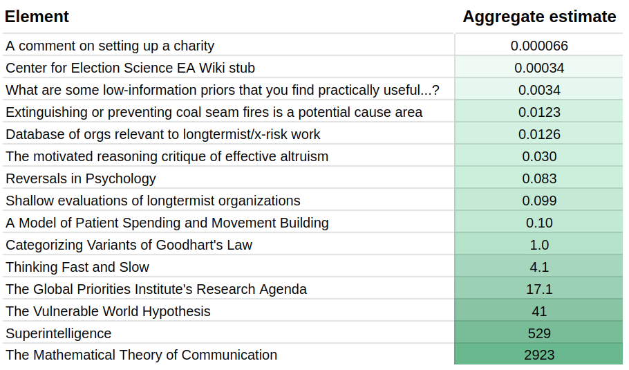
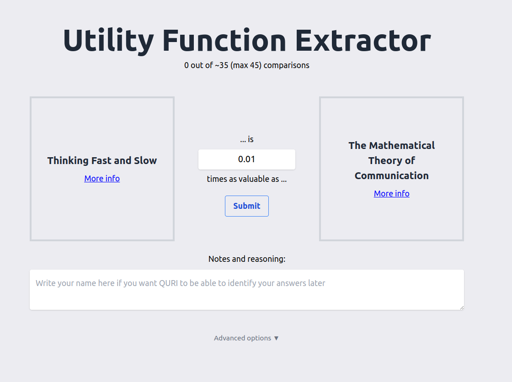
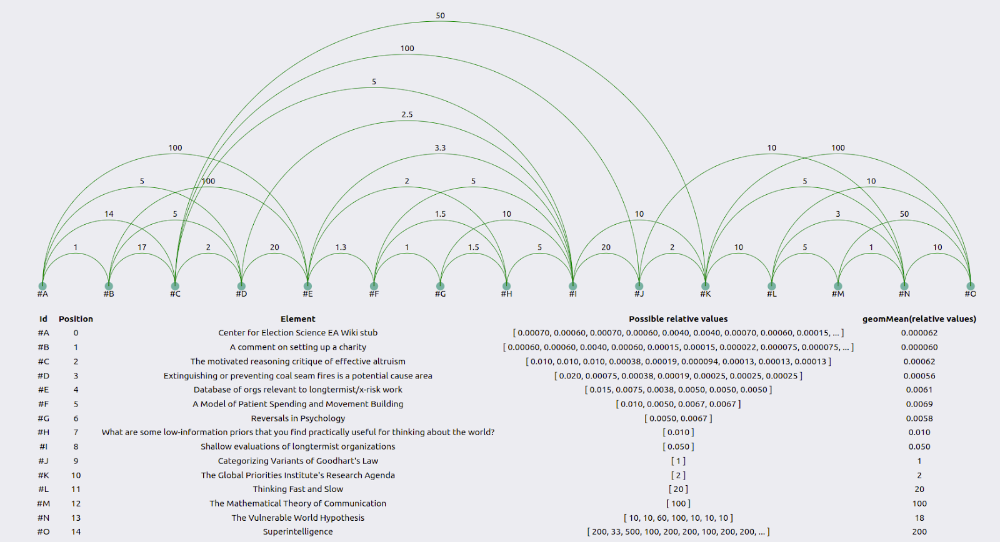
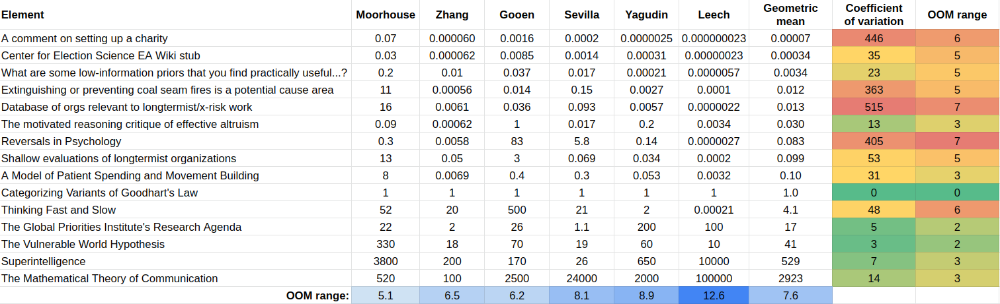
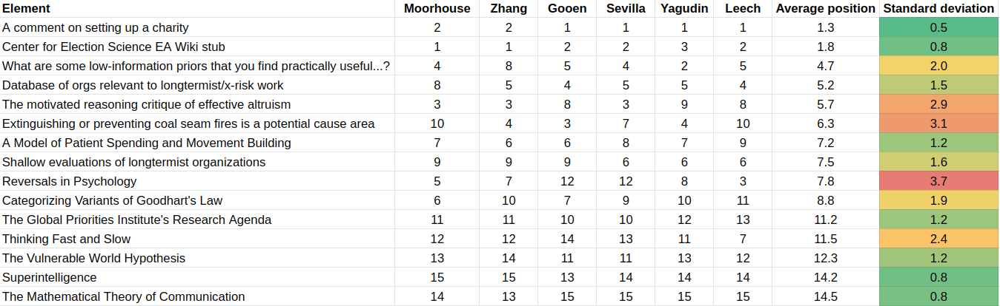
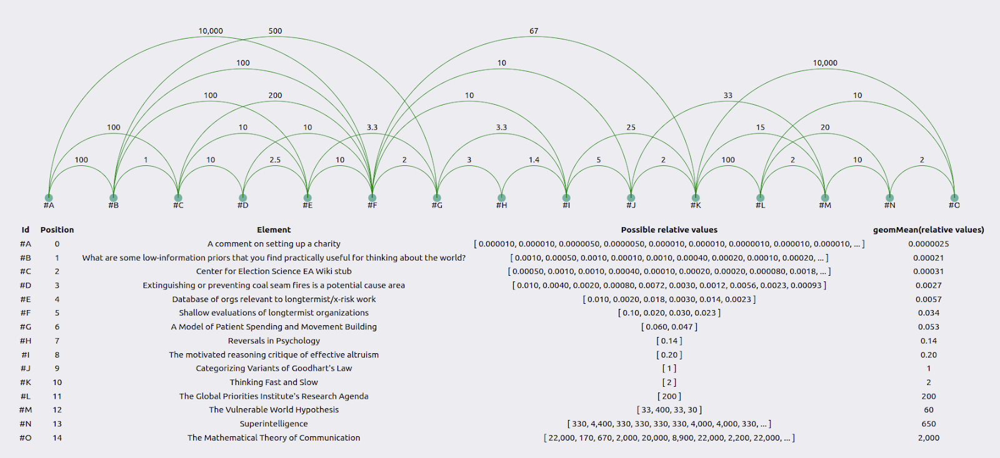
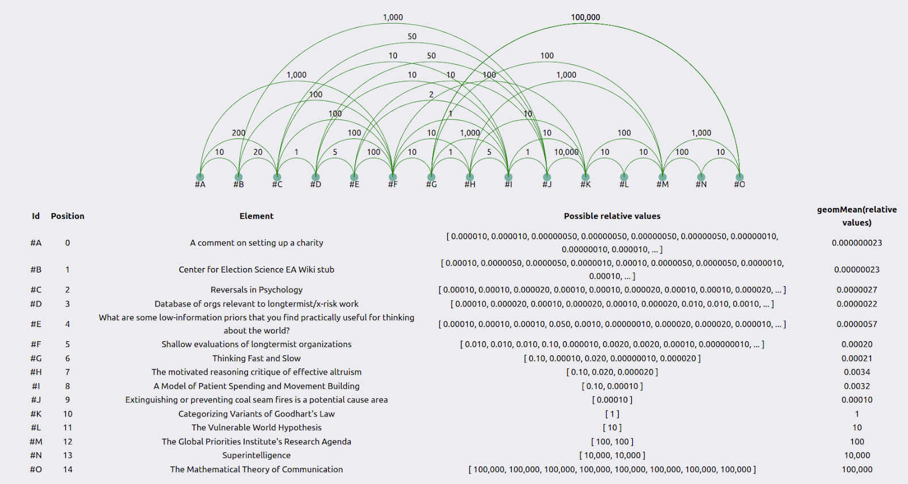

Valuing research works by eliciting comparisons from EA researchers
==============

**tl;dr:** 6 EA researchers each spent ~1-2 hours estimating the value (relative counterfactual values) of 15 very different research documents. The results varied highly between researchers and within similar comparisons differently posed to the same researchers. This variance suggests that EAs might have relatively undeveloped assessments of the value of different projects.

## Executive Summary

Six EA researchers I hold in high regard—Fin Moorhouse, Gavin Leech, Jaime Sevilla, Linch Zhang, Misha Yagudin, and Ozzie Gooen—each spent 1-2 hours rating the value of different pieces of research. They did this rating using a [utility function extractor](https://utility-function-extractor.quantifieduncertainty.org/research), an app that [presents the user with pairwise comparisons](https://forum.effectivealtruism.org/posts/9hQFfmbEiAoodstDA/simple-comparison-polling-to-create-utility-functions) and aggregates these comparisons to produce a utility function.

This method revealed a wide gap between different researchers' conceptions of research value. Sometimes, their disagreement ranged over several orders of magnitude. Results were also inconsistent at the individual level: a test subject might find A to be x times as valuable as B, and B to be y times as valuable as C, but A to be something very different from x\*y times as valuable as C.

It seems clear that individual estimates, even those of respected researchers, are likely very noisy and often inaccurate. Future research will further investigate ways to better elicit information from these people and recommend best guesses for the all-things-considered answers. It is also likely that researchers spending more time would have produced better estimates, and we could also experiment with this in the future.

My guess is that EA funders also have inconsistent preferences and similarly wide-ranging disagreements. That is one of the reasons I am excited about augmenting or partially automating them.

Current aggregate estimates look as follows:

## Motivation

EAs make important decisions based on how valuable different projects seem. For example, EAs can distribute funding based on expectations of future value. In fact, I estimate that the group I studied will cumulatively grant several millions of dollars, both in terms of advising various funds and because they are influential in the longtermist funding space.

Estimating the value of past projects seems easier than estimating the value of future projects, but even that is relatively tricky. We at the Quantified Uncertainty Research Institute are interested in helping to encourage more estimation of previous and future projects, and we are trying to find the best ways of doing so.

The most straightforward experiment we could do was survey a few researchers on their relative estimates of the value of different projects. We did this with six researchers.

My original plan was to create a [unit of research value](https://forum.effectivealtruism.org/posts/3hH9NRqzGam65mgPG/five-steps-for-quantifying-speculative-interventions) based on the aggregate estimates of a group of researchers. Initially, I expected the estimates to be consistent and that the aggregate could be a good best-guess at a “ground truth”. We could then build evaluations and shared assessments on top of them. For instance, forecasting systems could estimate how valuable this trusted group would find a new project and fund it according to their estimate.

However, ratings turned out to be very inconsistent, which made me more sceptical that the individual or aggregate opinion could be a good best guess. Instead, I would now prefer to improve elicitation and aggregation methods before building a forecasting system on top.

Further, core decision-makers might be similarly inconsistent and might be making mistakes accordingly. In that case, further work in this area might also be considered promising.

## Methodology

I asked six researchers to use [the application](https://utility-function-extractor.quantifieduncertainty.org/research) described in [Simple comparison polling to create utility functions](https://forum.effectivealtruism.org/posts/9hQFfmbEiAoodstDA/simple-comparison-polling-to-create-utility-functions) to compare 15 pieces of research. These pieces ranged from [a comment](https://forum.effectivealtruism.org/posts/3PjNiLLkCMzAN2BSz/when-setting-up-a-charity-should-you-employ-a-lawyer?commentId=YNKNcp6nKqxqkZgCu) on the EA Forum to Shannon's foundational text, "The Mathematical Theory of Communication".

The app presents the user with pairwise comparisons. Each comparison asks the user how valuable the first element is, compared to the second (e.g., 10 times as valuable, 0.01 times as valuable). The app internally uses [merge sort](https://en.wikipedia.org/wiki/Merge_sort) to ensure that there can be no cyclical comparisons—so that the user cannot express a preference that A > B > C > A. Readers are encouraged to [play around with it](https://utility-function-extractor.quantifieduncertainty.org/research).

## Results

### Visualization of results

For individual researchers, results can be visualized as follows:

The green lines represent how much more valuable the element to the right is than the element to the left. The table below the graph uses the geometric mean to combine the user’s guesses into an average guess. See the appendix for the method behind this.

When combining the results of all the individuals using the geometric mean—see the appendix for the method—we get a table such as the following:

The coefficient of variation is the standard deviation divided by the geometric mean. “OOM range” stands for “order of magnitude range”, where an order of magnitude is a difference of 10x. The method to calculate the relative values is in the first appendix. 

To create such a table, we need a reference element, which by construction has a value of “1”. In this experiment, that reference element was [Categorizing Variants of Goodhart’s Law](https://arxiv.org/abs/1803.04585). I picked this because it seemed like a very high-quality research output, but not unattainably so, and it was somewhat around the midpoint of value. Further research could determine which element or combination of elements is optimal to pick as a reference point. Further, many reference points could be used, which would have the advantage that, e.g., all guesses would have a coefficient of variation.

### Consistency in ordering

In the app, users stated their value ranges for the differences between elements. In a preliminary analysis, we simplified this data by simply calculating the ordering for each evaluator. The different orderings were as follows:

These are pretty consistent. Some of the most salient differences are:

*   Linch Zhang indicated that the [What are some low-information priors that you find useful…](https://forum.effectivealtruism.org/posts/SBbwzovWbghLJixPn/what-are-some-low-information-priors-that-you-find) —which he wrote—was pretty valuable, whereas other readers did not. Misha Yagudin felt that it was not that valuable at all. 
    *   Though note that Zhang is on the lower end of the crowd for his other piece of writting included in the table: [The motivated reasoning critique of effective altruism](https://forum.effectivealtruism.org/posts/pxALB46SEkwNbfiNS/the-motivated-reasoning-critique-of-effective-altruism)
*   Fin Moorhouse indicated that the [Database of orgs relevant to longtermist/x-risk work](https://forum.effectivealtruism.org/posts/twMs8xsgwnYvaowWX/database-of-orgs-relevant-to-longtermist-x-risk-work) was more valuable than others thought.
*   There were significant disagreements on [Reversals in Psychology](https://www.gleech.org/psych).

### Inconsistency in relative values between users

Yet, what we care about is not relative ordinal position—A is in the first position, but B is in the fifth position. Instead, we care about relative value—A is 10x better than B. The results are as follows:

### Inconsistency within the same researcher

Consider Misha Yagudin’s results:

Zooming in, we see that element #M is 2x as valuable as element #L, #L is 100x as valuable as #K, and #K is 2x as valuable as #J. So overall, #M should be 2\*100\*2 = 400x as valuable as #J. However, Yagudin evaluates it as only 33x as valuable in a face-to-face comparison.

Gavin Leech was generally consistent.

This was because he was paying particular attention to producing consistent estimates. On the other hand, the distance between, for example, #H and #K, was 10 when calculated one way, but 10,000\*1\*5=50,000 when calculated another way.

It would be interesting to calculate the coefficients of variations for each user in future iterations and see which user is the most inconsistent (or whether they are comparably so) and which item elicits the most inconsistency in the users.

It's also worth noting again that participants didn't end up spending all that much time on this, and it's likely that they would have been able to produce more consistent estimates if they had thought longer about it. 

### Raw data

The data and results are in [this git repository](https://github.com/QURIresearch/utility-function-extractor/tree/8ce1a4a8572ec692bc82d39a1bd983216fb0f136/data/results/research). It includes both visualizations and the raw data needed to generate them. 

## Conclusions

### Judgmental assessment

This exercise can be understood as a measure for _noise reduction_. Each researcher knows something about the value of research, but their assessments are noisy and incomplete. So using different comparisons, first by the same researcher and then aggregating the comparisons of many researchers, reduces noise and gets us closer to the ground truth. 

However, this exercise can also be understood as a “garbage in, garbage out” situation. We might have expected that respected researchers had somewhat consistent intuitions about relative values, both individually and between themselves.

And comparisons were indeed somewhat consistent, but not as much as I hoped. So even though aggregation is, in general, a powerful tool that can make, e.g., forecasters’ predictions more accurate, I am less sure about how close this aggregation comes to estimating a “ground truth” in this case.

One particularly worrying difference in opinions is the difference in the range of values. Moorhouse’s range is 5.1 orders of magnitude, whereas Leech’s is 12.6 (the participants’ average is 7.6). 

I am hesitant to extract too many conclusions from this, given that participants only spent roughly an hour on this per person. But at the very least, this work suggests that you and I might hold intuitions that differ much more than we would ever realize without a formal elicitation like this.

### Alternatives and future work

We could perhaps improve this elicitation method by applying lessons from forecasting. We could have a setup similar to the [Delphi method](https://en.wikipedia.org/wiki/Delphi_method) where:

1.  The participants give their first estimates.
2.  They reflect on their estimates and tweak them until they become more self-consistent.
3.  Only then do the participants talk with each other and share and justify their estimates.
4.  Finally, we could aggregate all relative value comparisons.

A different approach would be to rely on one central authority to think hard about different projects' value and produce more coherent and legible comparisons.

Both of these methods would require more upfront investment than this current experiment.

It could be that there has just been very little public discussion of this—so there is still low-hanging fruit that could be valuable to the EA community. It is possible that I am not familiar enough with the relevant elicitation and social choice literature. My impression is that the relevant literature mostly asks for many better/worse binary comparisons, or works with datasets of prices, to run lots of regressions to try to estimate the relevance of different features (thanks to Eva Vivalt for a brief discussion on this). This is more inefficient than trying to come up with a utility function from scratch using relative value comparisons but does require less sophistication from its users.

Further work and clarification in this area could be highly valuable. We could deploy rudimentary tools like the utility function extractor to sanity-check funding decisions. We could also generally invest in more powerful estimation infrastructure and then apply it at scale to relative value estimations to produce combined guesses which are better than our individual, imperfect guesses.

## Acknowledgements

This post is a project by the [Quantified Uncertainty Research Institute](https://quantifieduncertainty.org/). It was written by Nuño Sempere. Thanks to Ozzie Gooen and Gavin Leech for comments and suggestions and Finn Moorhouse, Gavin Leech, Jaime Sevilla, Linch Zhang, Misha Yagudin and Ozzie Gooen for participation in this experiment, and for permission to share their results. 

## Appendix I: Methods to extract relative values

We have several relative comparisons of the sort “A is 10 times as valuable than B”, and “C is 0.1 times as valuable than D”. The way I am calculating relative values is by choosing a reference value, say A, and then taking the geometric mean of all monotonic—either all increasing or all decreasing—paths from the element of interest to A.

So, for instance, suppose we have element B. The monotonic paths from B to A could be:

*   B is 3 times as valuable as X, X is 2 times as valuable as Y, Y is 10 times as valuable as A. This implies that B is 3\*2\*10=60 times as valuable as A
*   B is 5 times as valuable as N, N is 4 times as valuable as A. This implies that B is 5\*4=20 times as valuable as A.
*   B is 25 times as valuable as A.

So, in this case, I would take the geometric mean and say that B is (60\*20\*25)^(1/3) ~ 31 times more valuable than A.

The coefficient of variation is calculated as the standard deviation of the list, divided by the geometric mean. For example, the coefficient of variation is the same for (1, 2, 3) than for (0.1, 0.2, 0.3). This makes it possible to compare the variation of elements in very different orders of magnitude.

## Appendix II: Current and future improvements to the utility function extractor as a result of this experiment

After finishing this experiment, I added several improvements to the utility function extractor that I expect to be useful in future related projects.  

**Distributions over point estimates**

I modified the utility function extractor to allow for uncertain estimates using foretold syntax, e.g., of the sort “1 to 10”, or “normal(5,2)”, or “mm(normal(5,2), 3 to 100)”, rather than point estimates. This is a fairly obvious improvement but would have been harder before [Squiggle](https://github.com/foretold-app/squiggle) was more production-ready. For ease of composability, I send the query to an API endpoint for ease of composability, [https://server.loki.red/squiggle](https://server.loki.red/squiggle).

**Clearer instructions to participants**

Some participants were confused as to what “value” referred to. If I repeat this experiment, I will make sure that users consistently choose one of counterfactual, Shapley, or total values. We could also consider quality, value and counterfactuals separately.

I also added a prompt for participants to write their names to identify their estimates as theirs.

**A more conservative estimation of the number of comparisons**

Initially, I gave the expected number of comparisons needed to build the utility function. But users who went over this mean reported being confused by this.

I then added a reference to the maximum number of steps needed, but this still confused users. Finally, I gave up and made the “expected” value of steps a more conservative number.

**Better visualizations**

I also slightly improved the visualizations.

**Saving database to a server**

Initially, I had problems with the comparisons not being saved to my server. This works now, but I changed my experimental procedure to ensure that I could get the results even if they did not reach the server by providing a way to display them on the web page itself.

**Remaining improvements**

Some remaining improvements might be:

*   Allow people to modify their initial guesses. This is manually allowed, but the interface for doing this is by directly editing a JSON object.
*   Add a measure of how inconsistent comparisons are within one participant. This can be the same coefficient of variation explained above, but for within-participant comparisons. Later, the reference point could be chosen as the point that minimizes the geometric mean of the coefficients of variation.
*   Allow participants to come back another day and do the same exercise and view their comparisons side by side.
*   Structure an experiment so that participants can talk to each other and take time for reflection.
