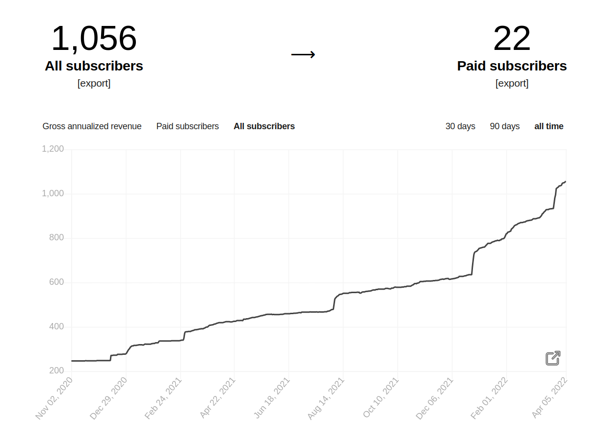
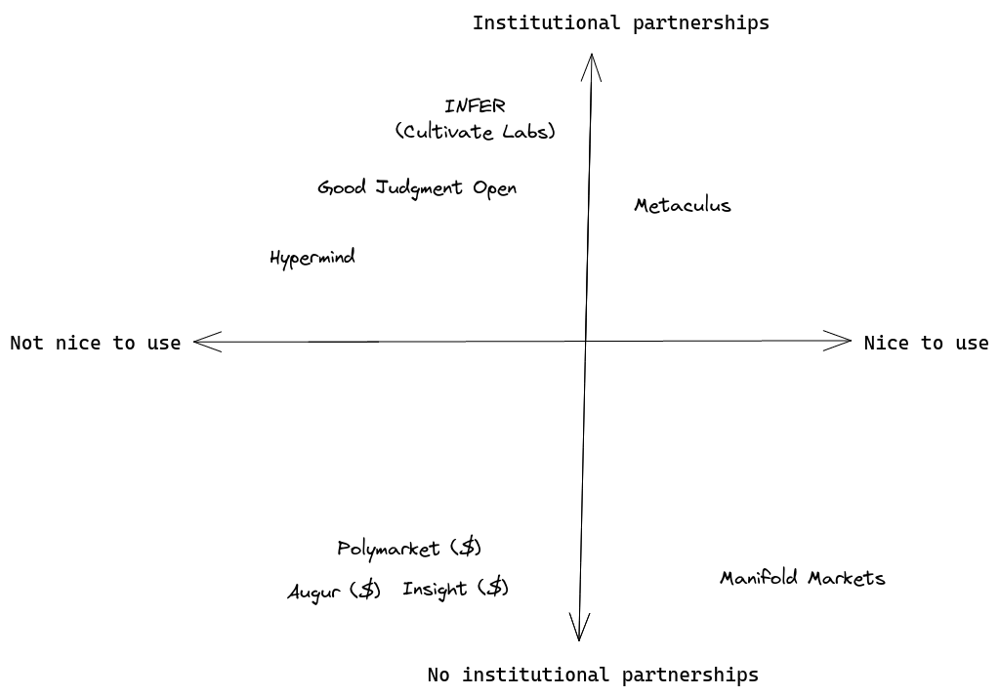
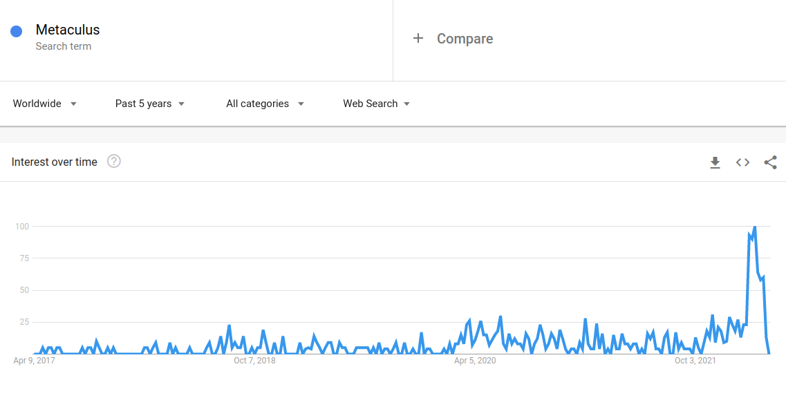
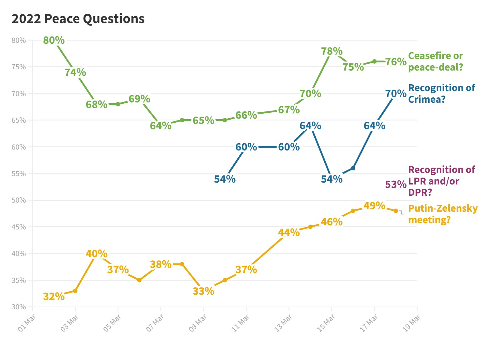
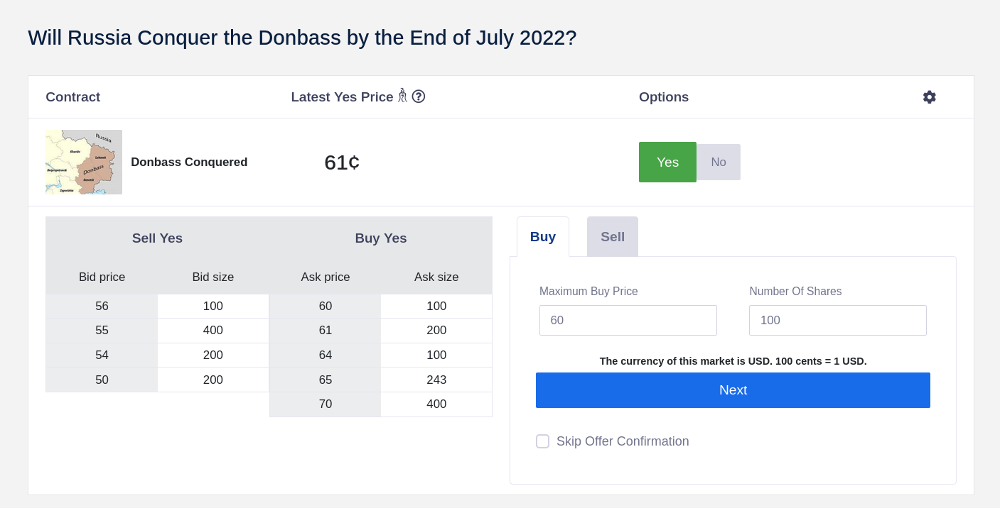
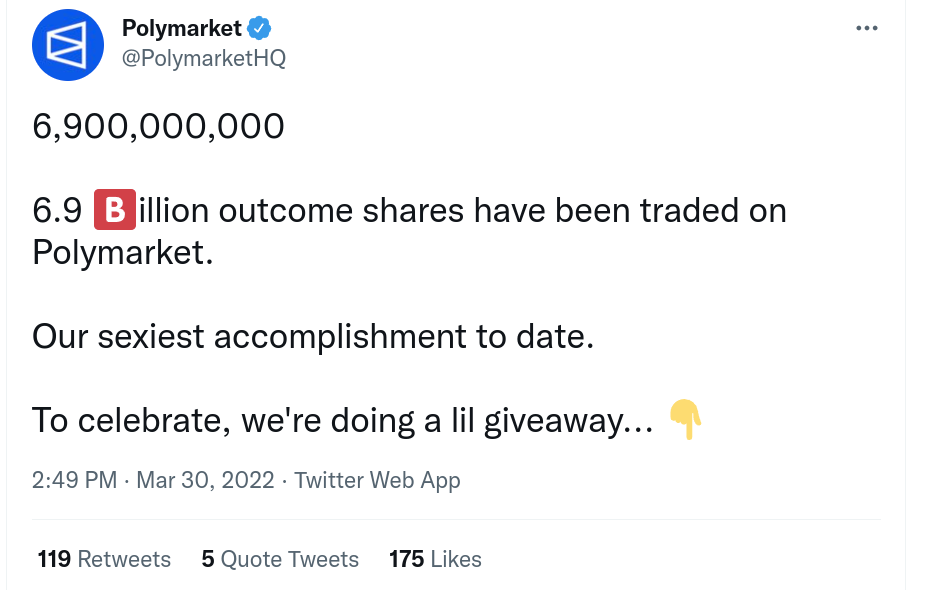
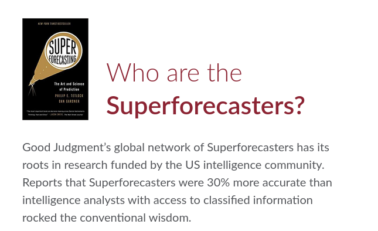
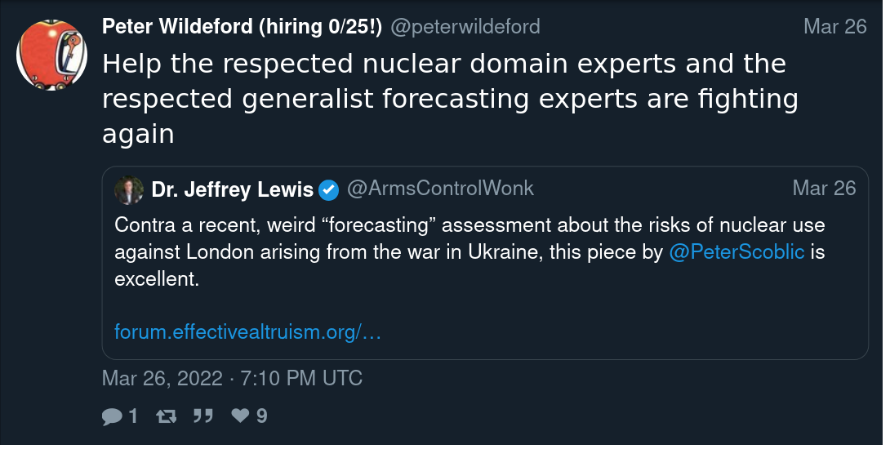
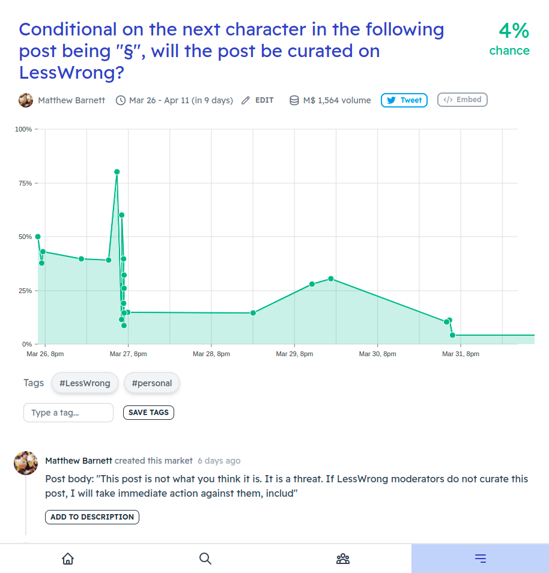

Forecasting Newsletter: March 2022
==============

## Highlights

*   [Comparing top forecasters and domain experts](https://forum.effectivealtruism.org/posts/qZqvBLvR5hX9sEkjR/comparing-top-forecasters-and-domain-experts) finds that past studies mainly were not comparing apples to apples and that the assertion that superforecasters were 30% better than intelligence analysts was unjustified.
*   [Samotsvety's Nuclear Forecasts](https://forum.effectivealtruism.org/posts/KRFXjCqqfGQAYirm5/samotsvety-nuclear-risk-forecasts-march-2022) got picked up in the [Spanish press](https://english.elpais.com/science-tech/2022-03-26/is-it-possible-to-predict-the-future-of-the-war-in-ukraine-online-forecasting-communities-think-so.html) and criticized by a [pessimistic nuclear expert](https://forum.effectivealtruism.org/posts/W8dpCJGkwrwn7BfLk/).
*   [Forecasting Wiki launched](https://forecasting.wiki/wiki/Main_Page)
*   Polymarket is inflating its volume by incentivizing wash trading. (edit: wrong, see [here](https://twitter.com/NunoSempere/status/1511425326701854720))

## Index

*   The state of forecasting
*   Notable news
*   Platform by platform
*   Relevant research

You can sign up for this newsletter on [substack](https://forecasting.substack.com/), or browse past newsletters [here](https://forum.effectivealtruism.org/s/HXtZvHqsKwtAYP6Y7).

## The state of forecasting

On account of getting a plug on one of Spain's most-read newspapers, this newsletter has reached 1,000 subscribers:

You can find a market on when it will reach 2000 [here](https://manifold.markets/Nu%C3%B1oSempere/when-will-my-newsletter-reach-2000).

So I thought I would summarize the state of forecasting as I see it, striving to be informative to new readers. If you're already familiar with the key points, you might want to skip to the next section.

The main problem is bullshit or lack of epistemic virtue and ability. The US misled itself into thinking that Iraq still had weapons of mass destruction or that [everything would be okay in Afghanistan](https://forecasting.substack.com/p/looking-back-at-2021?s=w) ([a](http://web.archive.org/web/20220304222048/https://forecasting.substack.com/p/looking-back-at-2021?s=w)). People were not expecting covid to last so long. And everyone keeps expecting a better brand of politician to show up.

What is the alternative? The alternative is to develop better models of the world and then use those better models to make better decisions.

But how do we know which models of the world are good? How do we differentiate real understanding from fake understanding? It's tricky, but to a first approximation, we make our hypotheses about the world output predictions, and we [reduce our confidence in the hypotheses that make worse predictions](https://arbital.com/p/bayes_rule/?l=1zq) ([a](http://web.archive.org/web/20220402005820/https://arbital.com/p/bayes_rule/?l=1zq)). The book _Superforecasting_ is a neat introduction to the practices involved. E.T. Jaynes' _Probability Theory: The Logic of Science_ is a hardcore introduction to the math behind it. Both books are probably available for free in the [z library](https://b-ok.org/) ([a](http://web.archive.org/web/20210129172145/https://b-ok.org/)).

A graphical representation of [Bayes' rule](https://en.wikipedia.org/wiki/Bayes%27_theorem), from [Arbital](https://arbital.com/p/bayes_waterfall_diagram/?l=1x1&pathId=84358).

You could keep track of your probabilities in a spreadsheet. But it would also be convenient to collaborate and compete with others. And here come various forecasting platforms, like [Metaculus](https://www.metaculus.com/) ([a](https://web.archive.org/web/20220401114829/https://www.metaculus.com/questions/)), [Manifold Markets](https://manifold.markets/) ([a](https://web.archive.org/web/20220328122934/https://manifold.markets/)), Good Judgment Open, or INFER. These forecasting platforms struggle to seduce forecasters into tracking their probabilities on their site and get the funds of decision-makers who want to use probabilities to make better decisions.

Besides forecasting platforms, we also have real-money prediction markets, where participants bet their own money on their degree of belief. These can either be based on cryptocurrencies, like [Polymarket](https://polymarket.com/) ([a](http://web.archive.org/web/20220401003928/https://polymarket.com/)), [Insight prediction](https://insightprediction.com/) ([a](http://web.archive.org/web/20220401195423/https://insightprediction.com/)), [Hedgehog](https://hedgehog.markets/) ([a](http://web.archive.org/web/20220322035748/https://hedgehog.markets/)), or be regulated, like Betfair, Kalshi, Nadex or PredictIt. Historically, prediction markets have focused on sports, but in recent times, they have also hosted more informative markets, e.g., on covid, the invasion of Ukraine, and various US political developments.

To my new Spanish readers, I would recommend that you start forecasting on [Metaculus](https://www.metaculus.com/questions/?show-welcome=true) and only consider trying prediction markets once you’ve proven to be good in platforms that don’t risk real money.

Something that has been on my mind is that forecasting platforms tend to either have institutional partnerships or be nice to use. But generally not both. I think this can be explained by older websites using worse technology but having had more time to develop partnerships:

I generally tend to take a _technology maximalist_ perspective toward that tradeoff in this newsletter. I tend to express the view that platforms with better technology will outcompete the others because they will be able to move and experiment faster, add new features, and retain more users.

Recently, two interesting developments have been affecting the forecasting ecosystem. First, the war between Russia and Ukraine has sparked broader interest in whether forecasting platforms or prediction markets have anything to say about it:

Popularity of the search term "Metaculus" in Google trends. h/t Metaculus user [UgandaMaximum](https://www.metaculus.com/accounts/profile/116440/)

And secondly, the [FTX Future Fund](https://ftxfuturefund.org/) ([a](http://web.archive.org/web/20220321183544/https://ftxfuturefund.org/)), a very large philanthropic funder, has expressed interest in forecasting. Platforms and individuals in the space have been scrambling to present proposals that might please it.

And with this, we are left to discuss recent developments:

## Notable news

[Pricing existential risk](https://www.project-syndicate.org/commentary/nuclear-war-existential-risk-in-stock-market-pricing-by-willem-h-buiter-2022-03) (see aso: [existential risk](https://wikiless.org/wiki/Global_catastrophic_risk?lang=en) ([a](http://web.archive.org/web/20220404233146/https://wikiless.org/wiki/Global_catastrophic_risk?lang=en))): All investments go to zero in the case of existential risk, so it's hard to price it correctly. In particular, one can't just substitute riskier assets with less risky assets. Still, the higher the existential risk is, the more one should frontload consumption. And if stocks are roughly worth the discounted value of dividends and other payments, higher existential risk should reduce their value. But the market may not have realized this yet. I thought that the article was great, but I would have appreciated a more comprehensive treatment.

[The Forecasting Wiki](https://forecasting.wiki/wiki/Main_Page) ([a](http://web.archive.org/web/20220331053135/https://forecasting.wiki/wiki/Main_Page)) is getting started. As advertised on their website, they have a meetup on April 24th, as well as a Discord channel. 

[Global Guessing](https://twitter.com/GlobalGuessing) continues to do a great job following developments in the Ukraine war through shifts in probabilities. For example:

Global Guessing's tracking of probabilities about the Ukraine conflict.

## Platform by platform

Metaculus [continued publishing questions on the Ukraine conflict](https://manifoldmarkets.substack.com/p/above-the-fold-bountiful-manifold?s=r) ([a](http://web.archive.org/web/20220404233248/https://manifoldmarkets.substack.com/p/above-the-fold-bountiful-manifold?s=r)), [estimated low meat production](https://forum.effectivealtruism.org/posts/2b9HCjTiFnWM8jkRM/forecasts-estimate-limited-cultured-meat-production-through) ([a](http://web.archive.org/web/20220331152933/https://forum.effectivealtruism.org/posts/2b9HCjTiFnWM8jkRM/forecasts-estimate-limited-cultured-meat-production-through)) and organized a [small White Hat cybersecurity tournament](https://www.metaculus.com/tournament/white-hat/) ([a](http://web.archive.org/web/20220316141130/https://www.metaculus.com/tournament/white-hat/)), which got picked up by [Lawfare](https://www.lawfareblog.com/come-compete-white-hat-cyber-forecasting-challenge) ([a](http://web.archive.org/web/20220330064955/https://www.lawfareblog.com/come-compete-white-hat-cyber-forecasting-challenge))

Per SimonM, the most insightful comments on Metaculus were:

*   [orion.tjungarryi](https://www.metaculus.com/questions/9939/kyiv-to-fall-to-russian-forces-by-april-2022/#comment-85701) looks at the relationship between population and how long cities hold out, to figure out whether Kiev would fall. The larger the cities, the longer they tend to hold.
*   [haukurth](https://www.metaculus.com/questions/10057/will-russia-control-chernihiv-on-june-1/#comment-87889): "It's a full time job now to constantly degrade Russian chances on various Metaculus questions."
*   [aqsalose](https://www.metaculus.com/questions/10246/russian-coup-or-regime-change-by-2024/#comment-86610=) calculates a base rate for regime change in Russia. Based on historical precedent, Putin's grip on power doesn't look to bad in the short term.
*   [Joker](https://www.metaculus.com/questions/9939/kyiv-to-fall-to-russian-forces-by-april-2022/#comment-84323) also looks at the base rate of sieges—they last longer than a month. Based on this, he gave a 1% chance of Kiev falling at a time when the Metaculus aggregate was at ~65%.

I also liked Richard Hanania's Metaculus notebook on [Why Forecasting War is Hard](https://www.metaculus.com/notebooks/10226/why-forecasting-war-is-hard/) ([a](http://web.archive.org/web/20220317133356/https://www.metaculus.com/notebooks/10226/why-forecasting-war-is-hard/)).

Good Judgement Inc is hiring a [Director of Sales](https://www.linkedin.com/jobs/view/2972722902/) ([a](https://web.archive.org/web/20220404233402/https://www.linkedin.com/jobs/view/2972722902/)).

Manifold Markets [discusses their market mechanics](https://manifoldmarkets.substack.com/p/above-the-fold-market-mechanics) ([a](http://web.archive.org/web/20220315225021/https://manifoldmarkets.substack.com/p/above-the-fold-market-mechanics)) (technical). Prediction markets need a way to match bets between users. In modern times, they do so by betting against a central automated market-maker, but different algorithms determine the specifics. Manifold Markets tells how they started with Dynamic Parmimutuel, considered the logarithmic market scoring rule, and ended up with a less elegant constant product market maker.

Manifold also [implemented loans on the first M$20 bet on any market](https://manifoldmarkets.substack.com/p/above-the-fold-borrow-away?s=r) ([a](http://web.archive.org/web/20220405134025/https://manifoldmarkets.substack.com/p/above-the-fold-borrow-away?s=r)), [applied to the FTX Fund](https://manifoldmarkets.substack.com/p/predicting-for-good-charity-prediction?s=r) ([a](http://web.archive.org/web/20220404234202/https://manifoldmarkets.substack.com/p/predicting-for-good-charity-prediction?s=r)), and [awarded some bounties to active community members](https://manifoldmarkets.substack.com/p/above-the-fold-bountiful-manifold?s=r) ([a](http://web.archive.org/web/20220404233248/https://manifoldmarkets.substack.com/p/above-the-fold-bountiful-manifold?s=r)).

INFER is organizing a tournament for [EA university groups](https://www.infer-pub.com/2022-ea-college-forecasting-tournament) ([a](http://web.archive.org/web/20220405134334/https://www.infer-pub.com/2022-ea-college-forecasting-tournament)). I would recommend joining; I enjoyed their team functionality.

[Insight predictions](https://insightprediction.com/markets/206) ([a](http://web.archive.org/web/20220404154746/https://insightprediction.com/markets/206)) continues to have the guts to ask the important questions, such as: "Will Russia Conquer the Donbass by the End of July 2022?". Though liquidity (the opportunity to trade on both sides of a question) is a bit thin.

The ¿founder? of Insight Predictions also [objected](https://forum.effectivealtruism.org/posts/xpkpXq57mXmLbgkSC/forecasting-newsletter-february-2022?commentId=jCn8ri7ux7Q28WmTP) ([a](https://web.archive.org/web/20220320031942/https://forum.effectivealtruism.org/posts/xpkpXq57mXmLbgkSC/forecasting-newsletter-february-2022#comments)) to me characterizing Insight as possibly but most likely not a scam in a previous newsletter. One of the key elements that made me suspicious was that he had previously remained anonymous. But he has now de-anonymized himself, and he turns out to be [Douglas Campbell](https://twitter.com/TradeandMoney), who previously served in Obama’s Council of Economic Advisors. So there’s that.

[Kalshi](https://kalshi.com/events/FED-22MAY/markets/FED-22MAY-T0.75) ([a](http://web.archive.org/web/20220405134451/https://kalshi.com/events/FED-22MAY/markets/FED-22MAY-T0.75)) and [Polymarket](https://polymarket.com/market/will-the-fed-set-interest-rates-above-1-after-their-scheduled-june-meeting) ([a](http://web.archive.org/web/20220315184508/https://polymarket.com/market/will-the-fed-set-interest-rates-above-1-after-their-scheduled-june-meeting)) offer markets on interest rate hikes by the US Federal Reserve. This seems like an interesting hedge.

Hypermind has a small [$5k tournament on African developments](https://prod.hypermind.com/ngdp/en/welcomeHA.html) ([a](http://web.archive.org/web/20211128100119/https://prod.hypermind.com/ngdp/en/welcomeHA.html))

Polymarket has been offering rewards for trading. Trading incurs a fee, but trading rewards are higher, which incentivizes wash trading (trading back-and-forth at high volumes.) The thing is, Polymarket developers are not stupid, so I'm guessing that they are doing this because they want the volume to be as high as possible ¿possibly to impress or appease investors? The non-nefarious explanation is that they deeply want to attract new traders and keep the engagement of old ones, and are ok paying wash traders as the cost of doing business.

In any case, I have downgraded [my estimates](https://github.com/QURIresearch/metaforecast/commit/067832b72f44420049330cbdc07269605e785160) ([a](https://web.archive.org/web/20220405151057/https://github.com/QURIresearch/metaforecast/commit/067832b72f44420049330cbdc07269605e785160)) of Polymarket prediction quality as a function of volume for Metaforecast. [Metaforecast](https://metaforecast.org/) ([a](http://web.archive.org/web/20220314154524/https://metaforecast.org/)) itself is doing great, with a bit over 15k views a month. I've also recently hired an [extremely competent developer](https://github.com/berekuk) ([a](http://web.archive.org/web/20220124211739/https://github.com/berekuk)) to continue working on the project. So far, he has been leaving the codebase in a much better position, solidifying and professionalizing parts that were previously more glued together with ducktape. [Feature ideas](https://github.com/QURIresearch/metaforecast/issues) are welcome!

[Spose](https://spose.app/) ([a](http://web.archive.org/web/20220331211539/https://spose.app/)) (pronounced like "I suppose", I'm guessing) is a smallish platform to "casually forecast serious stuff". They ask one very short-term question every day.

## Research

Source: [goodjudgment.com](https://goodjudgment.com/) frontpage.

[Comparing top forecasters and domain experts](https://forum.effectivealtruism.org/posts/qZqvBLvR5hX9sEkjR/comparing-top-forecasters-and-domain-experts) ([a](http://web.archive.org/web/20220315164806/https://forum.effectivealtruism.org/posts/qZqvBLvR5hX9sEkjR/comparing-top-forecasters-and-domain-experts)) reviews the idea that the very best generalist forecasters can beat experts at predicting events _in their own domain of expertise_.

In particular, there is an oft-cited refrain that "superforecasters are 30% better than experts with access to classified information". But the authors find that a large share of the difference may boil down to different aggregation methods: _"The forecaster prediction market performed about as well as the intelligence analyst prediction market; and in general, prediction pools outperform prediction markets in the current market regime (e.g. low subsidies, low volume, perverse incentives, narrow demographics)."_

The CEO of Good Judgment Inc answers [in the comments](https://forum.effectivealtruism.org/posts/qZqvBLvR5hX9sEkjR/comparing-top-forecasters-and-domain-experts?commentId=ohy9WutsY6o8LjGud) ([a](http://web.archive.org/web/20220405134724/https://forum.effectivealtruism.org/posts/qZqvBLvR5hX9sEkjR/comparing-top-forecasters-and-domain-experts?commentId=ohy9WutsY6o8LjGud)): _"These claims about Superforecasting are eye-catching. However, it's difficult to draw any conclusions when most of the research cited doesn't in fact include Superforecasters"_. But this seems inconsistent with the eye-catching 30% claim on Good Judgment's own website.

My forecasting group recently estimated the [risks of nuclear war](https://forum.effectivealtruism.org/posts/KRFXjCqqfGQAYirm5/samotsvety-nuclear-risk-forecasts-march-2022) ([a](http://web.archive.org/web/20220319084525/https://forum.effectivealtruism.org/posts/KRFXjCqqfGQAYirm5/samotsvety-nuclear-risk-forecasts-march-2022)). We arrived at a 24 in a million chance that an "informed and unbiased" Londoner would be hit by a nuclear blast in the next month. This estimate was picked up by [Scott Alexander](https://astralcodexten.substack.com/p/mantic-monday-31422?s=r) ([a](http://web.archive.org/web/20220321223923/https://astralcodexten.substack.com/p/mantic-monday-31422?s=r)) and the [Spanish press](https://english.elpais.com/science-tech/2022-03-26/is-it-possible-to-predict-the-future-of-the-war-in-ukraine-online-forecasting-communities-think-so.html) ([a](http://web.archive.org/web/20220403005302/https://english.elpais.com/science-tech/2022-03-26/is-it-possible-to-predict-the-future-of-the-war-in-ukraine-online-forecasting-communities-think-so.html))

Now a subject matter expert who served as deputy staff director of the Senate Committee on Foreign Relations where he worked on approval of the New START agreement, [critiziced our estimates](https://forum.effectivealtruism.org/posts/W8dpCJGkwrwn7BfLk/) ([a](http://web.archive.org/web/20220326095536/https://forum.effectivealtruism.org/posts/W8dpCJGkwrwn7BfLk/)). Our answer can be seen in [the comments](https://forum.effectivealtruism.org/posts/W8dpCJGkwrwn7BfLk/?commentId=PRkbcuTRDi6s2seLj) ([a](https://web.archive.org/web/20220405134835/https://forum.effectivealtruism.org/posts/W8dpCJGkwrwn7BfLk/?commentId=PRkbcuTRDi6s2seLj)).

[Why short-range forecasting can be useful for longtermism](https://forum.effectivealtruism.org/posts/zjMeGcgWpvDcm3CkH/why-short-range-forecasting-can-be-useful-for-longtermism) ([a](http://web.archive.org/web/20220322085048/https://forum.effectivealtruism.org/posts/zjMeGcgWpvDcm3CkH/why-short-range-forecasting-can-be-useful-for-longtermism))

> I argue that advances in short-range forecasting (particularly in quality of predictions, number of hoursted, and the quality and decision-relevance of questions) can be robustly and significantly useful for existential risk reduction, even without directly improving our ability to forecast long-range outcomes, and without large step-change improvements to our current approaches to forecasting itself (as opposed to our pipelines for and ways of organizing forecasting efforts).
> 
> To do this, I propose the hypothetical example of a futuristic EA Early Warning Forecasting Center. The main intent is that, in the lead up to or early stages of potential major crises (particularly in bio and AI), EAs can potentially (a) have several weeks of lead time to divert our efforts to respond rapidly to such crises and (b) target those efforts effectively.

In [Cryptoepistemology](https://www.lesswrong.com/posts/sDk3RziupmzShN2RN/cryptoepistemology) ([a](http://web.archive.org/web/20220307222715/https://www.lesswrong.com/posts/sDk3RziupmzShN2RN/cryptoepistemology)), davidad maps different theories of justified beliefs to different styles of cryptographic proof.

Lastly, I really enjoyed two prediction-market related April Fool's jokes: [Using prediction markets to generate LessWrong posts](https://www.lesswrong.com/posts/stefz96G9ycfMhjD2/using-prediction-markets-to-generate-lesswrong-posts) ([a](http://web.archive.org/web/20220404092319/https://www.lesswrong.com/posts/stefz96G9ycfMhjD2/using-prediction-markets-to-generate-lesswrong-posts)) and [Anti-Corruption Market](https://www.lesswrong.com/posts/px8ha4wSXcmfejEF9/anti-corruption-market) ([a](http://web.archive.org/web/20220404092344/https://www.lesswrong.com/posts/px8ha4wSXcmfejEF9/anti-corruption-market)). I'm also pretty proud of my own April Fool's: [Forecasting Newsletter: April 2222](https://forecasting.substack.com/p/forecasting-newsletter-april-2222?s=w) ([a](https://web.archive.org/web/20220405155605/https://forecasting.substack.com/p/forecasting-newsletter-april-2222?s=w)).

---

Note to the future: All links are added automatically to the Internet Archive, using this [tool](https://github.com/NunoSempere/longNowForMd) ([a](http://web.archive.org/web/20220304021930/https://github.com/NunoSempere/longNowForMd)). "(a)" for archived links was inspired by [Milan Griffes](https://www.flightfromperfection.com/) ([a](http://web.archive.org/web/20220304021952/https://www.flightfromperfection.com/)), [Andrew Zuckerman](https://www.andzuck.com/) ([a](http://web.archive.org/web/20220211080149/https://www.andzuck.com/)), and [Alexey Guzey](https://guzey.com/) ([a](http://web.archive.org/web/20220304022034/https://guzey.com/)).

---

> y en el mundo, en conclusión, 
> 
> todos sueñan lo que son, 
> 
> aunque ninguno lo entiende.

English translation:

> and in the world, in conclusion, 
> 
> they all dream what they are 
> 
> although none of them understands it

Fragment of Segismundo’s monologue, in _La vida es sueño_, from Spanish playwright Calderón de la Barca.
