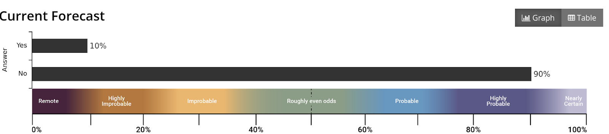
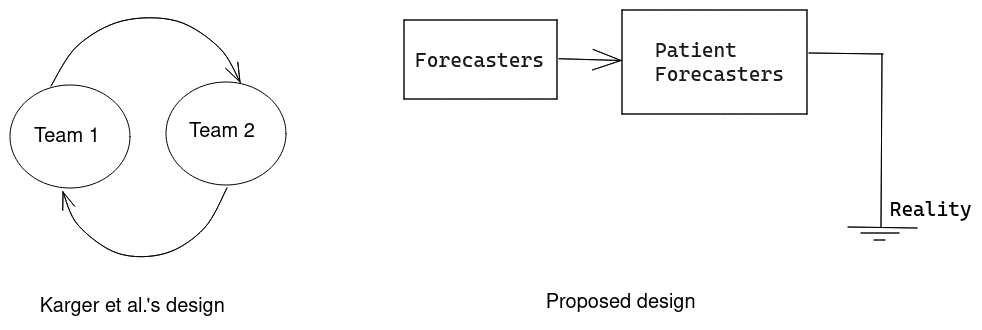

Forecasting Newsletter: April 2022
==============

## Highlights

*   The US CDC creates a [pandemic forecasting center](https://khn.org/morning-breakout/cdc-creates-a-forecasting-center/)
*   Tetlock's forecasting team is recruiting for a new tournament on [existential risk](https://forum.effectivealtruism.org/posts/Dm5eNgyvEwF9ibvzj/participate-in-the-hybrid-forecasting-persuasion-tournament)
*   Manifold Markets makes their webpage [open-source](https://github.com/manifoldmarkets/manifold)

## Index

*   Notable news
*   Platform by platform
    *   Correction on Polymarket incentivizing wash-trading.
*   Shortform research
*   Longform research

You can sign up for this newsletter on [substack](https://forecasting.substack.com/), or browse past newsletters [here](https://forum.effectivealtruism.org/s/HXtZvHqsKwtAYP6Y7).

## The state of forecasting: Where next?

At the high level, various new startups have been exploring different parts of the forecasting and prediction market space. Most recently, Manifold Markets allows anyone to easily instantly create a market, which comes at the cost of these markets having to use play money. And Polymarket or Insight Prediction have set up real-money prediction markets on some topics of real interest.

Our hope is that with time, a new project might stumble upon a winning combination, one that is able to produce large amounts of value by allowing people to pay for more accurate probabilities, even when these are unflattering.

Putting on my Scott Alexander hat, prediction markets or forecasting systems have the potential to be a powerful [asymmetric weapon](https://slatestarcodex.com/2017/03/24/guided-by-the-beauty-of-our-weapons/) ([a](https://web.archive.org/web/20220429054906/https://slatestarcodex.com/2017/03/24/guided-by-the-beauty-of-our-weapons/)): a sword of good that systematically favours the side which seeks the truth. A channel which is able to transmit accurate information even when the [evil forces of Moloch](https://slatestarcodex.com/2014/07/30/meditations-on-moloch/) ([a](https://web.archive.org/web/20220506085535/https://slatestarcodex.com/2014/07/30/meditations-on-moloch/)) would seek to prevent this.

In Linux circles, there is the meme of "the year of the Linux desktop": a magical year in which people realize that Windows adds little value, and that Linux is based. A year in which people would together [switch to Linux](https://www.linuxmint.com/) ([a](https://web.archive.org/web/20220510031755/https://www.linuxmint.com/)) and sing John Lennon. Instead, Linux, much like prediction markets, remains a powerful yet obscure tool which only a few cognoscenti can wield. So although I may wax poetically about the potential of prediction markets, "the year of the prediction market" has yet to come, much like "the year of the Linux desktop".

To get there, there needs to be investment in accessibility and popularization. And so I am happy to see things like the [Forecasting Wiki](https://forecasting.wiki/wiki/Main_Page) ([a](https://web.archive.org/web/20220501004347/https://forecasting.wiki/wiki/Main_Page)), [simpler apps](https://spose.app/) ([a](https://web.archive.org/web/*/spose.app)), popular writers introducing prediction markets to their audiences, or platforms experimenting with simplifying some of the complexity of prediction markets, or with combining the ideas behind prediction markets in new ways and exploring the space of prediction market-like things. It might also be wise for prediction markets to take a more [confrontational stance](https://www.metaculus.com/organization/public-figures/) ([a](https://web.archive.org/web/20220510031633/https://www.metaculus.com/organization/public-figures/)), by challenging powerful people who spout bullshit.

## Notable news

The CDC has a [new](https://khn.org/morning-breakout/cdc-creates-a-forecasting-center/) ([a](https://web.archive.org/web/20220510031621/https://khn.org/morning-breakout/cdc-creates-a-forecasting-center/)), $200M [center](https://www.washingtonpost.com/health/2022/04/19/new-cdc-team-early-alert-pandemic/) ([a](https://web.archive.org/web/20220510031758/https://www.washingtonpost.com/health/2022/04/19/new-cdc-team-early-alert-pandemic/)) for pandemic forecasting.

> When Walensky tapped outside experts to head the new outfit, the move was widely viewed as an acknowledgment of long-standing and systemic failures regarding surveillance, data collection and preparedness that were put into high relief by the pandemic.
> 
> Scientists will also look at who is infecting whom, how well vaccines protect against infection and severe illness, and how that depends on the vaccine, variants and the time since vaccination, said Marc Lipsitch, an epidemiologist and the center’s science director.
> 
> The center will be based in D.C. and will eventually have about 100 staff members, including some at CDC’s Atlanta headquarters. It will report to Walensky.

This is, broadly speaking, good. But it also seems like too little, too late. It seems suboptimal to have this center report to the CDC director, given that the CDC's leadership wasn't particularly shining during the pandemic. And the center is playing defence against the last [black swan](https://wikipedia.org/wiki/Black_swan_theory?lang=en), whereas I would prefer to see measures which could defend against unknown unknowns, such as [this one](https://forum.effectivealtruism.org/posts/sgcxDwyD2KL6BHH2C/case-for-emergency-response-teams) ([a](https://web.archive.org/web/20220510031746/https://forum.effectivealtruism.org/posts/sgcxDwyD2KL6BHH2C/case-for-emergency-response-teams)).

I recently stumbled upon a few prediction markets previously not on my radar: [TradeX](https://www.tradexapp.co/) ([a](https://web.archive.org/web/20220510031808/https://www.tradexapp.co/)) and [Better Opinions](https://betteropinions.in/) ([a](https://web.archive.org/web/20220510031856/https://betteropinions.in/)). In India, gambling games are [categorized](https://www.hindustantimes.com/brand-post/whats-the-legal-status-of-gambling-regulations-in-india-in-2021-101623671189683.html) ([a](https://web.archive.org/web/20220510031856/https://www.hindustantimes.com/brand-post/whats-the-legal-status-of-gambling-regulations-in-india-in-2021-101623671189683.html)) either as games of skill or games of chance, with games of skill being much less regulated.

And these new Indian platforms are making a calculated bet that they will be categorized as games of skill. It is also possible that there was a recent ruling to that effect, though I couldn't find it after some brief Googling. Given India's 1B+ population, this could be a big deal. h/t Vishal Maini.

Tetlock's forecasting team is recruiting for a "Hybrid forecasting-persuasion tournament" on x-risk topics (announcement [here](https://forum.effectivealtruism.org/posts/Dm5eNgyvEwF9ibvzj/participate-in-the-hybrid-forecasting-persuasion-tournament) ([a](https://web.archive.org/web/20220510031654/https://forum.effectivealtruism.org/posts/Dm5eNgyvEwF9ibvzj/participate-in-the-hybrid-forecasting-persuasion-tournament)), more details [here](https://docs.google.com/document/d/1iqJLXllG6KSYF91ppJy2boWAj5mqWfVD/edit) ([a](https://web.archive.org/web/20220510031857/https://docs.google.com/document/d/1iqJLXllG6KSYF91ppJy2boWAj5mqWfVD/edit))). I think that the impact pathway of participating in this looks like: better forecasters produce better probabilities in the tournament, which are then cited in reports by the UN and other large organizations, for which having a legible source to cite when justifying why they may work on preventing existential risks.

That said, I am not a fan of the reward scheme, which resembles a [Keynesian beauty contest](https://wikipedia.org/wiki/Keynesian_beauty_contest?lang=en), which means that the forecasters are not incentivized to directly predict reality, but instead to predict the opinion which will be mainstream among forecasters. In any case, the deadline for applying is May 13th, and rewards are $2k to $10k for at least 40 hours over three months, so a minimum compensation of $50/hour.

## Platform by platform

Kalshi [matches PredictIt's 538's approval markets](https://twitter.com/mansourtarek%5F/status/1520093852882907136). This seems like a "take more of the pie" action instead of a "make the pie bigger" action, which might be informative about latent variables.

According to [Manifold Markets' own estimations](https://manifold.markets/Elena/a-market-on-manifold-markets-will-b) ([a](https://web.archive.org/web/20220510031954/https://manifold.markets/Elena/a-market-on-manifold-markets-will-b)), the platform will likely create some sort of significant social drama in 2022. They are also bestowing their play money with some monetary value by allowing users to [donate their Manifold dollars to a selection of charities](https://manifold.markets/charity) ([a](https://web.archive.org/web/20220510031949/https://manifold.markets/charity)).

Manifold itself is rapidly increasing their team. It seems that they are aiming to make forecasting simple and streamlined, so that many people can use it and benefit from it. This is an uneasy combination with their current userbase, which is made out of power users. As a power move, they made their webpage [open-source](https://github.com/manifoldmarkets/manifold) ([a](https://web.archive.org/web/20220510031655/https://github.com/manifoldmarkets/manifold)).

Basil Halperin writes [Monetary policy in 2050: evidence from Metaculus](https://basilhalperin.com/essays/metaculus-monetary-policy.html) ([a](https://web.archive.org/web/20220510031922/https://basilhalperin.com/essays/metaculus-monetary-policy.html)).

Polymarket [asked the UMA DAO](https://discourse.umaproject.org/t/funding-request-for-liquidity-mining-program-extension-from-polymarket/1654/60) ([a](https://web.archive.org/web/20220510032003/https://discourse.umaproject.org/t/funding-request-for-liquidity-mining-program-extension-from-polymarket/1654/60)) for $2-3M worth of funds to continue subsidizing their rewards programme. The request will be [denied](https://snapshot.org/#/uma.eth/proposal/0xe9a9cdd146e9a14947b4538b275ea9b5f438ab92cf5e13f2bd22063e6d8b6410).

INFER is hosting a discussion tomorrow under the ominous headline “[Reasserting U.S. Leadership in Microelectronics](https://www.infer-pub.com/fireside-reasserting-us-leadership-in-microelectronics)” ([a](https://web.archive.org/web/20220510154237/https://www.infer-pub.com/fireside-reasserting-us-leadership-in-microelectronics)).

 Good Judgment Open adds [a few new features](https://mailchi.mp/goodjudgment/gjo6apr22newsletter-1148858?e=72ee153cd5) ([a](https://web.archive.org/web/20220510032016/https://mailchi.mp/goodjudgment/gjo6apr22newsletter-1148858?e=72ee153cd5)), chiefly, a neat slider for visualizing probabilities.

PredictIt bettor [refuses to pay](https://twitter.com/PeePeePooPooPI3/status/1521968019433525255) ([a](https://web.archive.org/web/20220510032133/https://twitter.com/PeePeePooPooPI3/status/1521968019433525255)) $15k worth of over-the-counter bets.

### Correction on Polymarket incentivizing wash trading.

In the previous issue of this newsletter, I mentioned that Polymarket was incentivizing wash-trading. Later on, on [Twitter](https://twitter.com/NunoSempere/status/1511425326701854720), I mentioned that this meant that their current volume levels "mean nothing".

Meme from the Polymarket Discord making light of Polymarket's incentive scheme. h/t @Acebaby256. "Poyo" is a semi-notorious prediction market figure from the early [Augur days](https://decrypt.co/6010/is-augur-being-gamed).

Although I do still think that Polymarket is incentivizing wash-trading, the claim that Polymarket's volume numbers "mean nothing" was an exaggeration: Polymarket would in all likelihood still see significant volume in the absence of their trading incentives. But it does mean that comparing Polymarket's volume to that of, for instance, Kalshi, is now nontrivial.

## Shortform

Robin Hanson considers the [pressures shaping the accuracy of authorities](https://www.overcomingbias.com/2022/04/the-accuracy-of-authorities.html) ([a](https://web.archive.org/web/20220510032051/https://www.overcomingbias.com/2022/04/the-accuracy-of-authorities.html)):

> The best estimates of a maximally accurate source would be very frequently updated and follow a random walk, which implies a large amount of backtracking. And authoritative sources like WHO are often said to be our most accurate sources. Even so, such sources do not tend to act this way. They instead update their estimates rarely, and are especially reluctant to issue estimates that seem to backtrack. Why?

Hanson also comes back to [Intellectual Prestige Futures](https://www.overcomingbias.com/2022/04/intellectual-prestige-futures.html) ([a](https://web.archive.org/web/20220510032050/https://www.overcomingbias.com/2022/04/intellectual-prestige-futures.html)). The idea is to predict what people really want according to Hanson: prestige, instead of "impact" or some such.

[Jan Kirchner](https://universalprior.substack.com/p/elementary-infra-bayesianism?s=r) ([a](https://web.archive.org/web/20220510032103/https://universalprior.substack.com/p/elementary-infra-bayesianism?s=r)) writes a popularization of ["Infrabayesianism"](https://www.alignmentforum.org/s/CmrW8fCmSLK7E25sa) ([a](https://web.archive.org/web/20220510032105/https://www.alignmentforum.org/s/CmrW8fCmSLK7E25sa)), a theory of how to make pseudo-Bayesian updates in the presence of intelligent adversaries. I appreciated the effort, but I thought this could have been much better. If anyone writes a better introduction I'll give them a forecasting microgrant proportionate to my estimate of its quality.

[Andrew Gelman](https://statmodeling.stat.columbia.edu/2022/04/06/what-should-he-read-to-pivot-into-research-with-a-bayesian-focus/) ([a](https://web.archive.org/web/20220510032116/https://statmodeling.stat.columbia.edu/2022/04/06/what-should-he-read-to-pivot-into-research-with-a-bayesian-focus/)) answers to someone seeking to do a PhD in Bayesian clinical trials after a lifetime of living in a state of frequentist sin, and reports on a [cool Bayesian framework for interpreting fings from impact evaluations](https://statmodeling.stat.columbia.edu/2022/04/27/hey-check-this-out-its-really-cool-a-bayesian-framework-for-interpreting-findings-from-impact-evaluations/) ([a](https://web.archive.org/web/20220510032145/https://statmodeling.stat.columbia.edu/2022/04/27/hey-check-this-out-its-really-cool-a-bayesian-framework-for-interpreting-findings-from-impact-evaluations/))

[Zvi Mowshowitz](https://thezvi.substack.com/p/ukraine-post-8-risk-of-nuclear-war?s=w) ([a](https://web.archive.org/web/20220510032127/https://thezvi.substack.com/p/ukraine-post-8-risk-of-nuclear-war?s=w)) writes about the probability he assigns to nuclear war, following up on my forecasting group's forecasts and its criticisms by a nuclear expert. I really appreciated the detail and the good faith.

The European Centre for Medium-Range Weather Forecasts scores [its performance in 2021](https://www.ecmwf.int/en/newsletter/171/news/forecast-performance-2021) ([a](https://web.archive.org/web/20220510032138/https://www.ecmwf.int/en/newsletter/171/news/forecast-performance-2021)).

Justin Shovelain writes about [Goodhart's Law Causal Diagrams](https://www.lesswrong.com/posts/e4SMfYWb4Tz568yh6/goodhart-s-law-causal-diagrams) ([a](https://web.archive.org/web/20220510032118/https://www.lesswrong.com/posts/e4SMfYWb4Tz568yh6/goodhart-s-law-causal-diagrams)).

Eric Neyman [grades his 2021 predictions](https://ericneyman.wordpress.com/2022/04/17/grading-my-2021-predictions/) ([a](https://web.archive.org/web/20220510032135/https://ericneyman.wordpress.com/2022/04/17/grading-my-2021-predictions/))

## Longform research

[The Boltzmann Policy Distribution: Accounting for Systematic Suboptimality in Human Models](https://arxiv.org/pdf/2204.10759.pdf) ([a](https://web.archive.org/web/20220510032145/https://arxiv.org/pdf/2204.10759.pdf)) proposes a neat Bayesian way of modelling humans: Assume that humans have a probability _p_ of choosing a policy _P_ proportional to _exp(ExpectedValue(P))_. Then update on human actions. This is obviously very hard to do, because one has to iterate through all policies, but the authors use some neural network witchcraft that I don't understand to make this more feasible. The authors then use this kind of Bayesian model of human irrationality to predict human actions in a simple cooperative game. One could also use it to predict values given actions.

Overall, their method performs worse than current machine techniques. It is also unclear whether it might be generalizable to more complex setups, in which approximating a large policy space would be even more difficult.

[Aggregating human judgment probabilistic predictions of COVID-19 transmission, burden, and preventative measures](https://arxiv.org/abs/2204.02466) ([a](https://web.archive.org/web/20220510032154/https://arxiv.org/abs/2204.02466)). The authors compare Good Judgment Open and Metaculus data, and find that they do "similarly well" to computational models. 

I released [three papers on scoring rules](https://github.com/SamotsvetyForecasting/optimal-scoring) ([a](https://web.archive.org/web/20220510032155/https://github.com/SamotsvetyForecasting/optimal-scoring)). The motivation behind them is my frustration with scoring rules as used in current forecasting platforms. I was also frustrated with the "reciprocal scoring" method recently proposed in [Karger et al](https://papers.ssrn.com/sol3/papers.cfm?abstract_id=3954498) ([a](https://web.archive.org/web/20220510032158/https://papers.ssrn.com/sol3/papers.cfm?abstract_id=3954498)) and now used in Tetlock's Hybrid Forecasting-Persuasion tournament (see above). These new scoring rules incentivize collaboration, and although not quite [ready for production](https://github.com/SamotsvetyForecasting/optimal-scoring/issues) ([a](https://web.archive.org/web/20220510032202/https://github.com/SamotsvetyForecasting/optimal-scoring/issues)), I hope they could eventually provide a better incentive scheme for the forecasting ecosystem.

---

Note to the future: All links are added automatically to the Internet Archive, using this [tool](https://github.com/NunoSempere/longNowForMd) ([a](http://web.archive.org/web/20220304021930/https://github.com/NunoSempere/longNowForMd)). "(a)" for archived links was inspired by [Milan Griffes](https://www.flightfromperfection.com/) ([a](http://web.archive.org/web/20220304021952/https://www.flightfromperfection.com/)), [Andrew Zuckerman](https://www.andzuck.com/) ([a](http://web.archive.org/web/20220211080149/https://www.andzuck.com/)), and [Alexey Guzey](https://guzey.com/) ([a](http://web.archive.org/web/20220304022034/https://guzey.com/)).

---

> In other words, I'm right. I'm always right, but sometimes I'm more right than other times. And dammit, \[this time\], I'm really really Right(tm).

— [Linus Torvalds](https://web.archive.org/web/20151007061636/https://permalink.gmane.org/gmane.comp.version-control.git/217)
