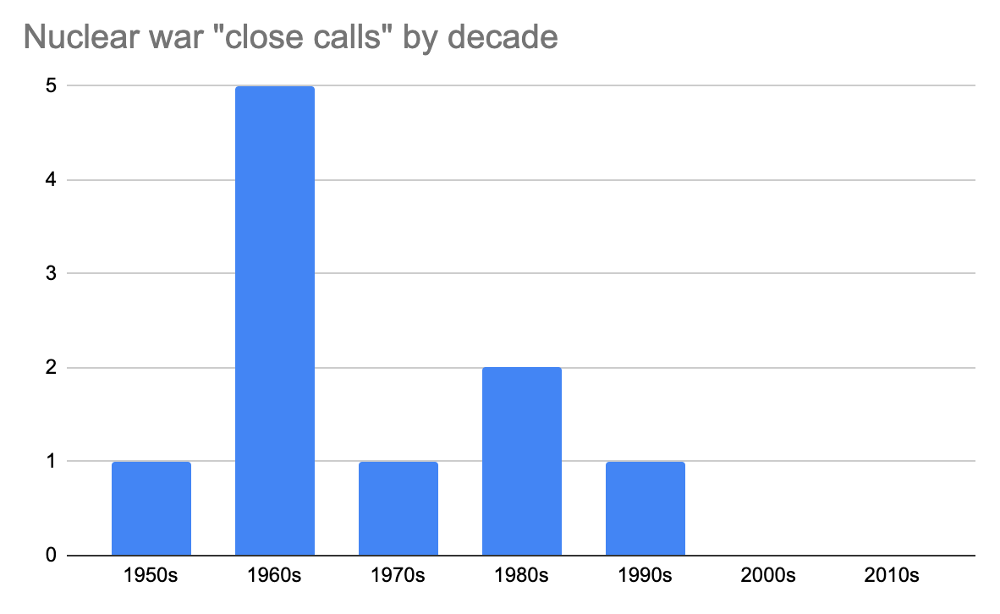
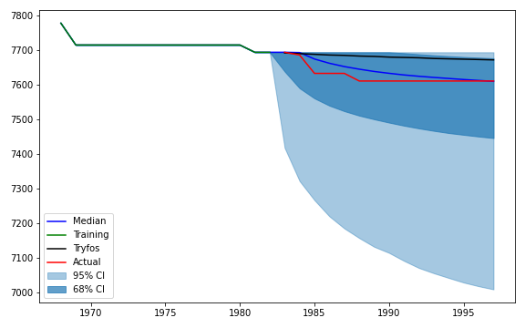
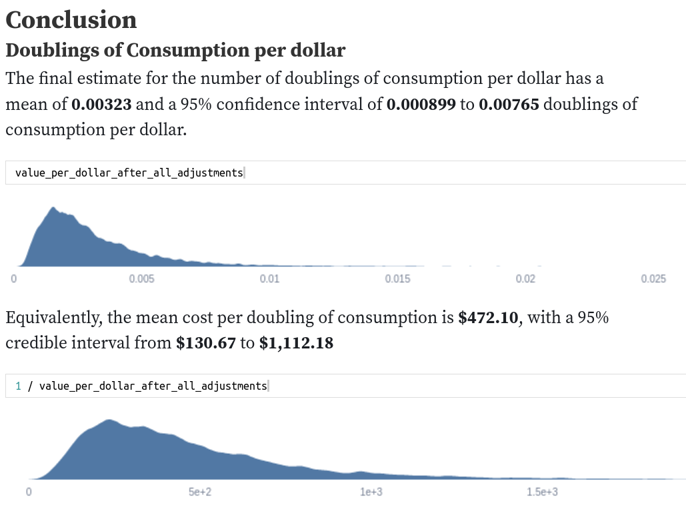

Forecasting Newsletter: May 2022
==============

## Highlights

*   Metaculus forecaster warns about [boasting about non-existent forecasting track records](https://www.lesswrong.com/posts/ZEgQGAjQm5rTAnGuM/beware-boasting-about-non-existent-forecasting-track-records)
*   Nick Bosse and others release a [comprehensive R package for scoring forecasts](https://github.com/epiforecasts/scoringutils)
*   Open Philanthropy is requesting [proposals for quantifying biological risks](https://forum.effectivealtruism.org/posts/xFsmibHafAu8APgiS/request-for-proposals-help-open-philanthropy-quantify) (deadline 5th of June)
*   The Survival and Flourishing Fund gave [a bit over $1M](https://survivalandflourishing.fund/sff-2022-h1-recommendations) to forecasting projects
*   Kalshi was profiled by [Bloomberg](https://www.bloomberg.com/news/features/2022-05-26/kalshi-s-stock-market-of-the-world-let-s-you-bet-on-anything)

## Index

*   The state of forecasting
*   Platform by platform updates
*   Ephemeral content
*   Long content

You can sign up for this newsletter on [substack](https://forecasting.substack.com), or browse past newsletters [here](https://forum.effectivealtruism.org/s/HXtZvHqsKwtAYP6Y7). If you have a content suggestion or want to reach out, you can leave a comment or find me on [Twitter](https://twitter.com/NunoSempere).

## The state of forecasting

Applying to the [FTX Future Fund](https://ftxfuturefund.org/) ([a](http://web.archive.org/web/20220411191549/https://ftxfuturefund.org/)) with forecasting projects is still a good idea.

The Survival and Flourishing Fund donated [a bit over $1M to forecasting projects](https://survivalandflourishing.fund/sff-2022-h1-recommendations) ([a](https://archive.is/KEV3I)): $461k to the [Quantified Uncertainty Research Insitute](https://quantifieduncertainty.org/) (my org), $346k to the [Social Science Prediction Platform](https://socialscienceprediction.org/), and $343k towards [Manifold Markets](https://manifold.markets/). From what I can tell, the funding generally came much later than expected, and thus was less useful. For instance, Manifold Markets has already carried out a [funding round](https://news.manifold.markets/p/above-the-fold-seeded?s=r).

Blockchain-based prediction markets continue popping up. Some never leave the beta phase. For example, this month I stumbled upon [Oracula](https://beta.oracula.io/) ([a](http://web.archive.org/web/20220507150908/https://beta.oracula.io/)) and [Presaga](https://www.presaga.app/) ([a](http://web.archive.org/web/20220215130205/https://www.presaga.app/)). On the one hand, having many fragmented real-money prediction markets seems good for the traders who are skilled at arbitrage. But on the other hand, it seems likely that prediction markets might have some features of a winner-take-all dynamics: bettors will want to bet where other people are betting.

Amongst friends and colleagues working in the forecasting space, I am also noticing that there is an incentive towards creating new organizations, rather than taking part in organizations that already exist. I think this might be because it sounds more prestigious to lead one's own small organization and because one can otherwise capture a larger share of the value that one creates. But I think that creating many micro-organizations creates less value overall because the operations burden is greater. [Here](https://www.facebook.com/ozzie.gooen/posts/pfbid02rDvhYZekLU4SKYYMgouY7gndxkqxJsumqGdRf4A8GLRHTUMfxBQDa9UKVwy8YBdNl) is a post by my boss on a similar topic.

## Platform by platform updates

Metaculus rapidly created forecasts about the [new monkeypox outbreak](https://www.metaculus.com/questions/?search=cat:bio--infectious-disease--monkeypox). Besides this, Metaculus updated its [social media previews](https://twitter.com/TetraspaceWest/status/1523115069252734977) ([a](http://web.archive.org/web/20220508013912/https://twitter.com/TetraspaceWest/status/1523115069252734977)), its journal spawned a [podcast](https://podcasts.apple.com/us/podcast/the-metaculus-journal/id1620850917) ([a](http://web.archive.org/web/20220603013516/https://podcasts.apple.com/us/podcast/the-metaculus-journal/id1620850917)), and its CEO wrote an essay on [Forecasting, Science, and Epistemology](https://metaculus.medium.com/forecasting-science-and-epistemology-d962de541a1f) ([a](http://web.archive.org/web/20220603013055/https://metaculus.medium.com/forecasting-science-and-epistemology-d962de541a1f)).

Manifold added some categories to organize their markets, added the possibility of replying to comments, moved to Algolia for market search, added one-click betting, added a numeric (rather than pointwise) market type, and added embedded markets in the EA forum. A hat-tip to David, who maintains a nice to read [newsletter](https://news.manifold.markets/) ([a](http://web.archive.org/web/20220603013524/https://news.manifold.markets/)) on Manifold's progress. Honestly, I'm not sure I even should be covering Manifold's individual platform improvements rather than remarking that their development speed seems to still be much faster than that of other platforms. Manifold's team also [visited the Bahamas](https://news.manifold.markets/p/above-the-fold-bahamas-edition?s=r) ([a](http://web.archive.org/web/20220603013548/https://news.manifold.markets/p/above-the-fold-bahamas-edition?s=r)).

INFER hosted a discussion on [Reasserting U.S. Leadership in Microelectronics](https://www.youtube.com/watch?v=5QKFFWISwhc) ([a](http://web.archive.org/web/20220603013307/https://www.youtube.com/watch?v=5QKFFWISwhc)). It also talks about the [race for AI dominance](https://mailchi.mp/cultivatelabs/2ejh0318wr-8876713?e=6a740e6197) ([a](http://web.archive.org/web/20220603013104/https://mailchi.mp/cultivatelabs/2ejh0318wr-8876713?e=6a740e6197)) in its newsletter. Conditional on a US/China AI race occurring, I would want the US to win it. But I would rather prefer there to not be such a race. So I'm not sure how to feel about various organizations around the EA (Effective Altruism) sphere, such as INFER, CSET or the Institute for Progress using bellicose and adversarial language and strategies. For instance, one can frame one's positions and justify one’s usefulness with reference to what the US needs to do in order to maintain its superiority over China. This might appeal to Republicans worried about national security, but also make non-adversarial framings more difficult to see.

Good Judgment Open has some analysis of whether Putin will cease to be president of the Russian Federation before 2023. See [here](https://www.gjopen.com/comments/1447459) ([a](http://web.archive.org/web/20220603013854/https://www.gjopen.com/comments/1447459)) for a comment arguing that this is ~5% unlikely and [here](https://www.gjopen.com/comments/1449378) ([a](http://web.archive.org/web/20220603013947/https://www.gjopen.com/comments/1449378)) for a comment that this is ~70% likely.

Kalshi was profiled by [Bloomberg](https://www.bloomberg.com/news/features/2022-05-26/kalshi-s-stock-market-of-the-world-let-s-you-bet-on-anything) ([a](http://web.archive.org/web/20220527013329/https://www.bloomberg.com/news/features/2022-05-26/kalshi-s-stock-market-of-the-world-let-s-you-bet-on-anything)). The article is very much worth reading: it gives a nice view of Kalshi's journey, and reveals some interesting details about the regulatory morass that Kalshi had to deal with.

The Bloomberg article also references a frankly embarrassing [2012 CFTC order](https://www.cftc.gov/sites/default/files/stellent/groups/public/@rulesandproducts/documents/ifdocs/nadexorder040212.pdf) ([a](http://web.archive.org/web/20220120141804/https://www.cftc.gov/sites/default/files/stellent/groups/public/@rulesandproducts/documents/ifdocs/nadexorder040212.pdf)) prohibiting [Nadex](https://wikipedia.org/wiki/Nadex) from offering contracts on binary outcomes, because they deemed it to be "against the public interest". The order stated:

> "there is no situation in which the Political Event Contracts' prices could form the basis for the pricing of a commercial transaction involving a physical commodity, financial asset or service, which demonstrates that the Political Event Contracts have no price basing utility".

Kalshi also made an [Arbitrage calculator](https://docs.google.com/spreadsheets/d/12dgV-9aeP5GkqmahK7M77_u2rwuBkoycwQEr56hJamo/edit#gid=0) between markets that were on PredictIt and now are also on Kalshi.

## Ephemeral content

Open Philanthropy is requesting [proposals for quantifying biological risks](https://forum.effectivealtruism.org/posts/xFsmibHafAu8APgiS/request-for-proposals-help-open-philanthropy-quantify) ([a](http://web.archive.org/web/20220603012244/https://forum.effectivealtruism.org/posts/xFsmibHafAu8APgiS/request-for-proposals-help-open-philanthropy-quantify)). The deadline to apply is June 5th. I think it wouldn't be that hard to assemble a good team to do this, If you are interested, leave a comment or send me an email at forecasting.newsletter@protonmail.com.

[Strippers explain how strip clubs can be a 'leading indicator' in forecasting a recession](https://www.newshub.co.nz/home/lifestyle/2022/05/strippers-explain-how-strip-clubs-can-be-a-leading-indicator-in-forecasting-a-recession.html) ([a](http://web.archive.org/web/20220603012317/https://www.newshub.co.nz/home/lifestyle/2022/05/strippers-explain-how-strip-clubs-can-be-a-leading-indicator-in-forecasting-a-recession.html)):

> Some strippers believe a recession is guaranteed because strip clubs are emptying—a "leading indicator" there is an economic downturn.
> 
> …
> 
> "I had a friend who stopped stripping after the 2008 housing crash. She said it was not worth dealing with men. Prior to that she was making over $2k and up a night, she said went down to $300/night. She got out quick. Definitely a good indicator how the economy is doing,"

Chris Brunett, a conservative economics blogger with a penchant for sensationalism, writes about [Turning $1,000 to $10,000 on Insight Prediction](https://karlstack.substack.com/p/turning-1000-to-10000-on-insight) ([a](http://web.archive.org/web/20220521055606/https://karlstack.substack.com/p/turning-1000-to-10000-on-insight)). Note that he hasn't yet done 10x his initial pot, but rather is aiming to do so.

More interestingly, he is creating a [speculative financial instrument](https://karlstack.substack.com/p/karlstack-is-building-a-memecoin) ([a](http://web.archive.org/web/20220525161826/https://karlstack.substack.com/p/karlstack-is-building-a-memecoin)) through which he is allowing others to buy into his proto-hedge fund. To be clear, I emphatically do **not** recommend that people invest in this: Brunet's forecasting track record is a bit spotty, the smart contracts he uses allows him to create infinite money, and the legal status of the whole thing is dubious. That said, it is an interesting and innovative instrument, I'm intrigued about where it will go, and I don’t expect Brunett to cheat investors.

Czech Priorities has an [update on their forecasting work](https://forum.effectivealtruism.org/posts/6meqpK339FnQpZ4kv/czech-forecasting-project-summary) ([a](http://web.archive.org/web/20220518092351/https://forum.effectivealtruism.org/posts/6meqpK339FnQpZ4kv/czech-forecasting-project-summary)) trying to influence the Czech government.

Note that incidents are declassified 10–25 years after they happen.

Peter Wildeford looks at the [chances of accidental nuclear war](https://forum.effectivealtruism.org/posts/woBYNgqjgvryF6aav/the-chance-of-accidental-nuclear-war-has-been-going-down) ([a](http://web.archive.org/web/20220602022519/https://forum.effectivealtruism.org/posts/woBYNgqjgvryF6aav/the-chance-of-accidental-nuclear-war-has-been-going-down)), by giving the chance of a nuclear incident based on the historical frequency of close calls using Laplace's law, and then another application of Laplace’s law to the chance that a nuclear close call will escalate. Personally, I’d be a bit higher than him because of [anthropic effects](https://forum.effectivealtruism.org/posts/woBYNgqjgvryF6aav/the-chance-of-accidental-nuclear-war-has-been-going-down?commentId=Lpuq8GfEjvZZMKwh2#comments).

[@botec\_horseman](https://twitter.com/botec_horseman) ([a](http://web.archive.org/web/20220603170528/https://twitter.com/botec_horseman)) is a new Twitter account dedicated to Back Of The Envelope (BOTEC) estimates. h/t Nathan Young.

[Is AI Progress Impossible To Predict?](https://www.lesswrong.com/posts/G993PFTwqqdQv4eTg/is-ai-progress-impossible-to-predict) ([a](http://web.archive.org/web/20220602171145/https://www.lesswrong.com/posts/G993PFTwqqdQv4eTg/is-ai-progress-impossible-to-predict)):

> Could we forecast AI progress ahead of time by seeing how each task gets better with model size, draw out the curve, and calculate which size model is needed to reach human performance?
> 
> I tried this, and apparently the answer is no. In fact, whether AI has improved on a task recently gives us exactly zero predictive power for how much the next model will improve on the same task

[NOAA predicts above-normal 2022 Atlantic Hurricane Season](https://www.noaa.gov/news-release/noaa-predicts-above-normal-2022-atlantic-hurricane-season) ([a](http://web.archive.org/web/20220603132541/https://www.noaa.gov/news-release/noaa-predicts-above-normal-2022-atlantic-hurricane-season)). "Forecasters at NOAA’s Climate Prediction Center, a division of the National Weather Service, are predicting above-average hurricane activity this year — **which would make it the seventh consecutive above-average hurricane season**" (emphasis mine).

## Long content

Jotto, an experienced Metaculus forecaster, cautions against [boasting about non-existent forecasting track records](https://www.lesswrong.com/posts/ZEgQGAjQm5rTAnGuM/beware-boasting-about-non-existent-forecasting-track-records) ([a](http://web.archive.org/web/20220602083227/https://www.lesswrong.com/posts/ZEgQGAjQm5rTAnGuM/beware-boasting-about-non-existent-forecasting-track-records)):

> If they want forecaster prestige, their forecasts must be:
> 
> *   Pre-registered,
> *   So unambiguous that people actually agree whether the event "happened",
> *   With probabilities and numbers so we can gauge calibration,
> *   And include enough forecasts that it's not just a fluke or cherry-picking.
> 
> When Eliezer Yudkowsky talks about forecasting AI, he has several times claimed implied he has a great forecasting track record. But a meaningful "forecasting track record" has well-known and very specific requirements, and Eliezer doesn't show these.

Nick Bosse and others release a [comprehensive R package for scoring forecasts](https://github.com/epiforecasts/scoringutils) ([a](http://web.archive.org/web/20220603012339/https://github.com/epiforecasts/scoringutils)) ([twitter](https://twitter.com/nikosbosse/status/1526511848144642051) ([a](http://web.archive.org/web/20220603012652/https://twitter.com/nikosbosse/status/1526511848144642051)), [CRAN](https://cran.r-project.org/web/packages/scoringutils/index.html) ([a](http://web.archive.org/web/20220603013058/https://cran.r-project.org/web/packages/scoringutils/index.html)), [accompanying arxiv paper](https://arxiv.org/abs/2205.07090) ([a](http://web.archive.org/web/20220603012725/https://arxiv.org/abs/2205.07090))). Per the [CRAN logs](https://cranlogs.r-pkg.org/downloads/total/2022-05-10:2025-01-02/scoringutils) ([a](http://web.archive.org/web/20220603012812/https://cranlogs.r-pkg.org/downloads/total/2022-05-10:2025-01-02/scoringutils)) so far it's seeing a smallish to medium number of downloads (791 so far, and 151 in the last week). But once a library is well-engineered, I think it will tend to last. And it makes developments in other languages easier.

Bayesian method (in bright blue and in shaded confidence intervals) beats previous method (in black) at predicting Marathon records (in red).

Jaime Sevilla and Jonathan Lindbloom publish some research on [Bayesian models of records](https://www.authorea.com/users/429500/articles/535592-a-bayesian-model-of-records) ([a](http://web.archive.org/web/20220529222525/https://www.authorea.com/users/429500/articles/535592-a-bayesian-model-of-records)) ([twitter summary](https://twitter.com/Jsevillamol/status/1531038943940059136) ([a](http://web.archive.org/web/20220529222538/https://twitter.com/Jsevillamol/status/1531038943940059136))), that is, on the maximums and minimums that a time series will take. I was expecting the approach to be based on having a large database of past records to create a prior. Instead, the authors model records as attempts drawn from the same distribution, which they model as uncertainty over a flat prior over [Weibull distributions](https://en.wikipedia.org/wiki/Weibull_distribution).

This approach might work for some problems, like Olympic records. But it would do less well over other problems where assuming identically distributed draws would not be a good assumption. For instance, Moore's law—or technological progress more generally—doesn't lend itself well to being modelled using this approach, because new approaches tend to build on top of previous approaches. The authors are planning to address this in future work.

My colleague Sam Nolan looks at [Quantifying Uncertainty in GiveWell's GiveDirectly Cost-Effectiveness Analysis](https://observablehq.com/@hazelfire/givewells-givedirectly-cost-effectiveness-analysis) ([a](http://web.archive.org/web/20220529032327/https://observablehq.com/@hazelfire/givewells-givedirectly-cost-effectiveness-analysis)). He takes point estimates of impact by GiveDirectly, and transforms them into estimates using distributions.

Niplav looks at [range and forecasting accuracy](https://forum.effectivealtruism.org/posts/nfEWwLH8qSqNATxmr/range-and-forecasting-accuracy) ([a](http://web.archive.org/web/20220603102420/https://forum.effectivealtruism.org/posts/nfEWwLH8qSqNATxmr/range-and-forecasting-accuracy)). I reviewed a version of this post in a [previous newsletter](https://forum.effectivealtruism.org/posts/8nNuRG26Te6k8xJhF/forecasting-newsletter-march-2021#Recent_Blog_Posts). The new version has analysis in Python as well as some further analysis. I would recommend reading the results section at the top.

---

Note to the future: All links are added automatically to the Internet Archive, using this [tool](https://github.com/NunoSempere/longNowForMd) ([a](http://web.archive.org/web/20220408093057/https://github.com/NunoSempere/longNowForMd)). "(a)" for archived links was inspired by [Milan Griffes](https://www.flightfromperfection.com/) ([a](http://web.archive.org/web/20220521191212/https://www.flightfromperfection.com/)), [Andrew Zuckerman](https://www.andzuck.com/) ([a](http://web.archive.org/web/20220316214638/https://www.andzuck.com/)), and [Alexey Guzey](https://guzey.com/) ([a](http://web.archive.org/web/20220515072125/https://guzey.com/)).

---

> There are no stupid questions, but there are a lot of inquisitive idiots

— Unattributed