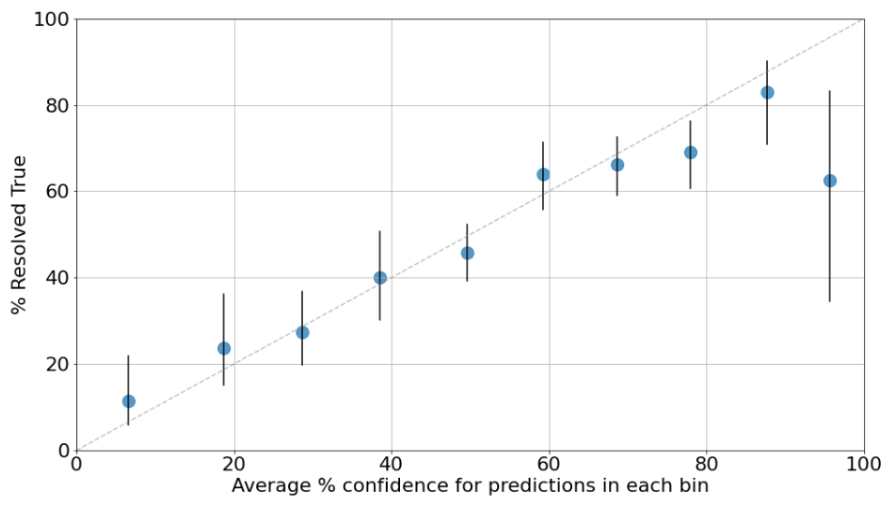
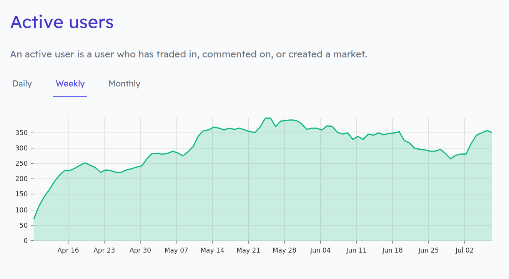
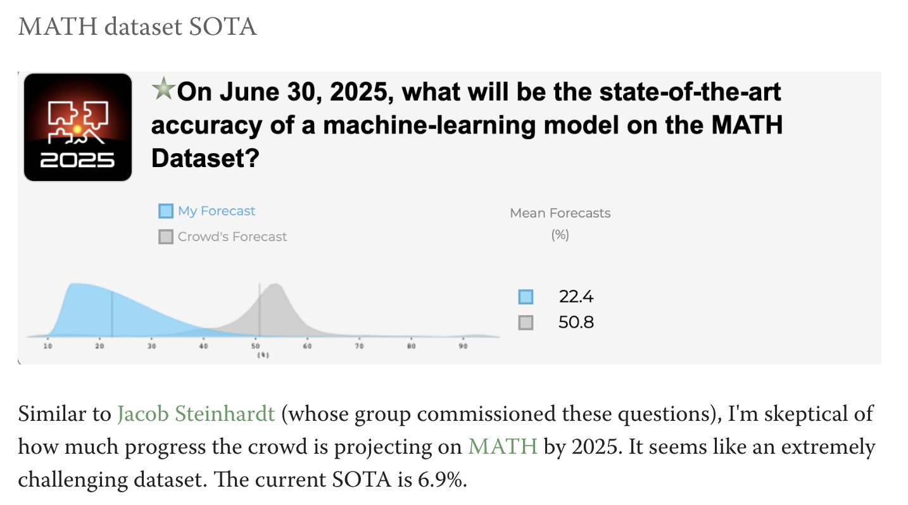
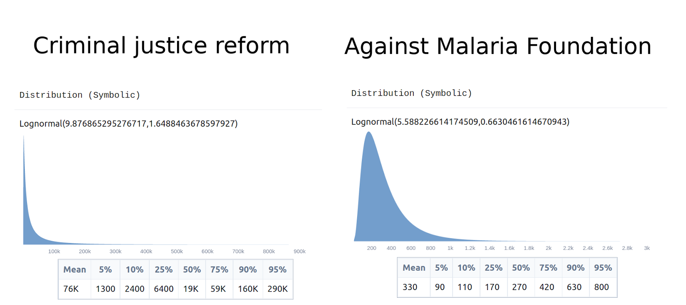

Forecasting Newsletter: June 2022
==============

## Highlights

*   Sequoia Capital on [forecasting and scenario planning](https://www.sequoiacap.com/wp-content/uploads/sites/6/2022/06/Forecasting_Sequoia-Capital-2022.pdf)
*   GPI workshop on longterm forecasting happened, notes below.
*   Forecasters were very [surprised](https://twitter.com/mishayagudin/status/1544121506409730049) by a recent large jump in ML models’ ability to do math
*   Arb Research [compiles and scores](https://arbresearch.com/files/big_three.pdf) the forecasting track record of the big three science fiction writers

## Index

*   Notes from the 2022 GPI Workshop On Longterm Forecasting
*   Prediction Markets & Forecasting Platforms
*   Blog Posts and Research
*   In The News

You can sign up for this newsletter on [substack](https://forecasting.substack.com) or browse past newsletters [here](https://forum.effectivealtruism.org/s/HXtZvHqsKwtAYP6Y7). If you have a content suggestion or want to reach out, you can leave a comment or find me on [Twitter](https://twitter.com/NunoSempere). Thanks to [Nathan Young](https://twitter.com/NathanpmYoung) for help writing this edition.

## Notes from the 2022 GPI Workshop On Longterm Forecasting

Between the 29th and the 30th of June, the [Global Priorities Institute](https://globalprioritiesinstitute.org/) (GPI) organized a workshop on longterm forecasting and existential risk in Oxford. This section gives my thoughts and shares [the slides](https://drive.google.com/drive/folders/1cxnCxrKahRk43FKK6UxgxWSsZ7OwmA4X?usp=sharing) ([a](https://web.archive.org/web/20220711161527/https://drive.google.com/drive/folders/1cxnCxrKahRk43FKK6UxgxWSsZ7OwmA4X?usp=sharing)) for the presentations whose speakers gave me consent to do so. I was jetlagged throughout the conference, so I'm surely missing some stuff.

### Talks 

(I recommend going through the slides of the talks that sound interesting, and ignoring the rest)

In the opening talk ([slides](https://drive.google.com/file/d/1lmELDGmZFrpVsB57DnegDvm_jD53Jihb/view?usp=sharing) ([a](https://web.archive.org/web/20220711161527/https://drive.google.com/file/d/1lmELDGmZFrpVsB57DnegDvm_jD53Jihb/view?usp=sharing))), Benjamin Tereick goes through GPI's reasons for existing and explains that recently, GPI has begun getting into forecasting, from a very academic angle. He then briefly covered some topics similar to the [Future Indices](https://cset.georgetown.edu/wp-content/uploads/CSET-Future-Indices.pdf) ([a](https://web.archive.org/web/20220711161536/https://cset.georgetown.edu/wp-content/uploads/CSET-Future-Indices.pdf)) report about how to forecast for the long term, for instance by using short-term proxies.

Javier Prieto presented Open Philanthropy's calibration results on their grant forecasts ([slides](https://docs.google.com/presentation/d/1_JpirzX2kf3WfXwr3xrJFunWno2xsQLPfuq3LqNkS8c/edit)), covering content similar to [this blog post](https://forum.effectivealtruism.org/posts/RjNFyJS3jPb4DA7wA/how-accurate-are-open-phil-s-predictions).

Open Philanthropy's calibration. Notice the 95% predictions, which happen around 60% of the time.

Blanka Havlíčková talked about [Confido](https://confido.tools/) ([a](https://web.archive.org/web/20220711161543/https://confido.tools/)) ([slides](https://docs.google.com/presentation/d/1F1XAUF7TrJP_UlUTM8AupYmO9EzgqNe_/edit?usp=sharinghttps://docs.google.com/presentation/d/1F1XAUF7TrJP_UlUTM8AupYmO9EzgqNe_/edit?usp=sharing&ouid=105745069467002633267&rtpof=true&sd=true) ([a](https://web.archive.org/web/20220711161543/https://docs.google.com/presentation/d/1F1XAUF7TrJP_UlUTM8AupYmO9EzgqNe_/edit?usp=sharing&ouid=105745069467002633267&rtpof=true&sd=true))), an online tool meant to make eliciting forecasts significantly more approachable and fast.

I presented on [Squiggle](https://squiggle-language.com/) ([slides](https://docs.google.com/presentation/d/1MUeCXkdqgCfC_PEY1aNVOJAvuWQ29izK5kHa0rQFjmk/edit?usp=sharing) ([a](https://web.archive.org/web/20220711161559/https://docs.google.com/presentation/d/1MUeCXkdqgCfC_PEY1aNVOJAvuWQ29izK5kHa0rQFjmk/edit?usp=sharing)), [slides content](https://docs.google.com/document/d/1jGwF79RlmAFcUbNHJEJcC_FdTxwfR6NjpQbhOOvhMJo/edit?usp=sharing) ([a](https://web.archive.org/web/20220711161605/https://docs.google.com/document/d/1jGwF79RlmAFcUbNHJEJcC_FdTxwfR6NjpQbhOOvhMJo/edit?usp=sharing))), an estimation tool meant to make hardcore forecasting and evaluation setups more feasible. Our [VS Code extension](https://marketplace.visualstudio.com/items?itemName=QURI.vscode-squiggle) might be of immediate interest to readers.

Charlie Giattino talked about how Our World in Data could be useful for forecasting existential risks ([slides](https://docs.google.com/presentation/d/1nWdFbAsb5UrRp1fh2dIF3q_AUN2cc6_uI1hPZP-Hl2o/edit#slide=id.g13a8313b7ad_0_1)). I particularly appreciated the [one slide](https://twitter.com/NunoSempere/status/1542149704670232576/photo/1) on his thoughts on how best to produce and present forecasts so that policymakers will pay attention to them and find them useful.

David Manheim briefly talked about his experience organizing a biorisk forecasting tournament ([slides](https://docs.google.com/presentation/d/1UMriFXBIJrivyGkDhkAtJJxhcauIFwrpnrkbTIfmpFo/edit#slide=id.p) ([a](https://web.archive.org/web/20220711170036/https://docs.google.com/presentation/d/1UMriFXBIJrivyGkDhkAtJJxhcauIFwrpnrkbTIfmpFo/edit#slide=id.p))). He emphasizes that most of the credit should go to Juan Cambeiro.

Nathan Young ([slides](https://docs.google.com/document/d/1nAyH7WqY4BrjrXMBbDG_iOuoP46tRchI93HhBwJx9nM/edit) ([a](https://web.archive.org/web/20220711194754/https://docs.google.com/document/d/1nAyH7WqY4BrjrXMBbDG_iOuoP46tRchI93HhBwJx9nM/edit?usp=sharing))) talked about his struggles with and solutions for the question generation process. He proposes—and has gotten funding from the FTX Future Fund for—a question creation platform.

David Rhys Bernard talked about approximating long-term forecasts. One ingenious method involved getting forecasters to make predictions about long-term datasets about to be released. This allows for rapid feedback for forecasters making long-term predictions. Eva Vivalt talked about forecasting counterfactuals and her work on the [Social Science Prediction Platform](https://socialscienceprediction.org/) ([a](https://web.archive.org/web/20220711161627/https://socialscienceprediction.org/)). But I can't find either of their slides.

In addition, about half of the presenters didn't give me consent to share their research and/or slides, which I'd say is a pity because some were interesting.

### Discussions

_**To what extent do lessons from short-term, geopolitically flavored forecasting might not generalize to long-term existential forecasting?**_ The overall mood was, I think, that forecasting is not perfect, but still worth using. Personally, I notice that short-term forecasting has a pretty strong prior/bias towards "things will remain the same", and I'm not sure I buy that strong prior for technological forecasting.

Clay Graubard pointed out that back in the day, Tetlock initially answered skeptics' suspicions by pointing out that there was a "goldilocks zone" of forecasters less than a few years out for which we have good past data and good information, and that forecasting was meaningfully better within that goldilocks zone. But existential risk seems like a pretty different beast, and pretty far from that goldilocks zone.

Still, we can use forecasters to predict short-term proxies for long-term impacts, we can update on evidence like good Bayesians even if we aren't directly incentivized, or we can try speculative reward methods.

_**To what extent is forecasting an adequate tool for interacting with policymakers, in contrast with other tools, like scenario planning?**_ A report from Perry World House discussed below interviews a number of policymakers, and they tend to appreciate explicit probabilities. But at least one workshop participant felt that other tools, like scenario planning or "horizon scanning" were more suitable tools.

_**Could we bet against Open Philanthropy’s forecasts?**_ After Javier’s talk, I tried to convince him to allow my forecasting group—Samotsvety Forecasting—to bet against their forecasts. The case for doing this would simply be that allowing people to put their money where their mouth is creates incentives for accuracy. Conversely, decoupling forecasting from any real reward—as OpenPhil seems to currently do—makes the forecasting process become more totemic. In any case, betting seems unlikely to happen.

I also thought it was suboptimal that Open Philanthropy’s predictions were about specific grants, rather than about strategic decisions.

_**To what extent do more expensive forecasting methods produce better or more legible predictions?**_ There is an academic discipline involved with studying and improving forecasting methods. But more complex and innovative forecasting methods have bigger costs, and there is a case to be made that object-level forecasting work—obtaining better models of the world about important topics and translating those better models into predictions—is more important than investing in a marginal forecasting improvement.

Ultimately, it tugs on my heartstrings when forecasting is used for utility maximization. Forecasting leads to better estimation of the consequences of actions, and that in turn can be used to choose better decisions. Right now, enabled by a past abundance in funding, there are many groups working on this broad area. Some might be doomed from the start, but we’ll hopefully produce enough value that it will be worth it.

## Prediction Markets & Forecasting Platforms

### Polymarket

Polymarket hired an [ex-CFTC head](https://www.bloomberg.com/news/articles/2022-05-19/polymarket-names-cryptodad-board-chair-months-after-cftc-probe#sapqmn) back in May. This follows in the footsteps of Kalshi, which previously hired a [CFTC commissioner](https://kalshi.com/blog/former-cftc-commissioner-brian-quintenz-joins-our-board) ([a](https://web.archive.org/web/20220711161404/https://kalshi.com/blog/former-cftc-commissioner-brian-quintenz-joins-our-board)). I don't like the [revolving door](https://wikiless.org/wiki/Revolving_door_(politics)?lang=en) dynamics here.

Prediction markets like Polymarket or Kalshi haven't yet sustainably solved the "sucker problem": In order for the research behind a bet to be worth it, one has to be at least somewhat confident that one’s counterparty will not know more. Polymarket sometimes achieves this on politics questions, for instance when betting against Trump supporters. But it otherwise has been using VC money. One answer to the sucker problem would be for those who want the information to subsidize the markets, but I've yet to see that in practice. In the meantime, Polymarket got some funds from [UMA](https://discourse.umaproject.org/t/revised-funding-request-for-liquidity-mining-program-extension-from-polymarket/1716) ([a](https://web.archive.org/web/20220711161409/https://discourse.umaproject.org/t/revised-funding-request-for-liquidity-mining-program-extension-from-polymarket/1716)), the oracle it is using for resolving its markets, for the purpose of incentivizing trading.

I appreciated Polymarket's coverage of [Boris Johnson's PM survival chances](https://polymarket.com/market/will-boris-johnson-remain-prime-minister-of-the-united-kingdom-through-august) ([a](https://web.archive.org/web/20220711161419/https://polymarket.com/market/will-boris-johnson-remain-prime-minister-of-the-united-kingdom-through-august)).

### Manifold

Manifold continues [shipping features](https://news.manifold.markets/) ([a](https://web.archive.org/web/20220711161346/https://news.manifold.markets/)), but its user growth has been [stalling](https://manifold.markets/stats) ([a](https://web.archive.org/web/20220711161337/https://manifold.markets/stats)). Partly as a result, I am offering [to bet against people's success or failure if they create a market on Manifold Markets](https://nunosempere.com/blog/2022/07/05/i-will-bet-on-your-success-or-failure/) ([a](https://web.archive.org/web/20220711161337/https://nunosempere.com/blog/2022/07/05/i-will-bet-on-your-success-or-failure/)).

At the same time, Manifold has received a $500k donation from FTX to build [prediction markets for charity](https://news.manifold.markets/p/above-the-fold-10000-for-charity) ([a](https://web.archive.org/web/20220711161356/https://news.manifold.markets/p/above-the-fold-10000-for-charity)), where people bet real money but the money goes to charity.

### Metaculus

Two comments from Metaculus [this month](https://metaculusextras.com/top_comments?start_date=2022-06-01&end_date=2022-07-01) (a) worth highlighting.

*   [Dan Hendrycks](https://www.metaculus.com/questions/7024/ai-to-beat-humans-on-metaculus/#comment-96276=) brings Metaculus’ attention to a [benchmark to help track ML model forecasting ability](https://arxiv.org/abs/2206.15474) ([a](https://web.archive.org/web/20220711161253/https://arxiv.org/abs/2206.15474)).
*   Jim1776 mentions that [in Lex Fridman's latest podcast, Demis Hassabis states that DeepMind is in the middle of scaling up Gato](https://www.metaculus.com/questions/3479/date-weakly-general-ai-system-is-devised/#comment-96221=).

Tamay organized an [AI Progress Essay Contest](https://www.metaculus.com/project/ai-fortified-essay-contest/) ([a](https://web.archive.org/web/20220711161314/https://www.metaculus.com/project/ai-fortified-essay-contest/)). He summarizes the results on [Twitter](https://nitter.net/tamaybes/status/1538979307908997122). Metaculus also has a small [humanitarian conflict tournament](https://www.metaculus.com/tournament/humanitarian/).

Metaculus is also looking to [hire people](https://apply.workable.com/metaculus/) ([a](https://web.archive.org/web/20220711161313/https://apply.workable.com/metaculus/)) for a bunch of positions, including that of CTO (Chief Technology Officer).

### Odds and ends

Forecasters—including those from Hypermind, Metaculus and Samotsvety, as well as myself personally—were very surprised by a recent jump in performance on the [MATH dataset](https://bounded-regret.ghost.io/ai-forecasting-one-year-in/) ([a](https://web.archive.org/web/20220711161433/https://bounded-regret.ghost.io/ai-forecasting-one-year-in/)); it generally exceeded our 95% percentile confidence interval. Some Twitter threads about this [here](https://twitter.com/mishayagudin/status/1544121506409730049) ([a](https://web.archive.org/web/20220711161437/https://twitter.com/mishayagudin/status/1544121506409730049)), [here](https://twitter.com/eli_lifland/status/1542580443635146753) ([a](https://web.archive.org/web/20220711161442/https://twitter.com/eli_lifland/status/1542580443635146753)) or [here](https://twitter.com/JacobSteinhardt/status/1543979109738369031).

Eli Lifland's predictions on the MATH dataset.

The jump was caused by a new Google AI model, Minerva, which [reaches 50.3% on the MATH dataset](https://ai.googleblog.com/2022/06/minerva-solving-quantitative-reasoning.html) ([a](https://web.archive.org/web/20220711161448/https://ai.googleblog.com/2022/06/minerva-solving-quantitative-reasoning.html)). A [previous model](https://arxiv.org/pdf/2112.15594.pdf) ([a](https://web.archive.org/web/20220711161451/https://arxiv.org/pdf/2112.15594.pdf)) from the beginning of this year reached a performance of 81% but was allowed to use programming libraries, and I think skipped the geometry questions.

The FTX Future Fund's grants and regrants for forecasting can be seen [here](https://ftxfuturefund.org/our-grants/?_search=forecasting) ([a](https://web.archive.org/web/20220711161453/https://ftxfuturefund.org/our-grants/?_search=forecasting)) and [here](https://ftxfuturefund.org/our-regrants/?_search=forecasting) ([a](https://web.archive.org/web/20220711161504/https://ftxfuturefund.org/our-regrants/?_search=forecasting)) respectively. I'd be excited about more people applying!

Avraham Eisenberg [calls the integrity of Kleros in question](https://deepfivalue.substack.com/p/the-kleros-experiment-has-failed) ([a](https://web.archive.org/web/20220711161423/https://deepfivalue.substack.com/p/the-kleros-experiment-has-failed)). Kleros aims to be a decentralized jury system, where evidence is presented to jurors and they have an incentive to resolve cases fairly because of Keynesian Beauty contest dynamics (much like in reciprocal scoring). I used to be a fan of Kleros because I thought it could enable pretty decentralized prediction market resolutions. But now, Eisenberg alleges that one of the Kleros founders successfully ran a 51% attack to resolve cases in his favor.

I liked [this analysis](https://www.gjopen.com/comments/1465987) of Putin's health on Good Judgment Open. Apparently, he underwent cancer surgery in April. The poster assigns an 8% to him losing power by the end of the year, which ultimately isn't all that high.

Kalshi has [some markets](https://kalshi.com/hurricanes) ([a](https://web.archive.org/web/20220711161517/https://kalshi.com/hurricanes)) about this years' hurricane season. They suggest that they could be used as an insurance mechanism.

INFER continues to use some pretty adversarial framings, e.g., on [this page](https://www.infer-pub.com/challenges/32-international-competitiveness-in-ai) ([a](https://web.archive.org/web/20220711161517/https://www.infer-pub.com/challenges/32-international-competitiveness-in-ai)) with questions about the "Global AI Race".

Richard Hanania covers [Kalshi prediction markets](https://richardhanania.substack.com/p/finally-real-money) ([a](https://web.archive.org/web/20220711161427/https://richardhanania.substack.com/p/finally-real-money)).

Hedgehog markets, a crypto prediction market previously known for implementing ["no-loss"](https://hedgehogmarkets.gitbook.io/hedgehog-markets/mainnet-user-guide/no-loss-competitions) ([a](https://web.archive.org/web/20220712122943/https://hedgehogmarkets.gitbook.io/hedgehog-markets/mainnet-user-guide/no-loss-competitions)) markets, has now launched [peer to peer markets](https://p2p.hedgehog.markets/) ([a](https://web.archive.org/web/20220712123053/https://p2p.hedgehog.markets/)). I find the interface a bit clunky to use, but I'm happy it exists.

Aver, another crypto prediction market, launched its [public beta](https://app.aver.exchange/) ([a](https://web.archive.org/web/20220712123213/https://app.aver.exchange/)), which does use real money. 

## Blog Posts and Research

Arb Research [compiles and scores](https://arbresearch.com/files/big_three.pdf) ([a](https://web.archive.org/web/20220711161231/https://arbresearch.com/files/big_three.pdf)) the track record of the ‘big three’ science fiction writers of the second half of the twentieth century: Asimov, Clarke and Heinlein. Holden Karnofsky summarizes this as ["the track record of futurists seems fine"](https://www.cold-takes.com/the-track-record-of-futurists-seems-fine/) ([a](https://web.archive.org/web/20220711161641/https://www.cold-takes.com/the-track-record-of-futurists-seems-fine/)).

Miles Brundage writes that [AGI Timeline Research/Discourse Might Be Overrated](https://forum.effectivealtruism.org/posts/SEqJoRL5Y8cypFasr/why-agi-timeline-research-discourse-might-be-overrated) ([a](https://web.archive.org/web/20220711161642/https://forum.effectivealtruism.org/posts/SEqJoRL5Y8cypFasr/why-agi-timeline-research-discourse-might-be-overrated)).

> Research and discourse on AGI timelines aren't as helpful as they may at first appear, and a lot of the low-hanging fruit (i.e. motivating AGI-this-century as a serious possibility) has already been plucked.

In [the comments](https://forum.effectivealtruism.org/posts/SEqJoRL5Y8cypFasr/why-agi-timeline-research-discourse-might-be-overrated?commentId=n6PE24wHMdQ5fCwY5), Carl Shulman ([a](https://web.archive.org/web/20220711161653/https://forum.effectivealtruism.org/posts/SEqJoRL5Y8cypFasr/why-agi-timeline-research-discourse-might-be-overrated?commentId=n6PE24wHMdQ5fCwY5)) gives some intervention types that are sensitive to timelines.

I really liked [this blog post](https://www.lesswrong.com/posts/uDz4ydD8dZBdm9PgZ/forecasts-are-not-enough) ([a](https://web.archive.org/web/20220711161752/https://www.lesswrong.com/posts/uDz4ydD8dZBdm9PgZ/forecasts-are-not-enough)) by Ege Erdil, on why "forecasts are not enough". The key quote is:

> Physics is a domain in which it's particularly easy to cut out external interference from an experiment and ensure that an understanding of just a few nodes in a causal network and their interactions will be sufficient to make good predictions about the results. If you have a similar good understanding of some subset of a complicated causal network, though, it's possible you really never get to express this in forecast quality in a measurable way if the real world never allows you to ask "local questions".
> 
> It would, however, be a mistake to conclude from this that \[a forecasting approach\] understand\[s\] earthquakes better than the expert or that I'm more reliable on questions about e.g. how to reduce the frequency of earthquakes. I likely know nothing about such questions and you better listen to the expert since he knows much more about what actually causes earthquakes than I do. That also means for anyone who wants to take action to affect earthquakes in the real world the expert's advice will be more relevant, but for someone who just wants to sell earthquake insurance my approach is probably what they will prefer.

I published [A Critical Review of Open Philanthropy’s Bet On Criminal Justice Reform](https://forum.effectivealtruism.org/posts/h2N9qEbvQ6RHABcae/a-critical-review-of-open-philanthropy-s-bet-on-criminal):

> Open Philanthropy spent $200M on criminal justice reform, $100M of which came after their own estimates concluded that it wasn’t as effective as other global health and development interventions. I think Open Philanthropy could have done better.

A particularly interesting result from that post was that the 90% confidence intervals of my estimates for the cost-effectiveness of the AMF and of criminal justice reform were not overlapping, even though they were both very wide. Though see [the comments](https://forum.effectivealtruism.org/posts/h2N9qEbvQ6RHABcae/a-critical-review-of-open-philanthropy-s-bet-on-criminal#comments) for some pushback.

Perry World House has a new short report on [A Roadmap to Implementing Probabilistic Forecasting Methods](https://global.upenn.edu/sites/default/files/perry-world-house/PWH-2022-Forecasting%20Report%20June%202022.pdf) ([a](https://web.archive.org/web/20220711161659/https://global.upenn.edu/sites/default/files/perry-world-house/PWH-2022-Forecasting%20Report%20June%202022.pdf)).

> The National Intelligence Council recently announced that it will once again be piloting a crowdsourced probabilistic geopolitical forecasting platform, after previous attempts to institutionalize this kind of intelligence gathering foundered for bureaucratic reasons. Crowdsourced geopolitical forecasting is a powerful complement to traditional analysis, but just creating a platform is not enough.
> 
> The IC will need to make choices about the platform and how it communicates forecasts to both IC leaders and policymakers.

Overall, I thought that it was a good, relatively short introductory report, and I appreciated the summary of interviews with policymakers, who generally tend to appreciate explicit probabilities. I think I caught two mistakes, namely describing Good Judgment Open as "open source", and characterizing the Cosmic Bazaar as a success. My impression is that the Good Judgment Open source code is [nowhere](https://github.com/orgs/CultivateLabs/repositories?type=all) (a) to be [found](https://github.com/goodjudgment) ([a](https://web.archive.org/web/20220711161936/https://github.com/goodjudgment)). And my sources tell me that the Cosmic Bazaar tends to have inoffensive questions, rather than questions which could lead to better decisions.

There is a new [dataset containing thousands of forecasting questions and an accompanying news corpus](https://arxiv.org/abs/2206.15474) ([a](https://web.archive.org/web/20220711161253/https://arxiv.org/abs/2206.15474)), meant to be able to test ML forecasting prowess.

Ben Garfinkel wrote a post [On Deference and Yudkowsky's AI Risk Estimates](https://forum.effectivealtruism.org/posts/NBgpPaz5vYe3tH4ga/on-deference-and-yudkowsky-s-ai-risk-estimates) ([a](https://web.archive.org/web/20220711161755/https://forum.effectivealtruism.org/posts/NBgpPaz5vYe3tH4ga/on-deference-and-yudkowsky-s-ai-risk-estimates)), highlighting some of [Eliezer Yudkowsky](https://en.wikipedia.org/wiki/Eliezer_Yudkowsky)'s past failed estimates. The [comments](https://forum.effectivealtruism.org/posts/NBgpPaz5vYe3tH4ga/on-deference-and-yudkowsky-s-ai-risk-estimates#comments) section was pretty heated.

## In the News

[Epoch](https://epochai.org/blog/announcing-epoch) ([a](https://web.archive.org/web/20220711161806/https://epochai.org/blog/announcing-epoch)) is a new organization working on "working on investigating trends in Machine Learning and forecasting the development of Transformative Artificial Intelligence". They are [hiring](https://epochai.org/careers) ([a](https://web.archive.org/web/20220711161811/https://epochai.org/careers)) for research and management roles, with salaries ranging from $60k to $80k.

The [New York Times](https://web.archive.org/web/20220711175715/https://www.nytimes.com/2022/06/28/business/recession-probability-us.html) has a short article comparing different experts' probabilities of a recession. I thought that prediction markets and forecasting platforms were [much more informative here](https://metaforecast.org/?query=recession) ([a](https://web.archive.org/web/20220711161834/https://metaforecast.org/?query=recession)), because they give a bottom-line probability, rather than a hard-to-aggregate litany of experts.

[Here](https://www.sequoiacap.com/wp-content/uploads/sites/6/2022/06/Forecasting_Sequoia-Capital-2022.pdf) ([a](https://web.archive.org/web/20220711161817/https://www.sequoiacap.com/wp-content/uploads/sites/6/2022/06/Forecasting_Sequoia-Capital-2022.pdf)) is a presentation to Sequoia executives on Forecasting and Scenario planning. They are drawing analogies to the 2000 and 2008 bubbles. The presentation seems to have pretty good models of the world, and I would recommend it to readers who are at all interested or affected by the startup funding situation.

A [few](https://www.elperiodico.com/es/politica/20220531/predicciones-elecciones-andalucia-2022-el-periodico-13730009) ([a](https://web.archive.org/web/20220711161826/https://www.elperiodico.com/es/politica/20220531/predicciones-elecciones-andalucia-2022-el-periodico-13730009)) small [Spanish newspapers](https://www.diariocordoba.com/andalucia/2022/06/18/ganara-elecciones-andalucia-2022-son-66832548.html) ([a](https://web.archive.org/web/20220711161824/https://www.diariocordoba.com/andalucia/2022/06/18/ganara-elecciones-andalucia-2022-son-66832548.html)) featured prediction markets on their coverage of the elections in Andalusia, a region in Spain. The forecasts come from a [new play-money prediction market](https://thepredictionmarket.com/) ([a](https://web.archive.org/web/20220711161858/https://thepredictionmarket.com/)) from the University of Zurich, which I was previously completely unaware of.

India recently did a U-turn around wheat exports; first planning to have substantial exports and then needing to import wheat to deal with the bad crop. An [Indian newspaper](https://theprint.in/india/from-tomatoes-to-wheat-indian-crop-forecasting-is-in-the-grip-of-a-raja-todar-mal-problem/985907/) ([a](https://web.archive.org/web/20220711161841/https://theprint.in/india/from-tomatoes-to-wheat-indian-crop-forecasting-is-in-the-grip-of-a-raja-todar-mal-problem/985907/)) makes the case that this was because of an over-reliance on an archaic system:

> India’s U-turn on wheat exports is a result of incorrect estimates derived from an archaic crop forecasting system devised 4 centuries ago by emperor Akbar’s finance minister.
> 
> “When it comes to yield estimates, the budgets are so low that local revenue officials seldom visit the field for CCEs. There is hardly any use of ground truthing aided with satellites or remote sensing. Decisionmakers still rely on a system developed by Raja Todar Mal,” the official added.

CoinDesk has an [introductory article](https://www.coindesk.com/layer2/2022/06/04/forecasting-prediction-markets-and-the-age-of-better-information/) ([a](https://web.archive.org/web/20220711161845/https://www.coindesk.com/layer2/2022/06/04/forecasting-prediction-markets-and-the-age-of-better-information/)) on prediction markets by friends of the newsletter Clay Graubard and Andrew Eaddy.

---

Note to the future: All links are added automatically to the Internet Archive, using this [tool](https://github.com/NunoSempere/longNowForMd) ([a](https://web.archive.org/web/20220711161908/https://github.com/NunoSempere/longNowForMd)). "(a)" for archived links was inspired by [Milan Griffes](https://www.flightfromperfection.com/) ([a](https://web.archive.org/web/20220711161909/https://www.flightfromperfection.com/)), [Andrew Zuckerman](https://web.archive.org/web/20220408093057/https://www.andzuck.com/), and [Alexey Guzey](https://guzey.com/) ([a](https://web.archive.org/web/20220711161922/https://guzey.com/)).

---

> There's a storm comin' that the weatherman couldn't predict 
> 
> — Eminem, [Cinderella Man](https://youtu.be/ZWouG1bo6uk?t=55)