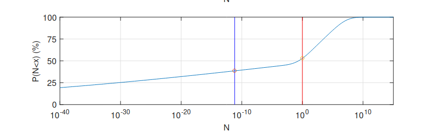

Introduction to Fermi estimates
===============================

*The following are my notes from an intro to [Fermi estimates](https://en.wikipedia.org/wiki/Fermi_problem) class I gave at [ESPR](https://espr-camp.org/), in preparation for a Fermithon, i.e., a Fermi estimates tournament.*

Fermi estimation is a method for arriving an estimate of an uncertain variable of interest. Given a variable of interest, sometimes you can decompose it into steps, and multiplying those steps together gives you a more accurate estimate than estimating the thing you want to know directly. I'll go through a proof sketch for this at the end of the post.

If you want to take over the world, why should you care about this? Well, you may care about this if you hope that having better models of the world would lead you to make better decisions, and to better achieve your goals. And Fermi estimates are one way of training or showing off the skill of building models of the world. They have fast feedback loops, because you can in many cases then check the answer on the internet afterwards. But they are probably most useful in cases where you can't.

The rest of the class was a trial by fire: I presented some questions, students gave their own estimates, and then briefly discussed them.

In case you want to give it a try before seeing the answers, the questions I considered were:

1. How many people have covid in the UK right now (2022-08-20)?
2. How many cummulative person years did people live in/under the Soviet Union?
3. How many intelligent species does the universe hold outside of Earth?
4. Are any staff members dating?
5. How many "state-based conflicts" are going on right now? ("state based conflict" = at least one party is a state, at least 25 deaths a year, massacres and genocides not included)
6. How much does ESPR (a summer camp) cost?
7. How many people are members of the Chinese communist party?
8. What is the US defense budget?
9. How many daily viewers does Tucker Carlson have?

## 1. How many people have covid in the UK right now (2022-08-20)?

### My own answer

```
proportionOutOf100 = 0.1 to 5
fraction_who_have_covid = proportionOutOf100 /100
population_of_UK = 67.22M
people_who_have_covid = fraction_who_have_covid * population_of_UK
people_who_have_covid // 67k to 3.4M
```

### Some student guesses

- 130k
- 600k
- 1M to 2M

### Check

To check, we can use the number of confirmed deaths:

<iframe src="https://ourworldindata.org/explorers/coronavirus-data-explorer?zoomToSelection=true&time=2020-03-01..latest&facet=none&pickerSort=asc&pickerMetric=location&hideControls=true&Metric=Confirmed+deaths&Interval=7-day+rolling+average&Relative+to+Population=true&Color+by+test+positivity=false&country=~GBR" loading="lazy" style="width: 100%; height: 600px; border: 0px none;"></iframe>

```
confirmed_deaths_per_day = 2
proportion_of_deaths_reported = 0.2 to 1
total_deaths = confirmed_deaths_per_day / proportion_of_deaths_reported
case_fatality_rate = to(0.01/100, 0.1/100) // paxlovid changed this.
implied_new_cases_per_day = total_deaths / case_fatality_rate
infection_duration = 5 to 20
implied_total_cases = implied_new_cases_per_day * infection_duration
implied_total_cases // 30K to 680K.
```

## 2. How many cummulative person years did people live in/under the Soviet Union?

### My own answer

```
avg_population_soviet_union = 50M to 300M
soviet_years = 1991 - 1917
cummulative_soviet_years = avg_population_soviet_union  * soviet_years // 4B to 22B
```

Students guessed pretty much the same.

### Check

Per [this graph](https://en.wikipedia.org/wiki/File:Demography_USSR.svg):

<p></p>

the average population seems to have been around 200M, implying 14.8 billion years.

## 3. How many intelligent species does the galaxy hold?

### My own answer

Probably just one (!?).

### Student guesses

- 10^4
- 0.4T
- 0 to 1

### Check

The [dissolving the Fermi paradox](https://arxiv.org/abs/1806.02404) paper gives the following estimate:

<p></p>

which gives something like a 40% chance of us being alone in the observable universe. I think the paper shows the importance of using distributions, rather than point-estimates: using point estimates results in the [Fermi paradox](https://en.wikipedia.org/wiki/Fermi_paradox).

The software I've been using for my own estimates is [Squiggle](https://www.squiggle-language.com/playground/); you can just copy examples there.

## 4. Are any staff members dating?

Note: Question does not include Junior Counsellors, because I don't know the answer to that.

### Own answer

11 male and 3 women staff members.

So the number of combinations is (11 choose 1) × (3 choose 1) = 11 × 3 = 33 possible pairings? But some of the pairings are not compatible (repeat the same person)?

Instead, say a 1% to 3% a priori probability for any man-woman pairing? How did I arrive at this? Essentially, 0.1% feels too low and 5% too high. Implies a 10 to 30% probability that a given woman staff member is dating any man staff member. We round off nontraditional pairings (there is 1 nonbinary Junior Counsellor, but none amongst instructors, that I recall).

If 30% for woman staff member:

```
p(0) = 1 × 0.7 × 0.7 × 0.7 = 34.3%
p(1) = 3 × 0.3 × 0.7 × 0.7 = 44.1%
p(2) = 3 × 0.3 × 0.3 × 0.7 = 18.9%
p(3) = 1 × 0.3 × 0.3 × 0.3 = 2.7%
```

If 10%:

```
p(0) = 1 × 0.9 × 0.9 × 0.9 = 72.9%
p(1) = 3 × 0.1 × 0.9 × 0.9 = 24.3%
p(2) = 3 × 0.1 × 0.1 × 0.9 = 2.7%
p(3) = 1 × 0.1 × 0.1 × 0.1 = 0.1%
```

So the probability that there is at least one pairing ranges from 65% to 35%, which is almost symmetrical. So this implies a roughly 50% that there is at least one pairing.

### Student estimates

- 25% no couples, 1: 50%, ...
- 0:25, 1:25 , 2: 33%, ...
- 0: 0, 1: 1/6, 2: 2/6, >=3: 3/6
- 0: 1/4, 1: 1/4, ...

### Check

You don't get to know the answer to this!

## 5. How many "state-based" conflicts are going on right now?

- At least one party is a state
- At least 25 deaths a year.
- One sided violence, like massacres, are not included

### My own estimate:

```
num_countries = mx(200 to 300, 200 to 400)
proportion_countries_unstable = 0.05 to 0.3
num_conflicts_per_unstable_country = mx(1, 2 to 4, [0.8, 0.2])
num_conflicts = num_countries * proportion_countries_unstable * num_conflicts_per_unstable_country // 14 to 150

```

### Check

<iframe src="https://ourworldindata.org/grapher/the-number-of-active-state-based-conflicts?country=~OWID_WRL" loading="lazy" style="width: 100%; height: 600px; border: 0px none;"></iframe>

## 6. How much does ESPR cost?

### My own estimate

```
num_people = 47
cost_per_person_per_day = 100 to 1000
num_days = 15
total_cost = num_people * cost_per_person_per_day * num_days
total_cost // 70K to 710K (280K)
```

### Student estimates

Student estimates ranged from ~$50k to $150k

### Check

Per [this source](https://www.openphilanthropy.org/grants/european-summer-program-on-rationality-general-support/), ESPR cost $500k over two years, i.e., $250k per camp back when there was only one camp a year. Some of the students forgot about the cost of staff members, food, or common rooms.

## 7. How many people are members of the Chinese communist party

### Own estimate

```
num_chinese = 1B
proportion_of_chinese_in_communist_party = 0.005 to 0.03
num_communist_party_members = num_chinese * proportion_of_chinese_in_communist_party
num_communist_party_members // 5M to 30M
```

### Check

[Wikipedia](https://en.wikipedia.org/wiki/Chinese_Communist_Party#:~:text=As%20of%202022%2C%20the%20CCP,India's%20Bharatiya%20Janata%20Party.) reveals that there are 96M ~ 100M members, which around 10% of their population. Surprising.

## What is the US defense budget?

### My own estimate

```
gdp_of_spain = 1T
population_of_spain = 40M
population_of_us = 300M
gdp_of_us = (1.5 to 3) * population_of_us * gdp_of_spain / population_of_spain
proportion_of_us_gdp_to_defense = mx(0.03 to 0.045, 0.02 to 0.05)
us_defense_budget = gdp_of_us * proportion_of_us_gdp_to_defense
us_defense_budget // 310B to 860B (560B)
```

### Check

$715B in 2022, per [Wikipedia](https://en.wikipedia.org/wiki/Military_budget_of_the_United_States#Budget_for_FY2022)

## How many daily viewers does Tucker Carlson have?

### My own estimate

```
population_of_US = 300M
fraction_watch_news_regularly = 0.05 to 0.3
fraction_which_watch_fox = 0.3 to 0.5
fraction_which_watch_tucker = 0.5 to 0.9
tucker_viewership = population_of_US * 
  fraction_watch_news_regularly * 
  fraction_which_watch_fox * 
  fraction_which_watch_tucker
tucker_viewership // 11M (3.6M to 25M)
```

### Check

Per [this source](<https://deadline.com/2022/08/fox-news-viewership-july-tucker-carlson-1235084361/>), Carlson gets about 3M viewers, so a bit outside my 90% range. I think I mis-estimated the fraction which watch news regularly, should probably have had a section for cable news specifically.

## Proof sketch that Fermi estimates go through

- Assume that guesses are independent lognormally distributed random variables, with a mean centered on the correct amount
- Observe that the multiplication of two lognormally distributed random variables is the sum of the logs of those variables, which are normally distributed. 
  - Per [well known math](https://en.wikipedia.org/wiki/Sum_of_normally_distributed_random_variables), the sum of two normally distributed variables is itself a normally distributed variable. And hence the product of two lognormally distributed variables is lognormally distributed.
- Look at the shape of _standard deviation / mean_ of the underlying normals.
  - E.g., consider _n_ lognormals with mean _m_ and standard deviation _s_ on their underlying normals.
  - Then that ratio is _s / m_
  - Then consider the product of _n_ such lognormals
  - Per [this](https://stats.stackexchange.com/questions/212690/the-product-of-two-lognormal-random-variables), the mean of the underlying normal is going to be _n * m_, and the standard deviation of the underlying normal is going to be _sqrt(n)*s_
  - Then the ratio is going to be _sqrt(n) * s / (n * m)_, which converges to 0 as _n_ grows higher.

One would then have to argue that the ratio of _standard deviation / mean_ is a meaningful quantity, because the proof wouldn't go through if we had used _mean / variance_. For what it's worth, _stardard deviation / mean_ is known as the [coefficient of variation](https://en.wikipedia.org/wiki/Coefficient_of_variation), and it doesn't depend on the unit of measurement used (e.g,. centimeters vs meters).
