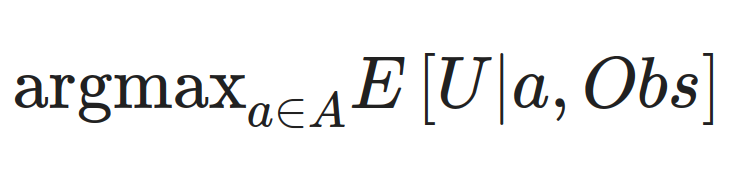

Utilitarianism: An Incomplete Approach
======================================

This blog post gives the sketch of a book, or maybe a long article, that's been on my mind for a while. I wrote it last week, over the course of an hour an a half, with _The Incredibles_ blasting on the background and with me feeling intellectually alive.

### Chapter 1. Utilitarism: The building blocks

This chapter would define utilitarianism, and go over the building blocks of expected utility maximization, like I did [in this post](https://forum.effectivealtruism.org/s/XbCaYR3QfDaeuJ4By/p/8XWi8FBkCuKfgPLMZ) but without boring the reader to death. The building blocks are:

1. The utility function
2. The set of actions to choose from
3. The expected value function
4. The knowledge of the world we condition over
5. The method we use to choose between the sets of actions

We can't always talk about these independently, and there are observations that apply to these parts in combination. From where I'm standing, I think I have to say most things to say about points 1., 3., 4., and maybe 5.

### Chapter 2: The utility function

Go over the basis of why the shape of some of your goals and desires might be utilitarian, or at least consequentialist.

Start with the [von Neumann-Morgenstern utility theorem](https://en.wikipedia.org/wiki/Von_Neumann%E2%80%93Morgenstern_utility_theorem), and go over various ways to stare at expected utility maximization in the face. Go over Harsany's proof of utilitarianism. Go over [what goes wrong if you try to discount small probabilities](https://petrakosonen.files.wordpress.com/2022/07/chapter-4-how-to-discount-small-probabilities.pdf).

There are two threads of arguments here. One thread is the vast literature on this topic, which to my uninitiated eyes seems like it goes around in circles a bit. The other thread are the intuitive reasons that utilitarianism has going for it. Ultimately, we can point to reasons for having utilitarian intuitions. Then for the rest of the text we can assume utilitarianim in theory, and ask about how to implement it in practice. And we can circle back to philosophical critiques at the theoretical level when considering limitations in the last chapter.

### Chapter 3: The set of actions

Point 2., the set of actions to choose from, seems more dependent on the time and place. For example, the 80,000 hours recommendations have changed in the last half a decade.

Still, maybe we can talk about robust ways of improving the set of actions one has access to, in order to do the most good. Or about [heuristics](https://forum.effectivealtruism.org/posts/EP6X362Q3ziibA99e/show-a-framework-for-shaping-your-talent-for-direct-work) and instrumental goals, and see what other long-lived organizations have done to attain success. Honestly not sure what to say here, I haven't been that much of a man of action.

### Chapter 4: Expected value and the knowledge behind it

Expected value can be divided into:

1. estimations of value of different states, and
2. estimation of probabilities.

For probabilities, we can bring in Bayesian probability theory on the theory side, and forecasting on the practical side. Discuss [Cox's theorem](https://en.wikipedia.org/wiki/Cox's_theorem), because I want to and because I think it's really elegant. Then discuss methods and trends in forecasting. Maybe add a bit of color by going through some nice predictions I've done with Samotsvety.

For values, we can go over how QALYs are created. And then we can try to generalize this. One could do this with relative values, but I think I'm more optimistic about writting down the pathway to impact directly and trying to estimate impact in general units, like QALYs or "basis points of the future"

### Chapter 5: The method of choice

Normally the method of choice would be to argmax, i.e., to choose the best option. You could also do quantilization (choose something amonst the top p% (e.g., top 5%) of options at randomly. Discuss Goodhart's law and the perils of maximizing on observables. Maybe discuss Pascal's mugging.

### Chapter 6: The limitations

Above, note that I didn't argue that one should be purely utilitarian, but rather that the altruistic parts of yourself should take that shape.

Then discuss:

- what can go wrong if you try to fit your preferences to a utility function.
- what can go wrong if you use expected values
- what can go wrong if you maximize too hard.
- classical objections to utilitarianism (repugnant conclusion &c).
- etc.

The limitations of my own perspective are that I'm kind of a jack of all trades, idiosyncratically deeply familiar with some things, but not with others.

### Chapter 7: Answers to limitations

1. The cop out answer is to be rule utilitarian
2. One could also be an "incrementalist": Argue for pushing the envelope. In combination with other perspectives, utilitarianism can be incredibly powerful, and it's a perspective worth listening to.
3. There is also bullet-biting utilitarianism maximalism.

### Chapter 8: These ideas in practice

Discuss how I've applied these ideas, at the Quantified Uncertainty Research Institute & in other places. Maybe discuss these ideas in relation to Effective Altruism as practiced today.

### Conclusion

In conclusion, people IMHO are quick to see the flaws and slow to see the appeal of a more hardcore type of utilitarianism. And the text of whcih the above is a very rough sketch could fill that gap.
